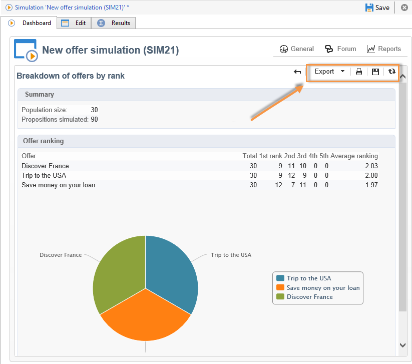

# 模拟跟踪{#simulation-tracking}

模拟完成后，您可以通过添加到模拟窗口的选 **[!UICONTROL Results]** 项卡和报告(在模拟仪表板 **[!UICONTROL Breakdown of offers by rank]** 中可以通过)分析其结果。

模拟结果包含按秩和按收件人的命题细分。 报告轴也会被考虑在内，并显示在此选项卡中。

您可以保存这些结果，并根据需要导出它们，方法是创建一个描述性的结果分析。 为此，请在结果窗口中单击相应的链接。

有关描述 [性分析](../../reporting/using/about-descriptive-analysis.md) 向导的更多信息，请参阅此部分。

透视表提供了每个排名的优惠细分的快速视图。 与Adobe Campaign中的所有报告一样，您可以导出、打印、存档或在Web浏览器中显示它。

如需详细信息，请参阅[此部分](../../reporting/using/actions-on-reports.md)。

