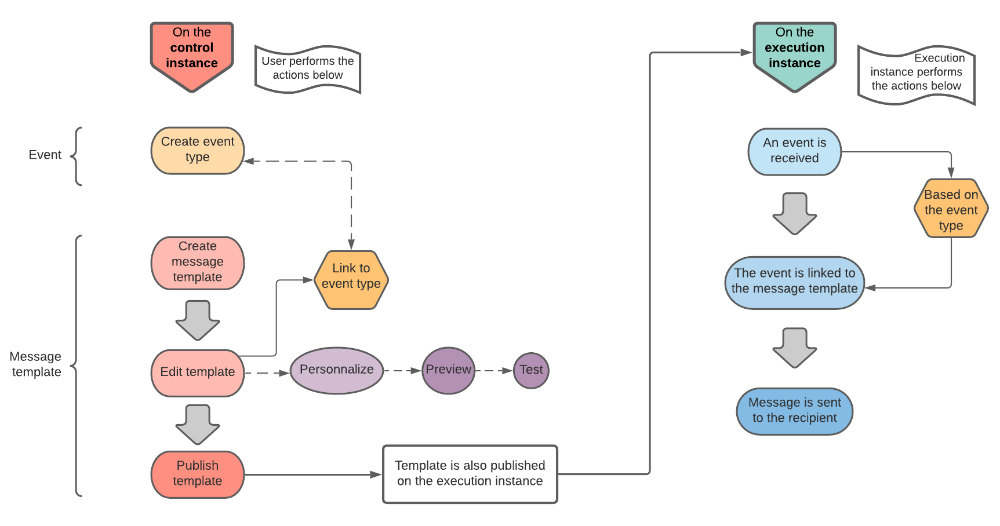

# 事务性消息传递入门 {#about-transactional-messaging}

## 概述 {#overview}

**事务性消息传递** （消息中心）是一个Campaign模块，用于管理从外部信息系统发送的事件生成的自定义触发器通知。

事务型消息是由提供程序（如网站）实时发送的单个且唯一的通信。 由于它包含收件人要检查或确认的重要信息，因此尤其需要使用。

事务性消息传递功能旨在支持可扩展性并提供7天24小时服务。

* **何时到期？**&#x200B;由于此邮件包含重要信息，用户希望实时发送该邮件。 因此，触发的事件与收到消息之间的延迟必须非常短。

* **为什么它很重要？**&#x200B;通常，事务型消息的打开率较高。 因此，应仔细设计，因为它在定义客户关系时可能会对客户行为产生强烈的影响。

* **例如？**&#x200B;可能是创建帐户后的欢迎消息、确认订单已发运的消息、发票、确认密码更改的消息、客户浏览您的网站后的通知、产品不可用通信、帐户对帐单等。

>[!IMPORTANT]
>
>事务性消息传递需要特定的许可证。 请核实您的许可协议。

<!--Before starting with transactional messaging, make sure you read the corresponding [best practices and limitations]().-->

## 事务型消息传递工作原理 {#transactional-messaging-operating-principle}

Adobe Campaign事务性消息传递模块集成到一个信息系统中，该信息系统返回要更改为个性化事务性消息的事件。 这些消息可以通过电子邮件、短信或推送通知单独或批量发送。

此功能依赖于特定架构，其中&#x200B;**执行实例**&#x200B;与&#x200B;**控制实例**&#x200B;分开。 此分布可确保更高的可用性和更好的负载管理。 有关详细信息，请参阅[事务性消息架构](../../message-center/using/transactional-messaging-architecture.md)。

>[!NOTE]
>
>要为托管在Adobe云上的消息中心执行实例创建新用户，您需要联系[Adobe客户关怀](https://helpx.adobe.com/cn/enterprise/admin-guide.html/enterprise/using/support-for-experience-cloud.ug.html)。 消息中心用户是特定的操作员，需要专用权限才能访问&#x200B;**[!UICONTROL Real time events (nmsRtEvent)]**&#x200B;文件夹。

事务型消息传递的总体过程可描述如下：

例如，假设您是一家设有网站的公司，您的客户可以在其中购买产品。

Adobe Campaign允许您向将产品添加到购物车的客户发送通知电子邮件。 当其中某个访客离开您的网站而未完成购买（触发营销活动事件的外部事件）时，会自动向他们发送购物车放弃电子邮件（事务性消息投放）。

下面在[此部分](#key-steps)中详细描述了实现此目标的主要步骤。

>[!NOTE]
>
>Adobe Campaign会优先处理事务型消息，而不是任何其他投放。

## 关键步骤 {#key-steps}

下面概述了在Adobe Campaign中创建和管理个性化事务型消息的主要步骤。

### 在控制实例上执行的步骤

在&#x200B;**控件实例**&#x200B;上，必须执行以下操作：

1. [创建事件类型](../../message-center/using/creating-event-types.md)。
1. [创建并设计消息模板](../../message-center/using/creating-the-message-template.md)。 在此步骤中，必须将事件链接到消息。
1. [测试邮件](../../message-center/using/testing-message-templates.md)。
1. [Publish消息模板](../../message-center/using/publishing-message-templates.md)。

>[!NOTE]
>
>上述所有步骤均在&#x200B;**控件实例**&#x200B;上执行。 在控制实例上发布模板也会在所有&#x200B;**执行实例**&#x200B;上发布。 有关事务性消息传递实例的详细信息，请参阅[事务性消息传递体系结构](../../message-center/using/transactional-messaging-architecture.md)。

### 执行实例上的事件处理

设计和发布事务性消息模板后，如果触发了相应的事件，则会对&#x200B;**执行实例**&#x200B;执行以下主要步骤：

1. 当外部信息系统生成事件时，相关数据将通过&#x200B;**PushEvent**&#x200B;和&#x200B;**PushEvents**&#x200B;方法发送到Campaign。 查看[事件集合](../../message-center/using/about-event-processing.md#event-collection)。
1. 该事件已链接到相应的消息模板。 请参阅[路由到模板](../../message-center/using/about-event-processing.md#routing-towards-a-template)。
1. 扩充阶段完成后，将发送投放。 请参阅[投放执行](../../message-center/using/delivery-execution.md)。 每个定向收件人都会收到一条个性化消息。

## 相关主题 {#related-topics}

* [通信渠道入门](../../delivery/using/communication-channels.md)
* [投放创建关键步骤](../../delivery/using/steps-about-delivery-creation-steps.md)
* [事务性消息传递架构](../../message-center/using/transactional-messaging-architecture.md)
* [访问事务性消息传递报告](../../message-center/using/about-transactional-messaging-reports.md)
