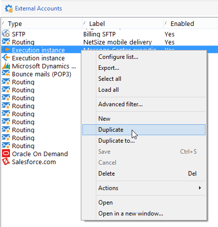
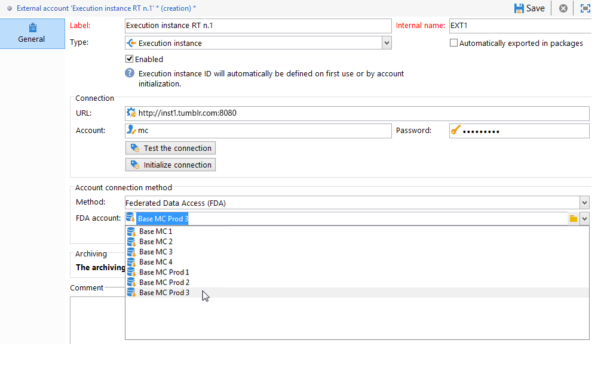
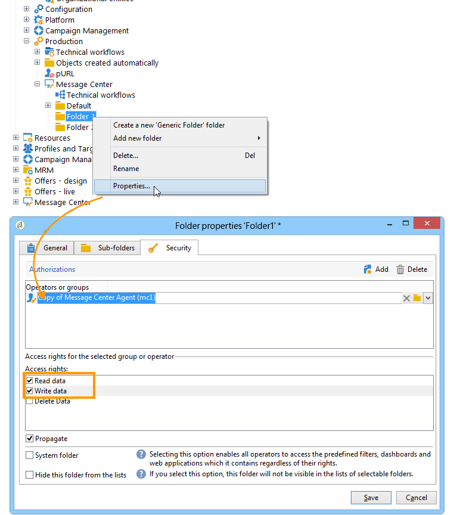

# 配置实例 {#creating-a-shared-connection}

要使用事务性消息传递功能，您需要配置控制实例和执行实例。 您可以使用以下任一方法：
* [一个控制实例](#control-instance) 与一个或多个执行实例相关联
* [多个控制实例](#using-several-control-instances) 与多个执行实例关联

>[!IMPORTANT]
>
>架构扩展影响了使用的资源 [消息中心技术工作流](../../message-center/using/additional-configurations.md#technical-workflows) 需要在事务性消息传递模块使用的其他实例上复制控制实例或执行实例。

您还需要指定执行实例并将其连接到控制实例。

本节介绍了配置和连接控制实例和执行实例所需的所有步骤。

>[!IMPORTANT]
>
>控制实例和执行实例必须安装在不同的计算机上。 他们不能共享同一个Campaign实例。

## 配置控制实例 {#control-instance}

要连接控制实例和执行实例，您首先需要创建和配置 **[!UICONTROL Execution instance]** 键入外部帐户 **在控制实例上**. 因此，一次 [已发布](../../message-center/using/publishing-message-templates.md#template-publication)，事务性消息模板可以部署到执行实例。

如果您使用多个执行实例，则必须创建与执行实例相同数量的外部帐户。

>[!NOTE]
>
>当多个控制实例使用执行实例时，数据可以按文件夹和运算符划分。 有关此内容的更多信息，请参阅 [使用多个控制实例](#using-several-control-instances).

### 创建外部帐户

>[!NOTE]
>
>必须执行以下步骤 **在控制实例上**.

创建 **[!UICONTROL Execution instance]** 键入外部帐户，应用以下内容：

1. 转到 **[!UICONTROL Administration > Platform > External accounts]** 文件夹。
1. 选择随Adobe Campaign一起提供的现成执行实例类型外部帐户之一，右键单击并选择 **[!UICONTROL Duplicate]** .

   

1. 根据需要更改标签。

   

1. 选择 **[!UICONTROL Enabled]** 使外部帐户可操作的选项。

   

1. 指定安装执行实例的服务器地址。

   

1. 帐户必须匹配operator文件夹中定义的消息中心代理。 默认情况下，Adobe Campaign提供的现成帐户为 **[!UICONTROL mc]** .

   

1. 输入在operator文件夹中定义的帐户的密码。

   >[!NOTE]
   >
   >要避免每次登录实例时都输入密码，您可以在执行实例中指定控制实例的IP地址。 有关此内容的更多信息，请参阅 [配置执行实例](#execution-instance).

1. 指定执行实例要使用的恢复方法。 要恢复的数据由执行实例转发到控制实例，以添加到事务性消息和事件存档。

   

   数据收集是通过使用HTTP/HTTPS访问的Web服务或通过联合数据访问(FDA)模块进行的。

   >[!NOTE]
   >
   >请注意，在使用FDA over HTTP时，仅支持使用PostgreSQL数据库的执行实例。 不支持MSSQL或Oracle数据库。

   如果控制实例可以直接访问执行实例的数据库，则建议使用第二种方法(FDA)。 如果没有，请选择Web服务访问。 要指定的FDA帐户与连接到在控制实例上创建的各个执行实例的数据库的时间一致。

   

   有关联合数据访问(FDA)的更多信息，请参阅 [本节](../../installation/using/about-fda.md).

1. 单击 **[!UICONTROL Test the connection]** 以确保控制实例和执行实例相关联。

   

使用多个执行实例时，重复这些步骤可创建与执行实例相同数量的外部帐户。

### 确定执行实例 {#identifying-execution-instances}

每个执行实例都必须与唯一标识符关联，以便区分在控制实例上查看每个执行实例时的历史记录。

此标识符可归因于每个执行实例 **手动**. 在这种情况下，必须执行此步骤 **在每个执行实例上**. 为此，请使用部署向导，如下所述：

1. 在执行实例上打开部署向导。
1. 转到 **[!UICONTROL Message Center]** 窗口。
1. 将选择的标识符分配给实例。

   

1. 对每个执行实例重复上述步骤。

标识符还可以 **自动** 已归因。 为此，请转到 **控制实例**，然后单击 **[!UICONTROL Initialize connection]** 按钮。

## 配置执行实例 {#execution-instance}

>[!NOTE]
>
>必须执行以下步骤 **在执行实例上**.

要将执行实例连接到控制实例，请执行以下步骤。

为了使控制实例能够连接到执行实例而无需提供密码，只需在中输入控制实例的IP地址 **消息中心** “访问权限”部分。 但是，默认情况下禁止使用空密码。

要使用空密码，请转到执行实例，并定义一个安全区域，该安全区域仅限于发送事件的信息系统的IP地址。 此安全区域必须允许空密码并接受 `<identifier> / <password>` 键入connections。 如需详细信息，请参阅[此部分](../../installation/using/security-zones.md)。

>[!NOTE]
>
>当多个控制实例使用执行实例时，数据可以按文件夹和运算符划分。 有关此内容的更多信息，请参阅 [使用多个控制实例](#using-several-control-instances).

1. 在执行实例上，转到operator文件夹( **[!UICONTROL Administration > Access management > Operators]** )。
1. 选择 **消息中心** 探员。

   

1. 选择 **[!UICONTROL Edit]** 选项卡，单击 **[!UICONTROL Access rights]** ，然后单击 **[!UICONTROL Edit the access parameters...]** 链接。

   

1. 在 **[!UICONTROL Access settings]** 窗口中，单击 **[!UICONTROL Add a trusted IP mask]** 链接并添加控制实例的IP地址。

   

使用多个执行实例时，对每个执行实例重复这些步骤。

## 使用多个控制实例 {#using-several-control-instances}

您可以与各种控制实例共享执行集群。 此类型的体系结构需要以下配置。

例如，假设您的公司管理两个品牌，每个品牌都有自己的控制实例： **控制1** 和 **控制2**. 还使用了两个执行实例。 您需要为每个控制实例输入不同的消息中心运算符： **mc1** 运算符 **控制1** 实例和 **mc2** 运算符 **控制2** 实例。

在所有执行实例的树中，为每个运算符创建一个文件夹(**文件夹1** 和 **文件夹2**)，并限制每个操作员的数据访问其文件夹。

### 配置控制实例 {#configuring-control-instances}

>[!NOTE]
>
>必须执行以下步骤 **在控件实例上**.

1. 在 **控制1** 控制实例，为每个执行实例创建一个外部帐户，然后输入 **mc1** 操作员。 此 **mc1** 此后，将在所有执行实例上创建运算符(请参阅 [配置执行实例](#configuring-execution-instances))。

   

1. 在 **控制2** 控制实例，为每个执行实例创建一个外部帐户，然后输入 **mc2** 操作员。 此 **mc2** 此后，将在所有执行实例上创建运算符(请参阅 [配置执行实例](#configuring-execution-instances))。

   

   >[!NOTE]
   >
   >有关配置控制实例的更多信息，请参阅 [本节](#control-instance).

### 配置执行实例 {#configuring-execution-instances}

>[!NOTE]
>
>必须执行以下步骤 **在执行实例上**.

要使用多个控制实例，必须在所有执行实例上执行此配置。

1. 在中为每个运算符创建一个文件夹 **[!UICONTROL Administration > Production > Message Center]** 节点： **文件夹1** 和 **文件夹2**. 有关创建文件夹和视图的详细信息，请参阅 [此页面](../../platform/using/access-management-folders.md).

   

1. 创建 **mc1** 和 **mc2** 运算符(**mc**)。 有关创建运算符的更多信息，请参阅 [本节](../../platform/using/access-management-operators.md).

   

   >[!NOTE]
   >
   >**mc1** 和 **mc2** 运算符必须具有 **[!UICONTROL Message Center execution]** 权限，他们无法访问Adobe Campaign客户端控制台。 运算符必须始终与安全区域链接。 如需详细信息，请参阅[此部分](../../installation/using/security-zones.md)。

1. 对于每个运算符，选中 **[!UICONTROL Restrict to information found in sub-folders of]** 框，然后选择相关的文件夹(**文件夹1** 对于 **mc1** 运算符和 **文件夹2** 对于 **mc2** 运算符)。

   

1. 向每个操作员授予对其文件夹的读写权限。 要执行此操作，请右键单击文件夹并选择 **[!UICONTROL Properties]** . 然后选择 **[!UICONTROL Security]** 制表符并添加相关运算符(**mc1** 对象 **文件夹1** 和 **mc2** 对象 **文件夹2**)。 确保 **[!UICONTROL Read/Write data]** 复选框的复选状态。

   
