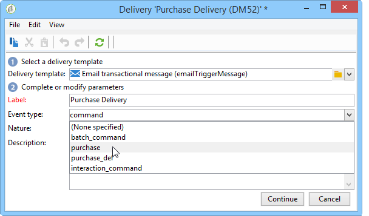

# 设计事务性消息模板 {#creating-the-message-template}

为了确保可以将每个事件更改为个性化消息，您需要创建消息模板以匹配每个事件类型。

>[!IMPORTANT]
>
>事件类型需要预先创建。 有关详细信息，请参阅[创建事件类型](../../message-center/using/creating-event-types.md)。

事务型消息模板包含个性化事务型消息所需的信息。 您还可以使用模板测试消息预览，并在将消息交付到最终目标之前使用种子地址发送校样。 有关详细信息，请参阅[测试事务型消息模板](../../message-center/using/testing-message-templates.md)。

## 创建消息模板 {#creating-message-template}

1. 转到Adobe Campaign树中的&#x200B;**[!UICONTROL Message Center >Transactional message templates]**&#x200B;文件夹。

1. 在事务性消息模板列表中，右键单击并在下拉菜单中选择&#x200B;**[!UICONTROL New]**，或单击事务性消息模板列表上方的&#x200B;**[!UICONTROL New]**&#x200B;按钮。

   

1. 在投放窗口中，选择适用于要使用的渠道的投放模板。

   

1. 根据需要更改其标签。

1. 选择与要发送的消息匹配的事件类型。

   

   事件类型需要在控制台中预先创建。 有关详细信息，请参阅[创建事件类型](../../message-center/using/creating-event-types.md)。

   >[!IMPORTANT]
   >
   >事件类型无法链接到多个模板。

1. 输入性质和描述，然后单击&#x200B;**[!UICONTROL Continue]**&#x200B;以创建邮件正文（请参阅[创建邮件内容](#creating-message-content)）。

   

## 创建消息内容 {#creating-message-content}

事务型消息内容的定义与Adobe Campaign中的常规投放相同。 例如，对于电子邮件投放，您可以创建HTML或文本格式的内容、添加附件或个性化投放对象。 有关详细信息，请参阅[电子邮件投放](../../delivery/using/about-email-channel.md)一章。

>[!IMPORTANT]
>
>消息中包含的图像必须可公开访问。 Adobe Campaign没有为事务性消息提供任何图像上传机制。\
>与JSSP或webApp不同，`<%=`没有任何默认转义。
>
>在这种情况下，必须正确对来自事件的每个数据进行转义。 此转义取决于此字段的使用方式。 例如，在URL中，请使用encodeURIComponent。 要显示在HTML中，您可以使用escapeXMLString。

定义消息内容后，您可以将事件信息集成到消息正文中并对其进行个性化。 由于个性化标记，事件信息将插入到文本正文中。

* 所有个性化字段都来自有效负载。
* 可以在事务型消息中引用一个或多个个性化块。 块内容将在发布到执行实例期间添加到投放内容。

要在电子邮件正文中插入个性化标记，请应用以下步骤：

1. 在消息模板中，单击与电子邮件格式(HTML或文本)匹配的选项卡。

1. 输入消息正文。

1. 在文本正文中，使用&#x200B;**[!UICONTROL Real time events > Event XML]**&#x200B;菜单插入标记。

   

1. 使用以下语法填写标记： **element name**。@**属性名称**，如下所示。

   

1. 保存您的内容。

您的消息现已准备就绪，可[测试](../../message-center/using/testing-message-templates.md)。
