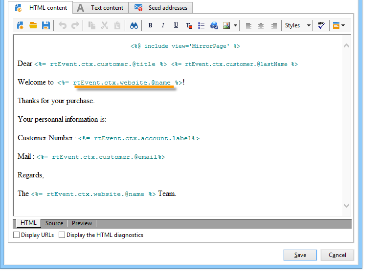

# 设计事务型消息模板 {#creating-the-message-template}

要确保每个事件都可以更改为个性化消息，您需要创建一个消息模板以匹配每个事件类型。

>[!IMPORTANT]
>
>事件类型需要事先创建。 有关更多信息，请参阅 [创建事件类型](../../message-center/using/creating-event-types.md).

事务型消息模板包含个性化事务型消息的必需信息。 您还可以使用模板来测试消息预览，并在将消息投放到最终目标之前使用种子地址发送校样。 有关此内容的更多信息，请参阅 [测试事务型消息模板](../../message-center/using/testing-message-templates.md).

## 创建消息模板 {#creating-message-template}

1. 转到 **[!UICONTROL Message Center >Transactional message templates]** 文件夹。

1. 在事务型消息模板列表中，右键单击并选择 **[!UICONTROL New]** 中，或单击 **[!UICONTROL New]** 按钮。

   

1. 在投放窗口中，选择适合您要使用的渠道的投放模板。

   

1. 如有必要，请更改其标签。

1. 选择与要发送的消息匹配的事件类型。

   

   事件类型需要事先在控制台中创建。 有关更多信息，请参阅 [创建事件类型](../../message-center/using/creating-event-types.md).

   >[!IMPORTANT]
   >
   >事件类型不能链接到多个模板。

1. 输入性质和描述，然后单击 **[!UICONTROL Continue]** 创建消息正文(请参阅 [创建消息内容](#creating-message-content))。

   

## 创建消息内容 {#creating-message-content}

事务型消息内容的定义与Adobe Campaign中常规投放的定义相同。 例如，对于电子邮件投放，您可以创建HTML或文本格式的内容、添加附件或个性化投放对象。 有关更多信息，请参阅 [电子邮件投放](../../delivery/using/about-email-channel.md) 章节。

>[!IMPORTANT]
>
>消息中包含的图像必须可以公开访问。 Adobe Campaign不为事务型消息提供任何图像上传机制。\
>与JSSP或webApp不同， `<%=` 没有任何默认转义。
>
>在这种情况下，必须正确转义来自事件的每个数据。 此转义取决于此字段的使用方式。 例如，在URL中，请使用encodeURIComponent。 要在HTML中显示，可以使用escXMLString。

定义消息内容后，您可以将事件信息集成到消息正文中并对其进行个性化。 由于个性化标记，事件信息会插入到文本正文中。

* 所有个性化字段都来自有效负载。
* 可以在事务型消息中引用一个或多个个性化块。 块内容将在发布到执行实例期间添加到投放内容。

要将个性化标记插入电子邮件正文，请应用以下步骤：

1. 在消息模板中，单击与电子邮件格式(HTML或文本)匹配的选项卡。

1. 输入消息的正文。

1. 在文本的正文中，使用 **[!UICONTROL Real time events > Event XML]** 菜单。

   

1. 使用以下语法填写标记： **元素名称**.@**属性名称** 如下所示。

   

1. 保存您的内容。

您的消息现已准备就绪， [测试](../../message-center/using/testing-message-templates.md).
