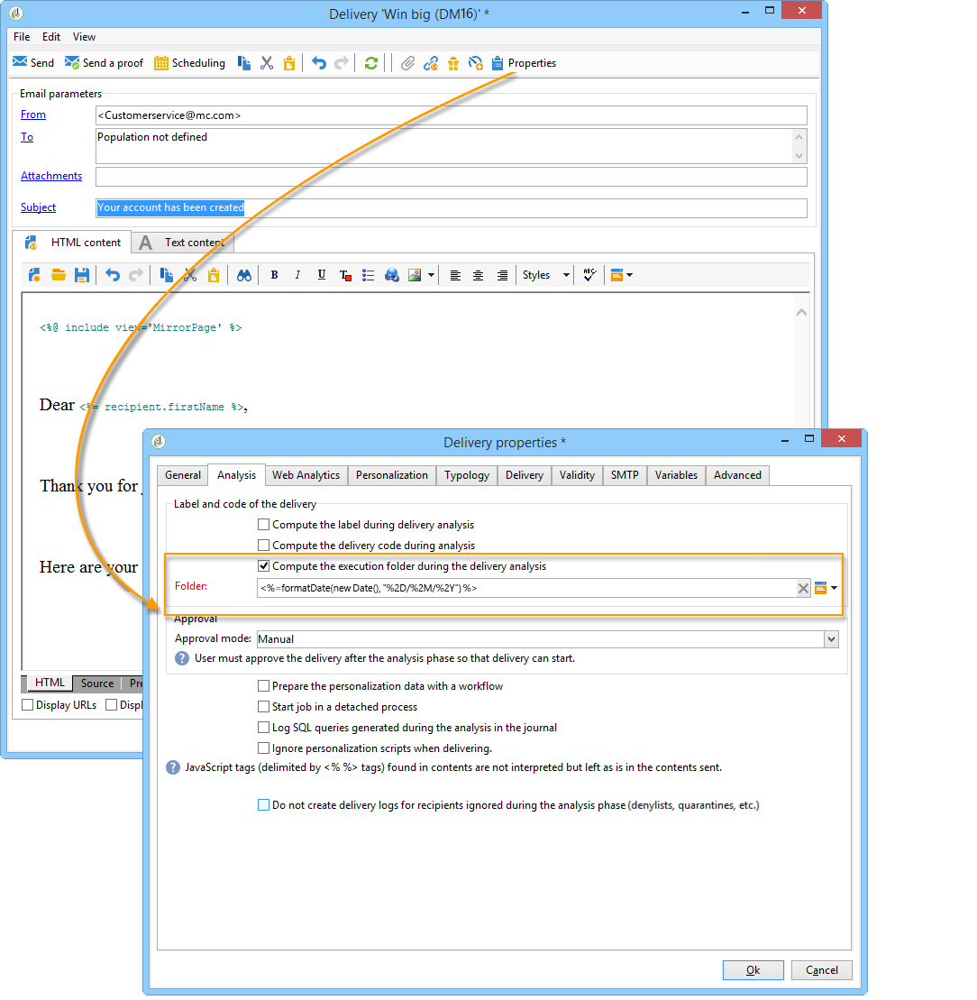

# 投放执行 {#delivery-execution}

## 事务性消息发送 {#transactional-message-send}

在执行实例上，一旦扩充阶段完成并将投放模板链接到事件，就会发送投放。

>[!NOTE]
>
>MTA会优先处理事务型消息，而不是任何其他投放。

所有投放都分组在 **[!UICONTROL Administration > Production > Message Center > Default > Deliveries]** 文件夹。

默认情况下，它们按投放月份分类为子文件夹。 可以在消息模板属性中更改此排序，如下所示。

>[!NOTE]
>
>对于托管或混合安装，如果已升级到 [增强MTA](../../delivery/using/sending-with-enhanced-mta.md)，所有事务型消息也可通过Adobe Campaign Enhanced MTA发送，以提升投放能力、吞吐量和退件处理。 所有影响与标准营销消息的影响相同。

## 事务性消息监测 {#transactional-message-monitoring}

要监控事务型消息，请检查 [投放日志](../../delivery/using/delivery-dashboard.md#delivery-logs-and-history).

从执行实例发送的事务投放通过技术工作流(**[!UICONTROL Message Center execution instance]**)，每小时运行一次。

>[!NOTE]
>
>投放每周根据最新的事件更新而不是根据事件创建日期来累计事件。 因此，在从控制实例提取事务性消息投放日志时，与每个投放日志ID关联的投放ID可能会随着日志的更新（例如，当收到事件的入站退回时）而随着时间的推移而改变。

<!--The transactional deliveries sent from the execution instance are synchronized back to the control instance as follows.

Let's take a [delivery template](../../message-center/using/introduction.md) labelled *Template_1*.

1. An event corresponding to *Template_1* is received on the execution instance.
1. The **Processing real time events** (rtEventsProcessing) workflow processes the event and searches for an existing delivery for the current month.

    >[!NOTE]
    >
    >If not found, a new delivery is created and the event is assigned to the new delivery.

1. The transactional email is sent and the delivery status changes to **[!UICONTROL Sent]**.
1. The **Message Center execution instance** (mcSync_mcExec) workflow retrieves the delivery logs from the execution instance and updates the delivery logs on the control instance.
1. The control instance searches for an existing delivery for week 40 (2020-09-28_Template_1).

    >[!NOTE]
    >
    >If not found, a new delivery is created.

1. The week after, an inbound bounce is received for the event.
1. The status of the event changes to **[!UICONTROL Delivery failed]**.
1. The **Message Center execution instance** (mcSync_mcExec) workflow retrieves the delivery logs from the execution instance and searches for a delivery for week 41 (2020-10-05_Template_1) to update the delivery logs. The delivery logs are then linked to a new delivery for the current week.

To summarize, the deliveries weekly accumulate the events based on the latest event update, and not on the event creation date.

Therefore, when extracting transactional messaging delivery logs from the control instance, the delivery ID associated with each delivery log ID changes every week.-->

要监视执行实例的活动和运行，请参见 [事务性消息报告](../../message-center/using/about-transactional-messaging-reports.md).
