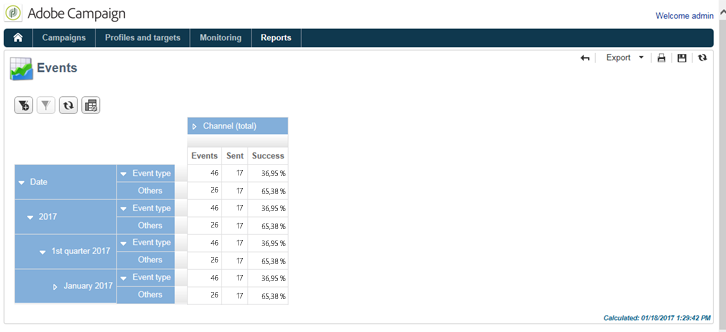

# 消息中心事件历史记录{#history-of-message-center-events}

**[!UICONTROL History of Message Center events]**&#x200B;报告提供了消息中心活动的概览，即作为事务性消息处理和投放的事件数。

在打开报告时，默认显示的信息与成功发送事务型消息的速率一致。 要查看更多级别，您可以打开各种节点，并将光标放在适当的级别上以将其选定。

您可以查看特定于每个事件类型、每个时段的数据。 **[!UICONTROL Events]**&#x200B;列对应于每个控件实例接收的事件数。 在&#x200B;**[!UICONTROL Sent]**&#x200B;列中详细列出了转换为个性化事务型消息的事件数。

**[!UICONTROL History of Message Center events]**&#x200B;报表是数据透视表类型报表。 有关更多信息，请参阅[分析群体](../../reporting/using/about-descriptive-analysis.md)部分。
