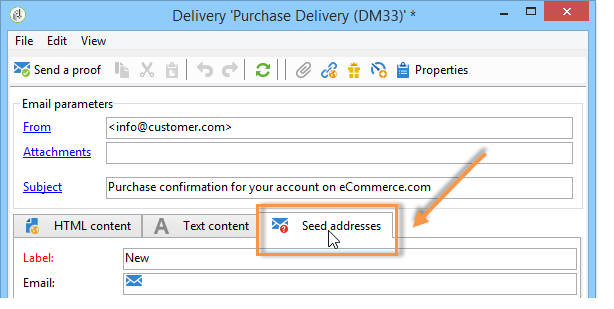

# 管理交易消息中的种子地址{#managing-seed-addresses-in-transactional-messages}

种子地址可让您在发送电子邮件或短信预览之前显示消息的验证、发送投放并测试消息个性化。 种子地址链接到投放，不能用于其他投放。

## 创建种子地址 {#creating-a-seed-address}

1. 在事务性消息模板中，单击&#x200B;**[!UICONTROL Seed addresses]**&#x200B;选项卡。

   

1. 为其分配标签，以便以后进行选择。

   

1. 输入种子地址(根据通信渠道，使用电子邮件或移动电话)。

   

1. 输入外部标识符:此可选字段允许您输入业务密钥（唯一ID、名称+电子邮件等） 这是您网站上所有用于识别您的用户档案的应用程序所通用的。 如果Adobe Campaign营销数据库中也存在此字段，则您随后可以将事件与数据库中的用户档案进行协调。

   

1. 插入测试数据（请参阅[个性化数据](../../message-center/using/personalization-data.md)）。

   

   <!--## Creating several seed addresses {#creating-several-seed-addresses}-->
1. 单击&#x200B;**[!UICONTROL Add other seed addresses]**&#x200B;链接，然后单击&#x200B;**[!UICONTROL Add]**&#x200B;按钮。

   

   <!--1. Follow the configuration steps for a seed address detailed in the [Creating a seed address](#creating-a-seed-address) section.-->
1. 重复此过程以创建所需数量的地址。

   

创建地址后，您可以显示其预览和个性化。 请参阅[事务性消息预览](../../message-center/using/transactional-message-preview.md)。
