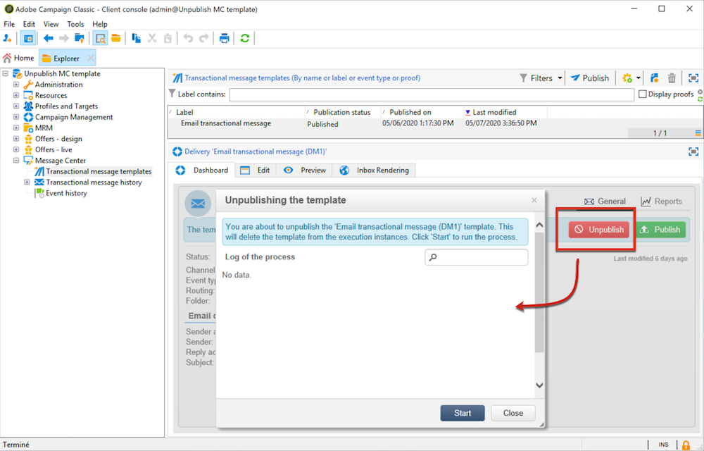

# 发布消息模板{#publishing-template-messages}

## 模板发布 {#template-publication}

在控制实例上创建的[消息模板](../../message-center/using/creating-the-message-template.md)完成后，在测试之后，即可发布该模板。 此过程还将在所有执行实例上发布该实例。

发布允许您在执行实例上自动创建&#x200B;**两个消息模板**，这允许您发送链接到&#x200B;**实时事件**&#x200B;和&#x200B;**批量事件**&#x200B;的消息。

>[!NOTE]
>
>发布事务型消息模板时，也会在执行实例上自动发布分类规则。

>[!IMPORTANT]
>
>每当对模板进行任何更改时，请确保再次发布该模板，以便这些更改在事务型消息投放期间生效。

1. 在控制实例中，转到树的&#x200B;**[!UICONTROL Message Center > Transactional message templates]**&#x200B;文件夹。
1. 选择要在执行实例上发布的模板。
1. 单击 **[!UICONTROL Publish]**。

   

发布完成后，将在&#x200B;**[!UICONTROL Administration > Production > Message Center Execution> Default > Transactional message templates]**&#x200B;文件夹的生产实例树中创建要应用于批处理事件和实时类型事件的消息模板。

发布模板后，如果触发了相应的事件，则执行实例将收到该事件，将其链接到事务型模板，并向每个收件人发送相应的事务型消息。 有关更多信息，请参阅[事件处理](../../message-center/using/about-event-processing.md)。

>[!NOTE]
>
>如果将事务型消息模板的现有字段（如发件人地址）替换为空值，则再次发布事务型消息后，将不会更新执行实例上的相应字段。 它仍将包含上一个值。
>
>但是，如果添加非空值，则相应字段将像往常一样在下次发布后更新。

## 模板取消发布 {#template-unpublication}

在执行实例上发布消息模板后，即可取消发布该模板。 有关模板发布过程的更多信息，请参阅[此部分](#template-publication)。

* 事实上，如果触发了相应的事件，则仍可以调用已发布的模板：如果您不再使用消息模板，建议取消发布该模板。 这是为了避免错误地发送不需要的事务型消息。

   例如，您发布了一个仅用于圣诞促销活动的消息模板。 在圣诞节结束后，您可能想要取消发布它，并在明年再次发布它。

* 此外，您还无法删除状态为&#x200B;**[!UICONTROL Published]**&#x200B;的事务型消息模板。 必须先取消发布它。

>[!NOTE]
>
>此功能从Campaign 20.2版本开始可用。

要取消发布事务型消息模板，请执行以下步骤。

1. 在控制实例中，转到树的&#x200B;**[!UICONTROL Message Center > Transactional message templates]**&#x200B;文件夹。
1. 选择要取消发布的模板。
1. 单击 **[!UICONTROL Unpublish]**。

   <!--1. Fill in the **[!UICONTROL Log of the process]** field.-->

1. 单击 **[!UICONTROL Start]**。

事务型消息模板状态从&#x200B;**[!UICONTROL Published]**&#x200B;更改回&#x200B;**[!UICONTROL Being edited]**。

取消发布完成后：

* 这两个消息模板（应用于批处理和实时类型事件）都将从每个执行实例中删除。

   它们不再显示在&#x200B;**[!UICONTROL Administration > Production > Message Center Execution > Default > Transactional message templates]**&#x200B;文件夹中（请参阅[此部分](#template-publication)）。

* 取消发布模板后，您可以从控制实例中将其删除。

   要执行此操作，请从列表中选择它，然后单击屏幕右上方的&#x200B;**[!UICONTROL Delete]**&#x200B;按钮。
