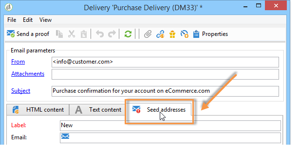

# 测试事务性消息模板 {#testing-message-templates}

一旦您的 [消息模板](../../message-center/using/creating-the-message-template.md) 准备就绪，请按照以下步骤进行预览和测试。

## 管理事务性消息中的种子地址 {#managing-seed-addresses-in-transactional-messages}

利用种子地址，可显示消息的预览、发送校样并在电子邮件或短信投放之前测试消息的个性化情况。 种子地址已链接到投放，并且无法用于其他投放。

要在事务型消息中创建种子地址，请执行以下步骤：

1. 在事务型消息模板中，单击 **[!UICONTROL Seed addresses]** 选项卡。

   

1. 为其分配标签以便稍后轻松选择。

   

1. 输入种子地址（电子邮件或手机，具体取决于通信渠道）。

   

1. 输入外部标识符：此可选字段允许您输入业务密钥（唯一ID、名称+电子邮件等） 这是您网站上所有应用程序通用的功能，用于识别您的配置文件。 如果此字段也出现在Adobe Campaign营销数据库中，则之后可以将事件与数据库中的用户档案进行协调。

   

1. 插入测试数据(请参阅 [个性化数据](#personalization-data))。

   

   <!--## Creating several seed addresses {#creating-several-seed-addresses}-->
1. 单击 **[!UICONTROL Add other seed addresses]** 链接，然后单击 **[!UICONTROL Add]** 按钮。

   

   <!--1. Follow the configuration steps for a seed address detailed in the [Creating a seed address](#creating-a-seed-address) section.-->
1. 重复此过程，根据需要创建所需数量的地址。

   

创建地址后，即可显示其预览和个性化。 请参阅 [事务性消息预览](#transactional-message-preview).

## 个性化数据 {#personalization-data}

可以在消息模板中使用数据来测试事务型消息个性化。 此功能用于生成预览或发送验证。 您还可以为各种Internet访问提供商显示消息的呈现。 有关此内容的更多信息，请参阅 [收件箱呈现](../../delivery/using/inbox-rendering.md).

此数据的目的是在最终投放之前测试您的消息。 这些消息与要处理的实际数据不一致。 但是，XML结构必须与执行实例中存储的事件的结构相同，如下所示：

此信息允许您使用个性化标记个性化消息内容(有关更多信息，请参阅 [创建消息内容](../../message-center/using/creating-the-message-template.md#creating-message-content))。

1. 选择事务型消息模板。

1. 在模板中，单击 **[!UICONTROL Seed addresses]** 选项卡。

1. 在事件内容中，以XML格式输入测试信息。

   

1. 单击 **[!UICONTROL Save]**。

## 事务性消息预览 {#transactional-message-preview}

创建一个或多个种子地址和消息正文后，您可以预览消息并检查其个性化。

1. 在消息模板中，单击 **[!UICONTROL Preview]** 选项卡。

   

1. 选择 **[!UICONTROL A seed address]** （在下拉列表中）。

   

1. 选择之前创建的种子地址以显示个性化消息。

   

使用种子地址，您还可以为各种Internet访问提供商显示消息的渲染。 有关此内容的更多信息，请参阅 [收件箱呈现](../../delivery/using/inbox-rendering.md).

## 发送验证 {#sending-a-proof}

您可以通过向之前创建的种子地址发送校样来测试消息投放。

发送校样的过程与发送校样的过程相同 [定期投放](../../delivery/using/steps-validating-the-delivery.md#sending-a-proof). 但是，对于事务型消息传递，您需要预先执行以下操作：

* 创建一个或多个 [种子地址](#managing-seed-addresses-in-transactional-messages) 替换为 [个性化数据](#personalization-data).
* [创建消息内容](../../message-center/using/creating-the-message-template.md#creating-message-content).

要发送证明：

1. 单击 **[!UICONTROL Send a proof]** 按钮。
1. 分析投放。
1. 更正任何错误并确认投放。

   

1. 检查邮件是否已发送到种子地址，以及邮件内容是否符合您的配置。

   

可以通过访问每个模板中的校样 **[!UICONTROL Audit]** 选项卡。 有关此内容的更多详细信息，请参阅 [发送验证](../../delivery/using/steps-validating-the-delivery.md#sending-a-proof).

您的消息模板现已准备就绪 [已发布](../../message-center/using/publishing-message-templates.md).