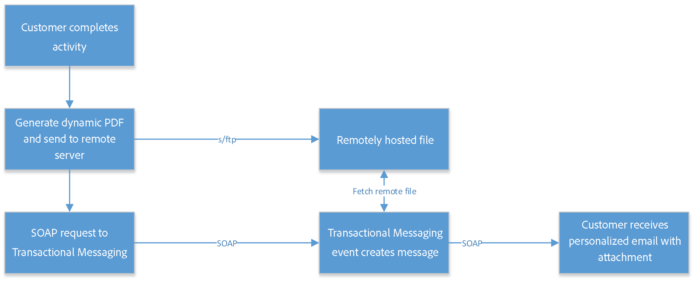

# 用例：发送带有附件的事务性电子邮件 {#transactional-email-with-attachments}


此用例旨在即时向出站调度添加电子邮件附件。

## 关键步骤 {#key-steps}

在此方案中，您将了解如何发送带有个人和/或个性化附件的事务性电子邮件。 附件不会预先上传到事务性消息服务器上：而是会动态生成。

当您捕获客户交互或详细信息时，您可能需要在流程结束时将此信息发送回客户，例如在附加到电子邮件的PDF文件中发送。

以下是此方案的主要步骤：

1. 客户进入网站，找到要购买的产品。
1. 客户选择产品并自定义某些选项。
1. 客户完成交易。
1. 向客户发送确认交易的电子邮件。 由于不建议在电子邮件中发送PII（个人身份信息），因此会生成一个安全PDF并将其附加到电子邮件中。
1. 客户收到包含相关数据的电子邮件及其附件。

在此方案中，不会预先创建附件，而是即时将其添加到叫客电子邮件，这样具有以下优势：

* 这允许您个性化附件的内容。
* 如果附件与交易相关联（如上述示例场景所示），则它可能包含客户流程中生成的动态数据。
* 附加PDF文件可优化安全性，因为您可以对其进行加密并通过HTTPS发送它们。

## Recommendations和护栏 {#important-notes}

为避免性能问题，电子邮件中包含的图像不能超过100 KB。 默认设置的此限制可以从 `NmsDelivery_MaxDownloadedImageSize` 选项。 但是，Adobe强烈建议避免在电子邮件投放中使用大型图像。

Adobe还建议限制附加文件的大小和数量。 默认情况下，您只能将一个文件作为附件添加到电子邮件中。 此阈值可以从以下位置配置： `NmsDelivery_MaxRecommendedAttachments` 选项。

了解详情，请参阅 [Campaign Classic选项列表](../../installation/using/configuring-campaign-options.md#delivery).

在实施此方案之前，请仔细阅读以下准则：

* 事务性消息实例不应用于存储、导出或上传文件或数据。 它们只能用于事件数据和相关信息。 不应将它们视为文件存储系统。
* 由于不能直接访问事务性消息传递实例或Adobe之外的服务器，因此没有标准方法在这些服务器上推送此类文件（无FTP访问）。
* 从合同上讲，使用事务性消息传递实例上的磁盘空间存储任何类型的文件都是不正确的，即使是附件也是如此。
* 您需要使用其他联机磁盘系统来托管这些文件。 您需要具有此系统的FTP访问权限，并且必须能够写入和删除文件。

>[!NOTE]
>
>为了避免出现性能问题，建议每封电子邮件不要附加多个附件。可以从以下位置配置建议的阈值 [Campaign Classic选项列表](../../installation/using/configuring-campaign-options.md#delivery).

## 实施 {#implementation}

下图显示了实施此方案时的不同步骤：



要即时向事务型消息添加电子邮件附件，请执行以下步骤：

1. 从设计附件开始。 有关更多信息，请参阅[此章节](../../delivery/using/attaching-files.md#attach-a-personalized-file)。

   这样，您可以将文件附加到电子邮件，即使它们不是在执行实例上托管。

1. 您可以通过SOAP消息触发器发送电子邮件。 在SOAP调用中，有一个URL参数(attachmentURL)。

   有关SOAP请求的详细信息，请参见 [事件描述](../../message-center/using/event-description.md).

1. 设计电子邮件时，单击 **[!UICONTROL Attachment]**.

1. 在 **[!UICONTROL Attachment definition]** 屏幕中，输入SOAP附件参数：

   ```
   <%= rtEvent.ctx.attachmentUrl %>
   ```

1. 处理消息时，系统会从远程位置（第三方服务器）获取文件，并将其附加到单个消息。

   由于此参数可以是变量，因此它应该接受文件的格式完整的远程URL变量，该变量通过SOAP调用发送。

   
