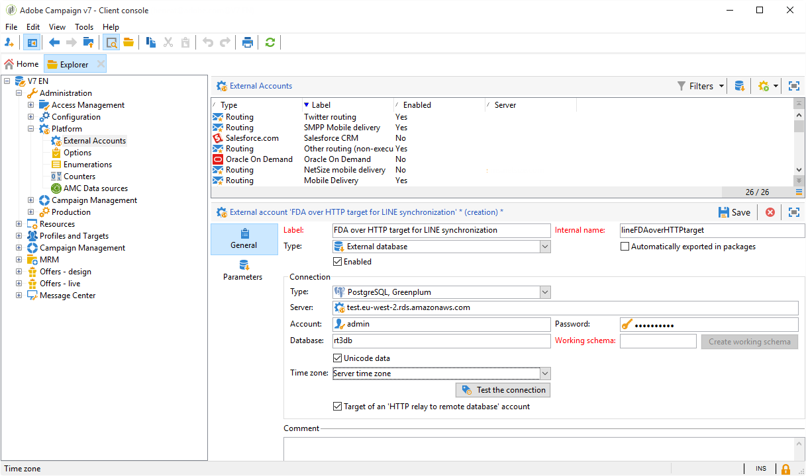

# 事务性消息传递架构 {#transactional-messaging-architecture}


事务性消息传递依赖于特定的架构，该架构由多个实例组成：

* 创建消息模板的&#x200B;**控件实例**。

* 接收事件并传递消息的一个或多个&#x200B;**执行实例**。


| 控制实例 | 执行实例 |
|--- |--- |
| Adobe Campaign用户登录到控制实例以： <ul><li>创建事务性消息模板</li><li>使用种子列表生成消息预览</li><li>显示报表</li><li>监视执行实例</li></ul> | 执行实例用于： <ul><li>接收事件</li><li>将它们链接到事务性消息模板</li><li>向每位收件人发送个性化消息</li></ul> |

## 安装实例 {#installing-instances}

安装事务型消息包时，要采取几个预防措施。 Adobe建议您先在测试环境中工作，然后再投入生产。 您还需要具有兼容的Adobe Campaign许可证。 有关更多信息，请与您的Adobe客户经理联系。

>[!IMPORTANT]
>
>控制实例和执行实例必须安装在不同的计算机上。 他们不能共享同一个Campaign实例。

如果需要使用多个渠道，则必须先安装和配置相关包，然后再安装事务性消息包。 有关此内容的更多信息，请参阅[添加投放渠道](#adding-a-delivery-channel)。

## 控制实例 {#control-instance}

要在计算机上安装控制实例，请通过&#x200B;**[!UICONTROL Tools]** > **[!UICONTROL Advanced]** > **[!UICONTROL Import package]**&#x200B;菜单选择&#x200B;**[!UICONTROL Transactional message control]**&#x200B;包。 有关详细信息，请参阅[安装Campaign Classic标准包](../../installation/using/installing-campaign-standard-packages.md)。


有关配置控制实例的详细步骤，请参见[此部分](../../message-center/using/configuring-instances.md#control-instance)。

### 支持多个控制实例 {#supporting-several-control-instances}

>[!IMPORTANT]
>
>仅本地环境支持将执行群集与多个控制实例共享。

可以在多个控制实例之间共享执行集群。 例如，如果您管理多个专用商店，则可以为每个品牌配置一个控制实例，并将它们全部链接到同一个执行集群。


>[!NOTE]
>
>有关必要配置的更多信息，请参阅[使用多个控制实例](../../message-center/using/configuring-instances.md#using-several-control-instances)。

## 执行实例 {#execution-instance}

要在计算机上安装执行实例，请通过&#x200B;**[!UICONTROL Tools]** > **[!UICONTROL Advanced]** > **[!UICONTROL Import package]**&#x200B;菜单选择&#x200B;**[!UICONTROL Transactional message execution]**&#x200B;包。 有关详细信息，请参阅[安装Campaign Classic标准包](../../installation/using/installing-campaign-standard-packages.md)。


有关配置执行实例的详细步骤，请参见[此部分](../../message-center/using/configuring-instances.md#execution-instance)。

## 可用的投放渠道

默认情况下，电子邮件渠道可用。 要在多个渠道上投放事务型消息，您可以添加其他渠道（移动渠道、移动应用程序渠道等）。

>[!IMPORTANT]
>
>添加投放渠道（移动设备渠道、移动设备应用程序渠道等） 必须在安装事务型消息包之前执行。

### 添加投放渠道 {#adding-a-delivery-channel}

Adobe建议您在安装事务型消息包&#x200B;**之前**&#x200B;始终添加投放渠道包。

但是，如果您已在电子邮件渠道上启动事务型消息传递项目，然后在项目期间决定添加新渠道，则可以执行以下步骤。

>[!NOTE]
>
>此过程仅适用于使用安装在同一台计算机上的Windows NLServer的客户。

1. 使用包导入助手(**[!UICONTROL Tools > Advanced > Import package... > Adobe Campaign Package]**)安装所需的频道，例如&#x200B;**Mobile频道**。
1. 执行文件导入(**[!UICONTROL Tools > Advanced > Import package... > File]**)，并选择&#x200B;**datakitnms **`[Your language]`**packagemessageCenter.xml**&#x200B;文件。
1. 在&#x200B;**[!UICONTROL XML content of the data to import]**&#x200B;中，仅保留与所添加渠道对应的投放模板。 例如，如果您添加了&#x200B;**移动渠道**，则仅保留与&#x200B;**[!UICONTROL Mobile transactional message]** (smsTriggerMessage)相对应的&#x200B;**实体**&#x200B;元素。 如果您已添加&#x200B;**移动应用程序渠道**，请仅保留&#x200B;**iOS事务型消息** (iosTriggerMessage)和&#x200B;**Android事务型消息** (androidTriggerMessage)。

   

<!--## Transactional messages and inbound Interaction {#transactional-messages-and-inbound-interaction}

When combined with the Inbound Interaction module, transactional messaging enables you to insert a marketing offer dedicated to the recipient into the message.

>[!NOTE]
>
>The Interaction module is detailed in [Interaction](../../interaction/using/interaction-and-offer-management.md).

To use transactional messaging with Interaction, you need to apply the following configurations:

* Install the **Interaction** package onto the control instance and configure your offer catalog.

  >[!IMPORTANT]
  >
  >Do not replicate the offers onto the execution instances.

* The event must include an identifier linked to the recipients, for personalizing offers. The **@externalId** attribute must contain the value of this identifier. **Interaction** is configured by default to identify the recipient of the primary key:

  ```
  <rtEvent type="order_confirmation" email="john.doe@adobe.com" externalId="1242"> 
  ```

  You can configure **Interaction** so that identification takes place in the field of your choice, for example on the email address:

  ```
  <rtEvent type="order_confirmation" email="john.doe@adobe.com" externalId="john.doe@yahoo.com"> 
  ```

Create your delivery templates the way you would for an email campaign:

* Add the offer to your transactional message template.
* Check the preview, send a proof and publish the template.

You also have to enable the unitary mode on your offer spaces. For more on this, refer to [this section](../../interaction/using/creating-offer-spaces.md).-->

### 事务性推送通知 {#transactional-messaging-and-push-notifications}

与移动应用程序渠道模块结合使用时，事务型消息传递允许您通过移动设备上的通知推送事务型消息。

>[!NOTE]
>
>[此部分](../../delivery/using/about-mobile-app-channel.md)中详细介绍了移动设备应用程序渠道。

要将事务性消息模块与移动应用程序渠道结合使用，您需要应用以下配置：

1. 将&#x200B;**移动设备应用程序通道**&#x200B;程序包安装到控件实例和执行实例上。
1. 复制&#x200B;**移动应用程序**&#x200B;类型Adobe Campaign服务以及它在执行实例上包含的移动应用程序。

事件必须包含以下元素：

* 移动设备ID (**registrationId**&#x200B;用于Android，**deviceToken**&#x200B;用于iOS)。 此ID表示将向其发送通知的“地址”。
* 指向移动应用程序或集成密钥(**uuid**)的链接，该链接允许您恢复特定于应用程序的连接信息。
* 将通知发送到的频道(**wishedChannel**)：对于iOS，为41；对于Android，为42
* 所有对个性化有用的数据

以下是包含此信息的事件示例：

```
<SOAP-ENV:Envelope xmlns:xsd="http://www.w3.org/2001/XMLSchema" xmlns:xsi="http://www.w3.org/2001/XMLSchema-instance" xmlns:SOAP-ENV="http://schemas.xmlsoap.org/soap/envelope/">
   <SOAP-ENV:Body>
     <urn:PushEvent>
         <urn:sessiontoken>mc/</urn:sessiontoken>
         <urn:domEvent>

              <rtEvent wishedChannel="41" type="DELIVERY" registrationToken="2cefnefzef758398493srefzefkzq483974">
                <mobileApp _operation="none" uuid="com.adobe.NeoMiles"/>
                <ctx>
                    <deliveryTime>1:30 PM</deliveryTime>
                    <url>http://www.adobe.com</url>
                </ctx>
              </rtEvent>

         </urn:domEvent>
     </urn:PushEvent>           
   </SOAP-ENV:Body>
</SOAP-ENV:Envelope>
```

>[!NOTE]
>
>消息模板的创建保持不变。

### 事务性消息传递和LINE {#transactional-messaging-and-line}

通过与LINE渠道相结合，事务型消息允许您在消费者移动设备上安装的LINE应用程序上发送实时消息。 当LINE用户添加品牌页面时，此标头用于发送欢迎消息。

要将事务性消息模块与LINE结合使用，您的&#x200B;**营销**&#x200B;实例和&#x200B;**执行**&#x200B;实例上的配置需要以下元素：

* 在两个实例上安装&#x200B;**[!UICONTROL LINE Connect]**&#x200B;包。
* 在营销实例上安装&#x200B;**[!UICONTROL Transactional message control]**&#x200B;包，在执行实例上安装&#x200B;**[!UICONTROL Transactional message execution]**&#x200B;包。
* 在两个实例上创建LINE **外部帐户**&#x200B;和&#x200B;**服务**，并使用相同的命名将它们同步。 有关如何创建LINE外部帐户和服务的详细信息，请参阅[此部分](../../delivery/using/line-channel.md#setting-up-line-channel)。

然后，从&#x200B;**[!UICONTROL Explorer]**，在&#x200B;**[!UICONTROL Platform]** > **[!UICONTROL External account]**&#x200B;中，您需要在两个实例上配置不同的外部帐户：

1. 使用以下配置在您的&#x200B;**执行**&#x200B;实例中创建&#x200B;**[!UICONTROL External database]**&#x200B;外部帐户：

   

   * **[!UICONTROL Label]**&#x200B;和&#x200B;**[!UICONTROL Internal name]** ：根据需要命名外部帐户。
   * **[!UICONTROL Type]** ：选择&#x200B;**[!UICONTROL External database]** 。
   * 必须选中&#x200B;**[!UICONTROL Enabled]**&#x200B;框。

   从&#x200B;**[!UICONTROL Connection]**&#x200B;类别中：

   * **[!UICONTROL Type]** ：选择您的数据库服务器，例如PostgresSQL。
   * **[!UICONTROL Server]** ：输入数据库服务器URL。
   * **[!UICONTROL Account]** ：输入数据库帐户。

     >[!NOTE]
     >
     >数据库用户需要拥有对FDA连接的以下表的读取权限：XtkOption、NmsVisitor、NmsVisitorSub、NmsService、NmsBroadLogRtEvent、NmsBroadLogBatchEvent、NmsTrackingLogRtEvent、NmsTrackingLogBatchEvent、NmsRtEvent、NmsBroadLogMsg、 NmsDelivery、NmsWebTrackingLogXtkFolder。

   * **[!UICONTROL Password]** ：输入数据库帐户的密码。
   * **[!UICONTROL Database]** ：输入执行实例的数据库名称。
   * 必须选中&#x200B;**[!UICONTROL Target of an HTTP relay to remote database's account]**&#x200B;框。

1. 使用以下配置在您的&#x200B;**营销**&#x200B;实例中创建一个&#x200B;**[!UICONTROL External Database]**&#x200B;帐户。

   

   * **[!UICONTROL Label]**&#x200B;和&#x200B;**[!UICONTROL Internal name]** ：根据需要命名外部帐户。
   * **[!UICONTROL Type]** ：选择&#x200B;**[!UICONTROL External database]** 。
   * 必须选中“已启用”框。

   从&#x200B;**[!UICONTROL Connection]**&#x200B;类别中：

   * **[!UICONTROL Type]** ：选择&#x200B;**[!UICONTROL HTTP relay to remote Database]** 。
   * **[!UICONTROL Server]** ：输入您营销活动的执行实例的服务器URL。
   * **[!UICONTROL Account]** ：输入用于访问执行实例的帐户。
   * **[!UICONTROL Password]** ：输入用于访问执行实例的帐户的密码。
   * **[!UICONTROL Data Source]** ：在执行实例中输入外部数据库帐户的以下语法&#x200B;**`nms:extAccount:ID`**。

1. 使用以下配置在&#x200B;**marketing**&#x200B;实例中创建&#x200B;**[!UICONTROL Execution instance]**&#x200B;外部帐户以创建数据同步工作流：

   

   * **[!UICONTROL Label]**&#x200B;和&#x200B;**[!UICONTROL Internal name]** ：根据需要命名外部帐户。
   * **[!UICONTROL Type]** ：选择&#x200B;**[!UICONTROL Execution instance]** 。
   * 必须选中“已启用”框。

   从&#x200B;**[!UICONTROL Connection]**&#x200B;类别中：

   * **[!UICONTROL URL]** ：输入执行实例的URL。
   * **[!UICONTROL Account]** ：输入用于访问执行实例的帐户。
   * **[!UICONTROL Password]** ：输入用于访问执行实例的帐户的密码。

   从&#x200B;**[!UICONTROL Account connection method]**&#x200B;类别中：

   * **[!UICONTROL Method]** ：选择&#x200B;**[!UICONTROL Federated Data Access (FDA)]** 。
   * **[!UICONTROL FDA account]** ：从下拉列表中选择您的FDA帐户。
   * 单击 **[!UICONTROL Create the archiving workflow]** 按钮。
   * 单击&#x200B;**[!UICONTROL Create data synchronization workflow]**&#x200B;按钮以创建LINE数据同步工作流。

1. 您现在可以开始[创建事务型消息](../../message-center/using/creating-the-message-template.md)。
