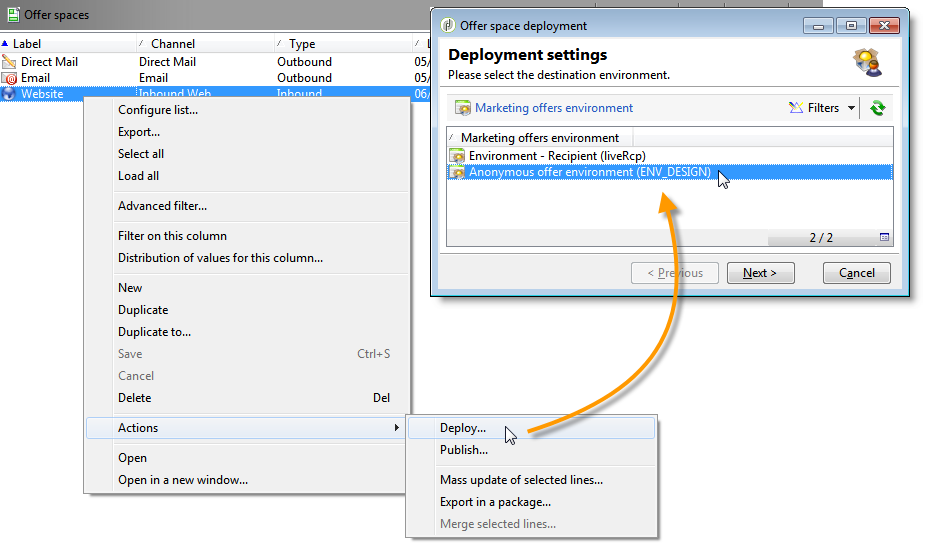

# 常规配置{#general-configurations}


如果您从v5.11或v6.02迁移，本节将详细介绍在Adobe Campaign v7中执行的配置。

此外：

* 如果从v5.11进行迁移，则还必须完成[v5.11](../../migration/using/specific-configurations-in-v5-11.md)中的特定配置部分中详述的配置。
* 如果从v6.02进行迁移，则还必须完成[v6.02](../../migration/using/specific-configurations-in-v6-02.md)中的特定配置部分中详述的配置。

## 时区 {#time-zones}

### 多时区模式 {#multi-time-zone-mode}

在v6.02中，“多时区”模式仅适用于PostgreSQL数据库引擎。 现在，无论使用哪种类型的数据库引擎，都会提供该引擎。 我们强烈建议您将您的基础转换为“多时区”基础。

要使用TIMESTAMP WITH TIMEZONE模式，您还需要将&#x200B;**-userTimestamptz:1**&#x200B;选项添加到后级命令行中。

>[!IMPORTANT]
>
>如果将&#x200B;**-usetimestamptz:1**&#x200B;参数与不兼容的数据库引擎一起使用，您的数据库将损坏，您必须恢复数据库的备份并重新执行上述命令。

>[!NOTE]
>
>通过控制台（**[!UICONTROL Administration > Platform > Options > WdbcTimeZone]**&#x200B;节点）迁移后，可以更改时区。
>
>有关时区管理的更多信息，请参阅[此部分](../../installation/using/time-zone-management.md)。

### Oracle {#oracle}

如果在升级后期间出现&#x200B;**ORA 01805**&#x200B;错误，则表示应用程序服务器和数据库服务器之间的Oracle时区文件不同步。 要重新同步它们，请应用以下步骤：

1. 要标识所使用的时区文件，请运行以下命令：

   ```
   select * from v$timezone_file
   ```

   时区文件通常位于&#x200B;**ORACLE_HOME/oracore/zoneinfo/**&#x200B;文件夹中。

1. 确保两个服务器上的时区文件相同。

有关更多信息，请访问：[https://docs.oracle.com/cd/E11882_01/server.112/e10729/ch4datetime.htm#NLSPG004](https://docs.oracle.com/cd/E11882_01/server.112/e10729/ch4datetime.htm#NLSPG004)。

客户端和服务器之间的时区不对齐也会导致一些滞后。 因此，我们建议在客户端和服务器端使用相同版本的Oracle库，因此两个时区必须相同。

要检查两侧是否位于同一时区，请执行以下操作：

1. 运行以下命令检查客户端上时区文件的版本：

   ```
   genezi -v
   ```

   genezi是在&#x200B;**$ORACLE_HOME/bin**&#x200B;存储库中找到的二进制文件。

1. 通过运行以下命令检查服务器端时区文件的版本：

   ```
   select * from v$timezone_file
   ```

1. 要更改客户端上的时区文件，请使用&#x200B;**ORA_TZFILE**&#x200B;环境变量。

## 安全性 {#security}

### 安全区 {#security-zones}

>[!IMPORTANT]
>
>出于安全考虑，Adobe Campaign平台默认不再可访问：您必须配置安全区，因此必须收集操作员IP地址。

Adobe Campaign v7包含&#x200B;**安全区**&#x200B;的概念。 每个用户必须与区域关联才能登录到实例，并且用户的IP地址必须包含在安全区域中定义的地址或地址范围中。 可以在Adobe Campaign服务器配置文件中配置安全区。 必须在控制台(**[!UICONTROL Administration > Access management > Operators]**)中定义用户关联到的安全区域。

**在迁移之前**，请咨询网络管理员以帮助您定义要在迁移后激活的安全区域。

**升级后** （在服务器重新启动之前）后，必须配置安全区。

在[此部分](../../installation/using/security-zones.md)中找到安全区域配置。

### 用户密码 {#user-passwords}

在v7中，**internal**&#x200B;和&#x200B;**admin**&#x200B;运算符连接必须使用密码进行保护。 我们强烈建议在迁移&#x200B;**之前，为这些帐户和所有操作员帐户分配密码。**&#x200B;如果您没有为&#x200B;**internal**&#x200B;指定密码，则将无法连接。 要为&#x200B;**internal**&#x200B;分配密码，请输入以下命令：

```
nlserver config -internalpassword
```

>[!IMPORTANT]
>
>对于所有跟踪服务器，**internal**&#x200B;密码必须相同。 有关更多信息，请参阅[此部分](../../installation/using/configuring-campaign-server.md#internal-identifier)和[此部分](../../platform/using/access-management.md)。

### v7的新增功能 {#new-features-in-v7}

* 无权限的用户无法再连接到Adobe Campaign。 必须手动添加其权限，例如，通过创建名为&#x200B;**connect**&#x200B;的权限。

   受此修改影响的用户会在升级后期识别并列出。

* 如果密码为空，则跟踪不再有效。 如果出现这种情况，将显示一条错误消息，通知您并要求您重新配置它。
* 用户密码不再存储在&#x200B;**xtk:sessionInfo**&#x200B;架构中。
* 现在，使用&#x200B;**xtk:builder:EvaluateJavaScript**&#x200B;和&#x200B;**xtk:builder:EvaluateJavaScriptTemplate**&#x200B;函数时，需要管理权限。

某些现成的架构已经修改，默认情况下，现在只能通过具有&#x200B;**admin**&#x200B;权限的运算符的写入访问权限访问：

* ncm:publishing
* nl：监控
* nms:calendar
* xtk:builder
* xtk：连接
* xtk:dbInit
* xtk:entityBackupNew
* xtk:entityBackupOriginal
* xtk:entityOriginal
* xtk:form
* xtk:funcList
* xtk:fusion
* xtk:image
* xtk:javascript
* xtk:jssp
* xtk:jst
* xtk:navtree
* xtk:operatorGroup
* xtk:package
* xtk:queryDef
* xtk:resourceMenu
* xtk:rights
* xtk:schema
* xtk:scriptContext
* xtk:specFile
* xtk:sql
* xtk:sqlSchema
* xtk:srcSchema
* xtk:strings
* xtk:xslt

### Sessiontoken参数 {#sessiontoken-parameter}

在v5中，**sessiontoken**&#x200B;参数在客户端两端工作（概述类型屏幕、链接编辑器等的列表） 和服务器端（web应用程序、报表、jsp、jssp等）。 在v7中，它仅在服务器端工作。 如果要恢复v5上的完整功能，则必须使用此参数修改链接，并通过连接页面传递：

链接示例：

```
/view/recipientOverview?__sessiontoken=<trusted login>
```

使用连接页面的新链接：

```
/nl/jsp/logon.jsp?login=<trusted login>&action=submit&target=/view/recipientOverview
```

>[!IMPORTANT]
>
>如果您使用与受信任的IP掩码链接的运算符，请检查它是否具有最小权限，并且它是否处于&#x200B;**sessionTokenOnly**&#x200B;模式的安全区域中。

### SQL函数 {#sql-functions}

未知的SQL函数调用不再自然地发送到服务器。 目前，必须将所有SQL函数添加到&#x200B;**xtk:funcList**&#x200B;架构中（有关更多信息，请参见[此部分](../../configuration/using/adding-additional-sql-functions.md)）。 迁移时，在升级后期间会添加一个选项，该选项允许您与未声明的旧SQL函数保持兼容。 如果要继续使用这些函数，请检查&#x200B;**XtkPassUnknownSQLFunctionsToRDBMS**&#x200B;选项是否确实在&#x200B;**[!UICONTROL Administration > Platform > Options]**&#x200B;节点级别定义。

>[!IMPORTANT]
>
>由于此选项会带来安全风险，我们强烈建议不要使用此选项。

### JSSP {#jssp}

例如，如果要授权通过HTTP协议（而非HTTPS）访问某些页面，则无论在安全区中执行何种配置，您都必须在相应的中继规则中指定&#x200B;**httpAllowed=&quot;true&quot;**&#x200B;参数。

如果使用匿名JSSP，则必须在JSSP的中继规则（**[!UICONTROL serverConf.xml]**&#x200B;文件）中添加&#x200B;**httpAllowed=&quot;true&quot;**&#x200B;参数：

例如：

```
<url IPMask="" deny="" hostMask="" httpAllowed="true" relayHost="true" relayPath="true"
           status="blacklist" targetUrl="https://localhost:8080" timeout="" urlPath="*/cus/myPublicPage.jssp"/>
```

## 语法 {#syntax}

### JavaScript {#javascript}

Adobe Campaign v7集成了更新的JavaScript解释器。 但是，此更新可能会导致某些脚本出现故障。 由于前一个引擎的权限更大，因此某些语法会起作用，而新版本的引擎已不再适用。

**[!UICONTROL myObject.@attribute]**&#x200B;语法现在仅对XML对象有效。 此语法可用于个性化投放和内容管理。 如果在非XML对象中使用此类语法，则个性化功能将不再有效。

对于所有其他对象类型，语法现在为&#x200B;**[!UICONTROL myObject`[`&quot;attribute&quot;`]`]**。 例如，使用以下语法的非XML对象：**[!UICONTROL employee.@sn]**，现在必须使用以下语法：**[!UICONTROL employee`[`&quot;sn&quot;`]`]**。

* 以前的语法：

   ```
   employee.@sn
   ```

* 新语法：

   ```
   employee["sn"]
   ```

要更改XML对象中的值，您现在需要先更新值，然后再添加XML节点：

* 旧JavaScript代码：

   ```
   var cellStyle = node.style.copy();
   this.styles.appendChild(cellStyle);
   cellStyle.@width = column.@width;
   ```

* 新的JavaScript代码：

   ```
   var cellStyle = node.style.copy();
   cellStyle.@width = column.@width;
   this.styles.appendChild(cellStyle);
   ```

不能再将XML属性用作表键。

* 以前的语法：

   ```
   if(serverForm.activities[ctx.activityHistory.activity[0].@name].type !="end")
   ```

* 新语法：

   ```
   if(serverForm.activities[String(ctx.activityHistory.activity[0].@name)].type !="end"
   ```

### SQLData {#sqldata}

为了加强实例安全性，Adobe Campaign v7中引入了新的语法来替换基于SQLData的语法。 如果将这些代码元素与此语法一起使用，则必须修改它们。 主要内容包括：

* 按子查询过滤：新语法基于`<subQuery>`元素来定义子查询
* 聚合：新语法为“aggregate function(collection)”
* 按连接过滤：新语法为`[schemaName:alias:xPath]`

已修改queryDef(xtk:queryDef)架构：

* 新的`<subQuery>`元素可用于替换SQLData中包含的SELECT
* 为属性引入了两个新值，即“IN”和“NOT IN”@setOperator
* 新的`<where>`元素，它是`<node>`元素的子元素：这样，您就可以在SELECT中进行“子选择”

使用“@expr”属性时，SQLData可能存在。 可以搜索以下术语：&quot;SQLData&quot;、&quot;aliasSqlTable&quot;、&quot;sql&quot;。

Adobe Campaign v7实例默认是安全的。 安全性来自&#x200B;**[!UICONTROL serverConf.xml]**&#x200B;文件中安全区的定义：**allowSQLIncompent**&#x200B;属性可管理SQL语法安全性。

如果在升级后执行期间发生SQLData错误，则必须修改此属性以临时允许使用基于SQLData的语法，从而允许您重写代码。 为此，必须在&#x200B;**serverConf.xml**&#x200B;文件中更改以下选项：

```
allowSQLInjection="true"
```

因此，请使用以下命令重新启动升级后：

```
nlserver config -postupgrade -instance:<instance_name> -force
```

您必须配置安全区（请参阅[Security](#security)），然后通过更改以下选项来重新激活安全区：

```
allowSQLInjection="false"
```

下面将找到旧语法和新语法的比较示例。

**按子查询过滤**

* 以前的语法：

   ```
   <condition expr="@id NOT IN ([SQLDATA[SELECT iOperatorId FROM XtkOperatorGroup WHERE iGroupId = $(../@owner-id)]])" enabledIf="$(/ignored/@ownerType)=1"/>
   ```

* 新语法：

   ```
   <condition setOperator="NOT IN" expr="@id" enabledIf="$(/ignored/@ownerType)=1">
     <subQuery schema="xtk:operatorGroup">
        <select>
          <node expr="[@operator-id]" />
        </select>
        <where>
          <condition expr="[@group-id]=$long(../@owner-id)"/>
        </where>
      </subQuery>
   </condition>
   ```

* 以前的语法：

   ```
   <queryFilter name="dupEmail" label="Emails duplicated in the folder" schema="nms:recipient">
       <where>
         <condition sql="sEmail in (select sEmail from nmsRecipient where iFolderId=$(folderId) group by sEmail having count(sEmail)>1)" internalId="1"/>
       </where>
       <folder _operation="none" name="nmsSegment"/>
     </queryFilter>
   ```

* 新语法：

   ```
   <queryFilter name="dupEmail" label=" Emails duplicated in the folder " schema="nms:recipient">
       <where>
         <condition expr="@email" setOperator="IN" internalId="1">
           <subQuery schema="nms:recipient">
             <select><node expr="@email"/></select>
             <where><condition expr="[@folder-id]=$(folderId)"/></where>
             <groupBy><node expr="@email"/></groupBy>
             <having><condition expr="count(@email)>1"/></having>
           </subQuery>
         </condition>
       </where>
       <folder _operation="none" name="nmsSegment"/>
     </queryFilter>
   ```

**聚合**

聚合函数（集合）

* 以前的语法：

   ```
   <node sql="(select count(*) from NmsNewsgroup WHERE O0.iOperationId=iOperationId)" alias="@nbMessages"/>
   ```

* 新语法：

   ```
   <node expr="count([newsgroup/@id])" alias="../@nbMessages"/>
   ```

   >[!NOTE]
   >
   >自动地对集料函数执行节点。 不再需要指定OO0.iOperationId=iOperationId的条件。
   >
   >无法再使用“count(*)”函数。 您必须使用“countall()”。

* 以前的语法：

   ```
   <node sql="(select Sum(iToDeliver) from NmsDelivery WHERE O0.iOperationId=iOperationId AND iSandboxMode=0 AND iState>=45)" alias="@nbMessages"/>
   ```

* 新语法：

   ```
   <node expr="Sum([delivery-linkedDelivery/properties/@toDeliver])" alias= "../@sumToDeliver">
                     <where><condition expr="[validation/@sandboxMode]=0 AND @state>=45" /></where></node>
   ```

**按连接过滤**

`[schemaName:alias:xPath]`

别名是可选的

* 以前的语法：

   ```
   <condition expr={"[" + joinPart.destination.nodePath + "] = [SQLDATA[W." + joinPart.source.SQLName + "]]"}
                                            aliasSqlTable={nodeSchemaRoot.SQLTable + " W"}/>
   ```

* 新语法：

   ```
   <condition expr={"[" + joinPart.destination.nodePath + "] = [" + nodeSchema.id + ":" + joinPart.source.nodePath + "]]"}/>
   ```

**提示和技巧**

在`<subQuery>`元素中，引用主`<queryDef>`的“field”字段   元素，请使用以下语法：`[../@field]`

示例:

```
<queryDef operation="select" schema="xtk:jobLog" startPath="/" xtkschema="xtk:queryDef">
  <select>
    <node expr="[job/@pid]" alias="@pid"/>
    <node expr="@id" ordered="true"/>
    <node expr="@logType"/>
  </select>
  <where>
    <condition expr="[@job-id]=99"/>
    <condition expr="@logType" setOperator="IN">
      <subQuery schema="xtk:jobLog">
        <select><node expr="@logType"/></select>
        <where><condition expr="[@job-id]=[../job/@id]"/></where>
        <groupBy><node expr="@logType"/></groupBy>
        <having><condition expr="count(@logType)>1"/></having>
      </subQuery>
    </condition>
  </where>
</queryDef>
```

## 冲突 {#conflicts}

迁移是通过升级后执行的，冲突可能会显示在报表、表单或Web应用程序中。 这些冲突可以从控制台中解决。

资源同步后，使用&#x200B;**postupgrade**&#x200B;命令可以检测同步是否生成错误或警告。

### 查看同步结果 {#view-the-synchronization-result}

可以通过两种方式查看同步结果：

* 在命令行界面中，错误由三个V形标记&#x200B;**>>**&#x200B;实现，并自动停止同步。 警告由双V形标记&#x200B;**>>**&#x200B;实现，并且必须在同步完成后进行解析。 在升级后，命令提示符中会显示一个摘要。 例如：

   ```
   2013-04-09 07:48:39.749Z        00002E7A          1     info    log     =========Summary of the update==========
   2013-04-09 07:48:39.749Z        00002E7A          1     info    log     test instance, 6 warning(s) and 0 error(s) during the update.
   2013-04-09 07:48:39.749Z        00002E7A          1     warning log     The document with identifier 'mobileAppDeliveryFeedback' and type 'xtk:report' is in conflict with the new version.
   2013-04-09 07:48:39.749Z        00002E7A          1     warning log     The document with identifier 'opensByUserAgent' and type 'xtk:report' is in conflict with the new version.
   2013-04-09 07:48:39.750Z        00002E7A          1     warning log     The document with identifier 'deliveryValidation' and type 'nms:webApp' is in conflict with the new version.
   2013-04-09 07:48:39.750Z        00002E7A          1     warning log     Document of identifier 'nms:includeView' and type 'xtk:srcSchema' updated in the database and found in the file system. You will have to merge the two versions manually.
   ```

   如果警告涉及资源冲突，则需要操作员注意才能解决该问题。

* postupgrade`>`.log **文件的** postupgrade_`<server version number>`_time包含同步结果。 默认情况下，该插件可在以下目录中使用：**安装目录/var/`<instance>`postupgrade**。 **error**&#x200B;和&#x200B;**warning**&#x200B;属性会指示错误和警告。

### 解决冲突 {#resolve-a-conflict}

解决冲突必须仅由高级运算符和那些已获得“管理员”权限的运算符执行。

要解决冲突，请应用以下流程：

1. 在Adobe Campaign树结构中，将光标放在&#x200B;**[!UICONTROL Administration > Configuration > Package management > Edit conflicts]**&#x200B;上。
1. 在列表中选择要解决的冲突。

解决冲突的方法有三种：

* **[!UICONTROL Declared as resolved]**:需要事先操作员干预。
* **[!UICONTROL Accept the new version]**:如果用户未更改随Adobe Campaign提供的资源，则建议使用此选项。
* **[!UICONTROL Keep the current version]**:表示更新被拒绝。

   >[!IMPORTANT]
   如果选择此解决模式，则可能会丢失新版本中的修补程序。 因此，强烈建议不要使用或仅保留此选项给专家运算符。

如果选择手动解决冲突，请按如下方式继续：

1. 在窗口的下部，搜索&#x200B;**`_conflict_ string`**&#x200B;以查找存在冲突的实体。 随新版本一起安装的实体包含&#x200B;**new**&#x200B;参数，与先前版本匹配的实体包含&#x200B;**cus**&#x200B;参数。

   

1. 删除您不希望保留的版本。 删除要保留的实体的&#x200B;**`_conflict_argument_ string`**。

   

1. 转到您本该解决的冲突。 单击&#x200B;**[!UICONTROL Actions]**&#x200B;图标，然后选择&#x200B;**[!UICONTROL Declare as resolved]**。
1. 保存更改：冲突现已解决。

## Tomcat {#tomcat}

Adobe Campaign v7中集成的Tomcat服务器已更改了版本。 因此，其安装文件夹(tomcat-6)也发生了更改(tomcat 7)。 升级后，请确保检查路径是否链接到更新的文件夹（在&#x200B;**[!UICONTROL serverConf.xml]**&#x200B;文件中）：

```
$(XTK_INSTALL_DIR)/tomcat-8/bin/bootstrap.jar 
$(XTK_INSTALL_DIR)/tomcat-8/bin/tomcat-juli.jar
$(XTK_INSTALL_DIR)/tomcat-8/lib/tomcat-util.jar
$(XTK_INSTALL_DIR)/tomcat-8/lib/tomcat-api.jar
$(XTK_INSTALL_DIR)/tomcat-8/lib/servlet-api.jar
$(XTK_INSTALL_DIR)/tomcat-8/lib/jsp-api.jar
$(XTK_INSTALL_DIR)/tomcat-8/lib/el-api.jar
```

## 互动 {#interaction}

### 先决条件 {#prerequisites}

**在升级后**&#x200B;之前，必须从6.02中删除v7中将不再存在的所有架构引用。

* nms:emailOfferView
* nms:webOfferView
* nms:callCenterOfferView
* nms:mobileOfferView
* nms:paperOfferView

### 选件内容 {#offer-content}

在v7中，选件内容已移动。 在v6.02中，内容位于每个表示模式(**nms:emailOfferView**)中。 在v7中，内容现在位于选件架构中。 升级后，该内容将不会显示在界面中。 升级后，您必须重新创建选件内容，或开发一个脚本，该脚本会自动将内容从表示架构移动到选件架构。

>[!IMPORTANT]
如果迁移后发送了某些使用已配置选件的投放，则必须在v7中删除并重新创建所有这些投放。 如果您无法执行此操作，则会提供“兼容性模式”。 不建议使用此模式，因为您不会从Interaction v7中的所有新增功能中受益。 这是一种过渡模式，允许您在实际6.1迁移之前完成持续的营销活动。 有关此模式的更多信息，请联系我们。

在Adobe Campaign v7文件夹的&#x200B;**Migration**&#x200B;文件夹中提供了移动脚本(**interactionTo610_full_XX.js**)的示例。 此文件显示了一个客户端脚本示例，该脚本针对每个选件使用单个电子邮件表示形式（**[!UICONTROL htmlSource]**&#x200B;和&#x200B;**[!UICONTROL textSource]**&#x200B;字段）。 **NmsEmailOfferView**&#x200B;表中的内容已移至选件表。

>[!NOTE]
使用此脚本不允许您从“内容管理”和“渲染函数”选项中受益。 要从这些功能中受益，您必须重新思考目录选件，特别是选件内容和配置空间。

```
loadLibrary("/nl/core/shared/nl.js");

NL.require("/nl/core/shared/xtk.js");

// 1. Restore old emailOfferView schema
logInfo("Restoring old emailOfferView schema");
var oldOfferViewSchemas = <entities schema="xtk:srcSchema"/>;

oldOfferViewSchemas.appendChild(
  <srcSchema img="nms:offerView.png"
             label="Email offer representations"
             labelSingular="Email offer representation"
             name="emailOfferView" namespace="nlmig"
             genAccessors="false" implements="xtk:persist">
    <element name="emailOfferView" template="nms:offerView" sqltable="NmsEmailOfferView">
      <element name="offer" revLabel="Email representation" revIntegrity="owncopy"/>
      <element   name="htmlSource"      type="html" label="HTML content"  xml="true"/>
      <element   name="textSource"      type="CDATA" label="Text content" xml="true"/>
      <element   name="htmlSource_jst"  type="CDATA" label="HTML script"  desc="HTML content calculation script."  xml="true" advanced="true"/>
      <element   name="textSource_jst"  type="CDATA" label="Text script" desc="Text content calculation script." xml="true" advanced="true"/>
    </element>
  </srcSchema>);

var oldOfferViewsPkg = <builder><package buildNumber="*">{oldOfferViewSchemas}</package></builder>;
xtk.builder.InstallPackage(oldOfferViewsPkg);

// 2. Migrate data from old emailOfferView table to nms:offer
logInfo("Moving data from old EmailOfferView table to NmsOffer");
var OFFER_STATUS_VALIDATED = 3;

var queryDef = xtk.queryDef.create(
  <queryDef operation="select" schema="nlmig:emailOfferView">
    <select>
      <node expr="[@offer-id]"/>
      <node expr="[@space-id]"/>
      <node expr="htmlSource_jst"/>
      <node expr="textSource_jst"/>
    </select>
  </queryDef>);
var res = queryDef.ExecuteQuery();

var processedOffers = {};
for each( var emailOfferView in res.emailOfferView )
{
  if( processedOffers[String(emailOfferView.@["offer-id"])] != undefined )
  {
    logWarning("Found 2 or more eff fffffmail representations for offer " + String(emailOfferView.@["offer-id"]) + ". Only keep the first one here.");
    continue;
  }
  xtk.session.Write(
    <offer id={emailOfferView.@["offer-id"]} status={OFFER_STATUS_VALIDATED} xtkschema="nms:offer">
      <view>
        {emailOfferView.mdSource_jst}
        {emailOfferView.textSource_jst}
      </view>
    </offer>
  );
  processedOffers[String(emailOfferView.@["offer-id"])] = 1;
}

// 3. Get rid of emailOfferView schema now that data has been moved.
logInfo("Deleting EmailOfferView schema");
xtk.session.Write(<srcSchema xtkschema="xtk:srcSchema" name="emailOfferView" namespace="nlmig" _operation="delete"/>);

logInfo("Done");
```

### 测试和配置 {#tests-and-configuration}

在移动了选件内容后，如果您只有一个环境，请按照以下步骤操作。 在本例中，让我们以“ENV”为例。

1. 在所有“ENV”环境选件空格中，更新所用字段的列表。 例如，对于仅使用&#x200B;**[!UICONTROL htmlSource]**&#x200B;的选件空间，必须添加&#x200B;**[!UICONTROL view/htmlSource]**。

   

1. 在&#x200B;**[!UICONTROL General]**&#x200B;选项卡的&#x200B;**[!UICONTROL Type of Environment]**&#x200B;字段中，选择&#x200B;**[!UICONTROL Live]**。

   

1. 创建一个设计环境（例如“ENV_DESIGN”）并将其连接到ENV联机环境。

   

1. 部署所有“ENV”环境选件空间（右键单击> **[!UICONTROL Actions > Deploy]**）并选择“ENV_DESIGN”环境。

   

1. 对所有“ENV”环境选件执行相同的操作。
1. 在相关渠道上激活所有环境提供“ENV_DESIGN”。
1. 测试是否启用选件。 如果您没有遇到任何问题，请对最新的工作流任务&#x200B;**[!UICONTROL Offer notification]**(offerMgt)执行挂起的任务，以使所有选件都上线。

   

1. 执行全面的测试。

   >[!NOTE]
   上线后将修改类别和选件的名称。 在传入渠道中，更新对选件和类别的所有引用。

## 报告 {#reports}

### 标准报表 {#standard-reports}

当前所有标准报表都使用渲染引擎v6.x。如果您已将JavaScript添加到这些报表中，则某些元素可能无法再正常使用。 事实上，旧版JavaScript与v6.x渲染引擎不兼容。 因此，您必须检查JavaScript代码，稍后再对其进行调整。 您应该测试每个报表，特别是导出函数。

### 个性化报表 {#personalized-reports}

<!--If you want to have the blue banner from v7 (allowing you access to the tabs), you must republish reports. If you encounter problems, you can force the v6.0 rendering engine. To do this, go to **[!UICONTROL Properties]** within the report, click **[!UICONTROL Rendering]** and choose the **[!UICONTROL Version 6.0 (Flash & OpenOffice)]** rendering engine.


-->
如果您希望从新报表功能中受益，则必须重新发布报表。 在这种情况下，请检查您的所有脚本，并根据需要更改它们。 关于PDF导出，如果您为Open Office添加了特定脚本，则新的PDF导出引擎(PhantomJS)将不再适用此脚本。

## Web 应用程序 {#web-applications}

有两个Web应用程序系列：

* 已识别的Web应用程序（一起查看、批准表、外联网内部开发），
* 匿名Web应用程序（web或调查表表单）。

### 已识别的Web应用程序 {#identified-web-applications}

与报表（[了解更多](#reports)）一样，如果您已添加JavaScript，则必须检查并调整（如果需要）。 如果您希望从v7蓝色横幅（包含蓝色选项卡）中受益，则必须重新发布Web应用程序。

v7中的Web应用程序连接方法已发生更改。 如果在已识别的Web应用程序中遇到任何连接问题，必须临时激活&#x200B;**serverConf.xml**&#x200B;文件中的&#x200B;**allowUserPassword**&#x200B;和&#x200B;**sessionTokenOnly**&#x200B;选项。 在升级后，修改以下选项值：

```
allowUserPassword="true"
```

```
sessionTokenOnly="true"
```

因此，请使用以下命令重新启动升级后：

```
nlserver config -postupgrade -instance:<instance_name> -force
```

在发布Web应用程序之前，请在v6.x渲染引擎中测试它们。 然后，取消激活这两个选项。

```
allowUserPassword="false"
```

```
sessionTokenOnly="false"
```

### 匿名Web应用程序 {#anonymous-web-applications}

如果遇到任何问题，请重新发布Web应用程序。

## 红帽 {#red-hat}

如果在v6.02或v5.11中删除了现成的架构，则在升级后可能无法再编辑您的架构。 如果发生这种情况，请执行以下命令：

```
su - neolane
nlserver config -postupgrade -instance:<instance name> -force
```
