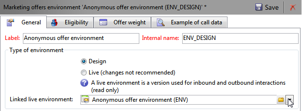

# 常规配置{#general-configurations}


本节详细介绍从v5.11或v6.02迁移时，在Adobe Campaign v7中执行的配置。

此外：

* 如果从v5.11迁移，则还必须完成中详述的配置 [本节](../../migration/using/configuring-your-platform.md#specific-configurations-in-v5-11).
* 如果从v6.02进行迁移，则还必须完成中详述的配置 [本节](../../migration/using/configuring-your-platform.md#specific-configurations-in-v6-02).

## 时区 {#time-zones}

### 多时区模式 {#multi-time-zone-mode}

在v6.02中，“多时区”模式仅适用于PostgreSQL数据库引擎。 现在，无论使用哪种类型的数据库引擎，都提供该功能。 我们强烈建议您将“基本时区”转换为“多时区”基本时区。

要使用TIMESTAMP WITH TIMEZONE模式，您还需要添加 **-userTimestamptz：1** 选项添加到升级后命令行。

>[!IMPORTANT]
>
>如果 **-usetimestamptz：1** 参数用于不兼容的数据库引擎，数据库将损坏，您必须恢复数据库的备份并重新执行上述命令。

>[!NOTE]
>
>可以在迁移后通过控制台(**[!UICONTROL Administration > Platform > Options > WdbcTimeZone]** 节点)。
>
>有关时区管理的详细信息，请参阅 [本节](../../installation/using/time-zone-management.md).

### Oracle {#oracle}

如果您收到 **ORA 01805** 升级后期间出错，这意味着应用程序服务器和数据库服务器之间的Oracle时区文件不同步。 要重新同步它们，请应用以下步骤：

1. 要标识使用的时区文件，请运行以下命令：

   ```
   select * from v$timezone_file
   ```

   时区文件通常可在 **oracle_HOME/oracore/zoneinfo/** 文件夹。

1. 确保两个服务器上的时区文件相同。

有关详细信息，请访问： [https://docs.oracle.com/cd/E11882_01/server.112/e10729/ch4datetime.htm#NLSPG004](https://docs.oracle.com/cd/E11882_01/server.112/e10729/ch4datetime.htm#NLSPG004).

客户端和服务器之间的时区不一致也会导致一些延迟。 因此，我们建议在客户端和服务器端使用相同版本的Oracle库，因为这两个时区必须相同。

要检查双方是否位于相同的时区，请执行以下操作：

1. 通过运行以下命令检查客户端的时区文件的版本：

   ```
   genezi -v
   ```

   genezi是中找到的二进制文件 **$ORACLE_HOME/bin** 存储库。

1. 通过运行以下命令检查服务器端的时区文件的版本：

   ```
   select * from v$timezone_file
   ```

1. 要更改客户端的时区文件，请使用 **ORA_TZFILE** 环境变量。

## 安全性 {#security}

### 安全区域 {#security-zones}

>[!IMPORTANT]
>
>出于安全原因，默认情况下无法再访问Adobe Campaign平台：您必须配置安全区域，因此请收集操作员IP地址。

Adobe Campaign v7包含的概念 **安全区域**. 每个用户都必须与区域关联才能登录到实例，并且用户的IP地址必须包含在安全区域中定义的地址或地址范围中。 可在Adobe Campaign服务器配置文件中配置安全区域。 必须在控制台中定义用户关联的安全区域(**[!UICONTROL Administration > Access management > Operators]**)。

**迁移前**，请咨询您的网络管理员，帮助您定义要在迁移后激活的安全区域。

**升级后** （在服务器重新启动之前），必须配置安全区域。

安全区域配置位于 [本节](../../installation/using/security-zones.md).

### 用户密码 {#user-passwords}

在v7中， **内部** 和 **管理员** 运算符连接必须使用密码进行保护。 我们强烈建议为这些帐户和所有操作员帐户分配密码， **迁移前**. 如果尚未指定密码 **内部**，您将无法连接。 要将密码分配给 **内部**，输入以下命令：

```
nlserver config -internalpassword
```

>[!IMPORTANT]
>
>此 **内部** 所有跟踪服务器的密码必须相同。 有关更多信息，请参阅 [本节](../../installation/using/configuring-campaign-server.md#internal-identifier) 和 [本节](../../platform/using/access-management.md).

### v7中的新增功能 {#new-features-in-v7}

* 没有权限的用户无法再连接到Adobe Campaign。 必须手动添加其权限，例如，通过创建名为的权限 **connect**.

  在升级后期间，将确定并列出受此修改影响的用户。

* 如果密码为空，则跟踪不再有效。 如果是这种情况，将显示一条错误消息，让您知道并要求您重新配置它。
* 用户密码不再存储在 **xtk：sessionInfo** 架构。
* 现在需要管理权限才能使用 **`xtk:builder:EvaluateJavaScript`** 和 **`xtk:builder:EvaluateJavaScriptTemplate`** 函数。

某些开箱即用的架构已修改，现在默认情况下只能通过具有的运算符的写入访问权限进行访问 **管理员** 权限：

* ncm：publishing
* nl：monitoring
* nms：calendar
* xtk：builder
* xtk：连接
* xtk：dbInit
* xtk：entityBackupNew
* xtk：entityBackupOriginal
* xtk：entityOriginal
* xtk：form
* xtk：funcList
* xtk：fusion
* xtk：image
* xtk：javascript
* xtk：jssp
* xtk：jst
* xtk：navtree
* xtk：operatorGroup
* xtk：package
* xtk：queryDef
* xtk：resourceMenu
* xtk：rights
* xtk：schema
* xtk：scriptContext
* xtk：specFile
* xtk：sql
* xtk：sqlSchema
* xtk：srcSchema
* xtk：字符串
* xtk：xslt

### Sessiontoken参数 {#sessiontoken-parameter}

在v5中， **sessiontoken** 参数在客户端均可使用（概述类型屏幕的列表、链接编辑器等） 和服务器端（Web应用程序、报表、jsp、jssp等）。 在v7中，它仅在服务器端工作。 如果要像v5一样返回全部功能，则必须使用此参数修改链接，并通过连接页面传递：

链接示例：

```
/view/recipientOverview?__sessiontoken=<trusted login>
```

使用“连接”页面新建链接：

```
/nl/jsp/logon.jsp?login=<trusted login>&action=submit&target=/view/recipientOverview
```

>[!IMPORTANT]
>
>如果您使用与受信任IP掩码关联的运算符，请检查该运算符是否具有最低权限，以及它是否位于的安全区域中 **sessionTokenOnly** 模式。

### SQL函数 {#sql-functions}

未知的SQL函数调用不再自然发送到服务器。 目前，所有SQL函数都必须添加到 **xtk：funcList** 架构(有关更多信息，请参阅 [本节](../../configuration/using/adding-additional-sql-functions.md))。 在迁移时，将在升级后期间添加一个选项，该选项允许您保持与旧的未声明SQL函数的兼容性。 如果要继续使用这些功能，请检查 **XtkPassUnknownSQLFunctionsToRDBMS** 选项的确定义于 **[!UICONTROL Administration > Platform > Options]** 节点级别。

>[!IMPORTANT]
>
>由于此选项会带来安全风险，因此我们强烈建议不要使用此选项。

### JSSP {#jssp}

例如，如果您要授权通过HTTP协议（而非HTTPS）访问某些页面，则在您的Web应用程序中，无论在安全区域中执行什么配置，都必须指定 **httpAllowed=&quot;true&quot;** 参数对应的中继规则。

如果您使用匿名JSSP，则必须添加 **httpAllowed=&quot;true&quot;** JSSP的中继规则中的参数(**[!UICONTROL serverConf.xml]** 文件)：

例如：

```
<url IPMask="" deny="" hostMask="" httpAllowed="true" relayHost="true" relayPath="true"
           status="blacklist" targetUrl="https://localhost:8080" timeout="" urlPath="*/cus/myPublicPage.jssp"/>
```

## 语法 {#syntax}

### JavaScript {#javascript}

Adobe Campaign v7集成了更新的JavaScript解释器。 但是，此更新可能会导致某些脚本无法正常运行。 由于前一款引擎更为宽容，某些语法将起作用，而新款引擎已不再是这种情况。

此 **[!UICONTROL myObject.@attribute]** 语法现在仅对XML对象有效。 此语法可用于个性化投放和内容管理。 如果您在非XML对象上使用了此类语法，则个性化功能将不再有效。

对于所有其他对象类型，语法现在为 **[!UICONTROL myObject`[`&quot;attribute&quot;`]`]**. 例如，使用以下语法的非XML对象： **[!UICONTROL employee.@sn]**&#x200B;中，现在必须使用以下语法： **[!UICONTROL employee`[`&quot;sn&quot;`]`]**.

* 以前的语法：

  ```
  employee.@sn
  ```

* 新语法：

  ```
  employee["sn"]
  ```

要更改XML对象中的值，您现在需要在添加XML节点之前先更新值：

* 旧JavaScript代码：

  ```
  var cellStyle = node.style.copy();
  this.styles.appendChild(cellStyle);
  cellStyle.@width = column.@width;
  ```

* 新的JavaScript代码：

  ```
  var cellStyle = node.style.copy();
  cellStyle.@width = column.@width;
  this.styles.appendChild(cellStyle);
  ```

不能再将XML属性用作表键。

* 以前的语法：

  ```
  if(serverForm.activities[ctx.activityHistory.activity[0].@name].type !="end")
  ```

* 新语法：

  ```
  if(serverForm.activities[String(ctx.activityHistory.activity[0].@name)].type !="end"
  ```

### SQLData {#sqldata}

为了加强实例安全性，在Adobe Campaign v7中引入了一个新语法，以取代基于SQLData的语法。 如果将这些代码元素与此语法一起使用，则必须对其进行修改。 有关的主要内容包括：

* 按子查询过滤：新语法基于 `<subQuery>`  用于定义子查询的元素
* 聚合：新语法为“aggregate function(collection)”
* 按连接过滤：新语法为 `[schemaName:alias:xPath]`

queryDef (xtk：queryDef)架构已修改：

* 新 `<subQuery>`  元素可用来替换SQLData中包含的SELECT
* @setOperator属性引入了两个新值：“IN”和“NOT IN”
* 新 `<where>`  元素，是以下项的子项： `<node>` 元素：这使您可以在SELECT中进行“子选择”

当使用“@expr”属性时，可能存在SQLData。 可以搜索以下术语：“SQLData”、“aliasSqlTable”、“sql”。

默认情况下，Adobe Campaign v7实例是安全的。 安全是指 **[!UICONTROL serverConf.xml]** 文件： **allowSQLInjection** 属性管理SQL语法安全性。

如果在升级后执行期间发生SQLData错误，则必须修改此属性以暂时允许使用基于SQLData的语法，从而允许您重写代码。 要执行此操作，必须在 **serverConf.xml** 文件：

```
allowSQLInjection="true"
```

因此，使用以下命令重新启动升级后：

```
nlserver config -postupgrade -instance:<instance_name> -force
```

您必须配置安全区域(请参阅 [安全性](#security))，然后通过更改选项重新激活安全性：

```
allowSQLInjection="false"
```

下方显示了新旧语法的对比示例。

**按子查询筛选**

* 以前的语法：

  ```
  <condition expr="@id NOT IN ([SQLDATA[SELECT iOperatorId FROM XtkOperatorGroup WHERE iGroupId = $(../@owner-id)]])" enabledIf="$(/ignored/@ownerType)=1"/>
  ```

* 新语法：

  ```
  <condition setOperator="NOT IN" expr="@id" enabledIf="$(/ignored/@ownerType)=1">
    <subQuery schema="xtk:operatorGroup">
       <select>
         <node expr="[@operator-id]" />
       </select>
       <where>
         <condition expr="[@group-id]=$long(../@owner-id)"/>
       </where>
     </subQuery>
  </condition>
  ```

* 以前的语法：

  ```
  <queryFilter name="dupEmail" label="Emails duplicated in the folder" schema="nms:recipient">
      <where>
        <condition sql="sEmail in (select sEmail from nmsRecipient where iFolderId=$(folderId) group by sEmail having count(sEmail)>1)" internalId="1"/>
      </where>
      <folder _operation="none" name="nmsSegment"/>
    </queryFilter>
  ```

* 新语法：

  ```
  <queryFilter name="dupEmail" label=" Emails duplicated in the folder " schema="nms:recipient">
      <where>
        <condition expr="@email" setOperator="IN" internalId="1">
          <subQuery schema="nms:recipient">
            <select><node expr="@email"/></select>
            <where><condition expr="[@folder-id]=$(folderId)"/></where>
            <groupBy><node expr="@email"/></groupBy>
            <having><condition expr="count(@email)>1"/></having>
          </subQuery>
        </condition>
      </where>
      <folder _operation="none" name="nmsSegment"/>
    </queryFilter>
  ```

**总计**

集合函数(collection)

* 以前的语法：

  ```
  <node sql="(select count(*) from NmsNewsgroup WHERE O0.iOperationId=iOperationId)" alias="@nbMessages"/>
  ```

* 新语法：

  ```
  <node expr="count([newsgroup/@id])" alias="../@nbMessages"/>
  ```

  >[!NOTE]
  >
  >对于集合函数，自动执行连接。 不再需要指定条件WHERE O0.iOperationId=iOperationId。
  >
  >不能再使用“count(&#42;)”函数。 必须使用“countall()”。

* 以前的语法：

  ```
  <node sql="(select Sum(iToDeliver) from NmsDelivery WHERE O0.iOperationId=iOperationId AND iSandboxMode=0 AND iState>=45)" alias="@nbMessages"/>
  ```

* 新语法：

  ```
  <node expr="Sum([delivery-linkedDelivery/properties/@toDeliver])" alias= "../@sumToDeliver">
                    <where><condition expr="[validation/@sandboxMode]=0 AND @state>=45" /></where></node>
  ```

**按连接过滤**

`[schemaName:alias:xPath]`

别名是可选的

* 以前的语法：

  ```
  <condition expr={"[" + joinPart.destination.nodePath + "] = [SQLDATA[W." + joinPart.source.SQLName + "]]"}
                                           aliasSqlTable={nodeSchemaRoot.SQLTable + " W"}/>
  ```

* 新语法：

  ```
  <condition expr={"[" + joinPart.destination.nodePath + "] = [" + nodeSchema.id + ":" + joinPart.source.nodePath + "]]"}/>
  ```

**提示和技巧**

在 `<subQuery>` 元素，以引用主字段的 `<queryDef>`   元素，请使用以下语法： `[../@field]`

例如：

```
<queryDef operation="select" schema="xtk:jobLog" startPath="/" xtkschema="xtk:queryDef">
  <select>
    <node expr="[job/@pid]" alias="@pid"/>
    <node expr="@id" ordered="true"/>
    <node expr="@logType"/>
  </select>
  <where>
    <condition expr="[@job-id]=99"/>
    <condition expr="@logType" setOperator="IN">
      <subQuery schema="xtk:jobLog">
        <select><node expr="@logType"/></select>
        <where><condition expr="[@job-id]=[../job/@id]"/></where>
        <groupBy><node expr="@logType"/></groupBy>
        <having><condition expr="count(@logType)>1"/></having>
      </subQuery>
    </condition>
  </where>
</queryDef>
```

## 冲突 {#conflicts}

迁移是通过升级后执行的，冲突可能会出现在报表、表单或Web应用程序中。 这些冲突可以从控制台中解决。

在资源同步之后， **升级后** 命令用于检测同步是否生成错误或警告。

### 查看同步结果 {#view-the-synchronization-result}

可通过两种方式查看同步结果：

* 在命令行界面中，错误以三个V形符号具体化 **>>>** 并且同步会自动停止。 警告以双V形标记具体化 **>>** 同步完成后必须解析和。 升级后结束时，命令提示符中会显示摘要。 例如：

  ```
  2013-04-09 07:48:39.749Z        00002E7A          1     info    log     =========Summary of the update==========
  2013-04-09 07:48:39.749Z        00002E7A          1     info    log     test instance, 6 warning(s) and 0 error(s) during the update.
  2013-04-09 07:48:39.749Z        00002E7A          1     warning log     The document with identifier 'mobileAppDeliveryFeedback' and type 'xtk:report' is in conflict with the new version.
  2013-04-09 07:48:39.749Z        00002E7A          1     warning log     The document with identifier 'opensByUserAgent' and type 'xtk:report' is in conflict with the new version.
  2013-04-09 07:48:39.750Z        00002E7A          1     warning log     The document with identifier 'deliveryValidation' and type 'nms:webApp' is in conflict with the new version.
  2013-04-09 07:48:39.750Z        00002E7A          1     warning log     Document of identifier 'nms:includeView' and type 'xtk:srcSchema' updated in the database and found in the file system. You will have to merge the two versions manually.
  ```

  如果警告与资源冲突有关，则操作员需要注意解决该冲突。

* 此 **升级后_`<server version number>`升级后时间(_T)`>`.log** 文件包含同步结果。 默认情况下，它位于以下目录中： **安装目录/var/`<instance>`升级后**. 错误和警告由 **错误** 和 **警告** 属性。

### 解决冲突 {#resolve-a-conflict}

解决冲突必须仅由高级操作员以及已授予“管理员”权限的操作员执行。

要解决冲突，请应用以下进程：

1. 在Adobe Campaign树结构中，将光标放在 **[!UICONTROL Administration > Configuration > Package management > Edit conflicts]**.
1. 在列表中选择要解决的冲突。

解决冲突的方法有三种：

* **[!UICONTROL Declared as resolved]**：需要操作员提前干预。
* **[!UICONTROL Accept the new version]**：如果用户未更改随Adobe Campaign提供的资源，则建议这样做。
* **[!UICONTROL Keep the current version]**：表示更新被拒绝。

  >[!IMPORTANT]
  >
  如果选择此解决模式，则可能会丢失新版本中的修补程序。 因此，强烈建议不要使用此选项，或者仅将此选项保留给专家操作员。

如果选择手动解决冲突，请按以下步骤操作：

1. 在窗口的下部，搜索 **`_conflict_ string`** 以查找具有冲突的图元。 使用新版本安装的实体包含 **新建** 参数，与先前版本匹配的实体包含 **cus** 参数。

   

1. 删除您不想保留的版本。 删除 **`_conflict_argument_ string`** 实体的URL名称。

   

1. 请转到您本来可以解决的冲突。 单击 **[!UICONTROL Actions]** 图标并选择 **[!UICONTROL Declare as resolved]**.
1. 保存更改：冲突现已解决。

## Tomcat {#tomcat}

Adobe Campaign v7中的集成Tomcat服务器已更改版本。 因此，其安装文件夹(tomcat-6)也发生了更改(tomcat 7)。 升级后，请确保检查路径是否确实链接到更新的文件夹(在 **[!UICONTROL serverConf.xml]** 文件)：

```
$(XTK_INSTALL_DIR)/tomcat-8/bin/bootstrap.jar 
$(XTK_INSTALL_DIR)/tomcat-8/bin/tomcat-juli.jar
$(XTK_INSTALL_DIR)/tomcat-8/lib/tomcat-util.jar
$(XTK_INSTALL_DIR)/tomcat-8/lib/tomcat-api.jar
$(XTK_INSTALL_DIR)/tomcat-8/lib/servlet-api.jar
$(XTK_INSTALL_DIR)/tomcat-8/lib/jsp-api.jar
$(XTK_INSTALL_DIR)/tomcat-8/lib/el-api.jar
```

## 交互 {#interaction}

### 先决条件 {#prerequisites}

**升级后之前**&#x200B;中，您必须从6.02中删除在v7中不再存在的所有架构引用。

* nms：emailOfferView
* nms：webOfferView
* nms：callCenterOfferView
* nms：mobileOfferView
* nms：paperOfferView

### 选件内容 {#offer-content}

在v7中，已移动选件内容。 在v6.02中，内容位于每个呈现模式中(**nms：emailOfferView**)。 在v7中，内容现在位于选件架构中。 因此，在升级后，该内容在界面中将不可见。 升级后，必须重新创建选件内容，或开发一个脚本，以自动将内容从呈现架构移至选件架构。

>[!IMPORTANT]
>
如果某些使用已配置选件的投放在迁移后发送，则必须在v7中删除并重新创建所有这些投放。 如果无法这样做，则会提供“兼容模式”。 不建议使用此模式，因为您将无法从Interaction v7中的所有新增功能中受益。 这是一种过渡模式，允许您在实际6.1迁移之前完成正在进行的营销活动。 有关此模式的更多信息，请与我们联系。

移动脚本示例(**interactionTo610_full_XX.js**)在中可用 **迁移** Adobe Campaign文件夹中。 此文件显示了一个客户端脚本示例，该脚本对每个选件使用单个电子邮件表示形式( **[!UICONTROL htmlSource]** 和 **[!UICONTROL textSource]** 字段)。 中的内容 **NmsEmailOfferView** 已将表移至选件表。

>[!NOTE]
>
使用此脚本将使您无法从“内容管理”和“渲染函数”选项中获益。 要受益于这些功能，您必须重新思考目录选件，特别是选件内容和配置空间。

```
loadLibrary("/nl/core/shared/nl.js");

NL.require("/nl/core/shared/xtk.js");

// 1. Restore old emailOfferView schema
logInfo("Restoring old emailOfferView schema");
var oldOfferViewSchemas = <entities schema="xtk:srcSchema"/>;

oldOfferViewSchemas.appendChild(
  <srcSchema img="nms:offerView.png"
             label="Email offer representations"
             labelSingular="Email offer representation"
             name="emailOfferView" namespace="nlmig"
             genAccessors="false" implements="xtk:persist">
    <element name="emailOfferView" template="nms:offerView" sqltable="NmsEmailOfferView">
      <element name="offer" revLabel="Email representation" revIntegrity="owncopy"/>
      <element   name="htmlSource"      type="html" label="HTML content"  xml="true"/>
      <element   name="textSource"      type="CDATA" label="Text content" xml="true"/>
      <element   name="htmlSource_jst"  type="CDATA" label="HTML script"  desc="HTML content calculation script."  xml="true" advanced="true"/>
      <element   name="textSource_jst"  type="CDATA" label="Text script" desc="Text content calculation script." xml="true" advanced="true"/>
    </element>
  </srcSchema>);

var oldOfferViewsPkg = <builder><package buildNumber="*">{oldOfferViewSchemas}</package></builder>;
xtk.builder.InstallPackage(oldOfferViewsPkg);

// 2. Migrate data from old emailOfferView table to nms:offer
logInfo("Moving data from old EmailOfferView table to NmsOffer");
var OFFER_STATUS_VALIDATED = 3;

var queryDef = xtk.queryDef.create(
  <queryDef operation="select" schema="nlmig:emailOfferView">
    <select>
      <node expr="[@offer-id]"/>
      <node expr="[@space-id]"/>
      <node expr="htmlSource_jst"/>
      <node expr="textSource_jst"/>
    </select>
  </queryDef>);
var res = queryDef.ExecuteQuery();

var processedOffers = {};
for each( var emailOfferView in res.emailOfferView )
{
  if( processedOffers[String(emailOfferView.@["offer-id"])] != undefined )
  {
    logWarning("Found 2 or more eff fffffmail representations for offer " + String(emailOfferView.@["offer-id"]) + ". Only keep the first one here.");
    continue;
  }
  xtk.session.Write(
    <offer id={emailOfferView.@["offer-id"]} status={OFFER_STATUS_VALIDATED} xtkschema="nms:offer">
      <view>
        {emailOfferView.mdSource_jst}
        {emailOfferView.textSource_jst}
      </view>
    </offer>
  );
  processedOffers[String(emailOfferView.@["offer-id"])] = 1;
}

// 3. Get rid of emailOfferView schema now that data has been moved.
logInfo("Deleting EmailOfferView schema");
xtk.session.Write(<srcSchema xtkschema="xtk:srcSchema" name="emailOfferView" namespace="nlmig" _operation="delete"/>);

logInfo("Done");
```

### 测试和配置 {#tests-and-configuration}

如果您只有一个环境，下面是移动选件内容后要遵循的过程。 在这种情况下，让我们以“ENV”为例。

1. 在所有“ENV”环境选件空间中，更新使用的字段列表。 例如，对于仅使用 **[!UICONTROL htmlSource]**，您必须添加 **[!UICONTROL view/htmlSource]**.

   

1. 在 **[!UICONTROL Type of Environment]** 中的字段 **[!UICONTROL General]** 选项卡，选择 **[!UICONTROL Live]**.

   

1. 创建设计环境（例如“ENV_DESIGN”）并将其连接到环境在线环境。

   

1. 部署所有“环境”环境选件空间(右键单击> **[!UICONTROL Actions > Deploy]**)，然后选择“环境_设计”环境。

   

1. 对所有“环境”环境选件执行相同的操作。
1. 在相关渠道上激活所有环境选件“ENV_DESIGN”。
1. 测试使选件上线。 如果没有遇到任何问题，请在最新的工作流任务上执行挂起任务 **[!UICONTROL Offer notification]** (offerMgt)启用所有选件。

   

1. 执行综合测试。

   >[!NOTE]
   >
   联机类别和选件的名称在启用后会进行修改。 在传入渠道上，更新所有对优惠和类别的引用。

## 报告 {#reports}

### 标准报表 {#standard-reports}

当前所有标准报表都使用渲染引擎v6.x。如果您已将JavaScript添加到这些报表中，则某些元素可能无法再使用。 事实上，旧版本的JavaScript与v6.x渲染引擎不兼容。 因此，您必须检查JavaScript代码并稍后对其进行调整。 您应该测试每个报表，特别是导出函数。

### 个性化报表 {#personalized-reports}

<!--If you want to have the blue banner from v7 (allowing you access to the tabs), you must republish reports. If you encounter problems, you can force the v6.0 rendering engine. To do this, go to **[!UICONTROL Properties]** within the report, click **[!UICONTROL Rendering]** and choose the **[!UICONTROL Version 6.0 (Flash & OpenOffice)]** rendering engine.


-->
如果您希望从新的报告功能中获益，则必须重新发布报告。 在这种情况下，请检查所有脚本，并在必要时进行更改。 关于PDF导出，如果您为Open Office添加了特定脚本，则新PDF导出引擎(PhantomJS)将不再能使用该脚本。

## Web 应用程序 {#web-applications}

有两种Web应用程序系列：

* 已识别的Web应用程序（可一起查看、审批表、外联网内部开发）、
* 匿名Web应用程序（Web或调查表）。

### 已识别的Web应用程序 {#identified-web-applications}

就像报告一样([了解详情](#reports))，如果您添加了JavaScript，则必须检查并视需要进行调整。 如果您希望从v7蓝色横幅（包含蓝色选项卡）中受益，则必须重新发布Web应用程序。

v7中的Web应用程序连接方法已更改。 如果您在已识别的Web应用程序中遇到任何连接问题，则必须临时激活 **allowUserPassword** 和 **sessionTokenOnly** 中的选项 **serverConf.xml** 文件。 升级后，修改以下选项值：

```
allowUserPassword="true"
```

```
sessionTokenOnly="true"
```

因此，使用以下命令重新启动升级后：

```
nlserver config -postupgrade -instance:<instance_name> -force
```

请在发布Web应用程序之前，在v6.x渲染引擎中对其进行测试。 然后取消激活这两个选项。

```
allowUserPassword="false"
```

```
sessionTokenOnly="false"
```

### 匿名Web应用程序 {#anonymous-web-applications}

如果遇到任何问题，请重新发布Web应用程序。
