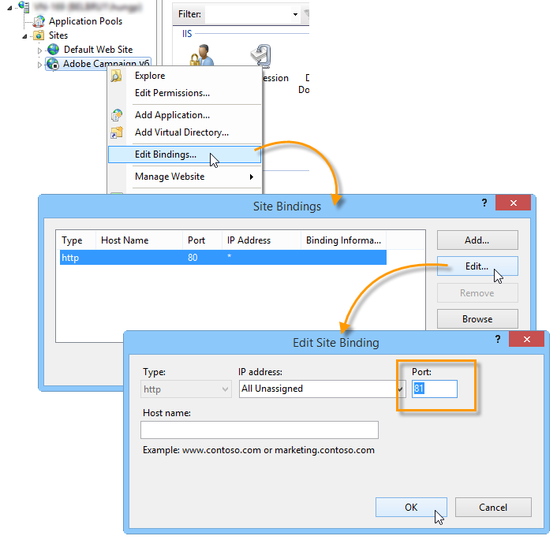
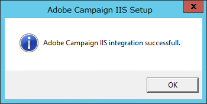

# 将Microsoft Windows平台迁移到Campaign v7{#migrating-in-windows-for-adobe-campaign}


对于Microsoft Windows环境，迁移步骤如下：

1. 停止所有服务 —  [了解详情](#service-stop).
1. 备份数据库 —  [了解详情](#back-up-the-database).
1. 迁移平台 —  [了解详情](#deploying-adobe-campaign-v7).
1. 迁移重定向服务器(IIS) - [了解详情](#migrating-the-redirection-server--iis-).
1. 重新启动服务 —  [了解详情](#re-starting-the-services).
1. 删除并清除以前的Adobe Campaign版本 —  [了解详情](#deleting-and-cleansing-adobe-campaign-previous-version).

## 服务停止 {#service-stop}

首先，停止在所有相关计算机上访问数据库的所有进程。

1. 所有使用重定向模块的服务器(**webmdl** service)必须停止。 对于IIS，请运行以下命令：

   ```
   iisreset /stop
   ```

1. 此 **mta** 模块及其子模块(**matachild**)必须使用以下命令停止：

   ```
   nlserver stop mta@<instance name>
   nlserver stop mtachild@<instance name>
   ```

1. 停止所有服务器上的Adobe Campaign服务。 使用管理员权限登录并运行以下命令：

   ```
   net stop nlserver6
   ```

<!--

   If you are migrating from v5.11, run the following command:

   ```
   net stop nlserver5
   ```

-->

1. 对于每台服务器，确保Adobe Campaign服务已正确停止。 使用管理员权限登录并运行以下命令：

   ```
   tasklist /FI "IMAGENAME eq nlserver*"
   ```

   此时将显示活动进程的列表及其ID (PID)。

   ```
   Image Name                     PID Session Name        Session#    Mem Usage
   ========================= ======== ================ =========== ============
   nlserver.exe                  3192 Console                    1     13,108 K
   ```

1. 如果数分钟后一个或多个Adobe Campaign进程仍处于活动状态或受阻，请将其终止。 使用管理员权限登录并运行以下命令：

   ```
   taskkill /IM nlserver* /T
   ```

1. 如果某些进程在几分钟后仍处于活动状态，您可以使用命令强制关闭它们：

   ```
   taskkill /F /IM nlserver* /T
   ```

## 备份Campaign数据库 {#back-up-the-database}

以下是备份Adobe Campaign v6.1的过程。

<!--

### For Adobe Campaign v5.11 {#migrating-from-adobe-campaign-v5-11}

1. Make a backup of the Adobe Campaign database.
1. Make a backup of the **Neolane v5** directory using the following command:

   ```
   ren "Neolane v5" "Neolane v5.back"
   ```

   >[!IMPORTANT]
   >
   >As a precaution, we recommend that you zip the **Neolane v5.back** folder and save it elsewhere in a safe location other than the server.

1. In the windows service management console, disable the automatic startup of the 5.11 application server service. You can also use the following command:

   ```
   sc config nlserver5 start= disabled
   ```

1. Edit the **config-`<instance name>`.xml** (in the **Neolane v5. back** folder) to prevent the **mta**, **wfserver**, **stat**, etc. services from starting automatically. For instance, replace **autoStart** with **_autoStart**.

   ```
   <?xml version='1.0'?>
   <serverconf>
     <shared>
       <dataStore hosts="myServer*" lang="en_US">
         <dataSource name="default">
           <dbcnx encrypted="1" login="myLogin" password="myPassword"  provider="postgresql" server="myServer"/>
         </dataSource>
       </dataStore>
     </shared>
   
     <mta _autoStart="true" statServerAddress="myStatServer"/>
     <stat _autoStart="true"/>
     <wfserver _autoStart="true"/>
     <inMail _autoStart="true"/>
     <sms _autoStart="false"/>
   </serverconf>
   ```

-->

<!--
### For Adobe Campaign v6.02 {#migrating-from-adobe-campaign-v6-02}

1. Make a backup of the Adobe Campaign database.
1. Make a backup of the **Neolane v6** directory using the following command:

   ```
   ren "Neolane v6" "Neolane v6.back"
   ```

   >[!IMPORTANT]
   >
   >As a precaution, we recommend that you zip the **Neolane v6.back** folder and save it elsewhere in a safe location other than the server.

1. In the Windows service manager, deactivate the 6.02 application server automatic startup. You can also use the following command:

   ```
   sc config nlserver6 start= disabled
   ```

1. Edit the **config-`<instance name>`.xml** (in the **Neolane v6. back** folder) to prevent the **mta**, **wfserver**, **stat**, etc. services from starting automatically. For instance, replace **autoStart** with **_autoStart**.

   ```
   <?xml version='1.0'?>
   <serverconf>
     <shared>
       <dataStore hosts="myServer*" lang="en_US">
         <dataSource name="default">
           <dbcnx encrypted="1" login="myLogin" password="myPassword" provider="postgresql" server="myServer"/>
         </dataSource>
       </dataStore>
     </shared>
   
     <mta _autoStart="true" statServerAddress="myStatServer"/>
     <stat _autoStart="true"/>
     <wfserver _autoStart="true"/>
     <inMail _autoStart="true"/>
     <sms _autoStart="false"/>
   </serverconf>
   ```

-->

1. 备份Adobe Campaign数据库。
1. 备份 **Adobe Campaign v6** 目录：

   ```
   ren "Adobe Campaign v6" "Adobe Campaign v6.back"
   ```

   >[!IMPORTANT]
   >
   >为以防万一，我们建议您压缩 **Adobe Campaign v6.back** 文件夹并将其保存在除服务器以外的其他安全位置。

1. 在Windows服务管理控制台中，禁用6.11应用程序服务器服务的自动启动。 也可以使用以下命令：

   ```
   sc config nlserver6 start= disabled
   ```

## 部署Adobe Campaign v7 {#deploying-adobe-campaign-v7}

部署Adobe Campaign涉及两个阶段：

* 安装内部版本v7：必须在每台服务器上执行此操作。
* 升级后：必须在每个实例上启动此命令。

要部署Adobe Campaign，请应用以下步骤：

1. Adobe Campaign通过运行 **setup.exe** 安装文件。 有关在Windows中安装Adobe Campaign服务器的详细信息，请参阅 [本节](../../installation/using/installing-the-server.md).

   

   >[!NOTE]
   >
   >Adobe Campaign v7默认安装在中 **C:\Program Files\Adobe\Adobe Campaign v7** 目录。

1. 要使客户端控制台安装程序可用，请复制 **setup-client-7.0.XXXX.exe** 文件到Adobe Campaign安装目录： **C:\Program Files\Adobe\Adobe Campaign v7\datakit\nl\eng\jsp**.

   >[!NOTE]
   >
   >有关在Windows中安装Adobe Campaign的更多信息，请参阅 [本节](../../installation/using/installing-the-server.md).

1. 使用以下命令启动首次使用的实例：

   ```
   net start nlserver6-v7
   net stop nlserver6-v7
   ```

   >[!NOTE]
   >
   >这些命令允许您创建Adobe Campaign v7内部文件系统： **会议** 目录(具有 **config-default.xml** 和 **serverConf.xml** 文件)， **var** 目录等。

1. 通过，复制并粘贴（覆盖）每个实例的配置文件和子文件夹 **Neolane v5.back**， **Neolane v6.back** 或 **Adobe Campaign v6.back** 备份文件(取决于您要从中迁移的版本 — 请参阅 [本节](#back-up-the-database-and-the-current-installation))。
1. 根据您要迁移的版本，执行以下命令：

   ```
   copy "Neolane v5.back"/conf/config-<instance name>.xml "Adobe Campaign v7"/conf/
   copy "Neolane v5.back"/customers/* "Adobe Campaign v7"/customers/
   copy "Neolane v5.back"/var/* "Adobe Campaign v7"/var/
   ```

   ```
   copy "Neolane v6.back"/conf/config-<instance name>.xml "Adobe Campaign v7"/conf/
   copy "Neolane v6.back"/customers/* "Adobe Campaign v7"/customers/
   copy "Neolane v6.back"/var/* "Adobe Campaign v7"/var/
   ```

   ```
   copy "Adobe Campaign v6.back"/conf/config-<instance name>.xml "Adobe Campaign v7"/conf/
   copy "Adobe Campaign v6.back"/customers/* "Adobe Campaign v7"/customers/
   copy "Adobe Campaign v6.back"/var/* "Adobe Campaign v7"/var/
   ```

   >[!IMPORTANT]
   >
   >对于上面的第一个命令，请勿复制 **config-default.xml** 文件。

1. 在 **serverConf.xml** 和 **config-default.xml** 在Adobe Campaign v7的文件中，应用您在Adobe Campaign早期版本中拥有的特定配置。 对于 **serverConf.xml** 文件，使用 **Neolane v5/conf/serverConf.xml.diff**， **Neolane v6/conf/serverConf.xml.diff** 或 **Adobe Campaign v6/conf/serverConf.xml.diff** 文件。

   >[!NOTE]
   >
   >在报告从以前版本的Adobe Campaign到Adobe Campaign v7的配置时，请确保物理目录的路径指向Adobe Campaign v7(而不是Neolane v5、Neolane v6或Adobe Campaign v6)。

1. 使用以下命令重新加载Adobe Campaign v7配置：

   ```
   nlserver config -reload
   ```

1. 使用以下命令启动升级后过程：

   ```
   nlserver config -postupgrade -instance:<instance name>
   ```

>[!IMPORTANT]
>
>尚未启动Adobe Campaign服务：需要对IIS进行一些更改。

## 迁移重定向服务器 {#migrating-the-redirection-server--iis-}

在此阶段，必须停止IIS服务器。 请参阅 [服务停止](#service-stop).

1. 打开 **Internet Information Services (IIS)管理器** 控制台。
1. 更改用于Adobe Campaign早期版本的站点的绑定（监听端口）：

   * 右键单击用于Adobe Campaign以前版本的网站并选择 **[!UICONTROL Edit bindings]**.
   * 对于每种类型的侦听端口(**[!UICONTROL http]** 和/或 **[!UICONTROL https]**)，选择相应的行并单击 **[!UICONTROL Edit]**.
   * 输入其他端口。 默认情况下，http的侦听端口为80，https的侦听端口为443。 检查新端口是否可用。

      

      >[!NOTE]
      >
      >如果您的IIS服务器包含多个网站，这些网站适用于Adobe Campaign并具有高级配置（共享端口和不同的IP地址），请联系您的管理员。

1. 为Adobe Campaign v7创建新网站：

   * 右键单击 **[!UICONTROL Sites]** 文件夹并选择 **[!UICONTROL Add Web Site...]**.

      

   * 输入站点名称， **Adobe Campaign v7** 例如。
   * 未使用指向网站基本目录的访问路径，但是 **[!UICONTROL Physical access path]** 必须输入字段。 输入默认IIS访问路径： **C:\inetpub\wwwroot**.
   * 单击 **[!UICONTROL Connect as...]** 作为按钮，并确保 **[!UICONTROL Application user]** 选项。
   * 您可以将默认值保留在 **[!UICONTROL IP address]** 和 **[!UICONTROL Port]** 字段。 如果要使用其他值，请确保IP地址和/或端口可用。
   * 查看 **[!UICONTROL Start Web site immediately]** 盒子。

      

1. 执行 **iis_neolane_setup.vbs** 用于在之前创建的虚拟目录中自动配置Adobe Campaign服务器使用的资源的脚本。

   * 此文件可在以下位置找到： **`[Adobe Campaign v7]`\conf** 目录，其中 **`[Adobe Campaign v7]`** 是Adobe Campaign安装目录的访问路径。 用于执行脚本的命令如下所示（对于管理员）：

      ```
      cd C:\Program Files (x86)\Adobe Campaign\Adobe Campaign v7\conf
      cscript iis_neolane_setup.vbs
      ```

   * 单击 **[!UICONTROL OK]** 以确认脚本执行。

      

   * 输入之前为Adobe Campaign v7创建的网站编号，然后单击 **[!UICONTROL OK]**.

      

   * 此时应会显示一条确认消息：

      

   * 在 **[!UICONTROL Content view]** 选项卡中，确保使用Adobe Campaign资源正确配置了网站配置：

      

      >[!NOTE]
      >
      >如果未显示树结构，请重新启动IIS。
      >
      >有关以下IIS配置步骤的详情，请参见 [本节](../../installation/using/integration-into-a-web-server-for-windows.md#configuring-the-iis-web-server).

<!--
## Security zones {#security-zones}

If you are migrating from v6.02 or earlier, you must configure your security zones before starting services. [Learn more](../../migration/using/general-configurations.md#security)
-->

## 重新启动服务 {#re-starting-the-services}

在下列每台服务器上启动IIS和Adobe Campaign服务：

1. 跟踪和重定向服务器。
1. 中间源服务器.
1. 营销服务器。

在继续下一步之前，请对新安装运行全面测试，确保没有回归，并且一切正常。

## 删除以前的版本 {#deleting-and-cleansing-adobe-campaign-previous-version}

以下是删除Adobe Campaign v6.1的过程。

<!--

### For Adobe Campaign v5 {#adobe-campaign-v5}

Before you delete and cleanse the Adobe Campaign v5 installation, you must apply the following recommendations:

* Get the functional teams to run a full check of the new installation.
* Only uninstall Adobe Campaign v5 once you are certain that no rollback is necessary.

1. In IIS, delete the **Neolane v5** website, then the **Neolane v5** application pool. 
1. Rename the **Neolane v5.back** folder as **Neolane v5**.
1. Uninstall Adobe Campaign v5 using the Add/remove components wizard. 

   

1. Delete the **nlserver5** Windows service using the following command:

   ```
   sc delete nlserver5
   ```

1. Re-start the server.

### For Adobe Campaign v6.02 {#adobe-campaign-v6-02}

Before you delete and cleanse the Adobe Campaign v6.02 installation, you must apply the following recommendations:

* Get the functional teams to run a full check of the new installation.
* Only uninstall Adobe Campaign v6.02 once you are certain that no rollback is necessary.

1. In IIS, delete the **Neolane v6** website, then the **Neolane v6** application pool. 
1. Rename the **Neolane v6.back** folder as **Neolane v6**.
1. Uninstall Adobe Campaign v6.02 using the Add/remove components wizard. 

   

1. Re-start the server.

-->

在删除和清除Adobe Campaign v6安装之前，必须应用以下建议：

* 让功能团队对新安装运行全面检查。
* 只有在确定无需回滚后，才卸载Adobe Campaign v6。

1. 在IIS中，删除 **Adobe Campaign v6** 网站，然后 **Adobe Campaign v6** 应用程序池。
1. 重命名 **Adobe Campaign v6.back** 文件夹为 **Adobe Campaign v6**.
1. 使用“添加/删除组件”向导卸载Adobe Campaign v6。

   

1. 重新启动服务器。
