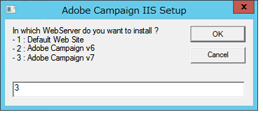

# 将Microsoft Windows平台迁移到Campaign v7{#migrating-in-windows-for-adobe-campaign}


对于Microsoft Windows环境，迁移步骤如下：

1. 停止所有服务 —  [了解更多](#service-stop).
1. 备份数据库 —  [了解更多](#back-up-the-database).
1. 迁移平台 —  [了解更多](#deploying-adobe-campaign-v7).
1. 迁移重定向服务器(IIS)- [了解更多](#migrating-the-redirection-server--iis-).
1. 重新启动服务 —  [了解更多](#re-starting-the-services).
1. 删除并清理以前的Adobe Campaign版本 —  [了解更多](#deleting-and-cleansing-adobe-campaign-previous-version).

## 服务停止 {#service-stop}

首先，在所有相关计算机上停止所有具有数据库访问权限的进程。

1. 使用重定向模块的所有服务器(**webmdl** 服务)。 对于IIS，运行以下命令：

   ```
   iisreset /stop
   ```

1. 的 **mta** 模块及其子模块(**母乳**):

   ```
   nlserver stop mta@<instance name>
   nlserver stop mtachild@<instance name>
   ```

1. 在所有服务器上停止Adobe Campaign服务。 使用管理员权限登录并运行以下命令：

   ```
   net stop nlserver6
   ```

   如果从v5.11迁移，请运行以下命令：

   ```
   net stop nlserver5
   ```

1. 对于每个服务器，确保正确停止Adobe Campaign服务。 使用管理员权限登录并运行以下命令：

   ```
   tasklist /FI "IMAGENAME eq nlserver*"
   ```

   将显示活动进程的列表及其ID(PID)。

   ```
   Image Name                     PID Session Name        Session#    Mem Usage
   ========================= ======== ================ =========== ============
   nlserver.exe                  3192 Console                    1     13,108 K
   ```

1. 如果一个或多个Adobe Campaign进程在几分钟后仍处于活动状态或被阻止状态，请终止它们。 使用管理员权限登录并运行以下命令：

   ```
   taskkill /IM nlserver* /T
   ```

1. 如果某些进程在几分钟后仍处于活动状态，您可以使用命令强制它们关闭：

   ```
   taskkill /F /IM nlserver* /T
   ```

## 备份Campaign数据库 {#back-up-the-database}

此过程取决于您之前的Adobe Campaign版本。

### 对于Adobe Campaign v5.11 {#migrating-from-adobe-campaign-v5-11}

1. 备份Adobe Campaign数据库。
1. 备份 **Neolane v5** 目录中使用以下命令：

   ```
   ren "Neolane v5" "Neolane v5.back"
   ```

   >[!IMPORTANT]
   >
   >为防范这种情况，我们建议您将 **Neolane v5.back** 文件夹，并将其保存在服务器以外的安全位置。

1. 在windows服务管理控制台中，禁用5.11应用程序服务器服务的自动启动。 您还可以使用以下命令：

   ```
   sc config nlserver5 start= disabled
   ```

1. 编辑 **配置 — `<instance name>`.xml** (在 **Neolane v5。 返回** 文件夹)来阻止 **mta**, **wfserver**, **stat**&#x200B;等。 服务自动启动。 例如， **autoStart** with **_autoStart**.

   ```
   <?xml version='1.0'?>
   <serverconf>
     <shared>
       <dataStore hosts="myServer*" lang="en_US">
         <dataSource name="default">
           <dbcnx encrypted="1" login="myLogin" password="myPassword"  provider="postgresql" server="myServer"/>
         </dataSource>
       </dataStore>
     </shared>
   
     <mta _autoStart="true" statServerAddress="myStatServer"/>
     <stat _autoStart="true"/>
     <wfserver _autoStart="true"/>
     <inMail _autoStart="true"/>
     <sms _autoStart="false"/>
   </serverconf>
   ```

### 对于Adobe Campaign v6.02 {#migrating-from-adobe-campaign-v6-02}

1. 备份Adobe Campaign数据库。
1. 备份 **Neolane v6** 目录中使用以下命令：

   ```
   ren "Neolane v6" "Neolane v6.back"
   ```

   >[!IMPORTANT]
   >
   >为防范这种情况，我们建议您将 **Neolane v6.back** 文件夹，并将其保存在服务器以外的安全位置。

1. 在Windows服务管理器中，停用6.02应用程序服务器自动启动。 您还可以使用以下命令：

   ```
   sc config nlserver6 start= disabled
   ```

1. 编辑 **配置 — `<instance name>`.xml** (在 **Neolane v6. 返回** 文件夹)来阻止 **mta**, **wfserver**, **stat**&#x200B;等。 服务自动启动。 例如， **autoStart** with **_autoStart**.

   ```
   <?xml version='1.0'?>
   <serverconf>
     <shared>
       <dataStore hosts="myServer*" lang="en_US">
         <dataSource name="default">
           <dbcnx encrypted="1" login="myLogin" password="myPassword" provider="postgresql" server="myServer"/>
         </dataSource>
       </dataStore>
     </shared>
   
     <mta _autoStart="true" statServerAddress="myStatServer"/>
     <stat _autoStart="true"/>
     <wfserver _autoStart="true"/>
     <inMail _autoStart="true"/>
     <sms _autoStart="false"/>
   </serverconf>
   ```

### 对于Adobe Campaign v6.1 {#migrating-from-adobe-campaign-v6-1}

1. 备份Adobe Campaign数据库。
1. 备份 **Adobe Campaign v6** 目录中使用以下命令：

   ```
   ren "Adobe Campaign v6" "Adobe Campaign v6.back"
   ```

   >[!IMPORTANT]
   >
   >为防范这种情况，我们建议您将 **Adobe Campaign v6.back** 文件夹，并将其保存在服务器以外的安全位置。

1. 在windows服务管理控制台中，禁用6.11应用程序服务器服务的自动启动。 您还可以使用以下命令：

   ```
   sc config nlserver6 start= disabled
   ```

## 部署Adobe Campaign v7 {#deploying-adobe-campaign-v7}

部署Adobe Campaign包含两个阶段：

* 安装版本v7:必须对每台服务器执行此操作。
* 升级后：必须在每个实例上启动此命令。

要部署Adobe Campaign，请应用以下步骤：

1. 通过运行 **setup.exe** 安装文件。 有关在Windows中安装Adobe Campaign服务器的更多信息，请参阅 [此部分](../../installation/using/installing-the-server.md).

   

   >[!NOTE]
   >
   >Adobe Campaign v7默认安装在 **C:\Program Files\Adobe\Adobe Campaign v7** 目录访问Advertising Cloud的帮助。

1. 要使客户端控制台安装程序可用，请复制 **setup-client-7.0.XXXX.exe** 文件到Adobe Campaign安装目录中： **C:\Program Files\Adobe\Adobe Campaign v7\datakit\nl\eng\jsp**.

   >[!NOTE]
   >
   >有关在Windows中安装Adobe Campaign的更多信息，请参阅 [此部分](../../installation/using/installing-the-server.md).

1. 通过以下命令启动实例以供首次使用：

   ```
   net start nlserver6-v7
   net stop nlserver6-v7
   ```

   >[!NOTE]
   >
   >以下命令允许您创建Adobe Campaign v7内部文件系统： **conf** 目录(使用 **config-default.xml** 和 **serverConf.xml** 文件)、 **var** 目录等。

1. 通过 **Neolane v5.back**, **Neolane v6.back** 或 **Adobe Campaign v6.back** 备份文件(取决于您从迁移的版本 — 请参阅 [此部分](#back-up-the-database-and-the-current-installation))。
1. 根据您从迁移的版本，执行以下命令：

   ```
   copy "Neolane v5.back"/conf/config-<instance name>.xml "Adobe Campaign v7"/conf/
   copy "Neolane v5.back"/customers/* "Adobe Campaign v7"/customers/
   copy "Neolane v5.back"/var/* "Adobe Campaign v7"/var/
   ```

   ```
   copy "Neolane v6.back"/conf/config-<instance name>.xml "Adobe Campaign v7"/conf/
   copy "Neolane v6.back"/customers/* "Adobe Campaign v7"/customers/
   copy "Neolane v6.back"/var/* "Adobe Campaign v7"/var/
   ```

   ```
   copy "Adobe Campaign v6.back"/conf/config-<instance name>.xml "Adobe Campaign v7"/conf/
   copy "Adobe Campaign v6.back"/customers/* "Adobe Campaign v7"/customers/
   copy "Adobe Campaign v6.back"/var/* "Adobe Campaign v7"/var/
   ```

   >[!IMPORTANT]
   >
   >对于上述第一个命令，请勿复制 **config-default.xml** 文件。

1. 在 **serverConf.xml** 和 **config-default.xml** Adobe Campaign v7的文件，请应用您在Adobe Campaign早期版本中的特定配置。 对于 **serverConf.xml** 文件，使用 **Neolane v5/conf/serverConf.xml.diff**, **Neolane v6/conf/serverConf.xml.diff** 或 **Adobe Campaign v6/conf/serverConf.xml** 文件。

   >[!NOTE]
   >
   >在将配置从Adobe Campaign的先前版本报告到Adobe Campaign v7时，请确保物理目录的路径指向Adobe Campaign v7(而不是Neolane v5、Neolane v6或Adobe Campaign v6)。

1. 使用以下命令重新加载Adobe Campaign v7配置：

   ```
   nlserver config -reload
   ```

1. 使用以下命令启动升级后进程：

   ```
   nlserver config -postupgrade -instance:<instance name>
   ```

>[!IMPORTANT]
>
>尚未启动Adobe Campaign服务：需要对IIS进行一些更改。

## 迁移重定向服务器 {#migrating-the-redirection-server--iis-}

此时，必须停止IIS服务器。 请参阅 [服务停止](#service-stop).

1. 打开 **Internet信息服务(IIS)管理器** 控制台。
1. 更改用于Adobe Campaign早期版本的站点的绑定（侦听端口）：

   * 右键单击用于Adobe Campaign早期版本的网站，然后选择 **[!UICONTROL Edit bindings]**.
   * 对于每种类型的监听端口(**[!UICONTROL http]** 和/或 **[!UICONTROL https]**)，选择相应的行并单击 **[!UICONTROL Edit]**.
   * 输入其他端口。 默认情况下， http的侦听端口为80,https的侦听端口为443。 检查新端口是否可用。

      

      >[!NOTE]
      >
      >如果您的IIS服务器包含多个具有高级配置（共享端口和不同的IP地址）的Adobe Campaign网站，请联系您的管理员。

1. 为Adobe Campaign v7创建新网站：

   * 右键单击 **[!UICONTROL Sites]** 文件夹，选择 **[!UICONTROL Add Web Site...]**.

      

   * 输入网站名称， **Adobe Campaign v7** 例如。
   * 不使用网站基本目录的访问路径，而是使用 **[!UICONTROL Physical access path]** 字段。 输入默认IIS访问路径： **C:\inetpub\wwwroot**.
   * 单击 **[!UICONTROL Connect as...]** 作为按钮，并确保 **[!UICONTROL Application user]** 选项。
   * 您可以将 **[!UICONTROL IP address]** 和 **[!UICONTROL Port]** 字段。 如果要使用其他值，请确保IP地址和/或端口可用。
   * 检查 **[!UICONTROL Start Web site immediately]** 框中。

      

1. 执行 **iis_neolane_setup.vbs** 脚本，用于在之前创建的虚拟目录上自动配置Adobe Campaign服务器使用的资源。

   * 此文件位于 **`[Adobe Campaign v7]`\conf** 目录，其中 **`[Adobe Campaign v7]`** 是Adobe Campaign安装目录的访问路径。 用于执行脚本的命令如下（对于管理员）：

      ```
      cd C:\Program Files (x86)\Adobe Campaign\Adobe Campaign v7\conf
      cscript iis_neolane_setup.vbs
      ```

   * 单击 **[!UICONTROL OK]** 以确认脚本执行。

      

   * 输入之前为Adobe Campaign v7创建的网站编号，然后单击 **[!UICONTROL OK]**.

      

   * 此时应会显示一条确认消息：

      

   * 在 **[!UICONTROL Content view]** 选项卡，确保使用Adobe Campaign资源正确配置了网站配置：

      

      >[!NOTE]
      >
      >如果未显示树结构，请重新启动IIS。
      >
      >以下IIS配置步骤详见 [此部分](../../installation/using/integration-into-a-web-server-for-windows.md#configuring-the-iis-web-server).

## 安全区 {#security-zones}

如果您是从v6.02或更低版本迁移，则必须先配置安全区，然后才能启动服务。 [了解详情](../../migration/using/general-configurations.md#security)

## 重新启动服务 {#re-starting-the-services}

在以下每个服务器上启动IIS和Adobe Campaign服务：

1. 跟踪和重定向服务器。
1. 中间源服务器.
1. 营销服务器。

在执行下一步之前，请对新安装进行完整测试，确保没有回归，并且所有操作都可以按照 [本页](../../migration/using/general-configurations.md).

## 删除以前的版本 {#deleting-and-cleansing-adobe-campaign-previous-version}

此过程取决于您之前的Adobe Campaign版本。

### 对于Adobe Campaign v5 {#adobe-campaign-v5}

在删除和清除Adobe Campaign v5安装之前，必须应用以下建议：

* 让功能团队对新安装进行完整检查。
* 只有在您确定不需要回滚时，才卸载Adobe Campaign v5。

1. 在IIS中，删除 **Neolane v5** 网站，然后 **Neolane v5** 应用程序池。
1. 重命名 **Neolane v5.back** 文件夹 **Neolane v5**.
1. 使用“添加/删除组件”向导卸载Adobe Campaign v5。

   

1. 删除 **nlserver5** 使用以下命令的Windows服务：

   ```
   sc delete nlserver5
   ```

1. 重新启动服务器。

### 对于Adobe Campaign v6.02 {#adobe-campaign-v6-02}

在删除和清除Adobe Campaign v6.02安装之前，必须应用以下建议：

* 让功能团队对新安装进行完整检查。
* 只有在您确定不需要回滚时，才卸载Adobe Campaign v6.02。

1. 在IIS中，删除 **Neolane v6** 网站，然后 **Neolane v6** 应用程序池。
1. 重命名 **Neolane v6.back** 文件夹 **Neolane v6**.
1. 使用“添加/删除组件”向导卸载Adobe Campaign v6.02。

   

1. 重新启动服务器。

### 对于Adobe Campaign v6.1 {#adobe-campaign-v6-1}

在删除和清除Adobe Campaign v6安装之前，必须应用以下建议：

* 让功能团队对新安装进行完整检查。
* 只有在您确定不需要回滚时，才卸载Adobe Campaign v6。

1. 在IIS中，删除 **Adobe Campaign v6** 网站，然后 **Adobe Campaign v6** 应用程序池。
1. 重命名 **Adobe Campaign v6.back** 文件夹 **Adobe Campaign v6**.
1. 使用“添加/删除组件”向导卸载Adobe Campaign v6。

   

1. 重新启动服务器。
