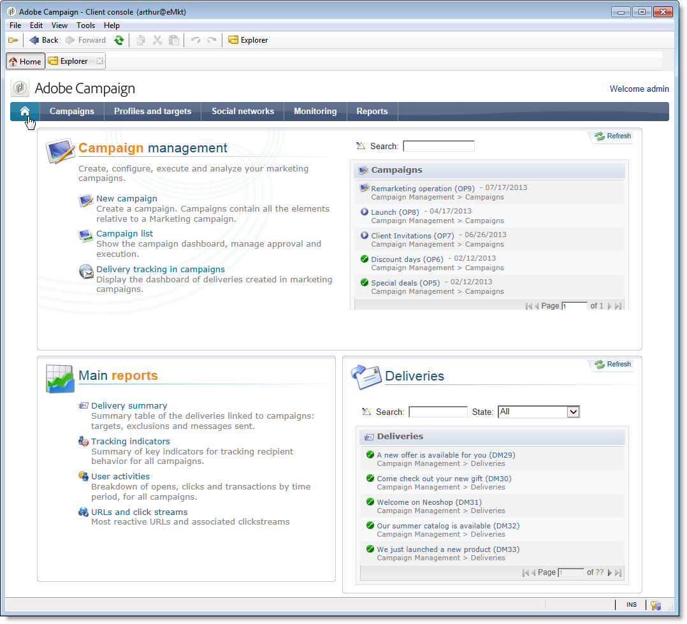

# v6.02 中的特定配置{#specific-configurations-in-v6-02}

以下部分详细介绍从v6.02迁移时需要的其他配置。您还应该配置[常规配置](../../migration/using/general-configurations.md)部分中详述的设置。

## Web 应用程序 {#web-applications}

如果您从v6.02迁移，则可能会显示有关概述类型Web应用程序的错误日志。 错误消息示例：

```
[PU-0006] Entity of type : 'xtk:entityBackupNew' and Id 'nms:webApp|taskOverview', expression '[SQLDATA[' was found : '...)) or (@id IN ([SQLDATA[select 
[PU-0006] Entity of type : 'xtk:formDictionary' and Id 'nms:webApp|lastTasks', expression '[SQLDATA[' was found : '...)) or (@id IN ([SQLDATA[select 
[PU-0006] Entity of type : 'nms:webApp' and Id 'taskOverview', expression '[SQLDATA[' was found : '...@owner-id] IN ([SQLDATA[select iGroupid...'. (iRc=-1)
```

这些Web应用程序使用SQLData，并且由于安全性较高而与v7不兼容。 这些错误将导致迁移失败。

如果您未使用这些Web应用程序，请运行以下清理脚本并重新运行后级：

```
Nlserver javascript -instance:[instance_name] -file [installation_path]/datakit/xtk/fra/js/removeOldWebApp.js
```

如果您已修改这些Web应用程序并希望继续在v7中使用它们，则必须在不同的安全区中激活&#x200B;**allowSQLIncompent**&#x200B;选项，然后重新启动后期升级。 有关更多信息，请参阅[SQLData](../../migration/using/general-configurations.md#sqldata)一节。

## 用户友好：主页和导航{#user-friendliness--home-page-and-navigation}

>[!IMPORTANT]
>
>如果要继续使用v6.02 overview-type Web应用程序，则必须在升级后之前，在不同的安全区中激活&#x200B;**allowSQLIncompent**&#x200B;选项。 请参阅[Web应用程序](#web-applications)。

从版本6.02迁移后，Adobe Campaign v6.02主页不再显示，但仍然可以访问且与Adobe Campaign v7兼容。

要继续使用v6.02主页，您必须在迁移后安装“兼容”包。

为此，请导入兼容包：

单击&#x200B;**[!UICONTROL Tools > Advanced > Import package]**，然后选择&#x200B;**`\nl\datakit\nms\[Your language]\package\optional`**&#x200B;中的&#x200B;**campaignMigration.xml**&#x200B;包。

要允许访问v6.02 Web应用程序类型接口，必须在&#x200B;**serverConf.xml**&#x200B;文件中激活&#x200B;**sessionTokenOnly**&#x200B;服务器配置选项：

```
sessionTokenOnly="true"
```

此选项会更改安全级别，以确保界面兼容性。

安装包后，Adobe Campaign v7主页将被旧版v6.02主页替换，主页中包含v7的常规配置（蓝色主页横幅）。



除列表（**[!UICONTROL operation list]**、**[!UICONTROL delivery tracking in operations]**&#x200B;等）外，此主页上的所有链接都链接到v7屏幕 链接到v6.02概述（web应用程序）。


如果要添加在v6.02中配置的其他概述，您需要从功能板将其添加到主页。(**[!UICONTROL Administration > Access management > Dashboard]**)。

>[!NOTE]
>
>请记住断开连接，然后重新连接控制台以注册修改。

## 消息中心{#message-center}

迁移消息中心控制实例后，必须重新发布事务型消息模板才能使用。

在v7中，执行实例上事务型消息模板的名称已发生更改。 它们当前由与创建它们的控制实例对应的运算符名称前缀，例如&#x200B;**control1_template1_rt**（其中&#x200B;**control1**&#x200B;是运算符的名称）。 如果您有大量模板，我们建议在控制实例中删除旧模板。
