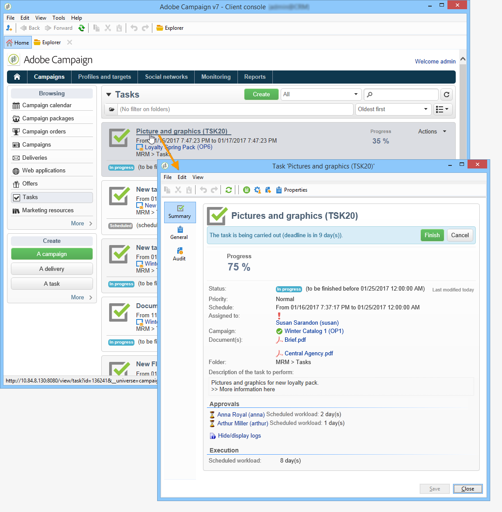
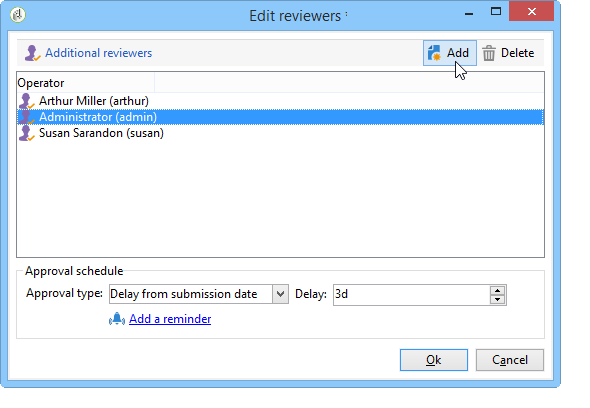
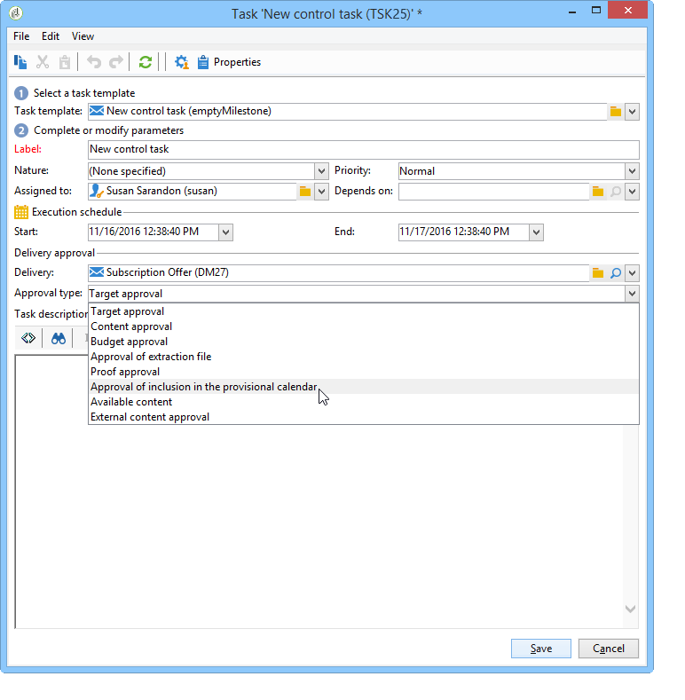

# 创建和管理任务{#creating-and-managing-tasks}

Adobe Campaign 让您可以直接在应用程序中创建任务并管理其完整的生命周期. 可以将项目和营销策划实施划分为分配给Adobe Campaign运营商或外部服务提供商的任务。 通过此操作模式，您可以创建包括所有计划参与者和外部参与者的开放协作环境。

可以从任务列表或营销活动仪表板创建、查看和监控任务。 还可以在营销计划、项目和营销策划的计划中查看和跟踪这些项目。

任务附加到营销活动，并且可以具有依赖关系，即关联的任务。 每个任务都具有状态、优先级、估计负载和相关成本。

所有任务都分组到一个可通过 **促销活动** 选项卡。 有关更多信息，请参阅 [访问任务](#accessing-tasks).

它们可以显示在它们所属的程序的计划中。

## 访问任务 {#accessing-tasks}

### 显示任务 {#displaying-tasks}

任务显示在可通过 **[!UICONTROL Campaigns]** 选项卡。

您可以在此处查看连接的操作员的所有任务。

有关更多信息，请参阅 [任务的执行状态](#execution-status-of-a-task) 和 [任务的进度状态](#progress-status-of-a-task).

### 筛选任务 {#filtering-tasks}

显示此视图时，会自动过滤该视图，以便仅显示 **[!UICONTROL operator tasks]**. 您还可以使用窗口上部分的字段过滤任务。

### 编辑任务 {#editing-tasks}

单击任务以对其进行编辑。

## 创建新任务 {#creating-a-new-task}

要创建任务，请单击 **[!UICONTROL Tasks]** 链接 **[!UICONTROL Campaigns]** 选项卡，选择 **[!UICONTROL Create]**.

至少输入任务的名称，并选择链接到的营销活动。 您还必须指定开始和结束日期。 这三条信息是强制性的。

单击 **[!UICONTROL Save]** 创建任务。

您还可以通过营销策划的功能板创建任务：在这种情况下，它会自动链接到从中创建它的营销策划。

创建任务后，该任务会添加到营销活动计划和任务列表中。 要编辑任务，请从计划中选择该任务，或在任务概述中单击其名称，然后单击 **[!UICONTROL Open]** 链接。

要配置它，您必须指示：

* 经理和参与者：请参阅 [经理和参与者](#manager-and-participants).
* 创建计划：请参阅 [执行计划](#execution-schedule).
* 承诺成本：请参阅 [开支及收入](#expenses-and-revenues).

也可以对审阅人进行广告审查(请参阅 [审阅人](#reviewers))和引用的文档(请参阅 [引用的文档](#documents-referenced))。

任务生命周期介绍于 [生命周期](#life-cycle).

### 经理和参与者 {#manager-and-participants}

只有负责任务的操作员才有权关闭该任务。

默认情况下，当Adobe Campaign运算符创建任务时，会自动将该任务分配给它们。 要选择其他运算符，请使用 **[!UICONTROL Assigned to]** 字段。

>[!NOTE]
>
>运营商管理在 [此部分](../../platform/using/access-management.md).

您可以指定执行任务时涉及的运算符。 这些操作员无权关闭任务。 他们只能批准分配给他们的任务。

使用 **[!UICONTROL Resources]** 图标。 单击 **[!UICONTROL Add]** 并选择相关的运算符。

单击 **[!UICONTROL Ok]** 然后输入使用率：这表示在任务执行期间分配给操作员的负载。 此比率仅表示，以百分比表示。

例如，对于执行时间表设置为10天的任务，使用率为50%的操作员将在该任务中调动其10天半的工作时间。

对于每个操作员，您可以输入计划工作量和实际工作量。 这些持续时间也仅供参考。

可以配置提醒，该提醒将在任务结束日期之前自动发送给任务中涉及的所有操作员。

您可以通过 **[!UICONTROL Edit link]** 图标。

运算符仪表板允许您检查其工作量（其他正在进行的任务）。

### 审阅人 {#reviewers}

除了参与者之外，您还可以定义操作员，在任务被负责人关闭后，操作员将审核该任务。 为此，请单击 **[!UICONTROL Enable task approval]** 选项 **[!UICONTROL Resources]** 窗口。 这可以是单个运算符、一组运算符或运算符列表。

要指定运算符列表，请单击 **[!UICONTROL Edit...]** 链接到第一个审阅人的右侧，并根据需要添加任意数量的运算符，如下所示：

您可以在审核人员配置窗口的下半部分定义任务的审批计划。 默认情况下，审阅人从提交日期起有三天时间批准任务。 可以配置提醒，该提醒将在批准截止时间之前自动发送给相关操作员。

任务负责人可以为自己分配批准该任务的任务，即使已指派其他操作员执行此操作也是如此。 如果尚未定义审核者，则通知将发送给任务负责人。 所有其他Adobe Campaign运算符 **[!UICONTROL Administrator]** 权限也可以批准任务。 但是，他们将不会收到通知。

### 引用的文档 {#documents-referenced}

可以向任务添加文档和营销资源(有关更多信息，请参阅 [管理营销资源](../../mrm/using/managing-marketing-resources.md))。 为此，请打开任务并单击 **[!UICONTROL Documents]** 图标。

单击 **[!UICONTROL Add]** 并选择要添加到任务中的文档。 对营销资源应用相同的流程。

被引用的文档将显示在发送给任务涉及的操作员的通知中，以及任务仪表板中。

### 执行计划 {#execution-schedule}

任务的有效期在 **[!UICONTROL Start]** 和 **[!UICONTROL End]** 字段。 计划负载表示在期间要执行的工作量。 以天或小时表示。

>[!NOTE]
>
>任务的生命周期在 [生命周期](#life-cycle).

的 **[!UICONTROL Workload performed]** 字段也以天和小时为单位表示，允许您针对计划工作量手动更新任务进度。

的 **[!UICONTROL Progress status]** 任务的百分比会根据涉及的操作员执行的任务自动更新。 可以手动输入。

此信息可在任务仪表板中查看。

它也显示在营销活动选项卡中。

如果任务执行计划结束日期已到，但任务未完成，则任务将 **[!UICONTROL Late]**. 警报操作员也会收到警告消息。

有关更多信息，请参阅 [任务的进度状态](#progress-status-of-a-task).

### 开支及收入 {#expenses-and-revenues}

您可以为每项任务定义相关费用和预测收入。 这些任务将被计算并合并到任务所附加的营销活动中。

要指定此信息，请单击 **[!UICONTROL Expenses and revenue]** 图标。

默认情况下，已计费预算是任务所附加到的营销活动的预算。 任务详细信息中会显示该参数。

>[!NOTE]
>
>有关费用和预算的详细信息，请参阅 [成本承担、计算及收费](../../mrm/using/controlling-costs.md#cost-commitment--calculation-and-charging).

在此窗口中，您还可以定义要实现的目标。 目标以任务的预测收入表示。

### 服务提供商 {#service-providers}

外部服务提供商可以参与任务的管理。

为此，请编辑任务属性并选择相关的服务提供商。 与服务提供商关联的成本类别会自动列在窗口的中央部分。

有关更多信息，请参阅 [创建服务提供商及其成本类别](../../campaign/using/providers--stocks-and-budgets.md#creating-a-service-provider-and-its-cost-categories).

选择与任务执行相关的成本类别。 为此，请选择成本类型，并在必要时添加附加费金额。

>[!NOTE]
>
>管理预算及成本之方法于 [控制成本](../../mrm/using/controlling-costs.md).

选择服务提供商后，该服务提供商会显示在任务仪表板中：

### 延迟任务 {#late-tasks}

如果任务已达到其结束日期，但状态未更改为 **[!UICONTROL Finished]**. 默认情况下，任务延迟时不会警告任何运算符。 您可以配置通知电子邮件的投放：即使所有运算符未参与任务，也会收到通知。

转到 **[!UICONTROL Resources]** 框中，将运算符添加到 **[!UICONTROL Assignation]** 字段。 要通知多个人，请选择一组运算符。

### 初始通知 {#initial-notifications}

当您创建或修改将来具有开始日期的任务时，Adobe Campaign会提供电子邮件，通知负责该任务的人员，以便他们在任务开始时知道该任务。

但是，如果您要创建的任务离开时间很长，则最好在任务开始之前安排发送通知。 例如，如果任务在一个月内开始，您可以在任务开始前一周通知负责人。

要计划通知，请转到 **[!UICONTROL Resources]** 框，并使用 **[!UICONTROL Initial notification]** 字段。

* 对于营销活动中的任务，请选择特定的日期和时间。
* 对于营销活动模板中的任务，通知时间以任务开始前的剩余时间表示(例如，如果您在 **[!UICONTROL Initial notification]** 字段，则会在任务开始日期之前2天发送电子邮件)。

如果您已计划通知，则在保存任务时，Adobe Campaign仍会提供立即发送通知的选件。 您可以决定发送它，这样不会替换计划的通知。

### 链接到程序的任务 {#task-linked-to-a-program}

您可以直接在项目中创建任务，以管理与其整体组织相关的操作，而不是与特定营销活动相关的操作（例如，召开会议，讨论项目中即将开展的营销活动的主题）。 任务将显示在程序计划中。

要创建直接链接到项目的任务，请执行以下操作：

1. 打开程序计划：在主页上，转到 **[!UICONTROL Campaigns > Browse > Other choices > Programs]**. 在窗口的右侧部分打开整个程序计划。
1. 在计划中，单击所需的程序：窗子里有程序。
1. 在此窗口中，单击 **[!UICONTROL Open]**. 将打开项目计划。
1. 单击 **[!UICONTROL Add]** 按钮，然后单击 **[!UICONTROL Add a task]**.

### 操作员可用性 {#operator-availability}

在任务仪表板中，操作员名称旁边的图标表示他们在任务涵盖的时段内已经在处理其他任务或事件。 操作员负责或涉及的任务将显示在 **[!UICONTROL Assigned to]** 字段或任务中的 **[!UICONTROL Resources]** 框中。

### 工作流中的任务 {#task-in-a-workflow}

使用 **[!UICONTROL Task]** 营销活动工作流中的元素允许您根据任务是否被批准定义两种方案。

在营销活动工作流中， **[!UICONTROL Task]** 活动在 **[!UICONTROL Flow control]** 选项卡。

## 任务类型 {#types-of-task}

通过营销活动创建任务时，可以创建特定任务。 任务类型在选定的模板中定义。

可以计划以下任务：

* [控制任务](#control-tasks),
* [分组任务](#grouping-task),
* [分组任务](#grouping-task),
* [通知任务](#notification-task).

>[!NOTE]
>
>**[!UICONTROL Control task]** 和 **[!UICONTROL Grouping]** 可以创建任务 **仅** 通过促销活动仪表板。\
>这些任务显示在为其分配任务的操作员的任务图中。 请参阅 [访问任务](#accessing-tasks).

### 控制任务 {#control-tasks}

A **[!UICONTROL Control task]** 链接到投放批准：批准定位、内容、提取文件、预算或校样。

创建任务后，该任务会添加到营销活动仪表板。

然后，您可以编辑它并指定其参数。

### 营销资源创建任务 {#marketing-resource-creation-task}

营销资源创建任务可用于管理营销资源的创建和发布。 如果您是通过任务而不是通过资源本身来管理资源，则可以：

* 通过营销活动控制资源创建过程。
* 在计划中查看资源创建过程。
* 管理资源创建过程（提醒、通知）。
* 计算和控制与资源创建关联的成本。
* 通过任务批准和发布资源（如果启用了相关选项）。

#### 任务与其链接资源之间的交互 {#interaction-between-the-task-and-its-linked-resource}

营销资源创建任务与与其链接的资源交互。 这意味着：

* 资源创建计划以及与其关联的成本通过任务进行管理。
* 操作员可以像处理普通资源（下载或上传、锁定和解锁）一样处理资源：这不会影响任务。
* 资源审批和发布可以通过以下任务进行：如果 **[!UICONTROL Publish the marketing resource]** 选项时，该资源会在任务完成后自动获得批准并发布。 如果未启用选项，则任务和资源不会进行交互：对一者行事不会影响另一者。

   您可以使用一系列链接的任务来定义完整的审批周期。 检查 **[!UICONTROL Publish the marketing resource]** 选项：要发布资源，需要完成所有任务。 此外，在创建子营销资源任务时，将在子任务中自动选择该资源。

   * **通过资源**:如果提交资源以供审批或批准，则这些操作不会影响任务。
   * **通过任务**:如果 **[!UICONTROL Publish the marketing resource]** 任务中选中选项时，资源将在任务完成后自动获得批准并发布（请参阅上文）。 如果未勾选选项，则任务和资源不会进行交互：对一者行事不会影响另一者。

#### 配置营销资源创建任务 {#configuring-a-marketing-resource-creation-task}

审查任务的人员不必是审查资源中定义内容的人员。 但是，如果 **[!UICONTROL Publish the marketing resource]** 选项已选中（请参阅下文），任务审核者有权批准资源内容，完成任务后将自动批准资源（或者，如果未定义审核者，则授权任务管理器）。

在 **[!UICONTROL Marketing resource]** 字段中，定义要通过此任务管理的资源。 您可以：

* 选择现有资源：下拉列表提供了状态为的所有资源 **[!UICONTROL Being edited]**.
* 创建资源：单击 **[!UICONTROL Select the link]** 图标，然后单击 **[!UICONTROL Create]** 图标。

的 **[!UICONTROL Publish the marketing resource]** 选项可自动发布资源：任务完成后 **[!UICONTROL Finished]**，资源的状态会自动切换到 **[!UICONTROL Published]**，即使任务既未提交也未获得批准，包括完成任务的审阅人不是资源中定义的内容审阅人。

的 **[!UICONTROL Publish the resource]** 按钮，资源发布审阅人将收到通知电子邮件，以告知其已准备发布。 在 **[!UICONTROL Edit > Tracking]** 选项卡，任务审阅者的审阅和发布将变为可见。 如果已定义资源后处理工作流，则立即执行该工作流。

### 组任务 {#grouping-task}

的 **[!UICONTROL Grouping task]** “类型”任务可让您对多个任务进行分组，并同步对其进度和审批的管理。

分组任务没有关联的费用或资源。

分组到分组任务的所有任务都可以在其自己的仪表板上查看。 这样，您就可以过滤任务列表，以仅显示您感兴趣的任务。

分组任务有一个链接，可让您轻松创建分组任务。

要根据分组任务创建分组任务，请转到营销活动仪表板，单击分组任务的名称以显示其说明，然后单击 **[!UICONTROL Add a task]**.

但是，如果已创建要链接到分组任务的任务，则可以通过 **[!UICONTROL Linked to]** 字段 **[!UICONTROL Properties]** 框中。

### 通知任务 {#notification-task}

通知任务允许您安排电子邮件投放（发送给操作员、操作员组、服务提供商等）。 这样，您就可以安排提醒，例如通知某个营销活动即将结束，或在营销活动开始之前发送文档，以便操作员可以准备。 这意味着您可以跟踪营销活动或项目内的通信，并更密切地关注所执行的操作。

#### 生命周期 {#life-cycle}

通知任务不需要批准。 这意味着他们的生命周期比标准任务的生命周期更简单：

通知任务可以具有以下状态：

* **[!UICONTROL Scheduled]** 直到发送电子邮件
* **[!UICONTROL In progress]** 发送电子邮件后直到到达结束日期
* **[!UICONTROL Finished]** 达到结束日期后。

#### 配置 {#configuration}

在创建过程中，必须在任务中输入以下元素：

* **[!UICONTROL Assigned to]** :接收电子邮件的操作员或操作员组。 如果在发送电子邮件后重新分配任务，则不会将电子邮件发送给新操作员（为此，您需要重新初始化任务并更改其开始日期）。
* **任务开始日期**:发送通知电子邮件的日期。 此日期必须在将来记录任务时发生。
* **任务结束日期**:任务状态更改为 **[!UICONTROL Finished]**. 默认情况下，结束日期与开始日期相同。 但是，为任务分配持续时间允许您表示操作员在计划中必须执行的时间（如有必要）。
* **[!UICONTROL Description]** :此处输入的文本将显示在通知电子邮件的正文中。

   

您可以向任务和通知电子邮件添加附件。 为此，请单击 **[!UICONTROL Documents]** 图标。

## 生命周期 {#life-cycle-1}

### 任务之间的链接 {#links-between-tasks}

的 **[!UICONTROL Properties]** 按钮，可定义营销活动中任务之间的链接。 您可以使用分组任务将任务拆分为子任务(请参阅 [链接的任务](#linked-tasks))，或定义任务之间的依赖关系(请参阅 [分组任务](#grouping-tasks))。

#### 链接的任务 {#linked-tasks}

使用 **[!UICONTROL Linked task]** 将任务与分组任务关联的字段。 请参阅 [任务类型](#types-of-task).

在以下示例中，定位的批准被划分为四个子任务。

每个子任务都是链接到主任务的标准任务。

#### 组任务 {#grouping-tasks}

使用 **[!UICONTROL Grouped to]** 字段，以根据其他任务的执行来执行任务。

任务之间的依赖关系在营销活动仪表板中由箭头表示。

对于分组任务，Adobe Campaign会自动将父任务的结束日期作为开始日期分配给子任务。 例如，如果 **创建邀请** 任务于10月15日下午3点30分结束， **发送邀请电子邮件** 子任务将于10月15日下午3点30分开始。

此外，如果推迟结束父项任务，则其某些子项任务可能会受到影响：这些是状态为 **[!UICONTROL Scheduled]** 和的开始日期早于父任务的新结束日期。 任务的持续时间保持不变。 如果子任务的开始日期晚于父任务的新结束日期，则子任务不会受到影响。

**示例**

计划在10月9日下午5点结束的父任务有两个子任务，任务A和任务B。任务A计划在10月10日下午2点开始，任务B计划在10月12日上午8点开始。

让我们推迟父任务：现在于10月11日下午1点结束。 只有任务A被推迟，并将于10月11日下午1点开始。

### 任务的执行状态 {#execution-status-of-a-task}

任务状态可在任务图中查看。 任务的执行状态会根据操作员的操作自动更新。

任务可以是： **[!UICONTROL Scheduled]**, **[!UICONTROL In progress]**, **[!UICONTROL Finished]**, **[!UICONTROL Canceled]**, **[!UICONTROL Pending approval]** 或 **[!UICONTROL Rejected]**.

* 创建任务后，该任务 **[!UICONTROL Scheduled]** 如果其开始日期是将来的日期。 它会一直保持此状态，直到达到其开始日期为止。
* 启动后，任务为 **[!UICONTROL In progress]**. 当任务负责人关闭任务时，它将更改为 **[!UICONTROL Finished]**.
* 如果已定义审核者，则任务将 **[!UICONTROL Pending approval]** 在负责该报表包的人关闭该报表包后，直到审核者批准它。 如果审阅人拒绝，则任务将为 **[!UICONTROL Rejected]**.
* 任务可由负责该任务的人员通过仪表板或 **[!UICONTROL Task map]** 单击 **[!UICONTROL Cancel]** 按钮。
* 要计划任务，请输入将来的开始日期。 然后，您可以向执行任务时涉及的Adobe Campaign操作员发送第一个通知。 请参阅 [完成任务生命周期](#complete-task-life-cycle).

>[!NOTE]
>
>* 任务状态会自动更新。
>* 即使有效期已结束，尚未关闭的任务仍会显示在正在进行的任务列表中。 警告会通知操作员任务已延迟。
>

### 任务的进度状态 {#progress-status-of-a-task}

除了执行状态之外，任务还可以与进度状态关联： **[!UICONTROL Late]**, **[!UICONTROL To approve]**, **[!UICONTROL To do today]** 或 **[!UICONTROL To do this week]**. 此信息将根据任务计划自动输入。

您可以按进程或进度状态过滤任务列表。

有关更多信息，请参阅 [访问任务](#accessing-tasks).

### 完成任务生命周期 {#complete-task-life-cycle}

以下是整个任务生命周期的各个阶段，负责人为其定义了参与者和审阅者。

1. 负责人创建任务并输入各个字段。 有关更多信息，请参阅 [创建新任务](#creating-a-new-task).

   创建和编辑任务时 **计划在将来** （只要未达到任务开始日期），就可以向参与者和经理发送通知，让他们知道已计划了新任务。

   

   要发送此第一个通知，请单击 **[!UICONTROL Yes]**. 此通知会告知他们下一项任务，并包含有关内容的详细信息以及在截止日期之前剩余的天数。

   在创建任务并计划将来执行时，其状态为 **[!UICONTROL Scheduled]**.

1. 在任务开始日期，负责人和参与者将收到通知，告知他们任务已开始。 其状态更改为 **[!UICONTROL In progress]**.
1. 完成分配给他们的部分后，参与者可以批准该任务，其中任一项：

   * 通过通知电子邮件。
   * 通过控制台或“任务”功能板中的web界面。

      

1. 每次参与者批准作业时，任务的进度状态都会更新。

   

1. 审阅人会收到通知电子邮件，告知他们操作员已完成分配给他们的部分。

   他们可以跟踪任务仪表板上的进度。

   

1. 任务负责人决定任务完成后，他们可以使用任务启动时发送的通知电子邮件中的链接、控制台或界面将其关闭。

   

   >[!NOTE]
   >
   >任务负责人可以随时关闭该任务，即使缺少批准也是如此。 进度状态会自动更改为100%。

1. 任务状态将更改为 **[!UICONTROL To approve]**，则会向审阅人发送通知。

   他们通过通知电子邮件、控制台或Web界面批准任务。

   他们可以通过促销活动仪表板进行操作：

   

   他们还可以使用任务批准按钮：

   

   >[!NOTE]
   >
   >任务状态将仅更改为 **[!UICONTROL To approve]** 如果已启用 **[!UICONTROL Enable task validation]** 选项 **[!UICONTROL Resources]** 窗口。\
   >如果审核者拒绝该任务，则其状态将更改为 **[!UICONTROL Rejected]**，则任务生命周期会再次自动启动。

1. 任务状态将更改为 **[!UICONTROL Finished]**. 系统会向涉及的每个人发送通知。

   >[!NOTE]
   >
   >任务完成后，其生命周期可由其负责人重新初始化。 为此，请打开任务并单击 **[!UICONTROL Reset task to execute it again...]** 链接。
