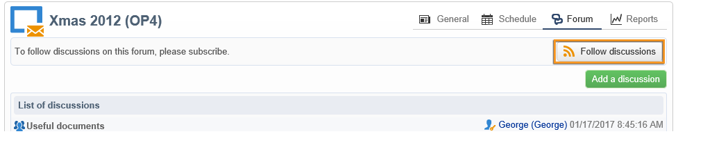

# 论坛{#discussion-forums}

Adobe Campaign运营商可以使用论坛来共享信息。 以下元素各自具有自己的论坛：计划、项目、活动、资源、模拟、库存。 每位运营商还设有个人论坛。 所有讨论都是公开的，甚至在个人论坛上。

操作员可以订阅论坛，以便在每次发布消息时接收通知电子邮件。

## 访问论坛 {#accessing-a-forum}

要访问营销活动论坛、操作员等，请转到其功能板，然后单击右上角的&#x200B;**[!UICONTROL Forum]**&#x200B;链接。 此链接还会显示论坛中的消息总数。

## 使用论坛 {#using-a-forum}

消息及其响应按时间顺序显示（从最新到最旧）。

要显示消息的内容，请单击其标题。

**开始新讨论**

要开始新的讨论，请单击右上角的&#x200B;**[!UICONTROL Add a discussion]**&#x200B;按钮。 出现&#x200B;**[!UICONTROL Discussion forum]**&#x200B;框（请参阅下文）。

**向现有讨论发送消息**

要将消息发布到现有讨论，请打开要回答的消息，然后单击左上角的&#x200B;**[!UICONTROL Reply]**&#x200B;链接。 出现&#x200B;**[!UICONTROL Discussion forum]**&#x200B;框（请参阅下文）。

当您回复消息时，发布原始消息的人将收到通知。

**写消息**

在&#x200B;**[!UICONTROL Discussion forum]**&#x200B;框中：

1. 在&#x200B;**[!UICONTROL Message]**&#x200B;字段中输入文本，在&#x200B;**[!UICONTROL Subject]**&#x200B;字段中输入讨论标题。

   

1. 如有必要：

   * 如果您希望有人参加未订阅论坛的讨论，请使用&#x200B;**[!UICONTROL Operator to notify]**&#x200B;字段。 操作员将收到此特定消息的通知电子邮件（他们不会订阅论坛）。 要通知多个运算符，请选择一组运算符。
   * 要向消息中添加附件，请单击&#x200B;**[!UICONTROL Browse]**。 附件也将包含在通知电子邮件中。 附件只能单独发送：要发送多个文件，您需要压缩这些文件。

1. 单击&#x200B;**[!UICONTROL Create the message]**&#x200B;将其发布到论坛。

>[!NOTE]
>
>将消息发布到论坛后，便无法再更改或删除该消息。

## 帖子到操作员的个人论坛 {#posting-to-the-personal-forum-of-an-operator}

例如，如果您的消息不涉及特定的营销活动，但您仍希望跟踪Adobe Campaign中的对话，则可以将消息发布到操作员的论坛。 个人论坛是公开的，所有运营商都会看到您的信息。 每次有人向其个人论坛发帖时，操作员都会收到一条消息。

要访问操作员论坛，请执行以下操作：

* 如果您拥有访问资源管理器&#x200B;**[!UICONTROL Administration > Access management > Operators]**&#x200B;节点的必要权限，请打开所需运算符的仪表板，然后单击右上角的&#x200B;**[!UICONTROL Forum]**&#x200B;链接。
* 如果没有，请在Adobe Campaign中找到操作员的姓名（通过此操作员向论坛发布的消息，即分配给他的任务），然后单击该姓名以访问其仪表板。 您还可以要求管理员创建操作员文件夹的视图。

## 订阅论坛 {#subscribing-to-a-forum}

订阅论坛可让您关注讨论。 每次向论坛发送消息时，您都会收到电子邮件通知。 此电子邮件将包含邮件正文和任何附件。 要回答消息，请单击电子邮件正文中的，然后登录Adobe Campaign Web界面。 订阅论坛时，所有人都可以看到此信息。

* 要订阅论坛，请单击消息列表上方右上方部分的&#x200B;**[!UICONTROL Follow discussions]**&#x200B;按钮。

   

   部分显示为蓝色，表示您已订阅论坛。

* 要退订论坛，请单击&#x200B;**[!UICONTROL Unsubscribe]**&#x200B;按钮。

   

* 您的个人仪表板列出了您订阅的论坛。 单击&#x200B;**[!UICONTROL Subscription to discussion forums]**&#x200B;链接以显示列表，然后单击您感兴趣的项目以访问其论坛。

   

   有关个人功能板的更多信息，请参阅[此部分](../../platform/using/access-management-operators.md)。

* 要查看谁订阅了论坛，请单击消息列表上方的&#x200B;**[!UICONTROL List of subscribers to this discussion forum]**&#x200B;链接。

   

## 检查通知投放 {#checking-notification-delivery}

如果订阅论坛的操作员未按预期收到通知：

* 检查是否在操作员的用户档案中输入了电子邮件地址。
* 转到&#x200B;**[!UICONTROL Administration > Production > Technical workflows > Campaign processes]**&#x200B;节点，并检查&#x200B;**[!UICONTROL Jobs in discussion forums]**&#x200B;工作流是否已启动且没有错误。
* 查看投放日志：

   * 在Adobe Campaign主页上，转到&#x200B;**[!UICONTROL Campaigns > Navigation > Deliveries]**，然后打开&#x200B;**[!UICONTROL Discussion forum notification]**&#x200B;投放。
   * 在浏览器中，转到&#x200B;**[!UICONTROL Administration > Production > Objects created automatically > Technical deliveries > Workflow notifications]**，然后单击&#x200B;**[!UICONTROL Discussion forum notifications]**。
   在&#x200B;**[!UICONTROL Discussion forum notifications]**&#x200B;框中，投放日志位于&#x200B;**[!UICONTROL Edit > Delivery]**&#x200B;选项卡中。 您还可以查看&#x200B;**[!UICONTROL Tracking > Log]**&#x200B;和&#x200B;**[!UICONTROL Exclusion causes]**&#x200B;选项卡。
