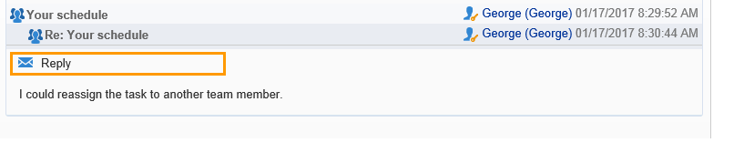
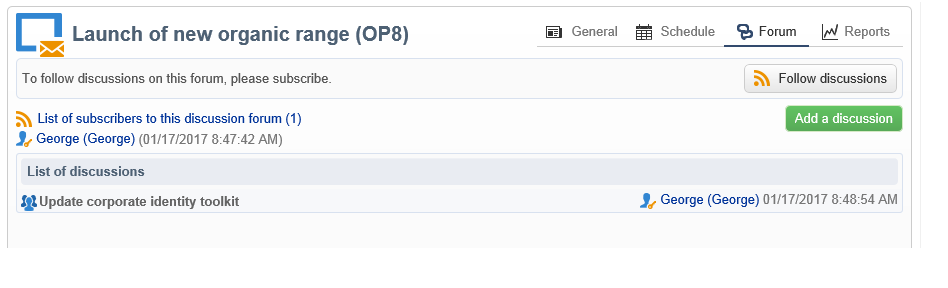

# 论坛{#discussion-forums}

Adobe Campaign操作员可以使用论坛来共享信息。 以下每个元素都有自己的论坛：计划、方案、促销活动、资源、模拟、库存。 每个操作员也有一个个人论坛。 所有讨论都是公开的，甚至在个人论坛上也是如此。

操作员可以订阅论坛，以便在每次发布消息时接收通知电子邮件。

## 访问论坛 {#accessing-a-forum}

要访问营销活动、操作员等的论坛，请转到其仪表板并单击右上角的&#x200B;**[!UICONTROL Forum]**&#x200B;链接。 此链接还会提供论坛中的邮件总数。

## 使用论坛 {#using-a-forum}

消息及其响应按时间顺序显示（从最新到最旧）。

要显示消息的内容，请单击其标头。

**开始新讨论**

要开始新的讨论，请单击右上角的&#x200B;**[!UICONTROL Add a discussion]**&#x200B;按钮。 出现&#x200B;**[!UICONTROL Discussion forum]**&#x200B;框（见下文）。

**将邮件发布到现有讨论**

若要在现有讨论中发布消息，请打开要应答的消息，然后单击左上角的&#x200B;**[!UICONTROL Reply]**&#x200B;链接。 出现&#x200B;**[!UICONTROL Discussion forum]**&#x200B;框（见下文）。

当您回复邮件时，发布原始邮件的人员将收到通知。

**写入消息**

在&#x200B;**[!UICONTROL Discussion forum]**&#x200B;框中：

1. 在&#x200B;**[!UICONTROL Message]**&#x200B;字段中输入您的文本，在&#x200B;**[!UICONTROL Subject]**&#x200B;字段中输入讨论标题。

   

1. 如有必要：

   * 如果您希望某个未订阅论坛的用户参与讨论，请使用&#x200B;**[!UICONTROL Operator to notify]**&#x200B;字段。 操作员将收到此特定消息的通知电子邮件（他们不会被订阅论坛）。 要通知多个操作员，请选择一组操作员。
   * 若要向邮件添加附件，请单击&#x200B;**[!UICONTROL Browse]**。 附件也将包含在通知电子邮件中。 附件只能单独发送：要发送多个文件，您需要压缩文件。

1. 单击&#x200B;**[!UICONTROL Create the message]**&#x200B;以将其发布到论坛。

>[!NOTE]
>
>消息发布到论坛后，无法再更改或删除。

## 发布到操作员的个人论坛 {#posting-to-the-personal-forum-of-an-operator}

例如，如果您的消息与特定营销活动无关，但仍希望在Adobe Campaign中跟踪对话，则您可以将消息发布到操作员的论坛。 个人论坛是公开的，所有操作员都将看到您的消息。 每次有人在个人论坛中发帖时，操作员都会收到消息。

访问操作员的论坛：

* 如果您具有访问资源管理器的&#x200B;**[!UICONTROL Administration > Access management > Operators]**&#x200B;节点所需的权限，请打开所需操作员的仪表板，然后单击右上角的&#x200B;**[!UICONTROL Forum]**&#x200B;链接。
* 如果没有，请在Adobe Campaign中查找操作员的姓名（通过操作员在论坛中发布的消息、分配给他们的任务），然后单击该消息以访问其仪表板。 您还可以要求管理员创建operator文件夹的视图。

## 订阅论坛 {#subscribing-to-a-forum}

通过订阅论坛，可关注讨论。 每次在论坛中发布消息时，您都会收到电子邮件通知。 此电子邮件将包含邮件正文和任何附件。 要回复消息，请单击电子邮件正文，然后登录到Adobe Campaign Web界面。 当您订阅论坛时，此信息对所有人可见。

* 要订阅论坛，请单击消息列表上方右上角的&#x200B;**[!UICONTROL Follow discussions]**&#x200B;按钮。

  

  部分变为蓝色，并显示您订阅了论坛。

* 要取消订阅论坛，请单击&#x200B;**[!UICONTROL Unsubscribe]**&#x200B;按钮。

  

* 您的个人信息板列出了您订阅的论坛。 单击&#x200B;**[!UICONTROL Subscription to discussion forums]**&#x200B;链接以显示列表，然后单击您感兴趣的项目以访问其论坛。

  

  有关个人仪表板的详细信息，请参阅[此部分](../../platform/using/access-management-operators.md)。

* 要查看哪些人订阅了论坛，请单击消息列表上方的&#x200B;**[!UICONTROL List of subscribers to this discussion forum]**&#x200B;链接。

  

## 检查通知投放 {#checking-notification-delivery}

如果订阅论坛的操作员未按预期收到通知：

* 检查操作员的配置文件中是否输入了电子邮件地址。
* 转到&#x200B;**[!UICONTROL Administration > Production > Technical workflows > Campaign processes]**&#x200B;节点并检查&#x200B;**[!UICONTROL Jobs in discussion forums]**&#x200B;工作流是否已启动且没有错误。
* 查看投放日志：

   * 在Adobe Campaign主页上，转到&#x200B;**[!UICONTROL Campaigns > Navigation > Deliveries]**，然后打开&#x200B;**[!UICONTROL Discussion forum notification]**&#x200B;投放。
   * 在资源管理器中，转到&#x200B;**[!UICONTROL Administration > Production > Objects created automatically > Technical deliveries > Workflow notifications]**，然后单击&#x200B;**[!UICONTROL Discussion forum notifications]**。

  在&#x200B;**[!UICONTROL Discussion forum notifications]**&#x200B;框中，在&#x200B;**[!UICONTROL Edit > Delivery]**&#x200B;选项卡中找到投放日志。 您还可以查看&#x200B;**[!UICONTROL Tracking > Log]**&#x200B;和&#x200B;**[!UICONTROL Exclusion causes]**&#x200B;选项卡。
