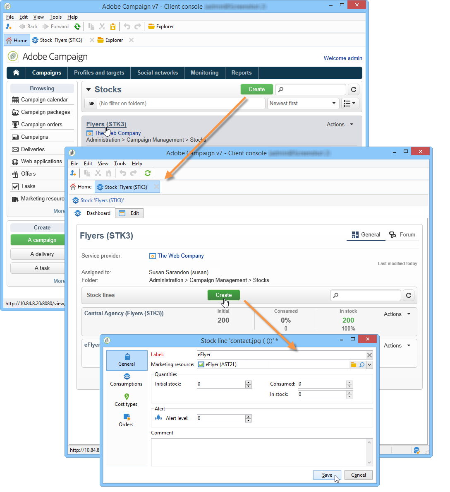

# 管理营销资源{#managing-marketing-resources}

通过Adobe Campaign，您可以管理和跟踪营销活动生命周期中涉及的营销资源。 这些营销资源可以是宣传册、可视化辅助工具或涉及多个操作员的任何其他通信媒介。

对于通过Adobe Campaign管理的每个营销资源，您可以随时跟踪其状态和历史记录并查看当前版本。

## 添加营销资源 {#adding-a-marketing-resource}

通过&#x200B;**[!UICONTROL Campaigns]**&#x200B;选项卡访问营销资源。

要添加资源，请单击&#x200B;**[!UICONTROL Create]**&#x200B;按钮。

要使某个资源在Adobe Campaign服务器上可用，必须通过将所需资源拖放到编辑器的中间区域来添加该资源。 您还可以单击&#x200B;**[!UICONTROL Upload file to server...]**&#x200B;链接。

确认消息允许您启动上载。

上传完成后，资源将添加到可用资源列表中。 它可供Adobe Campaign操作员访问。 他们可以查看（通过&#x200B;**[!UICONTROL Preview]**&#x200B;选项卡）、制作副本以对其进行修改，或更新服务器上的文件（使用&#x200B;**[!UICONTROL Edit]**&#x200B;选项卡）。

单击&#x200B;**[!UICONTROL General]**&#x200B;选项卡以选择负责监控、跟踪和批准此资源的操作员或操作员组。 通过&#x200B;**[!UICONTROL Advanced parameters]**&#x200B;链接选择审阅者。

* 分配了资源的操作员负责跟踪该资源。
* 审批操作员负责审批营销资源。 当启动资源验证过程时，将通知他们。

  如果未选择审阅者，则资源&#x200B;**[!UICONTROL cannot be]**&#x200B;需要批准。

* 如有必要，您还可以指定校对器。

您可以指定资源的（指示性）可用日期。 在此日期之后，将显示为&#x200B;**[!UICONTROL Late]**&#x200B;状态。

## 资源方面的协作工作 {#collaborative-work-on-resources}

您可以修改和更新营销资源，并在必要时将此告知其他Adobe Campaign操作员。 您可以：

* 在本地下载资源以对其进行修改。
* 更新服务器上的文件，并使其他操作员能够访问该文件。
* 锁定资源以禁止其他操作员对其进行修改。

>[!NOTE]
>
>**[!UICONTROL History]**&#x200B;选项卡包含资源的下载和更新日志。 使用&#x200B;**[!UICONTROL Details]**&#x200B;按钮可以查看所选版本。

### 锁定/解锁资源 {#locking-unlocking-a-resource}

创建后，营销资源功能板中提供了资源，操作员可以编辑和修改这些资源。

当操作员希望对资源进行操作时，最好在开始操作之前锁定该资源，以防止其他操作员同时修改该资源。 然后保留资源；该资源仍可访问，但无法由其他操作员在服务器上发布或更新。

一条特殊消息会通知尝试访问它的任何操作员：

**[!UICONTROL Tracking]**&#x200B;选项卡指示锁定资源的操作员的名称和计划的更新日期。

要锁定资源，必须单击该资源，然后单击资源仪表板中的&#x200B;**[!UICONTROL Lock]**&#x200B;按钮。

您可以在资源的&#x200B;**[!UICONTROL Tracking]**&#x200B;选项卡中指示计划的返回日期。

通过此信息，您可以将其中的资源解锁日期通知其他Adobe Campaign操作员。

更新资源后，该资源会自动解锁，并再次向所有操作员开放。

如有必要，您还可以从功能板手动解锁该功能。

>[!NOTE]
>
>只有锁定资源的操作员和具有管理员权限的操作员才有权解锁资源。

### 论坛 {#discussion-forums}

对于每个资源，**[!UICONTROL Forum]**&#x200B;选项卡允许参与者交换信息。

[讨论论坛](../../mrm/using/discussion-forums.md)介绍讨论论坛在Adobe Campaign中的运行方式。

## 营销资源的生命周期 {#life-cycle-of-a-marketing-resource}

创建资源后，将任命Adobe Campaign操作员设计、校对、批准和发布资源。 可以确定这些营销活动的持续时间。

通过&#x200B;**[!UICONTROL Tracking]**&#x200B;选项卡，可监视对资源执行的任何操作：批准、拒绝审批、相关评论或发布。

**[!UICONTROL History]**&#x200B;选项卡显示为此资源执行的文件传输。

### 审批流程 {#approval-process}

如果在&#x200B;**[!UICONTROL Tracking]**&#x200B;选项卡中指定了预期可用日期，则该日期会显示在资源详细信息中。 达到此日期后，您可以使用资源仪表板中的&#x200B;**[!UICONTROL Submit for approval]**&#x200B;按钮执行审批流程。 然后，资源状态更改为&#x200B;**[!UICONTROL Approval in progress]**。

可以通过其仪表板上的&#x200B;**[!UICONTROL Approve resource]**&#x200B;按钮批准资源。

授权操作员随后可以接受或拒绝批准。 此操作可通过以下方式执行：通过发送的电子邮件（单击通知消息中的链接），或通过控制台（单击&#x200B;**[!UICONTROL Approve]** ）按钮。

您可以在批准窗口中输入备注。

通过&#x200B;**[!UICONTROL Tracking]**&#x200B;选项卡，所有操作员都可以跟踪审批流程的各个阶段。

>[!NOTE]
>
>除了为每个营销资源指定的审阅者之外，具有管理员权限的操作员和资源管理器也被授权审批营销资源。

### 发布资源 {#publishing-a-resource}

获得批准后，必须发布营销资源。 发布过程必须按照公司要求具体实施。 这意味着可在外联网或任何其他服务器上发布资源，可向外部服务提供商发送特定信息等。

要发布资源，请单击营销资源功能板编辑区域中的&#x200B;**[!UICONTROL Publish]**&#x200B;按钮。

您还可以通过工作流自动发布资源。

发布资源意味着使其可用（例如，供其他任务使用）。 发布方式因资源的性质而异：对于传单，发布可能意味着将文件发送到打印机，对于Web代理，发布可能意味着将文件发布到网站等。

为了发布Adobe Campaign，您需要创建一个足够的工作流并将其链接到资源。 为此，请打开资源的&#x200B;**[!UICONTROL Advanced settings]**&#x200B;框，然后在&#x200B;**[!UICONTROL Post-processing]**&#x200B;字段中选择所需的工作流。

将执行工作流：

* 当审核者单击&#x200B;**[!UICONTROL Publish resource]**&#x200B;链接时（或者，如果未定义审核者，则为负责资源的人员）。
* 如果资源是通过营销资源创建任务管理的，则当任务设置为&#x200B;**[!UICONTROL Finished]**&#x200B;时，只要在任务中勾选&#x200B;**[!UICONTROL Publish the marketing resource]**&#x200B;框，就会执行该资源（请参阅[营销资源创建任务](../../mrm/using/creating-and-managing-tasks.md#marketing-resource-creation-task)）

如果未立即启动工作流（如果实例停止了工作流），则资源的状态将更改为&#x200B;**[!UICONTROL Pending publication]**。 工作流启动后，资源的状态将更改为&#x200B;**[!UICONTROL Published]**。 此状态不考虑发布过程中可能出现的错误。 检查工作流的状态，确保工作流已正确执行。

## 将资源链接到活动 {#linking-a-resource-to-a-campaign}

### 引用营销资源 {#referencing-a-marketing-resource}

营销资源可与营销活动关联，前提是在营销活动模板中选择了此功能。

>[!NOTE]
>
>有关如何创建和配置活动模板的详细信息，请参阅[活动模板](../../campaign/using/marketing-campaign-templates.md#campaign-templates)。

单击营销活动仪表板中的&#x200B;**[!UICONTROL Documents > Resources]**&#x200B;选项卡，然后单击&#x200B;**[!UICONTROL Add]**&#x200B;以选择相关的资源。

您可以按状态、性质或类型过滤资源，或应用个性化过滤器。

单击&#x200B;**[!UICONTROL OK]**&#x200B;以将资源添加到此营销活动引用的营销资源列表。

使用&#x200B;**[!UICONTROL Details]**&#x200B;按钮可编辑和查看它。

添加的资源将显示在仪表板中。 也可在其中编辑它们。

### 将营销资源添加到投放大纲 {#adding-a-marketing-resource-to-a-delivery-outline}

营销资源可以通过投放大纲与投放相关联。

>[!NOTE]
>
>有关投放概要的更多信息，请参阅[关联和构造通过投放概要](../../campaign/using/marketing-campaign-deliveries.md#associating-and-structuring-resources-linked-via-a-delivery-outline)链接的资源的问题。

## 库存管理 {#stock-management}

您可以将营销资源与一个或多个库存相关联，以便管理供应并在库存不足时在控制面板上显示警告。

>[!NOTE]
>
>有关Adobe Campaign中库存管理的详细信息，请参阅[库存管理](../../campaign/using/providers-stocks-and-budgets.md#stock-management)。

要将营销资源与股票相关联，请编辑股票映射并编辑或创建股票。 添加库存行并选择相应的营销资源。

如有必要，您可以在选择所选资源后，通过位于资源右侧的&#x200B;**[!UICONTROL Edit the link]**&#x200B;图标（放大镜）来编辑所选资源。

指定初始库存和警报库存，然后保存。

库存在资源详细信息中指明。

当库存不足时，向相关操作员发送警告。

## 高级功能 {#advanced-functions}

营销资源仪表板允许您执行常见的操作类型：添加、编辑、锁定/解锁、批准、发布。 您可以创建其他类型的营销资源，并通过Adobe Campaign树访问高级功能。 为此，请单击Adobe Campaign主页中的&#x200B;**[!UICONTROL Explorer]**。

默认情况下，营销资源存储在树的&#x200B;**[!UICONTROL MRM > Marketing resources]**&#x200B;节点中。

您可以从此视图添加以下资源：

* 文件
* HTML
* 文本
* URL
