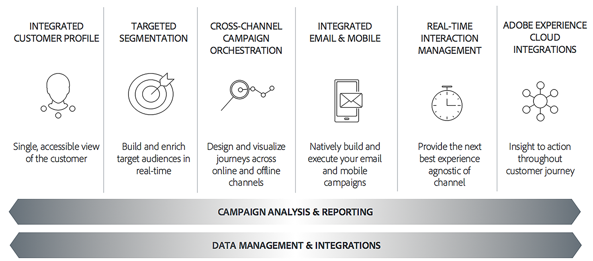

# Campaign Classic入门{#about-adobe-campaign-classic}

为了实现高水准的客户交互和优秀的客户体验，企业必须确保客户在所有接触点上的历程是一致且连续的。现在，营销人员能够高效的设计、计划、执行、管理，并且优化跨渠道营销活动，从而创造更高的市场营销投资回报，并且提高客户忠诚度。

您能够利用 Adobe Campaign 制作对话式的营销活动。Adobe Campaign 提供了大量创新功能，帮助企业实现营销活动和客户交互流程的模式化、流程化和自动化。

>[!AVAILABILITY]
>
>* 本系列中的帮助资料适用于其中的Campaign Classicv7 [最新版本](../../rn/using/latest-release.md). 当部分也适用于Campaign v8时，可提供特定徽章。
>
>* 提供了Adobe Campaign v8文档 [此处](https://experienceleague.adobe.com/docs/campaign/campaign-v8/campaign-home.html?lang=zh-Hans).

 [在视频中发现主要特性和功能](#video)

## 关键功能 {#key-capabilities}

Adobe Campaign 提供了跨渠道客户体验设计平台，并为可视化的活动编排、实时互动管理和跨渠道执行提供了环境。

Adobe Campaign 中的营销活动周期体现了产品功能的主要方面：

### Integrated Customer Profile {#integrated-customer-profile}

用户档案（客户、潜在客户、新闻稿订阅者等）将集中存储在 Adobe Campaign 数据库中。有许多可能的机制可获取用户档案并创建此数据库：通过 Web 窗体在线收集、手动或自动导入文本文件、复制公司数据库或其他信息系统的内容。借助 Adobe Campaign，您可以整合营销历史、购买信息、偏好、CRM 数据，以及整合视图中任何相关的 PII 数据，从而进行分析并采取行动。

在 Adobe　Campaign 中，收件人是发送投放内容（电子邮件、短信等）所定位的默认用户档案。凭借数据库中存储的收件人数据，您可以过滤将接收任何给定投放的目标并在投放内容中添加个性化数据。数据库中还有其他类型的用户档案。这些用户档案是针对不同用途而设计的。例如，种子用户档案用于在将投放内容发送给最终目标前测试该投放内容。

[关于用户档案](../../platform/using/about-profiles.md)中说明了用户档案管理的基本知识。

### 目标市场细分 {#targeted-segmentation}

Adobe Campaign 具有功能强大且易于使用的市场细分和定位功能，让您可以打造极具针对性的差异化优惠方案。您可以使用描述性分析功能分析营销活动的上游和下游信息，而过滤器管理及[图形查询编辑器](../../platform/using/about-queries-in-campaign.md)功能可用于过滤订阅者群体及样本，或根据无数量限制标准设定目标组。[此页面](../../reporting/using/about-descriptive-analysis.md)及[创建过滤器](../../platform/using/creating-filters.md)部分中介绍了分析和定位功能。

高级数据管理功能可进一步扩充数据处理能力。通过包含未在数据集市中建模的数据，该功能可简化并优化定位流程。[此页面](../../workflow/using/targeting-data.md#data-management)中详细介绍了该功能。

### 跨渠道营销活动编排 {#cross-channel-campaign-orchestration}

您可以利用 Adobe Campaign 在多个渠道上设计和编排有针对性的个性化活动：电子邮件、直邮、SMS、推送通知等。通过单个界面为您提供计划、编排、配置、个性化、自动化、执行和衡量所有活动和通信所需的全部功能。如需有关活动计划和执行活动的详细信息，请参阅[此页面](../../campaign/using/setting-up-marketing-campaigns.md)。

### 个性化和实时互动 {#personalization-and-real-time-interaction}

根据客户的用户档案和偏好进一步个性化邮件内容和标头，从而吸引客户的目光并提高响应率。如需有关邮件内容管理及个性化的详细信息，请参阅[此页面](../../delivery/using/about-personalization.md)。[此部分](../../mrm/using/about-marketing-resource-management.md)详细说明了如何协作管理内容、通知和批准循环。

### 分析和报告 {#analysis-and-reporting}

Adobe Campaign 可逐步丰富客户数据和用户档案，从而让您监控和解读客户的行为。利用报告和分析工具，您可以充分利用每一个新活动、更有效地确定营销方案的目标，且最大限度提高活动的影响力及投资回报。如需详细信息，请参阅[此页面](../../reporting/using/delivery-reports.md)。

### Adobe Experience Cloud 集成 {#adobe-experience-cloud-integrations}

您可以将 Adobe Campaign 的投放功能以及高级活动管理功能与帮助您个性化用户体验的解决方案（例如　Adobe Experience Manager、Adobe Analytics、Adobe Target 或 Adobe Experience Cloud 触发程序）结合起来。此外，您也可以使用 Adobe ID 集成到 Adobe IMS 并登录 Campaign。如需有关跨解决方案和身份验证集成的详细信息，请参阅[此部分](../../integrations/using/about-adobe-id.md)。

## 核心功能及附加组件 {#core-capabilities-and-add-ons}

根据您的需求和架构，Adobe Campaign 提供了一系列功能，帮助您实施和优化各种对话式营销功能。其中有些是核心功能，有些功能取决于软件包的安装和您的配置。此处提供了详细的产品说明：[Adobe Campaign Classic 产品说明](https://helpx.adobe.com/cn/legal/product-descriptions/adobe-campaign-classic---product-description.html)。

下列功能可供使用。根据您的许可协议，某些功能可能无法使用或者不在您的实例中。

* [渠道](../../delivery/using/steps-about-delivery-creation-steps.md) - 在不同渠道上设计并投放内容：电子邮件、SMS、Line、移动应用程序、直邮，
* [活动](../../campaign/using/designing-marketing-campaigns.md) - 跨渠道编排各种活动，
* [MRM](../../mrm/using/about-marketing-resource-management.md) - 管理营销资源和预算，
* [互动](../../interaction/using/interaction-and-offer-management.md) - 通过 Campaign 管理优惠方案，
* [消息中心](../../message-center/using/about-transactional-messaging.md) - 通过电子邮件、短信或在移动应用程序上发送事务性消息，
* [社交媒体营销](../../social/using/about-social-marketing.md)  — 在社交媒体上交流：Facebook、X(以前称为Twitter)、
* [工作流](../../workflow/using/about-workflows.md) / 数据管理 - 通过工作流自动化各个流程并管理数据，
* [Web 应用程序](../../web/using/about-web-applications.md) - 创建网页和窗体，
* [调查管理器](../../surveys/using/about-surveys.md) - 创建在线调查和投票，
* [内容管理器](../../delivery/using/about-content-management.md) - 管理电子邮件内容，
* [分布式营销](../../distributed/using/about-distributed-marketing.md) - 协调中央/地方机关的营销活动，
* [响应管理器](../../response/using/about-response-manager.md) - 管理客户响应，
* [连接器](../../platform/using/about-connectors.md) - 使用连接器与外部解决方案和数据库引擎通信，
* [Web 服务](../../configuration/using/about-web-services.md) - 通过 API/Web 服务使用 Campaign，
* [报告](../../reporting/using/about-adobe-campaign-reporting-tools.md) - 访问内置的报告、分析数据并设计您自己的报告。

## 教程视频 {#video}

此视频介绍Campaign Classic的主要特性和功能。

>[!VIDEO](https://video.tv.adobe.com/v/35129?quality=12)

提供了其他Campaign Classic操作方法视频 [此处](https://experienceleague.adobe.com/docs/campaign-classic-learn/tutorials/overview.html?lang=zh-Hans).
