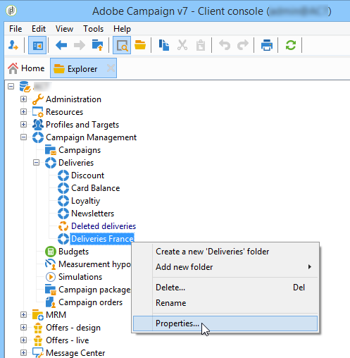
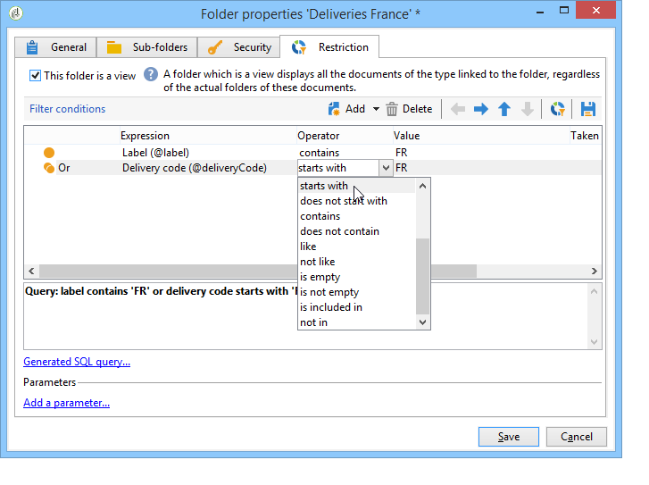

# 管理对文件夹的访问{#folder-access-management}

树的每个文件夹都有附加到它的读取、写入和删除访问权限。 要访问文件，运算符或操作员组必须至少具有对文件的读访问权限。

## 对文件夹的权限

### 编辑文件夹{#edit-permissions-on-a-folder}上的权限

要编辑树中特定文件夹的权限，请执行以下步骤：

1. 右键单击文件夹，然后选择&#x200B;**[!UICONTROL Properties...]**。

   

1. 单击&#x200B;**[!UICONTROL Security]**&#x200B;选项卡，以视图此文件夹中的授权。

   

### 修改权限{#modify-permissions}

要修改权限，您可以：

* **替换组或运算符**。要执行此操作，请单击对文件夹具有权限的组（或运算符）之一，然后从下拉列表中选择新组（或新运算符）：

   

* **授权组或运营商**。要执行此操作，请单击&#x200B;**[!UICONTROL Add]**&#x200B;按钮并选择要为此文件夹分配授权的组或运算符。
* **禁止组或运营商**。要执行此操作，请单击&#x200B;**[!UICONTROL Delete]**&#x200B;并选择要从中删除此文件夹授权的组或运算符。
* **选择分配给组或运算符的权限**。要执行此操作，请单击相关组或运算符，然后选择要授予的访问权限并取消选择其他访问权限。

   

### 传播权限{#propagate-permissions}

您可以传播授权和访问权限。 为此，请在文件夹属性中选择&#x200B;**[!UICONTROL Propagate]**&#x200B;选项。

然后，此窗口中定义的授权将应用于当前节点的所有子文件夹。 然后，您可以为每个子文件夹重载这些授权。

>[!NOTE]
>
>清除文件夹的此选项不会自动清除子文件夹的此选项。 必须为每个子文件夹显式清除它。

### 授予对所有运算符{#grant-access-to-all-operators}的访问权限

在&#x200B;**[!UICONTROL Security]**&#x200B;选项卡中，如果选择&#x200B;**[!UICONTROL System folder]**&#x200B;选项，则所有运算符都将有权访问此数据，而不管其权限如何。 如果清除此选项，则必须将运算符（或其组）显式添加到授权列表中，以便它们能够访问。

## 文件夹和视图{#folders-and-views}

### 关于文件夹{#about-folders}

文件夹是Adobe Campaign树中的节点。 通过右键单击树，通过&#x200B;**[!UICONTROL Add new folder]**&#x200B;菜单创建这些节点。 默认情况下，第一个菜单允许您添加与当前上下文对应的文件夹。

您可以像在树的所有其他文件夹中一样，为这些文件夹授予权限。 请参阅[文件夹访问管理](#folder-access-management)。

### 关于视图{#about-views}

此外，您还可以创建视图，以限制对数据的访问，并组织树的内容以满足您的要求。 然后，您可以为视图分配权限。

视图是一个文件夹，它显示物理存储在同一类型的一个或多个其他文件夹中的记录。 例如，如果您创建一个活动文件夹，它默认显示视图库中存在的所有活动，无论其来源如何。 然后可以过滤此数据。

将文件夹转换为视图时，视图中将显示与数据库中现有的文件夹类型对应的所有数据，而与保存该文件夹的文件夹无关。 然后，您可以对其进行筛选，以限制显示数据的列表。

>[!IMPORTANT]
>
>视图包含数据并提供对它的访问，但数据不实际存储在视图文件夹中。 操作员必须对数据源文件夹中所需的操作（至少读取访问权限）拥有适当的权限。
>
>要在不授予对视图源文件夹访问权限的情况下授予对该文件夹的访问权限，只需不授予对源文件夹的父节点的读取访问权限。

要区分视图和文件夹，每个视图的名称以不同的颜色（深青色）显示。

### 添加文件夹并创建视图{#adding-folders-and-creating-views}

在以下示例中，我们将创建新文件夹以显示特定数据：

1. 新建一个&#x200B;**[!UICONTROL Deliveries]**&#x200B;类型文件夹，并将其命名为&#x200B;**投放France**。
1. 右键单击此文件夹并选择&#x200B;**[!UICONTROL Properties...]**。

   

1. 在 **[!UICONTROL Restriction]** 选项卡中，选择 **[!UICONTROL This folder is a view]**。随后将显示数据库中的所有投放。

   

1. 从窗口中间部分的投放编辑器中定义查询过滤条件：随后将显示与定义的过滤器对应的活动。

   >[!NOTE]
   >
   >查询编辑器显示在[本节](../../platform/using/about-queries-in-campaign.md)中。

   具有以下筛选条件：

视图中将显示以下投放:

>[!NOTE]
>
>在管理[事务消息](../../message-center/using/about-transactional-messaging.md)事件时，不能将&#x200B;**[!UICONTROL Real time events]**&#x200B;或&#x200B;**[!UICONTROL Batch events]**&#x200B;文件夹设置为执行实例上的视图，因为这可能导致访问权限问题。 有关事件集合的详细信息，请参阅[此部分](../../message-center/using/event-collection.md)。