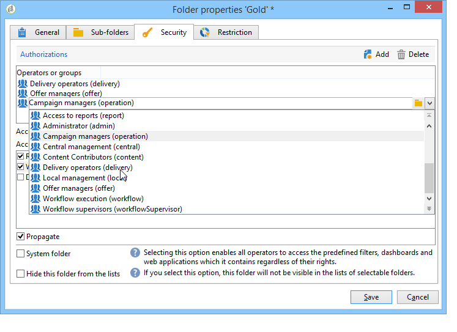

# 管理对文件夹的访问{#folder-access-management}

Explorer导航树的每个文件夹都具有读取、写入和删除访问权限。 要访问文件，操作员或操作员组必须至少具有文件的读取权限。

## 文件夹和视图 {#folders-and-views}

### 什么是文件夹 {#about-folders}

文件夹是Adobe Campaign树中的节点。 创建这些节点的方法是，通过右键单击树，然后单击 **[!UICONTROL Add new folder]** 菜单。 默认情况下，第一个菜单允许您添加对应于当前上下文的文件夹。

您可以自定义Explorer导航树。 了解配置步骤和最佳实践 [在此部分中](adobe-campaign-workspace.md).

### 什么是视图 {#about-views}

此外，您还可以创建视图以限制对数据的访问，并组织树的内容以满足您的要求。 然后，您可以为视图分配权限。

视图是一个文件夹，它显示实际存储在相同类型的一个或多个其他文件夹中的记录。 例如，如果您创建了一个视图的Campaign文件夹，则该文件夹会默认显示数据库中存在的所有Campaign，无论其来源如何。 然后，可以筛选此数据。

将文件夹转换为视图时，与数据库中存在的文件夹类型对应的所有数据都会显示在视图中，无论其保存在哪个文件夹中。 然后，您可以对其进行筛选以限制显示的数据列表。

>[!IMPORTANT]
>
>视图包含数据并提供对数据的访问，但数据并未实际存储在视图文件夹中。 操作员必须在数据源文件夹中拥有所需操作的适当权限（至少具有读取权限）。
>
>要授予视图的访问权限而不授予对其源文件夹的访问权限，只需在源文件夹的父节点上不授予读取权限即可。

为了区分视图和文件夹，每个视图的名称以不同的颜色（深青色）显示。

### 添加文件夹和创建视图 {#adding-folders-and-creating-views}

在以下示例中，我们将创建新文件夹以显示特定数据：

1. 新建 **[!UICONTROL Deliveries]** 键入文件夹并将其命名为 **投放（法国）**.
1. 右键单击此文件夹并选择 **[!UICONTROL Properties...]**.

   

1. 在 **[!UICONTROL Restriction]** 选项卡中，选择 **[!UICONTROL This folder is a view]**。随后将显示数据库中的所有投放。

   

1. 在窗口的中间部分通过查询编辑器定义投放过滤器条件：随后将显示与定义的过滤器对应的营销活动。

   >[!NOTE]
   >
   >中介绍了查询编辑器 [本节](../../platform/using/about-queries-in-campaign.md).

   具有以下筛选条件：

视图中将显示以下投放：

>[!NOTE]
>
>管理时 [事务性消息传递](../../message-center/using/about-transactional-messaging.md) 事件， **[!UICONTROL Real time events]** 或 **[!UICONTROL Batch events]** 不能将文件夹设置为执行实例上的视图，因为这可能会导致访问权限问题。 有关事件集合的更多信息，请参阅 [本节](../../message-center/using/about-event-processing.md#event-collection).

## 文件夹的权限

### 编辑文件夹权限 {#edit-permissions-on-a-folder}

要编辑树中特定文件夹的权限，请执行以下步骤：

1. 右键单击文件夹并选择 **[!UICONTROL Properties...]**.

   

1. 单击 **[!UICONTROL Security]** 选项卡以查看此文件夹的授权。

   

### 修改权限 {#modify-permissions}

要修改权限，您可以：

* **替换组或运算符**. 要执行此操作，请单击对该文件夹具有权限的组（或运算符）之一，然后从下拉列表中选择新组（或新运算符）：

   

* **授权组或操作员**. 要执行此操作，请单击 **[!UICONTROL Add]** 按钮上，并选择要为此文件夹分配授权的组或运算符。
* **禁止组或操作员**. 要执行此操作，请单击 **[!UICONTROL Delete]** 并选择要从中删除此文件夹授权的组或运算符。
* **选择分配给组或操作员的权限**. 为此，请单击相关的组或操作员，然后选择要授予的访问权限并取消选择其他权限。

   

### 传播权限 {#propagate-permissions}

您可以传播授权和访问权限。 要执行此操作，请选择 **[!UICONTROL Propagate]** 选项。

然后，此窗口中定义的授权将应用于当前节点的所有子文件夹。 然后，您可以对每个子文件夹重载这些授权。

>[!NOTE]
>
>为文件夹清除此选项不会自动为子文件夹清除它。 您必须为每个子文件夹显式清除它。

### 授予所有操作员的访问权限 {#grant-access-to-all-operators}

在 **[!UICONTROL Security]** 选项卡，如果 **[!UICONTROL System folder]** 选项，则所有操作员都将有权访问此数据，而不管他们有什么权限。 如果清除此选项，则必须将运算符（或其组）明确添加到授权列表，以便他们能够访问。

