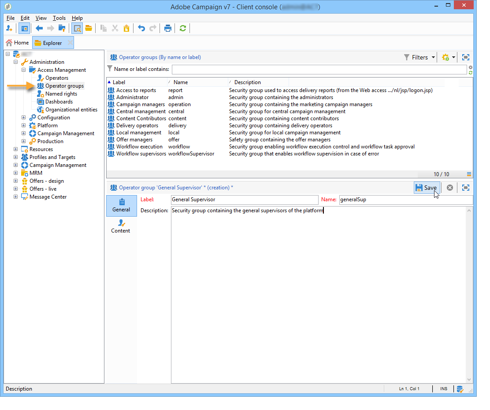

# 创建和管理操作员组 {#operator-groups}

>[!NOTE]
>
>这些过程仅适用于使用&#x200B;**旧版本机身份验证**&#x200B;连接到Campaign的操作员。 从Campaign Classic v7.3.1开始，所有操作员都应使用[Adobe Identity Management System (IMS)](https://helpx.adobe.com/cn/enterprise/using/identity.html){target="_blank"}连接到Campaign。 [了解详情](../../technotes/using/migrate-users-to-ims.md)
>
>使用Adobe ID连接到Campaign时，以下部分不再适用。 请参阅[Campaign v8文档](https://experienceleague.adobe.com/docs/campaign/campaign-v8/admin/permissions/gs-permissions.html?lang=zh-Hans){target="_blank"}以了解如何使用Adobe IMS设置权限。

操作员组通过树中的&#x200B;**[!UICONTROL Administration > Access management > Operator groups]**&#x200B;节点创建。

## 创建新的操作员组 {#creating-a-new-operator-group}

要创建新的运算符组，请应用以下步骤：

1. 单击组列表右侧的&#x200B;**[!UICONTROL New]**&#x200B;按钮，或右键单击列表并选择&#x200B;**[!UICONTROL New]**。
1. 在下部窗口中，从&#x200B;**[!UICONTROL General]**&#x200B;选项卡，在相应字段中输入此组的名称和描述。

   

1. 单击&#x200B;**[!UICONTROL Content]**&#x200B;选项卡以定义此组的授权。
1. 单击&#x200B;**[!UICONTROL Add]**&#x200B;按钮以选择要与组关联的指定权限或操作员。
1. 单击&#x200B;**[!UICONTROL Folder]**&#x200B;字段右侧的下拉列表或文件夹，找到要与此组关联的指定权限或操作员。
1. 选择要添加的权限或运算符，然后单击&#x200B;**[!UICONTROL OK]**&#x200B;进行验证。

   

   重复此操作以添加其他权限或操作员。

1. 单击&#x200B;**[!UICONTROL Save]**&#x200B;按钮以将组添加到列表。

## 默认组 {#default-groups}

默认运算符组为：

1. **[!UICONTROL Administrator]**

   此组中的操作员具有实例的完全访问权限。 管理员是可以访问界面中技术含量最高的部分的用户。 他们担任&#x200B;**[!UICONTROL Administration]**&#x200B;角色，并确保平台已全部设置。

   此组包含以下已命名权限：

   * **[!UICONTROL ADMINISTRATION]**：有权执行/创建/编辑/删除任何对象，如工作流、投放、脚本等。

1. **[!UICONTROL Delivery operators]**

   此组中的操作员负责管理投放：他们可访问创建和准备投放所需的主要资源（活动类型、投放映射、默认模板、个性化块等）。

   此组包含以下已命名权限：

   * **[!UICONTROL PREPARE DELIVERIES]**：有权创建、编辑和启动投放分析，
   * **[!UICONTROL START DELIVERIES]**：有权批准以前分析的投放。

1. **[!UICONTROL Campaign managers]**

   此组中的操作员可以管理营销活动：通过此组，您可以访问链接到营销活动的对象（计划、项目、工作流、预算等） 在&#x200B;**[!UICONTROL Campaign]**&#x200B;的框架内（可选Adobe Campaign模块）。

   此组包含以下已命名权限：

   * **[!UICONTROL INSERT FOLDERS]**：有权将文件夹插入到Adobe Campaign树中（前提是您对有关分支具有编辑权限），
   * **[!UICONTROL WORKFLOW]**：使用工作流的权限。

   >[!NOTE]
   >
   >此组不允许操作员开始投放。

1. **[!UICONTROL Content contributors]**

   此组中的操作员可以在&#x200B;**[!UICONTROL Content management]**&#x200B;的框架内访问内容文件夹（可选Adobe Campaign模块）。 此组不授予任何其他权限。

1. **[!UICONTROL Access to reports]**

   此组为外部操作员保留，用于为特定操作员启用营销活动功能板中的报表、计划和论坛图标。

1. **[!UICONTROL Workflow execution]**

   通过此组，您可以分配操作员以管理与营销活动无关的工作流。

1. **[!UICONTROL Workflow supervisors]**

   如果出现有关活动工作流的警报，此组中的操作员会收到电子邮件通知。

1. 本地/中央管理

   这些组允许您使用&#x200B;**[!UICONTROL Distributed marketing]**（可选Adobe Campaign模块）。

1. **[!UICONTROL Offer managers]**

   此组中的操作员可以创建和维护选件。有关此内容的详细信息，请参阅此[页面](../../interaction/using/operator-profiles.md)。
此组包含以下已命名权限：

   * **[!UICONTROL INSERT FOLDERS]**：有权将文件夹插入到Adobe Campaign树中（前提是您对有关分支具有编辑权限），
   * **[!UICONTROL EDIT FOLDERS]**：更改文件夹属性（如内部名称、标签、关联的图像、子文件夹顺序等）的权限。
