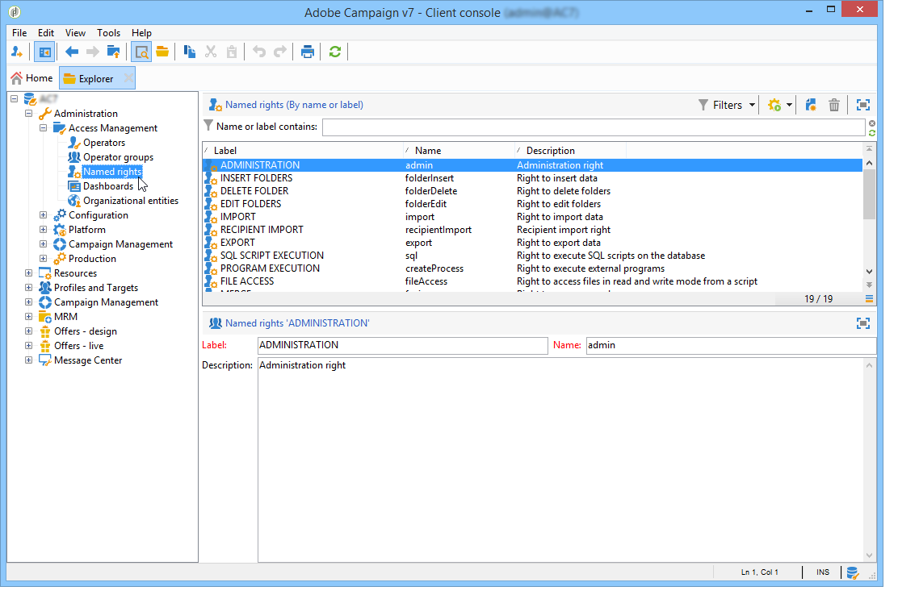

# 使用已命名权限设置权限{#named-rights}

默认情况下，Adobe Campaign会提供一组命名权限，用于定义分配给操作员和操作员组的授权。 可以从树的&#x200B;**[!UICONTROL Administration > Access management > Named rights]**&#x200B;节点编辑这些权限。

这些权限如下：

* **[!UICONTROL ADMINISTRATION]**:具有权限的 **[!UICONTROL ADMINISTRATION]** 运算符对实例具有完全访问权限。管理员用户可以执行/创建/编辑/删除任何对象，如工作流、交付、脚本等。

* **[!UICONTROL APPROVAL ADMINISTRATION]**:您可以在工作流和投放中设置多个批准步骤，以确保已分配的操作员或组批准当前状态。具有&#x200B;**[!UICONTROL APPROVAL ADMINISTRATION]**&#x200B;权限的用户可以设置批准步骤，还可以分配应批准这些步骤的操作员或操作员组。

* **[!UICONTROL CENTRAL]**:中央管理权（分布式营销）。

* **[!UICONTROL DELETE FOLDER]**:有权删除文件夹。在此权限下，允许用户从资源管理器视图中删除文件夹。

* **[!UICONTROL EDIT FOLDERS]**:有权更改文件夹属性，如内部名称、标签、关联图像、子文件夹顺序等。

* **[!UICONTROL EXPORT]**:用户可以使用工作流活动将其Adobe Campaign实例中的数据导出到服务器或本地计算机上 **[!UICONTROL EXPORT]** 的文件。

* **[!UICONTROL FILES ACCESS]**:有权通过脚本读取和写入文件，该脚本可以写入工作流活 **[!UICONTROL JavaScript]** 动中，以在服务器上读取/写入文件。

* **[!UICONTROL IMPORT]**:通用数据导入的权限。**[!UICONTROL IMPORT]** 用于将数据导入任何其他表，而 **[!UICONTROL RECIPIENT IMPORT]** 右侧仅允许导入收件人表。

* **[!UICONTROL INSERT FOLDERS]**:有权插入文件夹。具有&#x200B;**[!UICONTROL INSERT FOLDERS]**&#x200B;权限的用户可以在浏览器视图的文件夹树中创建新文件夹。

* **[!UICONTROL LOCAL]**:本地管理权（分布式营销）。

* **[!UICONTROL MERGE]**:有权将选定的记录合并到一个记录中。如果收件人存在为重复项，则右侧的&#x200B;**[!UICONTROL MERGE]**&#x200B;允许用户选择重复项并将其合并到主收件人中。

* **[!UICONTROL PREPARE DELIVERIES]**:有权创建、编辑和保存投放。具有&#x200B;**[!UICONTROL PREPARE DELIVERIES]**&#x200B;权限的用户也可以启动投放分析流程。

* **[!UICONTROL PRIVACY DATA RIGHT]**:收集和删除隐私数据的权利。有关详细信息，请参见此 [ 页面](https://helpx.adobe.com/cn/campaign/kb/acc-privacy.html)。

* **[!UICONTROL PROGRAM EXECUTION]**:以各种编程语言执行命令的权利。

* **[!UICONTROL RECIPIENT IMPORT]**:有权导入收件人。具有&#x200B;**[!UICONTROL RECIPIENT IMPORT]**&#x200B;权限的用户可以将本地文件导入收件人表。

* **[!UICONTROL SQL SCRIPT EXECUTION]** 有权直接在数据库上执行任何SQL命令。

* **[!UICONTROL START DELIVERIES]**:有权批准之前分析的投放。投放分析后，投放将在各个批准步骤中暂停，并需要获得批准才能继续。 具有&#x200B;**[!UICONTROL START DELIVERIES]**&#x200B;权限的用户可以批准投放。

* **[!UICONTROL USE SQL DATA MANAGEMENT ACTIVITY]**:有权使用SQL数据管理活动编写您自己的SQL脚本，以创建和填充工作表(请参 [阅此章节](../../workflow/using/sql-data-management.md))。

* **[!UICONTROL WORKFLOW]**:有权执行工作流。如果没有此权限，用户将无法启动、停止或重新启动工作流。

* **[!UICONTROL WEBAPP]**:有权使用Web应用程序。

>[!NOTE]
>
>此列表可能因平台上安装的加载项而异。

## 访问权限矩阵{#access-rights-matrix}

默认组和命名权限允许操作员访问导航层次结构中的某些文件夹，并授予读取、写入和删除权限。

Adobe Campaign访问权限矩阵可在[此处](/help/platform/using/assets/access-rights-matrix.pdf)获取。

