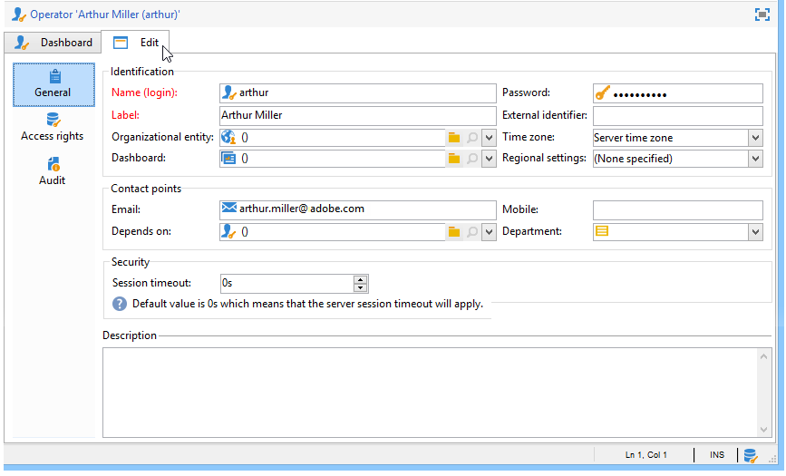

# 创建和管理操作员 {#operators}

## Campaign操作员入门  {#about-operators}

操作员是具有登录和执行操作权限的Adobe Campaign用户。

默认情况下，运算符存储在&#x200B;**[!UICONTROL Administration > Access management > Operators]**&#x200B;节点中。

可以手动创建或映射现有LDAP目录上的运算符。

[此页面](#creating-an-operator)中介绍了创建运算符的完整过程。

有关Adobe Campaign与LDAP集成的更多信息，请参阅[此页面](../../installation/using/connecting-through-ldap.md)。

>[!IMPORTANT]
>
>操作员需要链接到安全区域才能登录到实例。 有关Adobe Campaign安全区的更多信息，请参阅[此页面](../../installation/using/security-zones.md)。

用户还可以使用其Adobe ID直接连接到Adobe Campaign。 有关详细信息，请参见此 [ 页面](../../integrations/using/about-adobe-id.md)。

## 创建运算符 {#creating-an-operator}

要创建新运算符并授予权限，请执行以下步骤：

1. 单击位于运算符列表上方的&#x200B;**[!UICONTROL New]**&#x200B;按钮，然后输入新运算符的详细信息。

   

1. 指定用户的&#x200B;**[!UICONTROL Identification parameters]**:其登录名、密码和名称。 操作员将使用登录名和密码登录到Adobe Campaign。 用户登录后，可通过&#x200B;**[!UICONTROL Tools > Change password]**&#x200B;菜单更改其密码。 操作员的电子邮件至关重要，因为它使操作员能够接收通知，例如在处理批准时。

   此部分还允许您将运算符链接到组织实体。 有关更多信息，请参阅[此页面](../../distributed/using/about-distributed-marketing.md)。

1. 在&#x200B;**[!UICONTROL Operator access rights]**&#x200B;部分中，选择授予操作员的权限。

   要为操作员分配权限，请单击权限列表上方的&#x200B;**[!UICONTROL Add]**&#x200B;按钮，然后从可用组列表中选择一组操作员：

   

   您还可以选择一个或多个命名权限（请参阅[命名权限](#named-rights)）。 为此，请单击&#x200B;**[!UICONTROL Folder]**&#x200B;字段右侧的箭头，然后选择&#x200B;**[!UICONTROL Named rights]**:

   

   选择要分配的组和/或命名权限，然后单击&#x200B;**[!UICONTROL OK]**&#x200B;以验证。

1. 单击&#x200B;**[!UICONTROL Ok]**&#x200B;以创建运算符：该用户档案将添加到现有运算符的列表。

   

>[!NOTE]
>
>您可以通过创建新的操作员文件夹，根据您的要求组织操作员。 要执行此操作，请右键单击运算符文件夹，然后选择&#x200B;**[!UICONTROL Add an 'Operators' folder]**。

创建操作员的用户档案后，即可添加或更新其信息。 要执行此操作，请单击&#x200B;**[!UICONTROL Edit]**&#x200B;选项卡。

>[!NOTE]
>
>利用&#x200B;**[!UICONTROL Session timeout]**&#x200B;字段，可调整FDA会话超时前的延迟。 有关更多信息，请参阅[关于联合数据访问](../../installation/using/about-fda.md)。

## 定义运算符的时区 {#time-zone-of-the-operator}

在&#x200B;**[!UICONTROL General]**&#x200B;选项卡中，您可以选择运算符的时区。 默认情况下，运算符在服务器时区中工作。 但是，可以使用下拉列表选择其他时区。

[本页](../../installation/using/time-zone-management.md)中介绍了时区的配置。

>[!NOTE]
>
>不同时区内的协作需要按UTC存储日期。 在以下上下文中，日期将以相应的时区进行转换：在用户时区中显示日期时，导入和导出文件时，计划电子邮件投放时，在工作流中计划活动时（调度程序、等待、时间约束等）
>
>与这些情况相关的限制因素和建议见Adobe Campaign文档的相关章节。

此外，**[!UICONTROL Regional settings]**&#x200B;下拉列表允许您选择显示日期和数字的格式。

## 添加权限 {#access-rights-options}

使用&#x200B;**[!UICONTROL Access rights]**&#x200B;选项卡更新链接到运算符的组和命名权限。

**[!UICONTROL Edit the access parameters...]**&#x200B;链接允许您访问以下选项：

* **[!UICONTROL Disable account]**&#x200B;选项允许您禁用操作员的帐户：他将不再访问Adobe Campaign。

   >[!NOTE]
   >
   >即使帐户被禁用，操作员仍可以从Campaign接收警报或通知。 要停止向此运算符发送Campaign通知，Adobe建议您从其用户档案中删除电子邮件地址。

* 使用&#x200B;**[!UICONTROL Forbid access from the rich client]**&#x200B;选项，可将Adobe Campaign的使用限制为[Web访问](../../platform/using/adobe-campaign-workspace.md#console-and-web-access)或通过API:对Adobe Campaign客户端控制台的访问权限不再可用。
* 可以将安全区与操作员链接。 有关详细信息，请参见[此页面](../../installation/using/security-zones.md)。
* 您还可以使用相应的链接定义可信IP掩码。

   如果操作员的IP地址在此列表中，则他们将能够连接到Adobe Campaign，而无需输入其密码。

   您还可以指定一组IP地址，这些地址将在无密码的情况下被授权连接，例如以下示例中的：

   

   >[!NOTE]
   >
   >要保护对平台的访问安全，必须谨慎使用此选项。

* 使用&#x200B;**[!UICONTROL Restrict to information found in sub-folders of:]**&#x200B;选项可限制分配给文件夹运算符的权限。 只有此选项中指定的节点的子文件夹才对用户可见：

   

   >[!IMPORTANT]
   >
   >这是非常严格的限制，必须谨慎使用。 使用此类权限登录的操作员只能查看指定文件夹的内容，并且无法通过资源管理器访问树的任何其他节点。 但是，根据他有权访问的功能(例如：工作流)时，他可以显示通常存储在他看不到的节点中的数据。

### 检查设置 {#check-settings}

**[!UICONTROL Audit]**&#x200B;选项卡允许您查看与运算符相关的信息。 根据操作员干预区域中定义的设置，将各种选项卡自动添加到中。

您可以访问：

* 链接到运算符的文件夹的权限列表。

   

   >[!NOTE]
   >
   >有关更多信息，请参阅[文件夹访问管理](#folder-access-management)。

* 操作员批准日志。

   

* 他们订阅的论坛列表。
* 活动。
* 分配给它们的任务列表。

## 默认运算符 {#default-operators}

Adobe Campaign使用默认配置了用户档案的技术运算符：管理员（“管理员”）、账单（“账单”）、监控、Web应用程序代理(“webapp”)等。 其中某些选项取决于平台上安装的应用程序和选项：例如，“中心”和“本地”运算符仅在安装“分布式营销”选项时才可见。

>[!IMPORTANT]
>
>当平台返回信息消息时，默认情况下会通知这些技术操作员。 我们强烈建议向他们提供联系电子邮件。
>
>为确保Web应用程序正常运行，我们还建议不要为“webapp”运算符定义特定的区域设置。

默认情况下，“webapp”技术操作员具有命名的“管理”权限，这可能会导致安全风险。 要解决此问题，我们建议删除此权限。 操作步骤：

1. 在&#x200B;**[!UICONTROL Administration > Access management > Named rights]**&#x200B;节点中，单击&#x200B;**[!UICONTROL New]**&#x200B;以创建一个右侧节点并将其命名为WEBAPP。

   

   [Named rights](#named-rights)部分中详细介绍了命名权限。

1. 从&#x200B;**[!UICONTROL Administration > Access management > Operators]**&#x200B;节点中，选择Web应用程序代理运算符(“webapp”)。

   选择&#x200B;**[!UICONTROL Edit]**&#x200B;选项卡，然后选择&#x200B;**[!UICONTROL Access rights]**&#x200B;选项卡，并从列表中删除名为的ADMINISTRATION。

   

   单击&#x200B;**[!UICONTROL Add]**，选择您刚刚创建的WEBAPP右侧，然后保存更改。

   

1. 为与此运算符相关的文件夹（主要是“收件人”文件夹）分配“webapp”运算符的读取和写入数据访问权限。

   

   [文件夹访问管理](#folder-access-management)部分中详细介绍了修改树文件夹的权限。

>[!NOTE]
>
>有关安全准则的更多信息，请参阅[Adobe Campaign安全配置检查列表](https://helpx.adobe.com/cn/campaign/kb/acc-security.html)。
