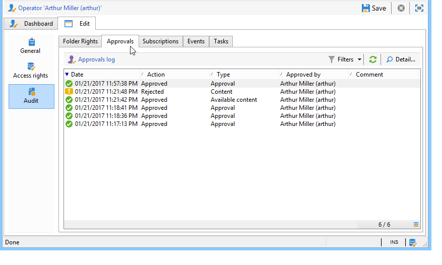
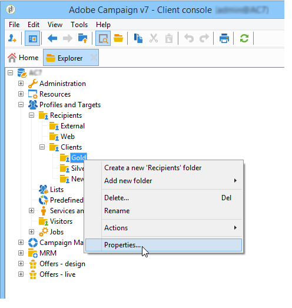

# 访问管理{#access-management}

## 关于权限 {#about-permissions}

Adobe Campaign允许您定义和管理分配给各种运算符的权限。 这些权限和限制授权或拒绝：

* 访问某些功能(通过已命名权限),
* 访问某些记录，
* 创建、修改和／或删除记录(操作、联系人、活动、组等)。

权限适用于操作员用户档案或操作员组。

它们由与操作员与Adobe Campaign的连接模式链接的安全参数来完成。 有关详细信息，请参见[此页面](../../installation/using/configuring-campaign-server.md#defining-security-zones)。

您可以向用户授予两种类型的权限：

* 您可以定义操作员组的属性，然后将运算符与一个或多个组关联。 这使您能够重复使用权限并使运营商用户档案更加一致。 它还方便了用户档案的管理和维护。 组创建和管理在操作员组 [中显示](#operator-groups)。
* 您可以将已命名权限直接归因给用户，在某些情况下，这会使通过组分配的权限过载。 这些权利以 [已命名权限](#named-rights)。

>[!NOTE]
>
>在开始定义权限之前，Adobe建议您阅读安 [全配置清单](https://helpx.adobe.com/campaign/kb/acc-security.html)。

## 运算符 {#operators}

### 关于运算符 {#about-operators}

操作员是具有登录和执行操作权限的Adobe Campaign用户。

默认情况下，操作符存储在节 **[!UICONTROL Administration > Access management > Operators]** 点中。

可以手动创建操作符，也可以将操作符映射到现有LDAP目录。

有关创建操作符的完整过程，请参 [阅本页](#creating-an-operator)。

有关Adobe Campaign和LDAP集成的详细信息，请参 [阅本页](../../installation/using/connecting-through-ldap.md)。

>[!IMPORTANT]
>
>操作符需要链接到安全区域才能登录到实例。 有关Adobe Campaign中安全区域的详细信息，请参 [阅本页](../../installation/using/configuring-campaign-server.md#defining-security-zones)。

用户还可以使用其Adobe ID直接连接到Adobe Campaign。 有关详细信息，请参见此 [ 页面](../../integrations/using/about-adobe-id.md)。

### 创建运算符 {#creating-an-operator}

要创建新操作员并授予权限，请按照以下步骤操作：

1. 单击位 **[!UICONTROL New]** 于运算符列表上方的按钮，然后输入新运算符的详细信息。

   

1. 指定 **[!UICONTROL Identification parameters]** 用户：登录名、密码和名称。 操作员将使用登录名和口令登录Adobe Campaign。 用户登录后，可通过菜单更改其口 **[!UICONTROL Tools > Change password]** 令。 运营商的电子邮件至关重要，因为它使运营商能够接收通知，例如在处理批准时。

   此部分还允许您将运算符链接到组织实体。 For more on this, refer to the [this page](../../campaign/using/about-distributed-marketing.md).

1. 在部分中选择授予操作员的 **[!UICONTROL Operator access rights]** 权限。

   要向操作员分配权限，请单 **[!UICONTROL Add]** 击位于权限列表上方的按钮，然后从可用组列表中选择一个操作员组:

   

   您还可以选择一个或多个已命名权限(请参 [阅已命名权限](#named-rights))。 为此，请单击字段右侧的箭头， **[!UICONTROL Folder]** 然后选择 **[!UICONTROL Named rights]**:

   

   选择要分配的组和／或已命名权限，然后单击 **[!UICONTROL OK]** 以验证。

1. 单击 **[!UICONTROL Ok]** 以创建运算符：该用户档案被添加到现有运营商的列表中。

   

>[!NOTE]
>
>您可以根据您的要求，通过创建新的操作员文件夹来组织操作员。 为此，请右键单击操作符文件夹并选择 **[!UICONTROL Add an 'Operators' folder]**。

创建操作员的用户档案后，您可以添加或更新其信息。 为此，请单击选 **[!UICONTROL Edit]** 项卡。

>[!NOTE]
>
>该字 **[!UICONTROL Session timeout]** 段允许您调整联合数据访问会话超时之前的延迟。 有关此内容的详细信息，请参 [阅关于联合数据访问](../../platform/using/about-fda.md)。

### 操作员的时区 {#time-zone-of-the-operator}

在选 **[!UICONTROL General]** 项卡中，可以选择运算符的时区。 默认情况下，操作符在服务器时区中工作。 但是，可以使用下拉列表选择其他时区。

本页介绍了时区的 [配置](../../installation/using/time-zone-management.md)。

>[!NOTE]
>
>不同时区内的协作需要存储UTC中的日期。 日期在以下上下文的适当时区内转换：当日期显示在用户时区中时、导入和导出文件时、计划电子邮件投放时、在工作流中计划活动时(调度程序、等待、时间约束等)
>
>与这些上下文相关的约束和建议在Adobe Campaign文档的相关章节中介绍。

此外，下拉 **[!UICONTROL Regional settings]** 式列表允许您选择显示日期和数字的格式。

### 访问权限选项 {#access-rights-options}

使用选 **[!UICONTROL Access rights]** 项卡可更新链接到运算符的组和已命名权限。

The **[!UICONTROL Edit the access parameters...]** link lets you access the following options:

* 通过 **[!UICONTROL Disable account]** 此选项可禁用操作员的帐户：他不会再去Adobe Campaign。
* 通 **[!UICONTROL Forbid access from the rich client]** 过该选项，可将Adobe Campaign的使用限 [制为Web](../../platform/using/adobe-campaign-workspace.md#console-and-web-access) 访问或通过API:对Adobe Campaign客户端控制台的访问不再可用。
* 可以将安全区与操作员连接。 有关详细信息，请参见[此页面](../../installation/using/configuring-campaign-server.md#defining-security-zones)。
* 您还可以使用相应的链接定义可信的IP掩码。

   如果Adobe Campaign的IP地址在此列表中，则操作员无需输入口令即可连接到该。

   您还可以指定一组IP地址，这些地址将授权在无口令的情况下进行连接，如以下示例中所示：

   

   >[!NOTE]
   >
   >要确保平台访问的安全，必须谨慎使用此选项。

* 通过 **[!UICONTROL Restrict to information found in sub-folders of:]** 此选项，可限制属于文件夹操作符的权限。 用户只能看到此选项中指定的节点的子文件夹：

   

   >[!IMPORTANT]
   >
   >这是非常严格的限制，必须谨慎使用。 使用此类型权限登录的操作员只能查看指定文件夹的内容，并且无法通过资源管理器访问树的任何其他节点。 但是，具体取决于他有权访问的功能(例如：工作流)，他可以显示通常存储在他看不到的节点中的数据。

### 操作员的文件夹、批准和任务 {#folders--approval-and-tasks-of-an-operator}

该选 **[!UICONTROL Audit]** 项卡允许您视图与操作符相关的信息。 根据操作员的干预区域中定义的设置自动添加各种选项卡。

您可以访问：

* 与操作员链接的文件夹的权限列表。

   

   >[!NOTE]
   >
   >有关此方面的详细信息，请参 [阅文件夹访问管理](#folder-access-management)。

* 操作员批准日志。

   

* 他们订阅的论坛的列表。
* 事件。
* 分配给他们的任务的列表。

### 默认运算符 {#default-operators}

Adobe Campaign使用技术操作符，默认配置用户档案:管理员（“管理员”）、计费（“计费”）、监控、Web 应用程序代理(“webapp”)等。 其中一些取决于平台上安装的应用程序和选项：例如，“central”和“local”运算符仅在安装了分布式营销选项时才可见。

>[!IMPORTANT]
>
>默认情况下，当平台返回信息消息时，这些技术运营商会收到通知。 我们强烈建议为他们提供联系电子邮件。
>
>为确保Web 应用程序正确运行，我们还建议不为“webapp”运算符定义特定区域设置。

默认情况下，“webapp”技术运营商具有命名的ADMINISTRATION权限，这会导致安全风险。 要解决此问题，建议删除此权限。 操作步骤：

1. 从节 **[!UICONTROL Administration > Access management > Named rights]** 点中，单 **[!UICONTROL New]** 击以创建右侧并将其命名为WEBAPP。

   

   已命名权限详见 [已命名权限](#named-rights) 。

1. 从节 **[!UICONTROL Administration > Access management > Operators]** 点中，选择Web 应用程序代理运算符(“webapp”)。

   选择选 **[!UICONTROL Edit]** 项卡，然后选 **[!UICONTROL Access rights]** 择选项卡，并从列表中删除名为ADMINISTRATION的管理。

   

   单 **[!UICONTROL Add]** 击并选择刚刚创建的WEBAPP，然后保存更改。

   

1. 为与此操作符(主要是“收件人”文件夹)相关的文件夹分配“webapp”运算符读写数据访问权限。

   

   有关修改树文件夹权限的详细信息，请参 [阅文件夹访问管理](#folder-access-management) 部分。

>[!NOTE]
>
>有关安全准则的详细信息，请参阅 [Adobe Campaign安全配置清单](https://helpx.adobe.com/campaign/kb/acc-security.html)。

## 运算符组 {#operator-groups}

操作符组通过树 **[!UICONTROL Administration > Access management > Operator groups]** 中的节点创建。

### 创建新的运算符组 {#creating-a-new-operator-group}

要创建新的运算符组，请应用以下步骤：

1. 单击 **[!UICONTROL New]** 组列表右侧的按钮或右键单击列表并选择 **[!UICONTROL New]**。
1. 在下部窗口的选项卡 **[!UICONTROL General]** 中，在相应的字段中输入此组的名称和说明。

   

1. 单击选 **[!UICONTROL Content]** 项卡以定义此组的授权。
1. 单击按 **[!UICONTROL Add]** 钮以选择指定的权限或要与组关联的运算符。
1. 单击下拉列表或字段右侧的文件夹，以找到要关联 **[!UICONTROL Folder]** 到此组的指定权限或运算符。
1. 选择要添加的权限或操作符，然后单击 **[!UICONTROL OK]** 以验证。

   

   重复此操作以添加其他权限或操作符。

1. 单击按 **[!UICONTROL Save]** 钮将组添加到列表。

### 默认用户组 {#default-groups}

默认运算符组为：

1. **[!UICONTROL Administrator]**

   此组中的运算符对实例具有完全访问权限。 管理员是可访问界面中技术含量最高的部分的用户。 他们担 **[!UICONTROL Administration]** 当角色并确保平台已全部设置。

   此组包含以下命名权限：

   * **[!UICONTROL ADMINISTRATION]**:执行／创建／编辑／删除任何对象(如工作流、投放、脚本等)的权利。

1. **[!UICONTROL Delivery operators]**

   此组中的运营商负责管理投放:它们允许访问创建和准备投放(活动类型、投放映射、默认模板、个性化块等)所需的主要资源。

   此组包含以下已命名权限:

   * **[!UICONTROL PREPARE DELIVERIES]**:创建、编辑和开始投放分析,
   * **[!UICONTROL START DELIVERIES]**:有权批准先前分析的投放。

1. **[!UICONTROL Campaign managers]**

   此组中的运营商可以管理营销活动:它允许您访问链接到活动的对象(计划、项目、工作流、预算等) (可选Adobe Campaign **[!UICONTROL Campaign]** 模块)。

   此组包含以下已命名权限:

   * **[!UICONTROL INSERT FOLDERS]**:将文件夹插入Adobe Campaign树的权利（前提是您对相关分支具有编辑权限）,
   * **[!UICONTROL WORKFLOW]**:使用工作流。

   >[!NOTE]
   >
   >此组不允许操作员开始投放。

1. **[!UICONTROL Content contributors]**

   此组中的操作符可以访问Content文件夹，该文件夹位于 **[!UICONTROL Content management]** (可选Adobe Campaign模块)的框架中。 此组不授予任何附加权利。

1. **[!UICONTROL Access to reports]**

   此组保留给外部操作员，以便通过Web访问访问访问投放报告。

1. **[!UICONTROL Workflow execution]**

   通过此组，您可以分配操作员管理与工作流无关的活动的权利。

1. **[!UICONTROL Workflow supervisors]**

   如果出现与活动工作流相关的警报，此组中的操作员将收到电子邮件通知。

1. 本地／中央管理

   这些组允许您使 **[!UICONTROL Distributed marketing]** 用(可选Adobe Campaign模块)。

1. **[!UICONTROL Offer managers]**

   此组中的运算符可以创建和维护优惠。 For more information on this, refer to this [page](../../interaction/using/operator-profiles.md).
此组包含以下已命名权限:

   * **[!UICONTROL INSERT FOLDERS]**:将文件夹插入Adobe Campaign树的权利（前提是您对相关分支具有编辑权限）,
   * **[!UICONTROL EDIT FOLDERS]**:有权更改文件夹属性，如内部名称、标签、关联图像、子文件夹顺序等。

## 已命名权限 {#named-rights}

默认情况下，Adobe Campaign建议一组已命名权限，用于定义分配给操作符和操作员组的授权。 可以从树的节点 **[!UICONTROL Administration > Access management > Named rights]** 编辑这些权限。

这些权利如下：

* **[!UICONTROL ADMINISTRATION]**:具有权限 **[!UICONTROL ADMINISTRATION]** 的运算符对实例具有完全访问权限。 管理员用户可以执行／创建／编辑／删除任何对象，如工作流、投放、脚本等。

* **[!UICONTROL APPROVAL ADMINISTRATION]**:您可以在工作流和投放中设置多个批准步骤，以确保当前状态已经由指定的操作员或组批准。 具有权限的 **[!UICONTROL APPROVAL ADMINISTRATION]** 用户可以设置批准步骤，还可以分配应批准这些步骤的操作员或操作员组。

* **[!UICONTROL CENTRAL]**:集中管理(分布式营销)的权利。

* **[!UICONTROL DELETE FOLDER]**:删除文件夹的权限。 通过此权限，用户可以从资源管理器视图中删除文件夹。

* **[!UICONTROL EDIT FOLDERS]**:有权更改文件夹属性，如内部名称、标签、关联图像、子文件夹顺序等。

* **[!UICONTROL EXPORT]**:用户可以使用工作流Adobe Campaign将活动实例中的数据导出到服务器或本地计算机上的 **[!UICONTROL EXPORT]** 文件中。

* **[!UICONTROL FILES ACCESS]**:有权通过脚本对文件进行读写访问，该脚本可以在工作流活动 **[!UICONTROL JavaScript]** 中写入到服务器上的文件读／写。

* **[!UICONTROL IMPORT]**:通用数据导入权限。 **[!UICONTROL IMPORT]** 允许您将数据导入任何其他表，而 **[!UICONTROL RECIPIENT IMPORT]** 右侧仅允许导入到收件人表。

* **[!UICONTROL INSERT FOLDERS]**:右键插入文件夹。 右侧用户 **[!UICONTROL INSERT FOLDERS]** 可以在资源管理器视图的文件夹树中创建新文件夹。

* **[!UICONTROL LOCAL]**:本地管理(分布式营销)权。

* **[!UICONTROL MERGE]**:将选定记录合并为一个记录的权利。 如果收件人作为重复存在， **[!UICONTROL MERGE]** 右侧允许用户选择重复并将其合并到主收件人中。

* **[!UICONTROL PREPARE DELIVERIES]**:创建、编辑和保存投放的权利。 具有权限 **[!UICONTROL PREPARE DELIVERIES]** 的用户还可以开始投放分析过程。

* **[!UICONTROL PRIVACY DATA RIGHT]**:收集和删除隐私数据的权利。 有关详细信息，请参见此 [ 页面](https://helpx.adobe.com/campaign/kb/acc-privacy.html)。

* **[!UICONTROL PROGRAM EXECUTION]**:使用各种编程语言执行命令的权利。

* **[!UICONTROL RECIPIENT IMPORT]**:有权导入收件人。 具有权限 **[!UICONTROL RECIPIENT IMPORT]** 的用户可以将本地文件导入收件人表。

* **[!UICONTROL SQL SCRIPT EXECUTION]** 直接在数据库上执行任何SQL命令的权限。

* **[!UICONTROL START DELIVERIES]**:有权批准先前分析的投放。 投放分析后，投放将在各个批准步骤中暂停，并需要获得批准才能恢复。 有权 **[!UICONTROL START DELIVERIES]** 限的用户可以批准投放。

* **[!UICONTROL USE SQL DATA MANAGEMENT ACTIVITY]**:有权使用SQL数据管理活动编写您自己的SQL脚本，以创建和填充工作表(请参 [阅本节](../../workflow/using/sql-data-management.md))。

* **[!UICONTROL WORKFLOW]**:执行工作流的权利。 没有此权限，用户将无法开始、停止或重新启动工作流。

* **[!UICONTROL WEBAPP]**:使用Web应用程序的权利。

>[!NOTE]
>
>此列表可能因平台上安装的加载项而异。

## 访问权限矩阵 {#access-rights-matrix}

默认组和已命名权限允许操作员访问导航层次结构中的特定文件夹，并授予读取、写入和删除权限。

Adobe Campaign访问权限表可在 [此处](/help/platform/using/assets/access-rights-matrix.pdf)。

## 文件夹访问管理 {#folder-access-management}

树的每个文件夹都附加有读取、写入和删除访问权限。 要访问文件，操作符或操作员组必须至少具有对文件的读取权限。

### 编辑文件夹的权限 {#edit-permissions-on-a-folder}

要编辑树中特定文件夹的权限，请按照以下步骤操作：

1. 右键单击文件夹并选择 **[!UICONTROL Properties...]**。

   

1. 单击此 **[!UICONTROL Security]** 文件夹的视图授权选项卡。

   

### 修改权限 {#modify-permissions}

要修改权限，您可以：

* **替换组或运算符**。 要执行此操作，请单击对文件夹具有权限的组（或运算符）之一，然后从下拉列表中选择新组（或新运算符）:

   

* **授权组或操作员**。 为此，请单击按 **[!UICONTROL Add]** 钮，然后选择要为此文件夹分配授权的组或运算符。
* **禁止组或操作员**。 为此，请单 **[!UICONTROL Delete]** 击并选择要从中删除此文件夹授权的组或运算符。
* **选择分配给组或运算符的权限**。 为此，请单击相关组或运算符，然后选择要授予的访问权限并取消选择其他访问权限。

   

### 传播权限 {#propagate-permissions}

您可以传播授权和访问权限。 为此，请在文件夹属 **[!UICONTROL Propagate]** 性中选择相应选项。

此窗口中定义的授权随后将应用于当前节点的所有子文件夹。 然后，您可以为每个子文件夹重载这些授权。

>[!NOTE]
>
>清除文件夹的此选项不会自动清除子文件夹的选项。 必须明确清除每个子文件夹的该属性。

### 授予所有运算符的访问权限 {#grant-access-to-all-operators}

在选 **[!UICONTROL Security]** 项卡中，如果选 **[!UICONTROL System folder]** 择该选项，则所有运算符都将有权访问此数据，而不管其权限如何。 如果清除此选项，则必须将运算符（或其组）显式添加到授权列表，以便它们能够访问。

## 文件夹和视图 {#folders-and-views}

### 关于文件夹 {#about-folders}

文件夹是Adobe Campaign树中的节点。 通过右键单击树（通过菜单）创建这些 **[!UICONTROL Add new folder]** 节点。 默认情况下，第一个菜单允许您添加与当前上下文对应的文件夹。

您可以像在树的所有其他文件夹中一样，为这些文件夹授予权限。 请参阅 [文件夹访问管理](#folder-access-management)。

### 关于视图 {#about-views}

此外，您还可以创建视图，以限制对数据的访问，并组织树的内容以满足您的要求。 然后，您可以为视图分配权限。

视图是一个文件夹，它显示物理上存储在同一类型的一个或多个其他文件夹中的记录。 例如，如果您创建一个活动文件夹，它默认显示视图中存在的所有活动，无论其来源如何。 然后可以过滤此数据。

将文件夹转换为视图时，视图中将显示与数据库中现有的文件夹类型对应的所有数据，而与保存该文件夹的文件夹无关。 然后，您可以对其进行筛选，以限制显示数据的列表。

>[!IMPORTANT]
>
>视图包含数据并提供对数据的访问，但数据不实际存储在视图文件夹中。 操作员必须对数据源文件夹中的所需操作具有适当的权限（至少读取访问权限）。
>
>要在不授予对视图源文件夹访问权限的情况下授予对该文件夹的访问权限，只需不授予对源文件夹父节点的读取权限。

要区分视图和文件夹，每个视图的名称以不同的颜色（深青色）显示。

### 添加文件夹和创建视图 {#adding-folders-and-creating-views}

在以下示例中，我们将创建新文件夹以显示特定数据：

1. 新建一个类 **[!UICONTROL Deliveries]** 型文件夹，并将其命 **名为France**。
1. 右键单击此文件夹并选择 **[!UICONTROL Properties...]**。

   

1. 在 **[!UICONTROL Restriction]** 选项卡中，选择 **[!UICONTROL This folder is a view]**。随后将显示投放库中的所有数据。

   

1. 从窗口中间部分的投放编辑器定义查询筛选条件：随后将显示与已定义的筛选器对应的活动。

   >[!NOTE]
   >
   >查询编辑器显示在 [本节中](../../platform/using/about-queries-in-campaign.md)。

   具有以下筛选条件：

投放中将显示以下视图:

