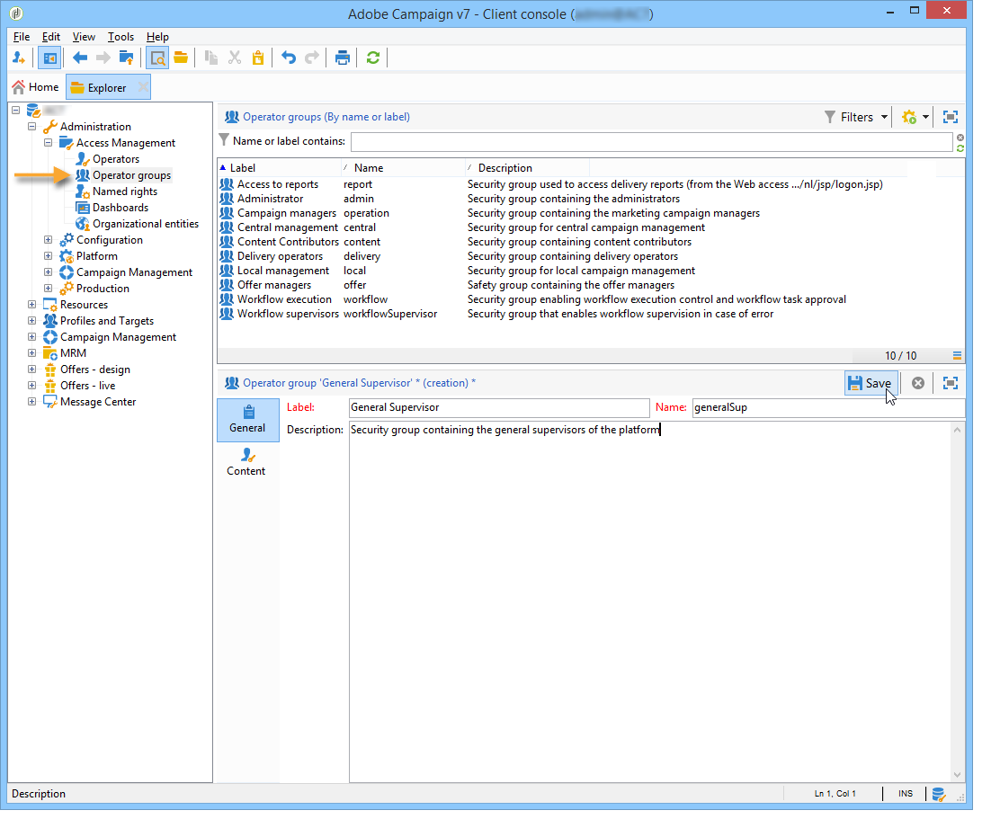

# 访问管理{#access-management}

## 关于权限{#about-permissions}

Adobe Campaign允许您定义和管理分配给各种运算符的权限。 这些权利和限制授权或拒绝：

* 访问某些功能(通过已命名权限),
* 访问某些记录，
* 创建、修改和/或删除记录(操作、联系人、活动、组等)。

权限适用于操作员用户档案或操作员组。

这些安全参数通过链接到操作员与Adobe Campaign的连接模式来完成。 有关详细信息，请参见[此页面](../../installation/using/configuring-campaign-server.md#defining-security-zones)。

有两种类型的权限可以授予用户：

* 您可以定义对其赋予权限的操作员组，然后将运算符与一个或多个组关联。 这使您能够重复使用权限并使运营商用户档案更加一致。 它还方便了用户档案的管理和维护。 组创建和管理显示在[运算符组](#operator-groups)中。
* 您可以将已命名权限直接归因给用户，在某些情况下，这会使通过组分配的权限过载。 这些权利在[已命名权限](#named-rights)中显示。

>[!NOTE]
>
>在开始定义权限之前，Adobe建议您阅读[安全配置清单](https://helpx.adobe.com/cn/campaign/kb/acc-security.html)。

## 运算符 {#operators}

### 关于运算符{#about-operators}

操作员是具有登录和执行操作权限的Adobe Campaign用户。

默认情况下，运算符存储在&#x200B;**[!UICONTROL Administration > Access management > Operators]**&#x200B;节点中。

可以手动创建运算符，也可以在现有LDAP目录上映射运算符。

有关创建运算符的完整过程，请参阅[此页](#creating-an-operator)。

有关Adobe Campaign和LDAP集成的详细信息，请参阅[此页](../../installation/using/connecting-through-ldap.md)。

>[!IMPORTANT]
>
>要登录到实例，操作符需要链接到安全区域。 有关Adobe Campaign中安全区域的详细信息，请参阅[此页](../../installation/using/configuring-campaign-server.md#defining-security-zones)。

用户还可以使用其Adobe ID直接连接到Adobe Campaign。 有关详细信息，请参见此 [ 页面](../../integrations/using/about-adobe-id.md)。

### 创建运算符{#creating-an-operator}

要创建新操作员并授予权限，请执行以下步骤：

1. 单击位于运算符列表上方的&#x200B;**[!UICONTROL New]**&#x200B;按钮，然后输入新运算符的详细信息。

   

1. 指定用户的&#x200B;**[!UICONTROL Identification parameters]**:其登录名、密码和名称。 操作员将使用登录名和密码登录Adobe Campaign。 用户登录后，可以通过&#x200B;**[!UICONTROL Tools > Change password]**&#x200B;菜单更改其口令。 运营商的电子邮件至关重要，因为它使运营商能够接收通知，例如在处理批准时。

   此部分还允许您将运算符链接到组织实体。 有关详细信息，请参阅[此页](../../campaign/using/about-distributed-marketing.md)。

1. 在&#x200B;**[!UICONTROL Operator access rights]**&#x200B;部分中选择授予操作员的权限。

   要将权限分配给操作员，请单击位于权限列表上方的&#x200B;**[!UICONTROL Add]**&#x200B;按钮，然后从可用组列表中选择一个操作员组:

   

   您还可以选择一个或多个已命名权限(请参阅[已命名权限](#named-rights))。 要执行此操作，请单击&#x200B;**[!UICONTROL Folder]**&#x200B;字段右侧的箭头，然后选择&#x200B;**[!UICONTROL Named rights]**:

   

   选择要分配的组和/或已命名权限，然后单击&#x200B;**[!UICONTROL OK]**&#x200B;进行验证。

1. 单击&#x200B;**[!UICONTROL Ok]**&#x200B;以创建运算符：用户档案将添加到现有运算符的列表中。

   

>[!NOTE]
>
>您可以根据您的要求，通过创建新的操作员文件夹来组织操作员。 要执行此操作，请右键单击操作符文件夹，然后选择&#x200B;**[!UICONTROL Add an 'Operators' folder]**。

创建操作员的用户档案后，您可以添加或更新其信息。 要执行此操作，请单击&#x200B;**[!UICONTROL Edit]**&#x200B;选项卡。

>[!NOTE]
>
>通过&#x200B;**[!UICONTROL Session timeout]**&#x200B;字段，可以调整联合数据访问会话超时之前的延迟。 有关详细信息，请参阅[关于联合数据访问](../../installation/using/about-fda.md)。

### 运算符{#time-zone-of-the-operator}的时区

在&#x200B;**[!UICONTROL General]**&#x200B;选项卡中，可以选择运算符的时区。 默认情况下，运算符在服务器时区中工作。 但是，可以使用下拉列表选择其他时区。

有关时区的配置，请参见[此页](../../installation/using/time-zone-management.md)。

>[!NOTE]
>
>不同时区内的协作需要存储UTC中的日期。 日期将在以下上下文的适当时区转换：在用户时区中显示日期时，在导入和导出文件时，在计划电子邮件投放时，在工作流中计划活动时(调度程序、等待、时间约束等)
>
>与这些上下文相关的限制和建议见Adobe Campaign文件的相关章节。

此外，**[!UICONTROL Regional settings]**&#x200B;下拉列表允许您选择显示日期和数字的格式。

### 访问权限选项{#access-rights-options}

使用&#x200B;**[!UICONTROL Access rights]**&#x200B;选项卡可更新链接到运算符的组和已命名权限。

**[!UICONTROL Edit the access parameters...]**&#x200B;链接允许您访问以下选项：

* 使用&#x200B;**[!UICONTROL Disable account]**&#x200B;选项可以禁用运算符的帐户：他不再能接触Adobe Campaign。

   >[!NOTE]
   >
   >即使禁用了该帐户，操作员仍可以接收来自活动的警报或通知。 要停止向此操作员发送活动通知，Adobe建议您从其用户档案中删除电子邮件地址。

* 通过&#x200B;**[!UICONTROL Forbid access from the rich client]**&#x200B;选项，可将Adobe Campaign的使用限制为[Web访问](../../platform/using/adobe-campaign-workspace.md#console-and-web-access)或通过API:访问Adobe Campaign客户端控制台不再可用。
* 可以将安全区与操作员链接。 有关详细信息，请参见[此页面](../../installation/using/configuring-campaign-server.md#defining-security-zones)。
* 您还可以使用相应的链接定义可信IP掩码。

   如果Adobe Campaign的IP地址在此列表中，则操作员将能够连接到，而无需输入密码。

   您还可以指定一组IP地址，这些地址将授权在不使用口令的情况下进行连接，如以下示例中所示：

   

   >[!NOTE]
   >
   >要保证对平台的安全访问，必须谨慎使用此选项。

* 通过&#x200B;**[!UICONTROL Restrict to information found in sub-folders of:]**&#x200B;选项，可限制属于文件夹运算符的权限。 用户只能看到此选项中指定的节点的子文件夹：

   

   >[!IMPORTANT]
   >
   >这是非常严格的限制，必须谨慎使用。 使用此类权限登录的运算符只能查看指定文件夹的内容，并且无法通过资源管理器访问树的任何其他节点。 但是，具体取决于他可以访问的功能(例如：工作流)，他可以显示通常存储在他看不到的节点中的数据。

### 操作员{#folders--approval-and-tasks-of-an-operator}的文件夹、批准和任务

使用&#x200B;**[!UICONTROL Audit]**&#x200B;选项卡可以视图与操作符相关的信息。 根据操作员干预区域中定义的设置自动添加各种选项卡。

您可以访问：

* 列表与操作员链接的文件夹的权限。

   

   >[!NOTE]
   >
   >有关详细信息，请参阅[文件夹访问管理](#folder-access-management)。

* 操作员批准日志。

   

* 他们订阅的论坛的列表。
* 事件。
* 分配给他们的任务的列表。

### 默认运算符{#default-operators}

Adobe Campaign使用技术操作符并配置默认用户档案:管理员（“管理员”）、帐单（“帐单”）、监控、Web 应用程序代理(“webapp”)等 其中一些取决于平台上安装的应用程序和选项：例如，“central”和“local”运算符仅在安装了“分布式营销”选项时才可见。

>[!IMPORTANT]
>
>默认情况下，当平台返回信息消息时，会通知这些技术运营商。 我们强烈建议为他们提供联系电子邮件。
>
>为确保Web 应用程序正确运行，我们还建议不为“webapp”运算符定义特定区域设置。

默认情况下，“webapp”技术运营商具有命名的ADMINISTRATION权限，这会导致安全风险。 要解决此问题，建议删除此权限。 操作步骤：

1. 在&#x200B;**[!UICONTROL Administration > Access management > Named rights]**&#x200B;节点中，单击&#x200B;**[!UICONTROL New]**&#x200B;创建一个右侧，并将其命名为WEBAPP。

   

   已命名权限详见[已命名权限](#named-rights)部分。

1. 从&#x200B;**[!UICONTROL Administration > Access management > Operators]**&#x200B;节点中，选择Web 应用程序代理运算符(“webapp”)。

   选择&#x200B;**[!UICONTROL Edit]**&#x200B;选项卡，然后选择&#x200B;**[!UICONTROL Access rights]**&#x200B;选项卡，并从列表中删除名为right的ADMINISTRATION。

   

   单击&#x200B;**[!UICONTROL Add]**，选择刚刚创建的WEBAPP，然后保存更改。

   

1. 为与此操作符(主要是“收件人”文件夹)相关的文件夹分配“webapp”操作符读取和写入数据访问权限。

   

   [文件夹访问管理](#folder-access-management)部分详细介绍了修改树状文件夹的权限。

>[!NOTE]
>
>有关安全指南的详细信息，请参阅[Adobe Campaign安全配置清单](https://helpx.adobe.com/campaign/kb/acc-security.html)。

## 运算符组{#operator-groups}

通过树中的&#x200B;**[!UICONTROL Administration > Access management > Operator groups]**&#x200B;节点创建操作符组。

### 创建新的运算符组{#creating-a-new-operator-group}

要创建新的运算符组，请应用以下步骤：

1. 单击组列表右侧的&#x200B;**[!UICONTROL New]**&#x200B;按钮或右键单击列表并选择&#x200B;**[!UICONTROL New]**。
1. 在下面窗口部分的&#x200B;**[!UICONTROL General]**&#x200B;选项卡中，在相应的字段中输入该组的名称和说明。

   

1. 单击&#x200B;**[!UICONTROL Content]**&#x200B;选项卡以定义此组的授权。
1. 单击&#x200B;**[!UICONTROL Add]**&#x200B;按钮以选择指定的右侧或要与组关联的运算符。
1. 单击下拉列表或&#x200B;**[!UICONTROL Folder]**&#x200B;字段右侧的文件夹，以找到要与此组关联的指定权限或运算符。
1. 选择要添加的权限或运算符，然后单击&#x200B;**[!UICONTROL OK]**&#x200B;进行验证。

   

   重复此操作以添加其他权限或运算符。

1. 单击&#x200B;**[!UICONTROL Save]**&#x200B;按钮将组添加到列表。

### 默认组{#default-groups}

默认运算符组为：

1. **[!UICONTROL Administrator]**

   此组中的运算符对实例具有完全访问权限。 管理员是可以访问界面中技术最强的部分的用户。 他们担任&#x200B;**[!UICONTROL Administration]**&#x200B;角色并确保平台已全部设置。

   此组包含以下命名权：

   * **[!UICONTROL ADMINISTRATION]**:执行/创建/编辑/删除任何对象(如工作流、投放、脚本等)的权利。

1. **[!UICONTROL Delivery operators]**

   此组中的运营商负责管理投放:它们允许访问创建和准备投放(活动类型、投放映射、默认模板、个性化块等)所需的主要资源。

   此组包含以下已命名权限:

   * **[!UICONTROL PREPARE DELIVERIES]**:创建、编辑和开始投放分析,
   * **[!UICONTROL START DELIVERIES]**:批准之前分析的投放。

1. **[!UICONTROL Campaign managers]**

   此组中的操作员可以管理营销活动:它允许您访问链接到活动(计划、项目、工作流、预算等)的对象 在&#x200B;**[!UICONTROL Campaign]**(可选Adobe Campaign模块)的框架中。

   此组包含以下已命名权限:

   * **[!UICONTROL INSERT FOLDERS]**:将文件夹插入Adobe Campaign树的权利（前提是您对相关分支拥有编辑权限），
   * **[!UICONTROL WORKFLOW]**:使用工作流。

   >[!NOTE]
   >
   >此组不允许运算符开始投放。

1. **[!UICONTROL Content contributors]**

   此组中的运算符可以访问&#x200B;**[!UICONTROL Content management]**(可选Adobe Campaign模块)框架中的“内容”文件夹。 此组不授予任何额外权利。

1. **[!UICONTROL Access to reports]**

   此组保留给外部操作员，以便通过Web访问访问访问投放报告。

1. **[!UICONTROL Workflow execution]**

   通过此组，您可以分配操作员管理与工作流无关的活动的权利。

1. **[!UICONTROL Workflow supervisors]**

   此组中的运算符会收到电子邮件通知，以防出现与活动工作流有关的警报。

1. 本地/中央管理

   这些组允许您使用&#x200B;**[!UICONTROL Distributed marketing]**(可选Adobe Campaign模块)。

1. **[!UICONTROL Offer managers]**

   此组中的运算符可以创建和维护优惠。 有关此的详细信息，请参阅此[页](../../interaction/using/operator-profiles.md)。
此组包含以下已命名权限:

   * **[!UICONTROL INSERT FOLDERS]**:将文件夹插入Adobe Campaign树的权利（前提是您对相关分支具有编辑权限），
   * **[!UICONTROL EDIT FOLDERS]**:有权更改文件夹属性，如内部名称、标签、关联图像、子文件夹顺序等。

## 已命名权限{#named-rights}

默认情况下，Adobe Campaign建议使用一组已命名权限来定义分配给运算符和操作员组的授权。 可以从树的&#x200B;**[!UICONTROL Administration > Access management > Named rights]**&#x200B;节点编辑这些权限。

这些权利如下：

* **[!UICONTROL ADMINISTRATION]**:对实例具有 **[!UICONTROL ADMINISTRATION]** 完全访问权限的运算符。管理员用户可以执行/创建/编辑/删除任何对象，如工作流、投放、脚本等。

* **[!UICONTROL APPROVAL ADMINISTRATION]**:您可以在工作流和投放中设置多个批准步骤，以确保当前状态已经由指定的操作员或组批准。具有&#x200B;**[!UICONTROL APPROVAL ADMINISTRATION]**&#x200B;权限的用户可以设置批准步骤，还可以分配应批准这些步骤的操作员或操作员组。

* **[!UICONTROL CENTRAL]**:中央管理权(分布式营销)。

* **[!UICONTROL DELETE FOLDER]**:删除文件夹的权利。通过此权限，用户可以从资源管理器视图中删除文件夹。

* **[!UICONTROL EDIT FOLDERS]**:有权更改文件夹属性，如内部名称、标签、关联图像、子文件夹顺序等。

* **[!UICONTROL EXPORT]**:用户可以使用工作流Adobe Campaign将其活动实例中的数据导出到服务器或本地计算机上的 **[!UICONTROL EXPORT]** 文件中。

* **[!UICONTROL FILES ACCESS]**:有权通过脚本对文件进行读和写访问，该脚本可以写入工作流 **[!UICONTROL JavaScript]** 活动，以在服务器上读/写文件。

* **[!UICONTROL IMPORT]**:通用数据导入的权利。**[!UICONTROL IMPORT]** 允许您将数据导入任何其他表，而 **[!UICONTROL RECIPIENT IMPORT]** 右侧仅允许导入到收件人表。

* **[!UICONTROL INSERT FOLDERS]**:右键插入文件夹。具有&#x200B;**[!UICONTROL INSERT FOLDERS]**&#x200B;权限的用户可以在资源管理器视图的文件夹树中创建新文件夹。

* **[!UICONTROL LOCAL]**:本地管理(分布式营销)权。

* **[!UICONTROL MERGE]**:将选定记录合并为一个的权利。如果收件人作为重复存在，则右侧的&#x200B;**[!UICONTROL MERGE]**&#x200B;允许用户选择重复并将其合并到主收件人。

* **[!UICONTROL PREPARE DELIVERIES]**:创建、编辑和保存投放的权利。具有&#x200B;**[!UICONTROL PREPARE DELIVERIES]**&#x200B;权限的用户还可以开始投放分析进程。

* **[!UICONTROL PRIVACY DATA RIGHT]**:收集和删除隐私数据的权利。有关详细信息，请参见此 [ 页面](https://helpx.adobe.com/cn/campaign/kb/acc-privacy.html)。

* **[!UICONTROL PROGRAM EXECUTION]**:使用各种编程语言执行命令的权利。

* **[!UICONTROL RECIPIENT IMPORT]**:有权导入收件人。具有&#x200B;**[!UICONTROL RECIPIENT IMPORT]**&#x200B;权限的用户可以将本地文件导入收件人表。

* **[!UICONTROL SQL SCRIPT EXECUTION]** 直接在数据库上执行任何SQL命令的权利。

* **[!UICONTROL START DELIVERIES]**:有权批准先前分析的投放。在投放分析后，投放将在各个批准步骤中暂停，并需要获得批准才能继续。 具有&#x200B;**[!UICONTROL START DELIVERIES]**&#x200B;权限的用户可以批准投放。

* **[!UICONTROL USE SQL DATA MANAGEMENT ACTIVITY]**:使用SQL数据管理活动编写您自己的SQL脚本，以便创建和填充工作表(请参 [阅本节](../../workflow/using/sql-data-management.md))。

* **[!UICONTROL WORKFLOW]**:执行工作流的权利。没有此权限，用户将无法开始、停止或重新启动工作流。

* **[!UICONTROL WEBAPP]**:使用Web应用程序的权利。

>[!NOTE]
>
>此列表可能因平台上安装的加载项而异。

## 访问权限矩阵{#access-rights-matrix}

默认组和已命名权限允许操作员访问导航层次结构中的特定文件夹，并授予读取、写入和删除权限。

Adobe Campaign访问权限矩阵可在[此处](/help/platform/using/assets/access-rights-matrix.pdf)获得。

## 文件夹访问管理{#folder-access-management}

树的每个文件夹都有附加到它的读取、写入和删除访问权限。 要访问文件，运算符或操作员组必须至少具有对文件的读访问权限。

### 编辑文件夹{#edit-permissions-on-a-folder}上的权限

要编辑树中特定文件夹的权限，请执行以下步骤：

1. 右键单击文件夹，然后选择&#x200B;**[!UICONTROL Properties...]**。

   

1. 单击&#x200B;**[!UICONTROL Security]**&#x200B;选项卡，以视图此文件夹中的授权。

   

### 修改权限{#modify-permissions}

要修改权限，您可以：

* **替换组或运算符**。要执行此操作，请单击对文件夹具有权限的组（或运算符）之一，然后从下拉列表中选择新组（或新运算符）：

   

* **授权组或运营商**。要执行此操作，请单击&#x200B;**[!UICONTROL Add]**&#x200B;按钮并选择要为此文件夹分配授权的组或运算符。
* **禁止组或运营商**。要执行此操作，请单击&#x200B;**[!UICONTROL Delete]**&#x200B;并选择要从中删除此文件夹授权的组或运算符。
* **选择分配给组或运算符的权限**。要执行此操作，请单击相关组或运算符，然后选择要授予的访问权限并取消选择其他访问权限。

   

### 传播权限{#propagate-permissions}

您可以传播授权和访问权限。 为此，请在文件夹属性中选择&#x200B;**[!UICONTROL Propagate]**&#x200B;选项。

然后，此窗口中定义的授权将应用于当前节点的所有子文件夹。 然后，您可以为每个子文件夹重载这些授权。

>[!NOTE]
>
>清除文件夹的此选项不会自动清除子文件夹的此选项。 必须为每个子文件夹显式清除它。

### 授予对所有运算符{#grant-access-to-all-operators}的访问权限

在&#x200B;**[!UICONTROL Security]**&#x200B;选项卡中，如果选择&#x200B;**[!UICONTROL System folder]**&#x200B;选项，则所有运算符都将有权访问此数据，而不管其权限如何。 如果清除此选项，则必须将运算符（或其组）显式添加到授权列表中，以便它们能够访问。

## 文件夹和视图{#folders-and-views}

### 关于文件夹{#about-folders}

文件夹是Adobe Campaign树中的节点。 通过右键单击树，通过&#x200B;**[!UICONTROL Add new folder]**&#x200B;菜单创建这些节点。 默认情况下，第一个菜单允许您添加与当前上下文对应的文件夹。

您可以像在树的所有其他文件夹中一样，为这些文件夹授予权限。 请参阅[文件夹访问管理](#folder-access-management)。

### 关于视图{#about-views}

此外，您还可以创建视图，以限制对数据的访问，并组织树的内容以满足您的要求。 然后，您可以为视图分配权限。

视图是一个文件夹，它显示物理存储在同一类型的一个或多个其他文件夹中的记录。 例如，如果您创建一个活动文件夹，它默认显示视图库中存在的所有活动，无论其来源如何。 然后可以过滤此数据。

将文件夹转换为视图时，视图中将显示与数据库中现有的文件夹类型对应的所有数据，而与保存该文件夹的文件夹无关。 然后，您可以对其进行筛选，以限制显示数据的列表。

>[!IMPORTANT]
>
>视图包含数据并提供对它的访问，但数据不实际存储在视图文件夹中。 操作员必须对数据源文件夹中所需的操作（至少读取访问权限）拥有适当的权限。
>
>要在不授予对视图源文件夹访问权限的情况下授予对该文件夹的访问权限，只需不授予对源文件夹的父节点的读取访问权限。

要区分视图和文件夹，每个视图的名称以不同的颜色（深青色）显示。

### 添加文件夹并创建视图{#adding-folders-and-creating-views}

在以下示例中，我们将创建新文件夹以显示特定数据：

1. 新建一个&#x200B;**[!UICONTROL Deliveries]**&#x200B;类型文件夹，并将其命名为&#x200B;**投放France**。
1. 右键单击此文件夹并选择&#x200B;**[!UICONTROL Properties...]**。

   

1. 在 **[!UICONTROL Restriction]** 选项卡中，选择 **[!UICONTROL This folder is a view]**。随后将显示数据库中的所有投放。

   

1. 从窗口中间部分的投放编辑器中定义查询过滤条件：随后将显示与定义的过滤器对应的活动。

   >[!NOTE]
   >
   >查询编辑器显示在[本节](../../platform/using/about-queries-in-campaign.md)中。

   具有以下筛选条件：

视图中将显示以下投放:

>[!NOTE]
>
>在管理[事务消息](../../message-center/using/about-transactional-messaging.md)事件时，不能将&#x200B;**[!UICONTROL Real time events]**&#x200B;或&#x200B;**[!UICONTROL Batch events]**&#x200B;文件夹设置为执行实例上的视图，因为这可能导致访问权限问题。 有关事件集合的详细信息，请参阅[此部分](../../message-center/using/event-collection.md)。