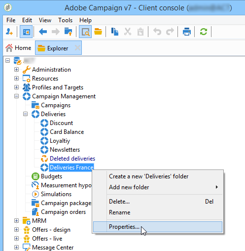

# 访问管理{#access-management}

## 关于权限 {#about-permissions}

Adobe Campaign允许您定义和管理分配给各个运算符的权限。 这些权限和限制是授权或拒绝的：

* 访问某些功能(通过已命名权限),
* 访问某些记录，
* 创建、修改和／或删除记录(操作、联系人、活动、组等)。

这些权限适用于运营商用户档案或运营商组。

这些安全参数由与操作员与Adobe Campaign的连接模式相链接的安全参数完成。 有关详细信息，请参见[此页面](../../installation/using/configuring-campaign-server.md#defining-security-zones)。

有两种类型的权限可授予用户：

* 您可以定义对其赋予权限的操作员组，然后将运算符与一个或多个组关联。 这使您能够重复使用权限并使运营商用户档案更加一致。 也方便了用户档案的管理和维护。 组创建和管理显示在操作员 [组中](#operator-groups)。
* 您可以将已命名权限直接归因给用户，在某些情况下，这会使通过组分配的权限过载。 这些权利以 [已命名权限呈列](#named-rights)。

>[!NOTE]
>
>在开始定义权限之前，Adobe建议您阅读安 [全配置清单](https://docs.campaign.adobe.com/doc/AC/getting_started/EN/security.html)。

## 运算符 {#operators}

### 关于运算符 {#about-operators}

操作员是具有登录和执行操作权限的Adobe Campaign用户。

默认情况下，操作符存储在节 **[!UICONTROL Administration > Access management > Operators]** 点中。

可以手动创建操作符，也可以将操作符映射到现有LDAP目录。

有关创建操作符的完整过程，请参阅 [本页](#creating-an-operator)。

有关Adobe Campaign和LDAP集成的详细信息，请参阅 [本页](../../installation/using/connecting-through-ldap.md)。

>[!CAUTION]
>
>操作员需要链接到安全区域才能登录到实例。 有关Adobe Campaign中安全区的详细信息，请参阅 [本页](../../installation/using/configuring-campaign-server.md#defining-security-zones)。

用户还可以使用其Adobe ID直接连接到Adobe Campaign。 For more on this, refer to this [page](../../integrations/using/about-adobe-id.md).

### 创建运算符 {#creating-an-operator}

要创建新的运算符并授予权限，请执行以下步骤：

1. 单击位 **[!UICONTROL New]** 于运算符列表上方的按钮，然后输入新运算符的详细信息。

   

1. 指定用 **[!UICONTROL Identification parameters]** 户的权限：其登录名、密码和名称。 操作员将使用登录名和密码登录Adobe Campaign。 用户登录后，可以通过菜单更改其密 **[!UICONTROL Tools > Change password]** 码。 运营商的电子邮件是必不可少的，因为它使运营商能够接收通知，例如在处理批准时。

   此部分还允许您将操作符链接到组织实体。 For more on this, refer to the [this page](../../campaign/using/about-distributed-marketing.md).

1. 在部分中选择授予操作员的权 **[!UICONTROL Operator access rights]** 限。

   要向操作员分配权限，请单击位 **[!UICONTROL Add]** 于权限列表上方的按钮，然后从可用组列表中选择一个操作员组:

   

   您还可以选择一个或多个已命名权限(请参阅 [已命名权限](#named-rights))。 要执行此操作，请单击字段右侧的箭头， **[!UICONTROL Folder]** 然后选择 **[!UICONTROL Named rights]**:

   

   选择要分配的组和／或已命名权限，然后单击以 **[!UICONTROL OK]** 进行验证。

1. 单击 **[!UICONTROL Ok]** 以创建运算符：该用户档案是在现有运营商的列表中加入的。

   

>[!NOTE]
>
>您可以根据自己的要求，通过创建新的操作员文件夹来组织操作员。 为此，请右键单击操作符文件夹，然后选择 **[!UICONTROL Add an 'Operators' folder]**。

创建操作员的用户档案后，您可以添加或更新其信息。 要执行此操作，请单击选 **[!UICONTROL Edit]** 项卡。

>[!NOTE]
>
>该字 **[!UICONTROL Session timeout]** 段允许您调整联合数据访问会话超时之前的延迟。 有关此问题的详细信息，请参阅 [关于联合数据访问](../../platform/using/about-fda.md)。

### 操作员的时区 {#time-zone-of-the-operator}

在选 **[!UICONTROL General]** 项卡中，您可以选择操作符的时区。 默认情况下，操作符在服务器时区中工作。 但是，可以使用下拉列表选择其他时区。

本页介绍了时区的 [配置](../../installation/using/time-zone-management.md)。

>[!NOTE]
>
>不同时区内的协作需要存储UTC的日期。 日期在以下上下文的相应时区中转换：在用户时区中显示日期时，在导入和导出文件时，在计划电子邮件投放时，在工作流(调度程序、等待、时间约束等)中计划活动时
>
>与这些上下文相关的限制和建议见Adobe Campaign文档的相关章节。

此外，通过下 **[!UICONTROL Regional settings]** 拉列表，您可以选择显示日期和数字的格式。

### 访问权限选项 {#access-rights-options}

使用选 **[!UICONTROL Access rights]** 项卡可更新链接到运算符的组和已命名权限。

The **[!UICONTROL Edit the access parameters...]** link lets you access the following options:

* 通过 **[!UICONTROL Disable account]** 此选项可禁用操作员的帐户：他不会再去Adobe Campaign。
* 通过 **[!UICONTROL Forbid access from the rich client]** 此选项，可限制对Web访问或通 [过API使用](../../platform/using/adobe-campaign-workspace.md#console-and-web-access) “Adobe Campaign”:对Adobe Campaign客户端控制台的访问不再可用。
* 可以将安全区与操作员连接。 有关详细信息，请参见[此页面](../../installation/using/configuring-campaign-server.md#defining-security-zones)。
* 您还可以使用相应的链接定义可信的IP掩码。

   如果运营商的IP地址在此Adobe Campaign中，则该运营商将能够连接到列表，而无需输入口令。

   您还可以指定一组IP地址，这些地址将在不使用口令的情况下授权连接，如以下示例中所示：

   

   >[!NOTE]
   >
   >要保持对平台的安全访问，必须谨慎使用此选项。

* 通过 **[!UICONTROL Restrict to information found in sub-folders of:]** 此选项，可以限制属于文件夹操作符的权限。 用户只能看到此选项中指定的节点的子文件夹：

   

   >[!CAUTION]
   >
   >这是一个非常严格的限制，必须谨慎使用。 使用此类权限登录的操作员只能查看指定文件夹的内容，并且无法通过资源管理器访问树的任何其他节点。 但是，根据他有权访问的功能(例如：工作流)，他可以显示通常存储在他看不到的节点中的数据。

### 运营商的文件夹、批准和任务 {#folders--approval-and-tasks-of-an-operator}

该选 **[!UICONTROL Audit]** 项卡允许您视图与操作符相关的信息。 根据操作员的干预区域中定义的设置自动添加各种选项卡。

您可以访问：

* 列表与操作员链接的文件夹的权限。

   

   >[!NOTE]
   >
   >有关详细信息，请参阅文 [件夹访问管理](#folder-access-management)。

* 操作员批准日志。

   

* 列表他们订阅的论坛。
* 事件。
* 分配给他们的任务的列表。

### 默认运算符 {#default-operators}

Adobe Campaign使用技术运营商，默认配置用户档案:管理员（“管理员”）、计费（“计费”）、监控、Web 应用程序代理(“webapp”)等。 其中一些取决于平台上安装的应用程序和选项：例如，“central”和“local”运算符只有在安装了分布式营销选项时才可见。

>[!CAUTION]
>
>默认情况下，当平台返回信息消息时，这些技术运营商会收到通知。 我们强烈建议为他们提供联系电子邮件。
>
>为确保Web 应用程序正确运行，我们还建议不为“webapp”运算符定义特定的区域设置。

默认情况下，“webapp”技术运营商的名称为“管理权”，这会导致安全风险。 要解决此问题，建议删除此权限。 操作步骤：

1. 从节 **[!UICONTROL Administration > Access management > Named rights]** 点中，单 **[!UICONTROL New]** 击以创建右侧并将其命名为WEBAPP。

   

   已命名权限详见 [已命名权限](#named-rights) 。

1. 从节 **[!UICONTROL Administration > Access management > Operators]** 点中，选择Web 应用程序代理运算符(“webapp”)。

   选择选 **[!UICONTROL Edit]** 项卡，然后选 **[!UICONTROL Access rights]** 择选项卡，并从列表中删除名为ADMINISTRATION的管理。

   

   单 **[!UICONTROL Add]** 击并选择刚刚创建的WEB应用程序，然后保存更改。

   

1. 为与此操作员相关的文件夹(主要是“收件人”文件夹)分配“webapp”操作员的读写数据访问权限。

   

   有关修改树文件夹权限的详细信息，请参阅“文件 [夹访问管理](#folder-access-management) ”部分。

>[!NOTE]
>
>有关安全准则的详细信息，请参阅 [Adobe Campaign安全配置清单](https://docs.campaign.adobe.com/doc/AC/getting_started/EN/security.html)。

## 运算符组 {#operator-groups}

操作符组通过树中 **[!UICONTROL Administration > Access management > Operator groups]** 的节点创建。

### 创建新的运算符组 {#creating-a-new-operator-group}

要创建新的运算符组，请应用以下步骤：

1. 单击 **[!UICONTROL New]** 组列表右侧的按钮，或右键单击列表并选择 **[!UICONTROL New]**。
1. 在下面部分的窗口中，从 **[!UICONTROL General]** 选项卡的相应字段中输入该组的名称和说明。

   

1. 单击选 **[!UICONTROL Content]** 项卡可定义此组的授权。
1. 单击按 **[!UICONTROL Add]** 钮以选择指定的右侧或要关联到组的运算符。
1. 单击下拉列表或字段右侧的文件夹，以找到要关联到此组的 **[!UICONTROL Folder]** 指定权限或操作符。
1. 选择要添加的权限或操作符，然后单击以 **[!UICONTROL OK]** 进行验证。

   

   重复此操作以添加其他权限或操作符。

1. 单击 **[!UICONTROL Save]** 按钮将组添加到列表。

### 默认用户组 {#default-groups}

默认的运算符组为：

1. 投放运营商

   此组中的运营商负责管理投放:它们允许访问创建和准备投放(活动类型、投放映射、默认模板、个性化块等)所需的主要资源。

   此组包含以下已命名权限:

   * 准备投放:创建、编辑和开始投放分析,
   * 开始投放:批准先前分析的投放。

1. 活动经理

   此组中的运营商可以管理营销活动:它允许您访问链接到活动(计划、项目、工作流、预算等)的对象。

   此组包含以下已命名权限:

   * 插入文件夹：将文件夹插入Adobe Campaign树的权利（前提是您对相关分支具有编辑权限）,
   * 工作流：使用工作流。
   >[!NOTE]
   >
   >此组不允许运营商开始投放。

1. 内容参与者

   此组中的操作符可以访问“内容”文件夹，在 **内容管理框架** (可选Adobe Campaign模块)中。 此组不授予任何附加权利。

1. 访问报告

   此组保留给外部操作员，以便通过Web访问访问访问投放报告。

1. 工作流执行

   通过此组，您可以分配操作员管理与工作流无关的活动的权利。

1. 工作流监督者

   如果出现与活动工作流相关的警报，此组中的操作员将收到电子邮件通知。

1. 本地／中央管理

   这些组允许您使用分 **布式营销** (可选Adobe Campaign模块)。

## 已命名权限 {#named-rights}

默认情况下，Adobe Campaign建议使用一组已命名权限来定义分配给操作符和操作员组的授权。 可以从树的节点中编 **[!UICONTROL Administration > Access management > Named rights]** 辑这些权限。

这些权利如下：

* **[!UICONTROL ADMINISTRATION]**:具有权限 **[!UICONTROL ADMINISTRATION]** 的操作符对实例具有完全访问权限。 管理员用户可以执行／创建／编辑／删除任何对象，如工作流、投放、脚本等。

* **[!UICONTROL APPROVAL ADMINISTRATION]**:您可以在工作流和投放中设置多个批准步骤，以确保当前状态已经由指定的操作员或组批准。 具有权限的 **[!UICONTROL APPROVAL ADMINISTRATION]** 用户可以设置批准步骤，还可以分配应批准这些步骤的操作员或操作员组。

* **[!UICONTROL CENTRAL]**:中央管理(分布式营销)权。

* **[!UICONTROL DELETE FOLDER]**:删除文件夹的权限。 通过此权限，用户可以从资源管理器视图中删除文件夹。

* **[!UICONTROL EDIT FOLDERS]**:有权更改文件夹属性，如内部名称、标签、关联图像、子文件夹顺序等。

* **[!UICONTROL EXPORT]**:用户可以使用工作流Adobe Campaign将数据从其活动实例导出到服务器或本地计算机上的 **[!UICONTROL EXPORT]** 文件中。

* **[!UICONTROL FILES ACCESS]**:有权通过脚本对文件进行读写访问，该脚本可以写入工作流活动中，以在服 **[!UICONTROL JavaScript]** 务器上读／写文件。

* **[!UICONTROL IMPORT]**:通用数据导入权限。 **[!UICONTROL IMPORT]** 允许您将数据导入任何其他表，而 **[!UICONTROL RECIPIENT IMPORT]** 右侧仅允许导入到收件人表。

* **[!UICONTROL INSERT FOLDERS]**:插入文件夹的权限。 具有右边的 **[!UICONTROL INSERT FOLDERS]** 用户可以在资源管理器视图的文件夹树中创建新文件夹。

* **[!UICONTROL LOCAL]**:本地管理权(分布式营销)。

* **[!UICONTROL MERGE]**:将选定记录合并为一个记录的右侧。 如果收件人作为重复存在， **[!UICONTROL MERGE]** 则右侧允许用户选择重复并将其合并到主收件人中。

* **[!UICONTROL PREPARE DELIVERIES]**:创建、编辑和保存投放的权限。 具有权限 **[!UICONTROL PREPARE DELIVERIES]** 的用户还可以开始投放分析过程。

* **[!UICONTROL PRIVACY DATA RIGHT]**:收集和删除隐私数据的权利。 For more on this, refer to this [page](https://helpx.adobe.com/campaign/kb/acc-privacy.html).

* **[!UICONTROL PROGRAM EXECUTION]**:使用各种编程语言执行命令的权利。

* **[!UICONTROL RECIPIENT IMPORT]**:有权导入收件人。 具有权限 **[!UICONTROL RECIPIENT IMPORT]** 的用户可以将本地文件导入到收件人表中。

* **[!UICONTROL SQL SCRIPT EXECUTION]** 直接在数据库上执行任何SQL命令的权限。

* **[!UICONTROL START DELIVERIES]**:批准先前分析的投放的权利。 在投放分析后，投放将在各个批准步骤中暂停，并需要获得批准才能恢复。 有权 **[!UICONTROL START DELIVERIES]** 批准投放的用户。

* **[!UICONTROL USE SQL DATA MANAGEMENT ACTIVITY]**:使用SQL数据管理活动编写自己的SQL脚本，以便创建和填充工作表(请参 [阅本节](../../workflow/using/sql-data-management.md))。

* **[!UICONTROL WORKFLOW]**:执行工作流的权利。 没有此权限，用户将无法开始、停止或重新启动工作流。

* **[!UICONTROL WEBAPP]**:使用Web应用程序的权利。

>[!NOTE]
>
>此列表可能因平台上安装的加载项而异。

## 访问权限矩阵 {#access-rights-matrix}

默认组和已命名权限允许操作员访问导航层次结构中的特定文件夹，并授予读取、写入和删除权限。

Adobe Campaign访问权限表可在此 [处获取](/help/platform/using/assets/accessrights.pdf)。

## 文件夹访问管理 {#folder-access-management}

树的每个文件夹都有其所附加的读取、写入和删除访问权限。 要访问文件，操作员或操作员组必须至少具有对文件的读访问权限。

### 编辑文件夹的权限 {#edit-permissions-on-a-folder}

要编辑树中特定文件夹的权限，请执行以下步骤：

1. 右键单击文件夹并选择 **[!UICONTROL Properties...]**。

   

1. 单击该选 **[!UICONTROL Security]** 项卡可视图此文件夹中的授权。

   

### 修改权限 {#modify-permissions}

要修改权限，您可以：

* **替换组或运算符**。 要执行此操作，请单击对文件夹具有权限的组（或运算符）之一，然后从下拉列表中选择新组（或新运算符）:

   

* **授权组或运营商**。 为此，请单击按 **[!UICONTROL Add]** 钮，然后选择要为此文件夹分配授权的组或运算符。
* **禁止组或运营商**。 要执行此操作，请单 **[!UICONTROL Delete]** 击并选择要从中删除此文件夹授权的组或运算符。
* **选择分配给组或运算符的权限**。 为此，请单击相关的组或运算符，然后选择要授予的访问权限并取消选择其他权限。

   

### 传播权限 {#propagate-permissions}

您可以传播授权和访问权限。 为此，请在文件夹属 **[!UICONTROL Propagate]** 性中选择相应选项。

然后，此窗口中定义的授权将应用于当前节点的所有子文件夹。 然后，您可以为每个子文件夹过载这些授权。

>[!NOTE]
>
>清除文件夹的此选项不会自动清除子文件夹的选项。 必须明确清除每个子文件夹的该属性。

### 授予对所有运营商的访问权限 {#grant-access-to-all-operators}

在选 **[!UICONTROL Security]** 项卡中，如果选 **[!UICONTROL System folder]** 择此选项，则所有操作员都有权访问此数据，而不管其权限如何。 如果清除此选项，则必须将运算符（或其组）显式添加到授权列表中，以便它们能够访问。

## 文件夹和视图 {#folders-and-views}

### 关于文件夹和视图 {#about-folders-and-views}

文件夹是Adobe Campaign树中的节点。 通过菜单右键单击树可创建这些节 **[!UICONTROL Add new folder]** 点。 默认情况下，第一个菜单允许您添加与当前上下文对应的文件夹。

您可以像在树的所有其他文件夹中一样，为这些文件夹授予权限。 请参阅 [文件夹访问管理](#folder-access-management)。

此外，您还可以创建视图，以限制对数据的访问，并组织树的内容以满足您的要求。 然后，您可以为视图分配权限。

视图是一个文件夹，它显示物理上存储在同一类型的一个或多个其他文件夹中的记录。 例如，如果您创建一个活动文件夹作为视图，则默认情况下，该文件夹会显示数据库中存在的所有活动，无论其来源如何。 然后，可以过滤此数据。

将文件夹转换为视图时，与数据库中存在的文件夹类型对应的所有数据都会显示在视图中，而与保存该文件夹的文件夹无关。 然后，您可以对其进行筛选以限制显示的数据列表。

>[!CAUTION]
>
>视图包含数据并提供对它的访问，但数据不实际存储在视图文件夹中。 操作员必须对数据源文件夹中的所需操作（至少读取访问权）拥有相应的权限。
>
>要在不授予对视图源文件夹访问权限的情况下授予对该文件夹的访问权限，只是不授予对源文件夹父节点的读访问权限。

### 添加文件夹和创建视图 {#adding-folders-and-creating-views}

在以下示例中，我们将创建新文件夹以显示特定数据：

1. 创建新的类 **[!UICONTROL Deliveries]** 型文件夹，并将其命名为 **投放France**。
1. 右键单击此文件夹并选择 **[!UICONTROL Properties...]**。

   

1. 在选项卡 **[!UICONTROL Restriction]** 中，选择 **[!UICONTROL This folder is a view]**。 随后将显示数据库中的所有投放。

   

1. 从窗口中部的投放编辑器中定义查询过滤条件：随后将显示与定义的过滤器对应的活动。

   >[!NOTE]
   >
   >查询编辑器显示在 [本节中](../../platform/using/about-queries-in-campaign.md)。

   具有以下过滤条件：

视图中将显示以下投放:

