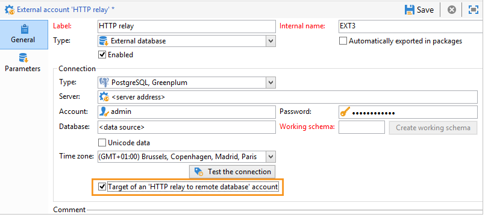
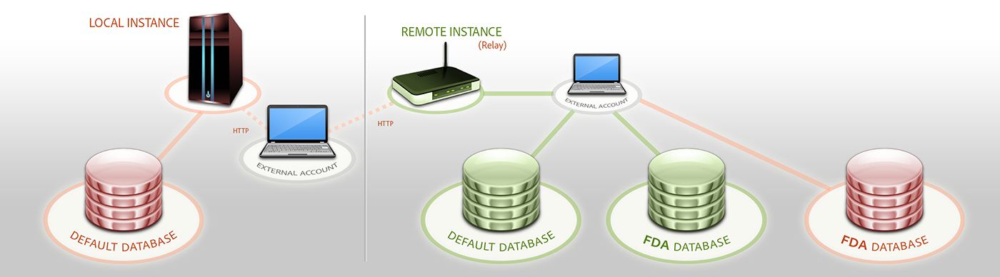

# 其他选项 {#additional-options}

<!--

## HTTP relay to a remote instance {#http-relay-to-a-remote-instance}

You can access external databases configured in remote instances using the HTTP protocol.

>[!NOTE]
>
>Not all SQL data types are supported by this feature. Blob data types are not supported at all. It is possible that other data types may not work depending on the targeted database (Timestamp on Microsoft SQL Server, for example). Please contact Adobe support for more information.

This simplifies transferring and synchronizing data between two instances. It also enables you to sidestep any tunneling between an instance and a remote database as well as the installation of the client layers to access this database. The destination instance can be a hosted instance.

>[!CAUTION]
>
>This option is only for facilitating data replication flows (ETL).   
>
>For example, it allows a cloud-hosted instance to have direct access to the data in an "on-premise" hosted database. However, it is not intended to allow targeting to be carried on an "on-premise" hosted database directly from the cloud.

To do this, you must configure the external accounts of the two instances so that the local instance can communicate with the remote instance using the HTTP protocol:

* Local instance: select the new **[!UICONTROL HTTP relay to a remote database]** connection type.

  In case of bulk load data transfer, also specify the buffer size. Select the compression option if you want to reduce the size of the transferred data.

  The **[!UICONTROL Data source]** must be defined with the following syntax: "nms:extAccount : `<internal_name_of_the_external_account>`"

  

  >[!NOTE]
  >
  >We recommend that you use an HTTPS connection.

* Remote instance: in the FDA external account of the database accessed via the HTTP relay, check the Target of an **[!UICONTROL 'HTTP relay to a remote database' account option]**.

  

The following example shows the new possible operating mode:



>[!CAUTION]
>
>The default database of the remote instance must be accessed via an external account as well.

This operating method avoids that the cleanup workflow of each instance deletes the work tables of the databases that use the instance as relay.

Thus, in the previous example, the cleanup workflow of the remote instance will not perform any action on the red FDA database as it is used by the local instance.

-->

## 直接创建临时模式 {#directly-creating-temporary-schemas}

如果要管理对联合数据访问外部模式库的多次访问，可使用新选项在配置外部帐户时直接创建工作数据。

>[!NOTE]
>
>此选项仅适用于PostgreSQL。


## 利用外部数据优化电子邮件个性化 {#optimizing-email-personalization-with-external-data}

从内部版本8740开始， **[!UICONTROL Prepare the personalization data with a workflow]** 投放属性的选 **[!UICONTROL Analysis]** 项卡中现在提供此选项。

在投放分析期间，此选项自动创建并执行一个工作流，该工作流将链接到目标的所有数据存储在临时表中，包括来自链接到联合数据访问的表的数据。

通过选中此选项，您可以显着提高执行个性化的性能。

## 在工作流中使用来自外部数据库的数据 {#using-data-from-an-external-database-in-a-workflow}

在多个Adobe Campaign工作流活动中，您可以使用存储在外部数据库中的数据。

### 对外部数据进行筛选 {#filtering-on-external-data}

查询活动允许您添加外部数据并在定义的筛选器配置中使用它。

For more on this, refer to the [Query](../../workflow/using/targeting-data.md#selecting-data) section.

### 创建子集 {#creating-sub-sets}

拆分活动允许您创建子集。 您可以使用外部数据来定义要使用的筛选条件。

For more on this, refer to the [Split](../../workflow/using/split.md) section.

### 加载外部数据库 {#loading-external-database}

您可以在数据加载(RDBMS)中使用外部数据。 此活动显示在“数 [据加载](../../workflow/using/data-loading--rdbms-.md) ”部分。

### 添加信息和链接 {#adding-information-and-links}

扩充活动允许您向工作流的工作台添加其他数据，以及向外部表添加链接。 因此，它可以利用外部数据库中的数据。 此活动显示在 [扩充](../../workflow/using/enrichment.md) 部分。
<!--

## Cloud Messaging - FDA synchronization {#cloud-messaging---fda-synchronization}

When the Cloud Messaging server and the Marketing server have not been synchronized for a long period, the volume of missing broadlogs on the Marketing server can be significant. To optimize broadlog synchronization via the FDA, the **NmsMidSourcing_LogsPeriodHour** option has been added. This allows a maximum period (expressed in hours) to be specified as to limit the number of broadlogs recovered every time the synchronization workflow is executed.

The option is to be added in the console, in the **[!UICONTROL Administration > Options]** node.

>[!CAUTION]
>
>This option must **only** be used for synchronizing a significant volume of broadlogs via the FDA.

>[!NOTE]
>
>The option is only taken into account if a last recovery date exists (**NmsMidSourcing_LastBroadLog_&#42;** option).

## Message Center - Read access on the XtkFolder table {#message-center---read-access-on-the-xtkfolder-table}

From build 8141 and above, manual action is necessary if Message Center uses the FDA as an archiving mode.

You need to grant read access on the XtKFolder table to the user linked with the external FDA account.

For a PostgreSQL database for example, the command is as follows:

```
GRANT SELECT ON XtkFolder TO DBUSER;
```

This user must have read access to the following tables:

* NmsBroadLogRtEvent
* NmsBroadLogBatchEvent
* NmsTrackingLogRtEvent
* NmsTrackingLogBatchEvent
* NmsRtEvent
* NmsBatchEvent
* NmsBroadLogMsg
* NmsTrackingUrl
* NmsDelivery
* NmsWebTrackingLog

>[!NOTE]
>
>This modification deletes the "Permission denied for relation xtkfolder" error message.

If the working schema selected in the external FDA account is not the out-of-the-box Neolane account, then this modification to the access rights is not necessary.

-->

