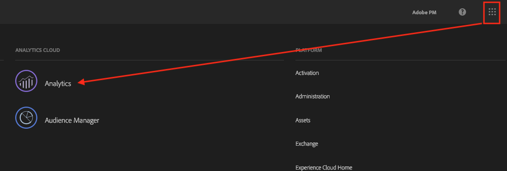
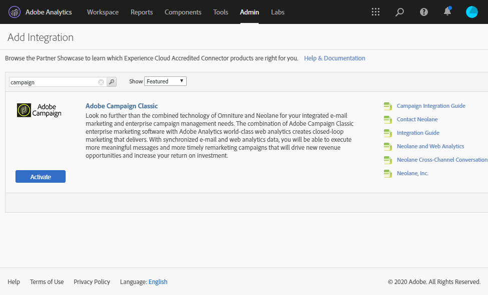
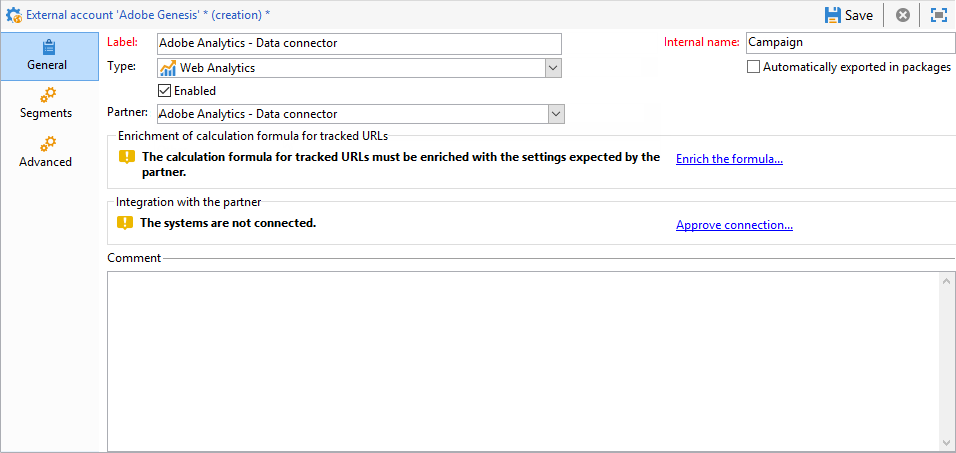
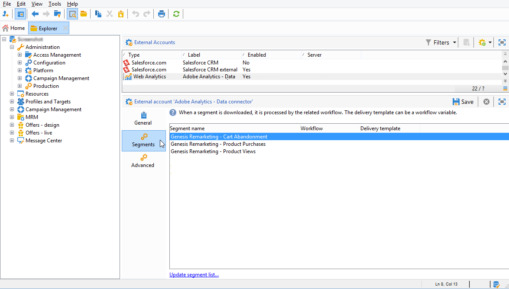

# Adobe Analytics 数据连接器{#adobe-analytics-data-connector-legacy}

>[!IMPORTANT]
>
>Adobe Analytics Data Connector现已弃用。 已弃用的功能仍然可用，但将不会进一步增强或支持这些功能。 在本页](../../rn/using/deprecated-features.md)中了解更多[信息。

## 关于Data Connector集成{#about-data-connector-integration}

>[!IMPORTANT]
>
>Adobe Analytics Data Connector与事务型消息传递（消息中心）不兼容。

Data Connector(以前称为Adobe Genesis)允许Adobe Campaign和Adobe Analytics通过&#x200B;**Web Analytics连接器**&#x200B;包进行交互。 它会以区段形式将数据转发到Adobe Campaign，其中涉及电子邮件促销活动后用户行为。 相反，它会将Adobe Campaign提供的电子邮件促销活动的指标和属性发送到Adobe Analytics - Data connector。

使用Data Connector，Adobe Campaign提供了一种测量Internet受众(Web Analytics)的方法。 借助这些集成，Adobe Campaign可以在营销活动后恢复一个或多个网站的访客行为数据，并（经过分析）运行再营销活动，以便将他们转化为购买者。 相反，Web分析工具使Adobe Campaign能够将指标和促销活动属性转发到其平台。

有关Adobe Analytics与Adobe Campaign集成实施的更多信息，请参阅此[文档](https://helpx.adobe.com/marketing-cloud/how-to/analytics-ac.html)。

每个工具的操作字段如下所示：

* Web分析的角色：

   1. 标记通过Adobe Campaign启动的电子邮件促销活动，
   1. 以区段形式保存收件人在点击促销活动电子邮件后浏览的网站上的行为。 区段涉及放弃的产品（已查看但未添加到购物车或已购买）、购买或购物车放弃。

* Adobe Campaign的角色：

   1. 将指示器和促销活动属性发送到连接器，连接器又将它们转发到Web分析工具，
   1. 恢复和分析区段，
   1. 触发再营销活动。

## 设置集成{#setting-up-the-integration}

要设置Data Connector，您必须连接到Adobe Campaign实例并执行以下操作：

* [步骤1:在Analytics中配置集成](#step-1--configure-integration-in-analytics)
* [步骤2:在Campaign中创建外部帐户](#step-2--create-the-external-account-in-campaign)
* [步骤3:同步Adobe Campaign和Adobe Analytics](#step-3--synchronize-adobe-campaign-and-adobe-analytics)

### 步骤1:在Analytics中配置集成{#step-1--configure-integration-in-analytics}

以下步骤使用向导详细说明Data Connector的配置。

1. 使用Adobe ID或Enterprise ID登录Adobe Experience Cloud。

   

1. 从Experience Cloud解决方案列表中，选择&#x200B;**[!UICONTROL Analytics]**。

   

1. 从&#x200B;**[!UICONTROL Admin]**&#x200B;选项卡中，选择&#x200B;**[!UICONTROL Data Connectors]**。

   您需要具有以下Analytics工具权限才能访问&#x200B;**[!UICONTROL Data Connectors]**&#x200B;菜单。 有关更多信息，请参阅此[页面](https://docs.adobe.com/content/help/en/analytics/admin/admin-console/permissions/analytics-tools.html)
   * 集成（创建）
   * 集成（更新）
   * 集成（删除）

   

1. 从合作伙伴列表中，选择&#x200B;**[!UICONTROL Adobe Campaign Classic]**。

   

1. 在&#x200B;**[!UICONTROL Add integration]**&#x200B;对话框中，单击&#x200B;**[!UICONTROL Activate]**。
1. 选中&#x200B;**[!UICONTROL I accept these terms and conditions]**&#x200B;并选择链接到此集成的&#x200B;**[!UICONTROL Report suite]**&#x200B;并输入连接器标签。

   完成后，单击&#x200B;**[!UICONTROL Create and configure this integration]**。

   

1. 输入将代表连接器接收通知的电子邮件地址，然后复制&#x200B;**[!UICONTROL Account ID]**(该将显示在外部Adobe Campaign帐户中)(有关更多信息，请参阅[步骤2:在Campaign](#step-2--create-the-external-account-in-campaign)中创建外部帐户)。

   

1. 指定测量电子邮件促销活动影响所需的标识符，即内部促销活动名称(cid)和iNmsBroadlog(bid)表ID。 您还应指定要收集事件的指标。
确保**[!UICONTROL Events]**&#x200B;的类型为数字，否则它们将不会显示在下拉菜单中。

   

1. 如有必要，请指定个性化区段。

   

1. 在&#x200B;**[!UICONTROL Data collection]**&#x200B;中，选择用于恢复数据的方法，在此例中，选择步骤6中指定的&#x200B;**[!UICONTROL cid]**&#x200B;和&#x200B;**[!UICONTROL bid]**&#x200B;标识符。

   

1. 选择要在功能板中显示的信息。

   

1. 检查页面中的配置，该配置汇总了前面的步骤。

   

1. 单击&#x200B;**[!UICONTROL Activate Now]**&#x200B;以批准配置并激活连接器。

   

   数据连接器现已配置完成。

### 步骤2:在Campaign {#step-2--create-the-external-account-in-campaign}中创建外部帐户

将Adobe Campaign集成到Analytics平台是使用连接器执行的。 要同步应用程序，请应用以下流程：

1. 在Adobe Campaign中安装&#x200B;**Web Analytics连接器**&#x200B;包。
1. 转到Adobe Campaign树的&#x200B;**[!UICONTROL Administration > Platform > External accounts]**&#x200B;文件夹。
1. 右键单击外部帐户列表，然后在下拉菜单中选择&#x200B;**[!UICONTROL New]**（或单击外部帐户列表上方的&#x200B;**[!UICONTROL New]**&#x200B;按钮）。
1. 使用下拉列表选择&#x200B;**[!UICONTROL Web Analytics]**&#x200B;类型。
1. 选择连接器的提供程序，例如&#x200B;**[!UICONTROL Adobe Analytics - Data Connector]**。

   

1. 单击&#x200B;**[!UICONTROL Enrich the formula...]**&#x200B;链接可更改URL计算公式，以指定Web分析工具集成信息（促销活动ID）以及必须跟踪其活动的网站的域。
1. 指定网站的域名。

   

1. 单击&#x200B;**[!UICONTROL Next]**&#x200B;并确保域名已保存。

   

1. 如有必要，必须使计算公式过载。 要执行此操作，请勾选方框并直接在窗口中编辑公式。

   

   >[!IMPORTANT]
   >
   >此配置模式为专家用户保留：此公式中的任何错误都可能导致电子邮件投放停止。

1. **[!UICONTROL Advanced]**&#x200B;选项卡允许您配置或修改更多技术设置。

   * **[!UICONTROL Lifespan]**:允许您指定延迟(以days_为单位，技术工作流会在Adobe Campaign中恢复web事件。默认：180天。
   * **[!UICONTROL Persistence]**:允许您将所有Web事件（例如购买）归因到再营销活动的时段，默认：7天。

>[!NOTE]
>
>如果您使用多个受众测量工具，则在创建外部帐户时，可以在&#x200B;**[!UICONTROL Partners]**&#x200B;下拉列表中选择&#x200B;**[!UICONTROL Other]**。 您只能在投放属性中引用一个外部帐户：因此，您需要通过添加Adobe预期的参数以及使用的所有其他测量工具来调整跟踪URL的公式。

### 步骤3:同步Adobe Campaign和Adobe Analytics {#step-3--synchronize-adobe-campaign-and-adobe-analytics}

创建外部帐户后，需要同步两个应用程序。

1. 转到您之前创建的外部帐户。
1. 根据需要更改帐户&#x200B;**[!UICONTROL Label]**。
1. 更改&#x200B;**[!UICONTROL Internal name]**，使其与配置Data Connector时选择的&#x200B;**[!UICONTROL Name]**&#x200B;匹配。

   

1. 单击&#x200B;**[!UICONTROL Approve connection]**&#x200B;链接。

   

   确保&#x200B;**[!UICONTROL Internal name]**&#x200B;与Data Connector配置向导中指定的&#x200B;**[!UICONTROL Name]**&#x200B;匹配。

1. 在Data Connector配置向导中输入&#x200B;**[!UICONTROL Account ID]**。

   

1. 按照Data Connector向导指南中的步骤操作，然后返回到Adobe Campaign中的外部帐户。
1. 单击&#x200B;**[!UICONTROL Next]** ，以便在Adobe Campaign和Adobe Analytics - Data Connector之间进行数据交换。

   同步完成后，将显示区段列表。

   

在Adobe Campaign和Adobe Analytics之间同步数据时 — Data Connector生效后，Data Connector向导中定义的三个默认区段将由Adobe Campaign恢复，并可在Adobe Campaign外部帐户的&#x200B;**[!UICONTROL Segments]**&#x200B;选项卡中访问。

如果已在Data Connector向导中配置了其他区段，则可以将其添加到Adobe Campaign。 为此，请单击&#x200B;**[!UICONTROL Update segment list]**&#x200B;链接，然后按照外部帐户向导中所述的步骤操作。 执行操作后，新区段将显示在列表中。

### Web分析流程的技术工作流{#technical-workflows-of-web-analytics-processes}

Adobe Campaign与Adobe Analytics之间的数据交换 — Data Connector由四个作为后台任务运行的技术工作流处理。

它们位于Adobe Campaign树的&#x200B;**[!UICONTROL Administration > Production > Technical workflows > Web analytics process]**&#x200B;文件夹下。

* **[!UICONTROL Recovering of web events]**:每小时一次，此工作流会下载有关给定网站上用户行为的区段，并将其包含在Adobe Campaign数据库中，并启动再营销工作流。
* **[!UICONTROL Event purge]**:利用此工作流，可根据字段中配置的时段，从数据库中删除所有 **[!UICONTROL Lifespan]** 事件。有关更多信息，请参见[步骤2:在Campaign](#step-2--create-the-external-account-in-campaign)中创建外部帐户。
* **[!UICONTROL Identification of converted contacts]**:再营销活动后进行购买的访客的目录。通过此工作流收集的数据可在&#x200B;**[!UICONTROL Re-marketing efficiency]**&#x200B;报表中访问，请参阅此[页面](#creating-a-re-marketing-campaign)。
* **[!UICONTROL Sending of indicators and campaign attributes]**:允许您使用Adobe Analytics - Data connector通过Adobe Campaign将电子邮件促销活动指示符发送到Adobe Experience Cloud。此工作流每天凌晨4点触发，可能需要24小时才能将数据发送到Analytics。

   请注意，此工作流不应重新启动，否则将重新发送所有可能会使Analytics结果产生偏差的先前数据。

   所涉指标有：

   * **[!UICONTROL Messages to deliver]** (@toDeliver)
   * **[!UICONTROL Processed]** (@processed)
   * **[!UICONTROL Success]** (@success)
   * **[!UICONTROL Total count of opens]** (@totalRecipientOpen)
   * **[!UICONTROL Recipients who have opened]** (@recipientOpen)
   * **[!UICONTROL Total number of recipients who clicked]** (@totalRecipientClick)
   * **[!UICONTROL People who clicked]** (@personClick)
   * **[!UICONTROL Number of distinct clicks]** (@recipientClick)
   * **[!UICONTROL Opt-Out]** (@optOut)
   * **[!UICONTROL Errors]** (@error)

   >[!NOTE]
   >
   >发送的数据是基于上次快照的增量，可能会导致量度数据中出现负值。

   发送的属性如下所示：

   * **[!UICONTROL Internal name]** (@internalName)
   * **[!UICONTROL Label]** (@label)
   * **[!UICONTROL Label]** (操作/@label):仅当安装了 **** Campaign包时
   * **[!UICONTROL Nature]** (操作/@nature):仅当安装了 **** Campaign包时
   * **[!UICONTROL Tag 1]** (webAnalytics/@tag1)
   * **[!UICONTROL Tag 2]** (webAnalytics/@tag2)
   * **[!UICONTROL Tag 3]** (webAnalytics/@tag3)
   * **[!UICONTROL Contact date]** (计划/@contactDate)

## 在Adobe Campaign中跟踪投放{#tracking-deliveries-in-adobe-campaign}

为了让Adobe Experience Cloud能够在Adobe Campaign发送投放后跟踪站点上的活动，您需要在投放属性中引用匹配的连接器。 要执行此操作，请应用以下步骤：

1. 打开要跟踪的营销活动的投放。

   

1. 打开投放属性。
1. 转到&#x200B;**[!UICONTROL Web Analytics]**&#x200B;选项卡，然后选择之前创建的外部帐户。 请参阅[步骤2:在Campaign](#step-2--create-the-external-account-in-campaign)中创建外部帐户。

   

1. 您现在可以发送投放内容，并在Adobe Analytics中访问其报表。

## 创建再营销活动{#creating-a-re-marketing-campaign}

要准备再营销活动，只需创建用于再营销类型营销活动的投放模板即可。 然后，配置再营销活动并将其链接到区段。 每个区段必须具有不同的再营销活动。

在Adobe Campaign完成恢复区段后，将自动启动再营销活动，以分析初始营销活动所定向人员的行为。 如果放弃购买或查看产品而未进行购买，则会向相关收件人发送投放内容，以便其浏览网站以结束购买。

Adobe Campaign提供个性化投放模板，您可以使用这些模板或将您自己的数据库设置在上以准备营销活动。

1. 从&#x200B;**[!UICONTROL Explorer]**，转到Adobe Campaign树的&#x200B;**[!UICONTROL Resources > Templates > Delivery templates]**&#x200B;文件夹。
1. 复制&#x200B;**[!UICONTROL Email delivery (re-marketing)]**&#x200B;模板或Adobe Campaign提供的再营销模板示例。
1. 根据您的需求对模板进行个性化并进行保存。

   

1. 创建新营销活动，并从下拉列表中选择&#x200B;**[!UICONTROL Re-marketing campaign]**&#x200B;模板。

   

1. 单击&#x200B;**[!UICONTROL Configure...]**&#x200B;链接以指定链接到该营销活动的客户群和投放模板。
1. 选择之前配置的外部帐户。

   

1. 选择相关区段。

   

1. 选择要用于此再营销活动的投放模板，然后单击&#x200B;**[!UICONTROL Finish]**&#x200B;以关闭窗口。

   

1. 单击&#x200B;**[!UICONTROL OK]**&#x200B;以关闭营销活动窗口。

可通过全局报告页面访问&#x200B;**[!UICONTROL Re-marketing efficiency]**&#x200B;报告。 它允许您查看与Adobe Campaign再营销活动后放弃购物车的次数相关的已转换联系人数（即已购买商品）。 转化率是按周、月或自Adobe Campaign与Web分析工具开始同步后计算的。

