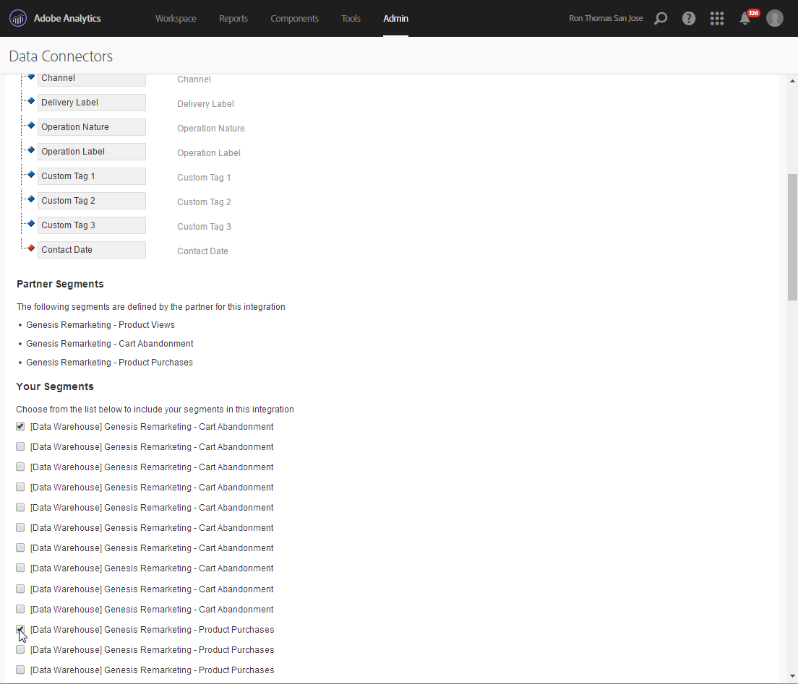

# Adobe Analytics Data Connector{#adobe-analytics-data-connector-legacy}

>[!IMPORTANT]
>
>Adobe Analytics Data Connector 现已弃用。已弃用的功能仍然可用，但不会进一步增强或支持这些功能。请参阅[此页面](../../rn/using/deprecated-features.md)以了解详情。

## 关于 Data Connector 集成 {#about-data-connector-integration}

>[!IMPORTANT]
>
>Adobe Analytics Data Connector 与事务性消息传递（消息中心）不兼容。

Data Connector（此前称为 Adobe Genesis）允许 Adobe Campaign 和 Adobe Analytics 通过&#x200B;**网站分析连接器**&#x200B;包进行交互。它会以区段形式将数据转发到 Adobe Campaign，它们涉及到投放电子邮件营销活动后的用户行为。反过来，它会将 Adobe Campaign 提供的电子邮件营销活动的指标和属性发送到 Adobe Analytics - Data Connector。

使用 Data Connector，Adobe Campaign 提供了一种衡量互联网受众（网站分析）的方法。借助这些集成，Adobe Campaign 可以在投放营销活动后回收一个或多个网站的访客行为数据，并（在分析之后）开展再营销活动，以期将访客转化为购买者。反过来，网站分析工具让 Adobe Campaign 能够将指标和营销活动属性转发到其平台。

每个工具的操作字段如下所示：

* 网站分析的作用：

   1. 标记通过 Adobe Campaign 启动的电子邮件营销活动，
   1. 以区段形式保存收件人在点击营销活动电子邮件后浏览的网站上的行为。区段涉及放弃的产品（已浏览但未加入购物车或购买）、购买或购物车放弃。

* Adobe Campaign 的角色：

   1. 将指标和营销活动属性发送到连接器，然后由连接器将它们转发到网站分析工具，
   1. 恢复和分析区段，
   1. 触发再营销活动。

## 设置集成 {#setting-up-the-integration}

要设置 Data Connector，您必须连接到 Adobe Campaign 实例并执行以下操作：

* [步骤 1：在 Analytics 中配置集成](#step-1--configure-integration-in-analytics)
* [步骤 2：在 Campaign 中创建外部帐户](#step-2--create-the-external-account-in-campaign)
* [步骤 3：同步 Adobe Campaign 和 Adobe Analytics](#step-3--synchronize-adobe-campaign-and-adobe-analytics)

### 步骤 1：在 Analytics 中配置集成 {#step-1--configure-integration-in-analytics}

以下步骤详细介绍了如何使用向导配置 Data Connector。

1. 使用 Adobe ID 或 Enterprise ID 登录 Adobe Experience Cloud。

   

1. 从 Experience Cloud 解决方案列表中，选择 **[!UICONTROL Analytics]**。

   

1. 在 **[!UICONTROL Admin]** 选项卡中，选择 **[!UICONTROL Data Connectors]**。

   您需要具有以下 Analytics 工具权限才能访问 **[!UICONTROL Data Connectors]** 菜单。有关更多信息，请参阅此[页面](https://experienceleague.adobe.com/docs/analytics/admin/admin-console/permissions/analytics-tools.html?lang=zh-Hans)
   * 集成（创建）
   * 集成（更新）
   * 集成（删除）

   

1. 从合作伙伴列表中，选择 **[!UICONTROL Adobe Campaign Classic]**。

   

1. 在 **[!UICONTROL Add integration]** 对话框中，单击 **[!UICONTROL Activate]**。
1. 勾选 **[!UICONTROL I accept these terms and conditions]** 并选择链接到此集成的 **[!UICONTROL Report suite]** 并输入连接器标签。

   完成后，单击 **[!UICONTROL Create and configure this integration]**。

   

1. 输入将代表连接器接收通知的电子邮件地址，然后复制显示在外部 Adobe Campaign 帐户中的 **[!UICONTROL Account ID]**（有关更多信息，请参阅[步骤 2：在 Campaign 中创建外部帐户](#step-2--create-the-external-account-in-campaign)）。

   

1. 指定衡量电子邮件营销活动影响所需的标识符，即内部营销活动名称 (cid) 和 iNmsBroadlog (bid) 表 ID。您还应指定要收集事件的指标。
确保 **[!UICONTROL Events]** 为数字类型，否则它们将不会显示在下拉菜单中。

   

1. 如有必要，请指定个性化区段。

   

1. 在 **[!UICONTROL Data collection]** 中，选择恢复数据方法，在这个示例中，选择步骤 6 中指定的 **[!UICONTROL cid]** 和 **[!UICONTROL bid]** 标识符。

   

1. 选择要在仪表板中显示的信息。

   

1. 检查页面中的配置，该配置汇总了前面的步骤。

   

1. 单击 **[!UICONTROL Activate Now]** 以批准配置并激活连接器。

   

   Data Connector 现已配置完成。

### 步骤 2：在 Campaign 中创建外部帐户 {#step-2--create-the-external-account-in-campaign}

Adobe Campaign 与 Analytics 平台的整合是通过连接器执行的。要同步应用程序，请应用以下流程：

1. 在 Adobe Campaign 中安装&#x200B;**网站分析连接器**&#x200B;包。
1. 转到 Adobe Campaign 树的 **[!UICONTROL Administration > Platform > External accounts]** 文件夹。
1. 右键单击外部帐户列表，然后在下拉菜单中选择 **[!UICONTROL New]**（或单击外部帐户列表上方的 **[!UICONTROL New]** 按钮）。
1. 使用下拉列表选择 **[!UICONTROL Web Analytics]** 类型。
1. 选择连接器的提供程序，也就是 **[!UICONTROL Adobe Analytics - Data Connector]**。

   

1. 单击 **[!UICONTROL Enrich the formula...]** 链接可更改 URL 计算公式，以指定网站分析工具集成信息（营销活动 ID）以及必须跟踪其活动的网站的域名。
1. 指明网站的域名。

   

1. 单击 **[!UICONTROL Next]** 并确保域名已保存。

   

1. 如有必要，必须让计算公式过载运行。要实现此目的，请勾选方框并直接在窗口中编辑公式。

   

   >[!IMPORTANT]
   >
   >此配置模式为专家用户而设：公式中的任何错误都可能导致电子邮件投放停止。

1. **[!UICONTROL Advanced]** 选项卡可让您配置或修改更多技术设置。

   * **[!UICONTROL Lifespan]**：可让您指定延迟（以天为单位），在此之后技术工作流会在 Adobe Campaign 中恢复网站事件。默认值：180 天。
   * **[!UICONTROL Persistence]**:用于定义所有Web事件（例如购买）可归因到再营销活动的时段，默认：7天。

>[!NOTE]
>
>如果您使用多个受众衡量工具，则在创建外部帐户时，可以在 **[!UICONTROL Partners]** 下拉列表中选择 **[!UICONTROL Other]**。您只能在投放属性中引用一个外部帐户：因此，您需要通过添加 Adobe 以及使用的所有其他衡量工具预期的参数来调整跟踪 URL 的公式。

### 步骤 3：同步 Adobe Campaign 和 Adobe Analytics {#step-3--synchronize-adobe-campaign-and-adobe-analytics}

创建外部帐户后，需要同步两个应用程序。

1. 转到您之前创建的外部帐户。
1. 根据需要更改帐户 **[!UICONTROL Label]**。
1. 更改 **[!UICONTROL Internal name]**，使其与配置 Data Connector 时选择的 **[!UICONTROL Name]** 匹配。

   

1. 单击 **[!UICONTROL Approve connection]** 链接。

   

   确保 **[!UICONTROL Internal name]** 与 Data Connector 配置向导中指定的 **[!UICONTROL Name]** 匹配。

1. 在 Data Connector 配置向导中输入 **[!UICONTROL Account ID]**。

   

1. 按照 Data Connector 向导指南中的步骤操作，然后返回到 Adobe Campaign 中的外部帐户。
1. 单击 **[!UICONTROL Next]**，以便在 Adobe Campaign 和 Adobe Analytics - Data Connector 之间进行数据交换。

   同步完成后，将显示区段列表。

   

在 Adobe Campaign 和 Adobe Analytics - Data Connector 之间同步数据生效后，Data Connector 向导中定义的三个默认区段将由 Adobe Campaign 恢复，并可在 Adobe Campaign 外部帐户的 **[!UICONTROL Segments]** 选项卡中访问。

如果已在 Data Connector 向导中配置了其他区段，则可以将它们添加到 Adobe Campaign。为此，请单击 **[!UICONTROL Update segment list]** 链接，然后按照外部帐户向导中所述的步骤操作。执行操作后，新区段将显示在列表中。

### 网站分析流程的技术工作流 {#technical-workflows-of-web-analytics-processes}

Adobe Campaign 与 Adobe Analytics - Data Connector 之间的数据交换由四个作为后台任务运行的技术工作流处理。

它们位于 Adobe Campaign 树的 **[!UICONTROL Administration > Production > Technical workflows > Web analytics process]** 文件夹下。

* **[!UICONTROL Recovering of web events]**：每小时一次，此工作流会下载关于用户在特定网站上的行为的区段，将它们纳入 Adobe Campaign 数据库，并启动再营销工作流。
* **[!UICONTROL Event purge]**：使用此工作流，可根据 **[!UICONTROL Lifespan]** 字段中配置的时段，从数据库中删除所有事件。有关此类内容的更多信息，请参阅[步骤 2：在 Campaign 中创建外部帐户](#step-2--create-the-external-account-in-campaign)。
* **[!UICONTROL Identification of converted contacts]**：再营销活动后进行购买的访客的目录。通过此工作流收集的数据可在 **[!UICONTROL Re-marketing efficiency]** 报表中访问，请参阅此[页面](#creating-a-re-marketing-campaign)。
* **[!UICONTROL Sending of indicators and campaign attributes]**：可让您使用 Adobe Analytics - Data Connector 通过 Adobe Campaign 将电子邮件营销活动指标发送到 Adobe Experience Cloud。此工作流在每天凌晨 4 点触发，可能需要 24 小时才能将数据发送到 Analytics。

   请注意，切勿重新启动此工作流，否则它将重新发送所有先前数据，可能会影响 Analytics 结果的准确性。

   所涉指标包括：

   * **[!UICONTROL Messages to deliver]** (@toDeliver)
   * **[!UICONTROL Processed]** (@processed)
   * **[!UICONTROL Success]** (@success)
   * **[!UICONTROL Total count of opens]** (@totalRecipientOpen)
   * **[!UICONTROL Recipients who have opened]** (@recipientOpen)
   * **[!UICONTROL Total number of recipients who clicked]** (@totalRecipientClick)
   * **[!UICONTROL People who clicked]** (@personClick)
   * **[!UICONTROL Number of distinct clicks]** (@recipientClick)
   * **[!UICONTROL Opt-Out]** (@optOut)
   * **[!UICONTROL Errors]** (@error)

   >[!NOTE]
   >
   >发送的数据是基于上次快照的 delta 值，可能会导致量度数据中出现负值。

   发送的属性如下所示：

   * **[!UICONTROL Internal name]** (@internalName)
   * **[!UICONTROL Label]** (@label)
   * **[!UICONTROL Label]** (operation/@label)：仅当安装了 **Campaign** 软件包时
   * **[!UICONTROL Nature]** (operation/@nature)：仅当安装了 **Campaign** 软件包时
   * **[!UICONTROL Tag 1]** (webAnalytics/@tag1)
   * **[!UICONTROL Tag 2]** (webAnalytics/@tag2)
   * **[!UICONTROL Tag 3]** (webAnalytics/@tag3)
   * **[!UICONTROL Contact date]** (scheduling/@contactDate)

## 在 Adobe Campaign 中跟踪投放 {#tracking-deliveries-in-adobe-campaign}

为了让 Adobe Experience Cloud 能够在 Adobe Campaign 发送投放后跟踪网站上的活动，您需要在投放属性中引用匹配的连接器。要执行此操作，请应用以下步骤：

1. 打开要跟踪的营销活动的投放。

   

1. 打开投放属性。
1. 转到 **[!UICONTROL Web Analytics]** 选项卡，然后选择之前创建的外部帐户。请参阅[步骤 2：在 Campaign 中创建外部帐户](#step-2--create-the-external-account-in-campaign)。

   

1. 您现在可以发送投放，并在 Adobe Analytics 中访问其报表。

## 创建再营销活动 {#creating-a-re-marketing-campaign}

要准备再营销活动，只需创建用于再营销类型的营销活动的投放模板即可。然后，配置再营销活动并将其链接到区段。每个区段必须具有不同的再营销活动。

在 Adobe Campaign 恢复区段，完成对初始营销活动目标人群的行为分析后，将自动启动再营销活动。对于购物车放弃或查看产品但未购买的情况，会向相关收件人发送投放内容，以便让他们的网站浏览活动以购买结束。

Adobe Campaign 提供个性化投放模板，您可以使用这些模板或建立您自己的数据库以准备营销活动。

1. 在 **[!UICONTROL Explorer]** 中，转到 Adobe Campaign 树的 **[!UICONTROL Resources > Templates > Delivery templates]** 文件夹。
1. 复制 **[!UICONTROL Email delivery (re-marketing)]** 模板或 Adobe Campaign 提供的再营销模板示例。
1. 根据您的需求对模板进行个性化并保存。

   

1. 创建新营销活动，并从下拉列表中选择 **[!UICONTROL Re-marketing campaign]** 模板。

   

1. 单击 **[!UICONTROL Configure...]** 链接以指定链接到该营销活动的区段和投放模板。
1. 选择之前配置的外部帐户。

   

1. 选择相关区段。

   

1. 选择要用于此再营销活动的投放模板，然后单击 **[!UICONTROL Finish]** 以关闭窗口。

   

1. 单击 **[!UICONTROL OK]** 以关闭营销活动窗口。

可通过全局报告页面访问 **[!UICONTROL Re-marketing efficiency]** 报告。它可以让您查看在 Adobe Campaign 再营销活动后，已转化联系人数（即已购买商品）与购物车放弃数的关系。转化率在每周、每月或自 Adobe Campaign 与网站分析工具之间开始同步后进行计算。

