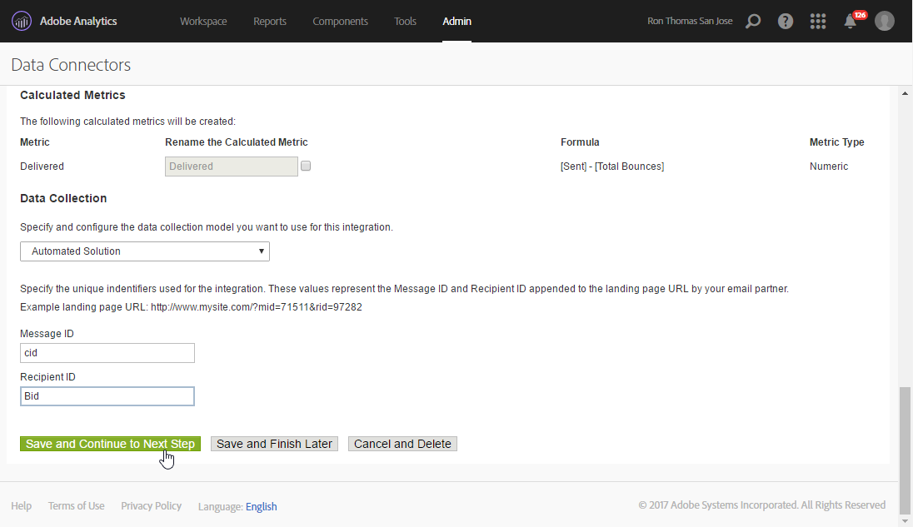

# Adobe Analytics 数据连接器{#adobe-analytics-data-connector}

## 关于数据连接器集成 {#about-data-connector-integration}

>[!IMPORTANT]
>
>Adobe Analytics数据连接器与事务消息（消息中心）不兼容。

Data Connector(以前称为Adobe Genesis)允许Adobe Campaign和Adobe Analytics通过Web Analytics连接 **器包进行交互** 。 它以区段形式将Adobe Campaign转发给活动，其中涉及电子邮件后的用户行为。 相反，它会通过Adobe Campaign向Adobe Analytics-数据连接器发送电子邮件活动的指标和属性。

Adobe Campaign使用数据连接器，可以衡量Internet受众（Web分析）。 借助这些集成，Adobe Campaign可以恢复营销活动后一个或多个站点的访客行为数据，并(分析后)与视图一起运行再营销活动以将其转换为购买者。 相反，Web分析工具使Adobe Campaign能够将指标和活动属性转发到其平台。

有关Adobe Analytics与Adobe Campaign一体化的执行情况，请参阅本文 [件](https://helpx.adobe.com/marketing-cloud/how-to/analytics-ac.html)。

每个工具的操作字段如下所示：

* Web分析的角色：

   1. 标记用Adobe Campaign启动的电子邮件活动,
   1. 以区段的形式保存收件人行为，在单击活动电子邮件后浏览的站点上。 区段涉及放弃的产品（已查看但未添加到购物车或已购买）、购买或放弃购物车。

* Adobe Campaign的角色：

   1. 将指示器和活动属性发送到连接器，然后连接器将它们转发到Web分析工具，
   1. 恢复和分析细分，
   1. 触发再营销活动。

## 设置集成 {#setting-up-the-integration}

要设置Adobe Campaign连接器，必须连接到数据实例并执行以下操作：

* [第1步：在Analytics中配置集成](#step-1--configure-integration-in-analytics)
* [第2步：在活动中创建外部帐户](#step-2--create-the-external-account-in-campaign)
* [第3步：同步Adobe Campaign和Adobe Analytics](#step-3--synchronize-adobe-campaign-and-adobe-analytics)

### 第1步：在Analytics中配置集成 {#step-1--configure-integration-in-analytics}

以下步骤使用向导详细说明数据连接器的配置。

1. 使用Adobe ID或Enterprise ID登录到Adobe Experience Cloud。

   

1. 从Experience Cloud解决方案列表中，选择 **[!UICONTROL Analytics]**。

   

1. From the **[!UICONTROL Admin]** tab, select **[!UICONTROL Data Connectors]**.

   您需要具有以下分析工具权限才能访问 **[!UICONTROL Data Connectors]** 菜单。 For more on this, refer to this [page](https://docs.adobe.com/content/help/en/analytics/admin/admin-console/permissions/analytics-tools.html)
   * 集成（创建）
   * 集成（更新）
   * 集成（删除）

   

1. 从合作伙伴列表中，选择 **[!UICONTROL Adobe Campaign Classic]**。

   

1. In the **[!UICONTROL Add integration]** dialog, click **[!UICONTROL Activate]**.
1. 选中 **[!UICONTROL I accept these terms and conditions]** 并选择链 **[!UICONTROL Report suite]** 接到此集成的连接器标签。

   完成后，单击 **[!UICONTROL Create and configure this integration]**。

   

1. 输入将代表连接器接收通知的电子邮件地址，然后复 **[!UICONTROL Account ID]** 制外部Adobe Campaign帐户中显示的通知(有关详细信息，请参阅 [步骤2:创建外部帐户](#step-2--create-the-external-account-in-campaign))。

   

1. 指定测量电子邮件活动影响所需的标识符，即内部活动名称(cid)和iNmsBroadlog(bid)表ID。 您还应指定要收集的事件的指示器。
请确保您的 **[!UICONTROL Events]** 类型为数字，否则它们不会显示在下拉菜单中。

   

1. 如有必要，请指定个性化细分。

   

1. 在 **[!UICONTROL Data collection]**&#x200B;中，选择一种恢复数据的方法，在此例中， **[!UICONTROL cid]** 选择 **[!UICONTROL bid]** 步骤6中指定的标识符和标识符。

   

1. 选择要在仪表板中显示的信息。

   

1. 检查页面中总结前面步骤的配置。

   

1. 单击 **[!UICONTROL Activate Now]** 以批准配置并激活连接器。

   

   数据连接器现已配置。

### 第2步：在活动中创建外部帐户 {#step-2--create-the-external-account-in-campaign}

将Adobe Campaign集成到Analytics平台中是使用连接器进行的。 要同步应用程序，请应用以下过程：

1. 以Adobe Campaign **形式安装Web** Analytics连接器包。
1. 转到Adobe Campaign **[!UICONTROL Administration > Platform > External accounts]** 树的文件夹。
1. 右键单击外部帐户的列表，然 **[!UICONTROL New]** 后在下拉菜单中选择(或 **[!UICONTROL New]** 单击外部帐户列表上方的按钮)。
1. 使用下拉列表选择类 **[!UICONTROL Web Analytics]** 型。
1. 选择连接器的提供者，即 **[!UICONTROL Adobe Analytics - Data Connector]** ，在本例中。

   

1. 单击链 **[!UICONTROL Enrich the formula...]** 接以更改URL计算公式，以指定Web分析工具集成信息(活动ID)和必须跟踪其活动的站点的域。
1. 指定站点的域名。

   

1. 单 **[!UICONTROL Next]** 击并确保域名已保存。

   

1. 如有必要，必须使计算公式过载。 要执行此操作，请选中该框并直接在窗口中编辑公式。

   

   >[!IMPORTANT]
   >
   >此配置模式为专家用户保留：此公式中的任何错误都可能导致电子邮件投放停止。

1. 通过选 **[!UICONTROL Advanced]** 项卡可配置或修改更多技术设置。

   * **[!UICONTROL Lifespan]**:允许您指定延迟（以天数_为单位），之后Web事件以技术工作流Adobe Campaign恢复。 默认：180天。
   * **[!UICONTROL Persistence]**:允许您将所有Web事件（例如，采购）归属于再营销活动的期间，默认值：7天。

>[!NOTE]
>
>如果您使用多个受众测量工具，则可 **[!UICONTROL Other]** 以在创 **[!UICONTROL Partners]** 建外部帐户时在下拉列表中进行选择。 您只能在外部帐户属性中引用一个投放:因此，您需要通过添加Adobe和所有其他使用的测量工具所需的参数来调整跟踪URL的公式。

### 第3步：同步Adobe Campaign和Adobe Analytics {#step-3--synchronize-adobe-campaign-and-adobe-analytics}

创建外部帐户后，您需要同步这两个应用程序。

1. 转到之前创建的外部帐户。
1. 根据需要更 **[!UICONTROL Label]** 改帐户。
1. 更改 **[!UICONTROL Internal name]** ，使其与配置数据连 **[!UICONTROL Name]** 接器时选择的匹配。

   

1. 单击链 **[!UICONTROL Approve connection]** 接。

   

   确保与“数 **[!UICONTROL Internal name]** 据连接 **[!UICONTROL Name]** 器配置”向导中指定的匹配。

1. 在数据连 **[!UICONTROL Account ID]** 接器配置向导中输入。

   

1. 按照“数据连接器”向导的步骤操作，然后返回Adobe Campaign外部帐户。
1. 单 **[!UICONTROL Next]** 击以在Adobe Campaign和Adobe Analytics-数据连接器之间进行数据交换。

   同步完成后，将显示段列表。

   

当Adobe Campaign与Adobe Analytics之间的数据同步——数据连接器有效时，Adobe Campaign将恢复在数据连接器向导中定义的三个默认段，并可在Adobe Campaign外部帐户的选 **[!UICONTROL Segments]** 项卡中访问这些段。

如果已在数据连接器向导中配置了其他区段，则可以将其添加到Adobe Campaign。 为此，请单击链 **[!UICONTROL Update segment list]** 接并按照外部帐户向导中概述的步骤操作。 执行操作后，新区段将显示在列表中。

### 技术工作流Web分析流程 {#technical-workflows-of-web-analytics-processes}

Adobe Campaign与Adobe Analytics之间的数据交换——数据连接器由四个技术工作流处理，作为后台任务运行。

它们位于Adobe Campaign树中的文件夹 **[!UICONTROL Administration > Production > Technical workflows > Web analytics process]** 下。

* **[!UICONTROL Recovering of web events]**:此工作流每小时会下载一次有关给定站点上用户行为的细分，将其包括在Adobe Campaign库中，并开始再营销工作流。
* **[!UICONTROL Event purge]**:此工作流允许您根据字段中配置的期间从事件库删除所有 **[!UICONTROL Lifespan]** 。 有关此方面的详细信息，请参 [阅步骤2:以活动创建外部帐户](#step-2--create-the-external-account-in-campaign)。
* **[!UICONTROL Identification of converted contacts]**:再营销访客后进行购买的活动的目录。 此工作流收集的数据可在报 **[!UICONTROL Re-marketing efficiency]** 告中访问，请参 [阅此页](#creating-a-re-marketing-campaign)。
* **[!UICONTROL Sending of indicators and campaign attributes]**:允许您使用“Adobe Analytics-数据连接器”，通过Adobe Campaign将电子邮件活动指示器发送到Adobe Experience Cloud。 此工作流程每天凌晨4点触发，可能需要24小时才能将数据发送到Analytics。

   请注意，此工作流不应重新启动，否则将重新发送所有可能歪斜Analytics结果的先前数据。

   所涉指标包括：

   * **[!UICONTROL Messages to deliver]** (@toDeliver)
   * **[!UICONTROL Processed]** （@已处理）
   * **[!UICONTROL Success]** (@success)
   * **[!UICONTROL Total count of opens]** (@totalRecipientOpen)
   * **[!UICONTROL Recipients who have opened]** (@recipientOpen)
   * **[!UICONTROL Total number of recipients who clicked]** (@totalRecipientClick)
   * **[!UICONTROL People who clicked]** (@personClick)
   * **[!UICONTROL Number of distinct clicks]** (@recipientClick)
   * **[!UICONTROL Opt-Out]** (@optOut)
   * **[!UICONTROL Errors]** (@error)

   >[!NOTE]
   >
   >发送的数据是基于最后一个快照的增量，它可能导致度量数据中的负值。

   发送的属性如下：

   * **[!UICONTROL Internal name]** (@internalName)
   * **[!UICONTROL Label]** (@label)
   * **[!UICONTROL Label]** (operation/@label):仅当安 **装活动** 包时
   * **[!UICONTROL Nature]** (operation/@nature):仅当安 **装活动** 包时
   * **[!UICONTROL Tag 1]** (webAnalytics/@tag1)
   * **[!UICONTROL Tag 2]** (webAnalytics/@tag2)
   * **[!UICONTROL Tag 3]** (webAnalytics/@tag3)
   * **[!UICONTROL Contact date]** (scheduling/@contactDate)

## 在Adobe Campaign中跟踪投放 {#tracking-deliveries-in-adobe-campaign}

为了使Adobe Experience Cloud能够在Adobe Campaign发送投放后跟踪站点上的活动，您需要在投放属性中引用匹配连接器。 为此，请应用以下步骤：

1. 打开要跟踪的活动的投放。

   

1. 打开投放属性。
1. 转到选项 **[!UICONTROL Web Analytics]** 卡，然后选择之前创建的外部帐户。 请参阅 [步骤2:以活动创建外部帐户](#step-2--create-the-external-account-in-campaign)。

   

1. 您现在可以发送投放并访问Adobe Analytics的报告。

## Creating a re-marketing campaign {#creating-a-re-marketing-campaign}

要准备再营销活动，只需创建用于再营销类型活动的投放模板。 然后配置再营销活动并将其关联到区段。 每个细分必须具有不同的再营销活动。

在Adobe Campaign完成恢复细分后，再营销活动会自动启动，以分析初始活动所针对人员的行为。 如果放弃购物车或未购买产品查看，则投放会发送给相关收件人，以便其浏览站点以购买结束。

Adobe Campaign提供个性化投放模板，您可以自己使用这些或将其数据库化，以准备活动。

1. 从中 **[!UICONTROL Explorer]**，转到Adobe Campaign **[!UICONTROL Resources > Templates > Delivery templates]** 树的文件夹。
1. 重复 **[!UICONTROL Email delivery (re-marketing)]** Adobe Campaign提供的模板或再营销模板示例。
1. 个性化模板以满足您的需求并保存它。

   

1. 创建新活动并从下 **[!UICONTROL Re-marketing campaign]** 拉列表中选择模板。

   

1. 单击链 **[!UICONTROL Configure...]** 接以指定链接到活动的区段和投放模板。
1. 选择以前配置的外部帐户。

   

1. 选择相关区段。

   

1. 选择要用于此再营销活动的投放模板，然后单击 **[!UICONTROL Finish]** 以关闭窗口。

   

1. 单击 **[!UICONTROL OK]** 以关闭活动窗口。

报告 **[!UICONTROL Re-marketing efficiency]** 可通过全局报告页面进行访问。 它允许您视图转换的联系人数（即已购买某些产品）与Adobe Campaign再营销活动后放弃购物车的数量相关。 转化率是每周、每月或自Adobe Campaign和Web分析工具之间同步的开始计算的。

