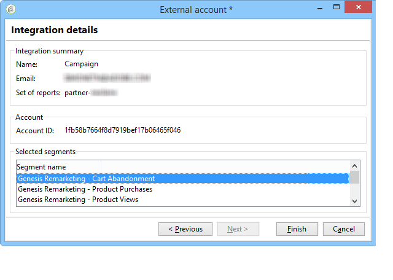
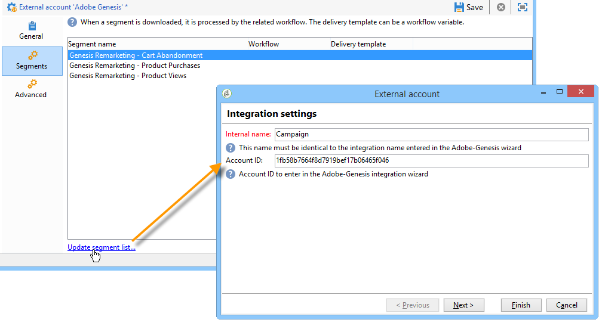
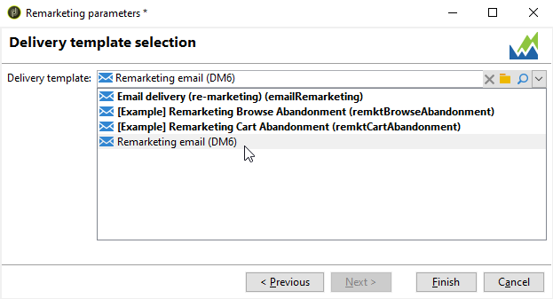

# Adobe Analytics 数据连接器{#adobe-analytics-data-connector}

## 关于数据连接器集成{#about-data-connector-integration}

>[!IMPORTANT]
>
>Adobe Analytics Data Connector与Transactional Messaging(Message Center)不兼容。

Data Connector(以前称为Adobe Genesis)允许Adobe Campaign和Adobe Analytics通过&#x200B;**Web Analytics connectors**&#x200B;包进行交互。 它以区段形式向Adobe Campaign转发有关用户在电子邮件活动后的行为的数据。 相反，它会通过Adobe Campaign将电子邮件活动的指示符和属性发送到Adobe Analytics — 数据连接器。

Adobe Campaign使用数据连接器，可以测量Internet受众（Web分析）。 借助这些集成，Adobe Campaign可以恢复营销活动后一个或多个站点的访客行为数据，并(分析后)与视图一起运行再营销活动以将其转化为购买者。 相反，Web分析工具使Adobe Campaign能够将指标和活动属性转发到其平台。

有关实施Adobe Analytics与Adobe Campaign集成的详细信息，请参阅此[文档](https://helpx.adobe.com/marketing-cloud/how-to/analytics-ac.html)。

每个工具的操作字段如下：

* Web分析的角色：

   1. 标记使用Adobe Campaign启动的电子邮件活动,
   1. 以区段的形式保存收件人行为，保存在单击活动电子邮件后浏览的站点上。 区段涉及已放弃的产品（已查看但未添加到购物车或已购买）、购买或放弃购物车。

* Adobe Campaign的角色：

   1. 将指示符和活动属性发送到连接器，连接器又将它们转发到Web分析工具，
   1. 恢复和分析细分，
   1. 触发再营销活动。

## 设置集成{#setting-up-the-integration}

要设置Adobe Campaign连接器，必须连接到数据实例并执行以下操作：

* [第1步：在Analytics中配置集成](#step-1--configure-integration-in-analytics)
* [第2步：在活动中创建外部帐户](#step-2--create-the-external-account-in-campaign)
* [第3步：同步Adobe Campaign和Adobe Analytics](#step-3--synchronize-adobe-campaign-and-adobe-analytics)

### 第1步：在Analytics {#step-1--configure-integration-in-analytics}中配置集成

以下步骤使用向导详细说明了数据连接器的配置。

1. 使用Adobe ID或Enterprise ID登录到Adobe Experience Cloud。

   

1. 从Experience Cloud解决方案的列表中，选择&#x200B;**[!UICONTROL Analytics]**。

   

1. 从&#x200B;**[!UICONTROL Admin]**&#x200B;选项卡中，选择&#x200B;**[!UICONTROL Data Connectors]**。

   要访问&#x200B;**[!UICONTROL Data Connectors]**&#x200B;菜单，您需要具有以下Analytics工具权限。 有关详细信息，请参阅此[页面](https://docs.adobe.com/content/help/en/analytics/admin/admin-console/permissions/analytics-tools.html)
   * 集成（创建）
   * 集成（更新）
   * 集成（删除）

   

1. 从合作伙伴的列表中，选择&#x200B;**[!UICONTROL Adobe Campaign Classic]**。

   

1. 在&#x200B;**[!UICONTROL Add integration]**&#x200B;对话框中，单击&#x200B;**[!UICONTROL Activate]**。
1. 选中&#x200B;**[!UICONTROL I accept these terms and conditions]**&#x200B;并选择链接到此集成的&#x200B;**[!UICONTROL Report suite]**&#x200B;并输入连接器标签。

   完成后，单击&#x200B;**[!UICONTROL Create and configure this integration]**。

   

1. 输入将代表连接器接收通知的电子邮件地址，然后复制&#x200B;**[!UICONTROL Account ID]**(它显示在外部Adobe Campaign帐户中)(有关详细信息，请参阅[步骤2:在活动](#step-2--create-the-external-account-in-campaign)中创建外部帐户。

   

1. 指定测量电子邮件活动影响所需的标识符，即内部活动名称(cid)和iNmsBroadlog(bid)表ID。 您还应指定要收集的事件的指示器。
确保**[!UICONTROL Events]**&#x200B;的类型为“数字”，否则它们不会显示在下拉菜单中。

   

1. 如有必要，请指定个性化细分。

   

1. 在&#x200B;**[!UICONTROL Data collection]**&#x200B;中，选择一种恢复数据的方法，在这种情况下，请选择步骤6中指定的&#x200B;**[!UICONTROL cid]**&#x200B;和&#x200B;**[!UICONTROL bid]**&#x200B;标识符。

   

1. 选择要在仪表板中显示的信息。

   

1. 检查页面中用于总结前面步骤的配置。

   

1. 单击&#x200B;**[!UICONTROL Activate Now]**&#x200B;批准配置并激活连接器。

   

   数据连接器现已配置。

### 第2步：在活动 {#step-2--create-the-external-account-in-campaign}中创建外部帐户

将Adobe Campaign集成到Analytics平台是使用连接器进行的。 要同步应用程序，请应用以下过程：

1. 在Adobe Campaign中安装&#x200B;**Web Analytics connectors**&#x200B;包。
1. 转到Adobe Campaign树的&#x200B;**[!UICONTROL Administration > Platform > External accounts]**&#x200B;文件夹。
1. 右键单击外部帐户的列表，在下拉菜单中选择&#x200B;**[!UICONTROL New]**(或单击外部帐户列表上方的&#x200B;**[!UICONTROL New]**&#x200B;按钮)。
1. 使用下拉列表选择&#x200B;**[!UICONTROL Web Analytics]**&#x200B;类型。
1. 选择连接器的提供者，即&#x200B;**[!UICONTROL Adobe Analytics - Data Connector]**。

   

1. 单击&#x200B;**[!UICONTROL Enrich the formula...]**&#x200B;链接可更改URL计算公式以指定Web分析工具集成信息(活动ID)和必须跟踪其活动的站点的域。
1. 指定站点的域名。

   

1. 单击&#x200B;**[!UICONTROL Next]**&#x200B;并确保已保存域名。

   

1. 如有必要，您必须使计算公式超载。 要执行此操作，请选中该框并直接在窗口中编辑公式。

   

   >[!IMPORTANT]
   >
   >此配置模式为专家用户保留：此公式中的任何错误都可能导致电子邮件投放停止。

1. **[!UICONTROL Advanced]**&#x200B;选项卡允许您配置或修改更多技术设置。

   * **[!UICONTROL Lifespan]**:允许您指定延迟（以天数_为单位），在此之后，Web事件会以技术工作流的Adobe Campaign恢复。默认：180天。
   * **[!UICONTROL Persistence]**:允许您将所有Web事件（例如采购）归属于再营销活动的期间，默认：7天。

>[!NOTE]
>
>如果您使用多个受众测量工具，则创建外部帐户时可在&#x200B;**[!UICONTROL Partners]**&#x200B;下拉列表中选择&#x200B;**[!UICONTROL Other]**。 您只能在外部帐户属性中引用一个投放:因此，您需要通过添加Adobe和所使用的所有其他测量工具所需的参数来调整跟踪URL的公式。

### 第3步：同步Adobe Campaign和Adobe Analytics {#step-3--synchronize-adobe-campaign-and-adobe-analytics}

创建外部帐户后，您需要同步这两个应用程序。

1. 转到之前创建的外部帐户。
1. 根据需要更改帐户&#x200B;**[!UICONTROL Label]**。
1. 更改&#x200B;**[!UICONTROL Internal name]**，使其与配置数据连接器时选择的&#x200B;**[!UICONTROL Name]**&#x200B;匹配。

   

1. 单击&#x200B;**[!UICONTROL Approve connection]**&#x200B;链接。

   

   确保&#x200B;**[!UICONTROL Internal name]**&#x200B;与“数据连接器配置”向导中指定的&#x200B;**[!UICONTROL Name]**&#x200B;匹配。

1. 在数据连接器配置向导中输入&#x200B;**[!UICONTROL Account ID]**。

   

1. 按照“Data Connector（数据连接器）”向导指南执行步骤，然后返回到Adobe Campaign中的外部帐户。
1. 单击&#x200B;**[!UICONTROL Next]**&#x200B;以便在Adobe Campaign和Adobe Analytics — 数据连接器之间进行数据交换。

   同步完成后，将显示区段列表。

   

当Adobe Campaign与Adobe Analytics — 数据连接器之间的数据同步生效时，Adobe Campaign将恢复在数据连接器向导中定义的三个默认段，并可在Adobe Campaign外部帐户的&#x200B;**[!UICONTROL Segments]**&#x200B;选项卡中访问。

如果在“数据连接器”向导中配置了其他区段，则可以将其添加到Adobe Campaign。 要执行此操作，请单击&#x200B;**[!UICONTROL Update segment list]**&#x200B;链接，然后按照外部帐户向导中概述的步骤操作。 执行操作后，新区段将显示在列表中。

### 技术工作流个Web分析进程{#technical-workflows-of-web-analytics-processes}

Adobe Campaign与Adobe Analytics之间的数据交换 — 数据连接器由四个技术工作流处理，它们作为后台任务运行。

它们位于Adobe Campaign树中&#x200B;**[!UICONTROL Administration > Production > Technical workflows > Web analytics process]**&#x200B;文件夹下。

* **[!UICONTROL Recovering of web events]**:此工作流每小时会下载一次有关给定站点上用户行为的细分，将其包含在Adobe Campaign数据库中并开始再营销工作流。
* **[!UICONTROL Event purge]**:此工作流允许您根据字段中配置的期间从数据库中删除所有 **[!UICONTROL Lifespan]** 事件。有关详细信息，请参阅[步骤2:在活动](#step-2--create-the-external-account-in-campaign)中创建外部帐户。
* **[!UICONTROL Identification of converted contacts]**:在再营销活动后进行购买的访客的目录。可在&#x200B;**[!UICONTROL Re-marketing efficiency]**&#x200B;报告中访问此工作流收集的数据，请参阅此[页面](#creating-a-re-marketing-campaign)。
* **[!UICONTROL Sending of indicators and campaign attributes]**:允许您使用Adobe Analytics -活动连接器通过Adobe Campaign将电子邮件指示器发送到Adobe Experience Cloud。此工作流每天在凌晨4点触发，并且可能需要24小时才能将数据发送到Analytics。

   请注意，此工作流不应重新启动，否则将重新发送所有可能扭曲Analytics结果的先前数据。

   所涉指标有：

   * **[!UICONTROL Messages to deliver]** (@toDeliver)
   * **[!UICONTROL Processed]** (@processed)
   * **[!UICONTROL Success]** (@success)
   * **[!UICONTROL Total count of opens]** (@totalRecipientOpen)
   * **[!UICONTROL Recipients who have opened]** (@recipientOpen)
   * **[!UICONTROL Total number of recipients who clicked]** (@totalRecipientClick)
   * **[!UICONTROL People who clicked]** (@personClick)
   * **[!UICONTROL Number of distinct clicks]** (@recipientClick)
   * **[!UICONTROL Opt-Out]** (@optOut)
   * **[!UICONTROL Errors]** (@error)

   >[!NOTE]
   >
   >发送的数据是基于最后一个快照的增量，该快照可能导致量度数据中的负值。

   发送的属性如下：

   * **[!UICONTROL Internal name]** (@internalName)
   * **[!UICONTROL Label]** (@label)
   * **[!UICONTROL Label]** (操作/@label):仅当安装 **** 了Campaign包时
   * **[!UICONTROL Nature]** (操作/@nature):仅当安装 **** 了Campaign包时
   * **[!UICONTROL Tag 1]** (webAnalytics/@tag1)
   * **[!UICONTROL Tag 2]** (webAnalytics/@tag2)
   * **[!UICONTROL Tag 3]** (webAnalytics/@tag3)
   * **[!UICONTROL Contact date]** (计划/@contactDate)

## Adobe Campaign {#tracking-deliveries-in-adobe-campaign}中的跟踪投放

为了使Adobe Experience Cloud能够在Adobe Campaign发送投放后跟踪站点上的活动，您需要在投放属性中引用匹配连接器。 为此，请应用以下步骤：

1. 打开要跟踪的活动的投放。

   

1. 打开投放属性。
1. 转到&#x200B;**[!UICONTROL Web Analytics]**&#x200B;选项卡，然后选择之前创建的外部帐户。 请参阅[步骤2:在活动](#step-2--create-the-external-account-in-campaign)中创建外部帐户。

   

1. 您现在可以发送投放并访问Adobe Analytics中的报表。

## 创建再营销活动{#creating-a-re-marketing-campaign}

要准备再营销活动，只需创建用于再营销类型活动的投放模板。 然后配置再营销活动并将其关联到区段。 每个细分都必须具有不同的再营销活动。

在Adobe Campaign完成恢复细分后，再营销活动会自动启动，以分析初始活动所针对人员的行为。 如果客户放弃购物车或查看产品而不进行购买，则会向相关收件人发送投放，以便其浏览网站以购买结束。

Adobe Campaign提供个性化投放模板，您可以使用这些活动或将数据库自己存储在其中，以准备应用程序。

1. 从&#x200B;**[!UICONTROL Explorer]**，转到Adobe Campaign树的&#x200B;**[!UICONTROL Resources > Templates > Delivery templates]**&#x200B;文件夹。
1. 重复&#x200B;**[!UICONTROL Email delivery (re-marketing)]**&#x200B;模板或Adobe Campaign提供的再营销模板示例。
1. 个性化模板以满足您的需求并保存它。

   

1. 创建新活动，然后从下拉列表中选择&#x200B;**[!UICONTROL Re-marketing campaign]**&#x200B;模板。

   

1. 单击&#x200B;**[!UICONTROL Configure...]**&#x200B;链接以指定链接到活动的区段和投放模板。
1. 选择以前配置的外部帐户。

   

1. 选择相关区段。

   

1. 选择要用于此再营销活动的投放模板，然后单击&#x200B;**[!UICONTROL Finish]**&#x200B;以关闭窗口。

   

1. 单击&#x200B;**[!UICONTROL OK]**&#x200B;关闭活动窗口。

可通过全局报告页面访问&#x200B;**[!UICONTROL Re-marketing efficiency]**&#x200B;报告。 它允许您视图与Adobe Campaign再营销活动后放弃的购物车数量相关的已转换联系人数（即已购买某些产品）。 转化率是每周、每月或自Adobe Campaign和Web分析工具之间同步开始以来计算的。

