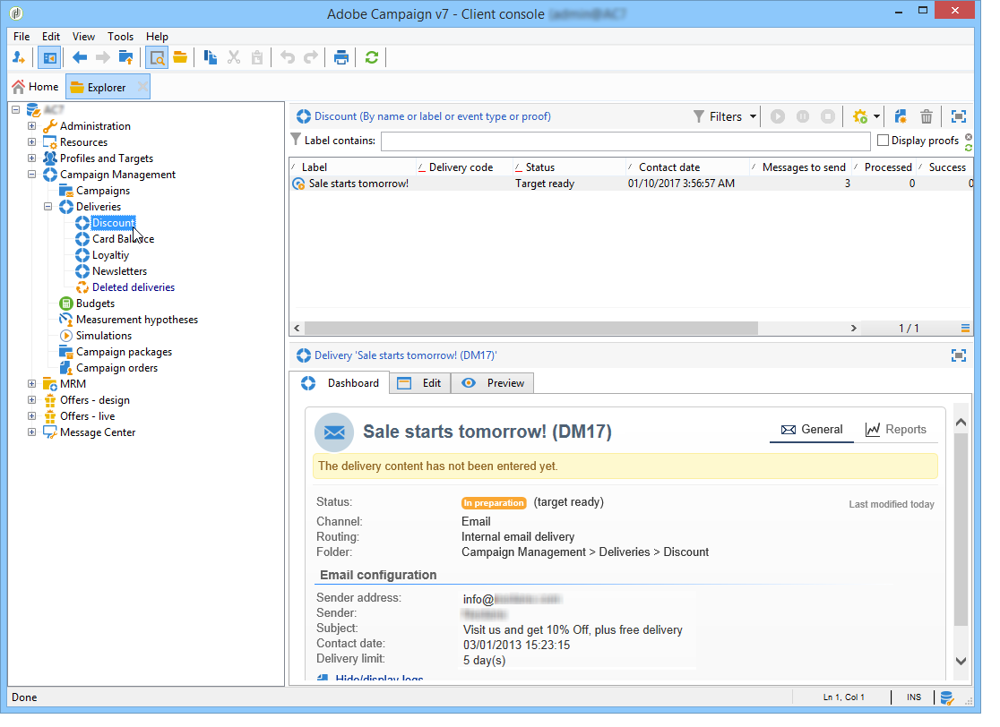

# 管理和自定义列表{#manage-and-customize-lists}

您可以使用资源管理器访问Campaign数据库中的记录列表。 您可以过滤这些列表、运行搜索、添加信息、过滤和排序数据。

## 计数记录 {#counting-records}

默认情况下，Adobe Campaign 会加载列表的前 200 条记录。这意味着不一定会显示您所查看的数据库表的所有记录。您可以统计列表中的记录数量并加载更多记录。

在列表屏幕的右下方， **[!UICONTROL counter]** 显示已加载的记录数以及数据库中的记录总数（在应用任何筛选器后）：

如果右侧出现 **?** 而非数字，可单击计数器启动计算过程。

### 加载更多记录 {#loading-more-records}

要加载（以及显示）其他记录（默认为 200 行），可单击 **[!UICONTROL Continue loading]**。

要加载所有记录，可右键单击列表，然后选择 **[!UICONTROL Load all]**。

>[!CAUTION]
>
>根据记录数，加载完整列表的时间可能会很长。

### 更改默认的记录数 {#change-default-number-of-records}

要更改加载时的默认记录数，可单击列表右下角的 **[!UICONTROL Configure list]**。

在列表配置窗口中，单击 **[!UICONTROL Advanced parameters]** （左下方）并更改要检索的行数。

## 配置列表 {#configuring-lists}

### 添加列 {#add-columns}

在列表中添加列有两种方法。

您可以从记录详细信息快速将列添加到列表。 操作步骤：

1. 在详细信息屏幕中，右键单击要在列中显示的字段。
1. 选择 **[!UICONTROL Add in the list]**。

   该列会添加到现有列的右侧。

添加列的另一种方法是，例如，如果想显示详细信息屏幕上未显示的数据，可使用列表配置窗口。操作步骤：

1. 单击下方列表右侧的 **[!UICONTROL Configure list]**。

   

1. 在列表配置窗口中，双击 **[!UICONTROL Available fields]** 列表中要添加的字段，以便将其添加到 **[!UICONTROL Output columns]**。

   

   >[!NOTE]
   >
   >默认不会显示高级字段。要显示它们，请单击可用字段列表右下方的 **Display advanced fields**。
   >
   >会按照数据库表，然后按字母顺序显示各个标签。
   >
   >使用 **Search** 字段在可用字段中执行搜索。有关详细信息，请参阅 [此部分](#sorting-a-list).
   >
   >通过具体图标标识各字段：SQL 字段、链接的表、已计算字段等。针对选中的每个字段，在可用字段的列表下会显示其说明。[了解详情](#configuring-lists)。
   >
   >您也可以排序和过滤数据。请参阅[此小节](../../platform/using/filtering-options.md)。

1. 对要显示的每个列重复此步骤。
1. 使用箭头修改&#x200B;**显示顺序**。值最高的列将显示在记录列表的左侧。

   

1. 如果需要，可单击 **[!UICONTROL Distribution of values]**，查看目前文件夹中所选字段的重新分区值。

   

1. 单击 **[!UICONTROL OK]** 确认配置并显示结果。

### 新建列 {#create-a-new-column}

您可以创建新的列来显示列表中的其他字段。操作步骤：

1. 单击 **[!UICONTROL Configure the list]** 列表右侧。
1. 单击 **[!UICONTROL Add]** 在列表中显示新字段。

### 移除列 {#remove-a-column}

您可使用列表右下方的 **[!UICONTROL Configure list]** 屏蔽记录列表中的一个列或多个列。

在列表配置窗口中，从 **[!UICONTROL Output columns]** 区域中选择要屏蔽的列，然后单击删除按钮。

对要屏蔽的每个列重复此步骤。单击 **[!UICONTROL OK]** 确认配置并显示结果。

### 调整列宽 {#adjust-column-width}

列表处于活动状态时，即至少选中了一行时，您可以使用 F9 调整列宽，以便在屏幕上显示所有的列。

### 在子文件夹中显示数据 {#display-sub-folders-records}

列表可显示：

* 仅包含在所选文件夹中的记录，
* 或是所选文件夹及其子文件夹中的记录。

要从一个显示模式切换到另一个显示模式，可单击工具栏中的 **[!UICONTROL Display sub-levels]**。

## 保存列表配置 {#saving-a-list-configuration}

列表配置是在工作站级别本地定义的。清空本地缓存时，本地配置被禁用。

默认情况下，会将所定义的显示参数应用到具有相匹配文件夹类型的所有列表上。因此，当您从文件夹修改收件人列表显示方式时，这个配置将应用到所有其他收件人文件夹。

但是也可存储多个配置，从而将其应用到相同类型的不同文件夹。该配置会随包含数据的文件夹的属性一同保存，并可重新应用。

例如，对于投放文件夹，可以配置以下显示：

要保存此列表配置，使其可重复使用，可执行以下操作：

1. 右键单击其中包含已显示数据的文件夹。
1. 选择 **[!UICONTROL Properties]**。
1. 单击 **[!UICONTROL Advanced settings]** 然后在 **[!UICONTROL Configuration]** 字段。

   

1. 单击 **[!UICONTROL OK]** 然后单击 **[!UICONTROL Save]**.

然后可将此配置应用到另一个 **Delivery** 文件夹：

单击文件夹属性窗口中的 **[!UICONTROL Save]**。此时会修改列表显示，以符合所指定的配置：

## 导出列表 {#exporting-a-list}

要从列表中导出数据，必须使用导出向导。要启动此向导，可从列表中选择要导出的元素，右键单击它后选择 **[!UICONTROL Export...]**。

有关导入和导出功能的使用，请参阅 [一般导入和导出](../../platform/using/about-generic-imports-exports.md).

>[!CAUTION]
>
>不得使用“复制/粘贴”功能从列表中导出元素。

## 对列表排序 {#sorting-a-list}

列表中可包含大量的数据。您可以排序这些数据，或者应用简单或高级过滤器。利用排序，您可以按升序或降序顺序显示数据。您可以利用过滤器来定义并组合各种标准，从而仅显示所选的数据。

单击列标题可应用升序或降序排序，或者取消数据排序。正在使用的排序状态和排序顺序会在列标签前方以蓝色箭头表示。列标签前方的红色破折号表示该排序已应用到数据库中已建立索引的数据。此排序方法用于优化排序作业。

此外也可以配置排序或组合排序标准。为此请执行以下操作步骤：

1. **[!UICONTROL Configure list]** 列表右侧。

   

1. 在列表配置窗口中，单击 **[!UICONTROL Sorting]** 选项卡。
1. 选择要排序的字段以及排序方向（升序或降序）。

   

1. 排序优先级通过排序列的顺序来定义。要改变优先级，可使用适当的图标改变各列的顺序。

   

   排序优先级不会影响列表中各类的显示情况。

1. 单击 **[!UICONTROL Ok]** 确认此配置，并在列表中显示结果。

### 搜索元素 {#running-a-search}

您可使用字段列表上方的 **[!UICONTROL Search]** 字段对编辑器中的可用字段进行搜索。按下键盘上的 **Enter** 键或浏览列表。符合搜索内容的字段将以粗体标签显示。

>[!NOTE]
>
>您可以创建过滤器，只显示列表中的部分数据。[了解详情](../../platform/using/creating-filters.md)。
