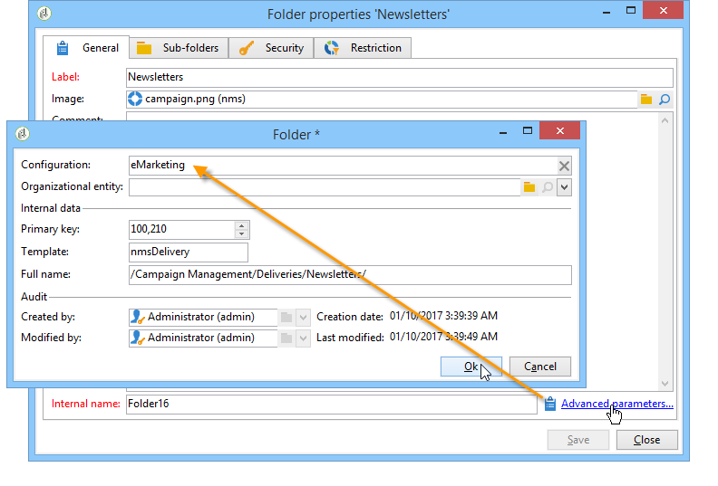

# 管理和自定义列表{#manage-and-customize-lists}

您可以使用资源管理器访问Campaign数据库中的记录列表。 您可以筛选这些列表、运行搜索、添加信息、筛选和排序数据。

## 对记录计数 {#counting-records}

默认情况下，Adobe Campaign会加载列表的前200条记录。 这意味着显示不一定显示您正在查看的表的所有记录。 您可以统计列表中的记录数量并加载更多记录。

在列表屏幕的右下方，**[!UICONTROL counter]**&#x200B;显示已加载的记录数以及数据库中的记录总数（应用任何筛选器后）：

如果是“**”？将显示“**”而不是右侧的数字，请单击计数器以启动计算。

### 加载更多记录 {#loading-more-records}

要加载（并因此显示）其他记录（默认为200行），请单击&#x200B;**[!UICONTROL Continue loading]**。

要加载所有记录，请右键单击列表并选择&#x200B;**[!UICONTROL Load all]**。

>[!CAUTION]
>
>根据记录数，加载完整列表的时间可能会很长。

### 更改默认的记录数 {#change-default-number-of-records}

要更改加载的默认记录数，请单击列表右下角的&#x200B;**[!UICONTROL Configure list]**。

在列表配置窗口中，单击&#x200B;**[!UICONTROL Advanced parameters]** （左下方）并更改要检索的行数。

## 配置列表 {#configuring-lists}

### 添加列 {#add-columns}

在列表中添加列有两种方法。

您可以从记录的详细信息中快速向列表中添加列。 操作步骤：

1. 在详细信息屏幕中，右键单击要在列中显示的字段。
1. 选择 **[!UICONTROL Add in the list]**。

   该列会添加到现有列的右侧。

添加列的另一种方法（例如，如果要显示未在详细信息屏幕上显示的数据）是使用列表配置窗口。 操作步骤：

1. 单击列表右下方的&#x200B;**[!UICONTROL Configure list]**。

   

1. 在列表配置窗口中，双击要添加到&#x200B;**[!UICONTROL Available fields]**&#x200B;列表中的字段以将其添加到&#x200B;**[!UICONTROL Output columns]**。

   

   >[!NOTE]
   >
   >默认情况下，不显示高级字段。 要显示它们，请单击可用字段列表右下方的 **Display advanced fields**。
   >
   >会按照数据库表，然后按字母顺序显示各个标签。
   >
   >使用&#x200B;**搜索**&#x200B;字段在可用字段中运行搜索。 有关详细信息，请参阅[此部分](#sorting-a-list)。
   >
   >字段由特定图标标识：SQL字段、链接表、计算字段等。 对于每个选定的字段，描述都显示在可用字段列表下。 [了解详情](#configuring-lists)。
   >
   >您还可以对数据进行排序和过滤。 请参阅[此小节](../../platform/using/filtering-options.md)。

1. 对要显示的每个列重复此步骤。
1. 使用箭头修改&#x200B;**显示顺序**。 值最高的列将显示在记录列表的左侧。

   

1. 如果需要，可以单击&#x200B;**[!UICONTROL Distribution of values]**&#x200B;查看当前文件夹中选定字段的值的重新分区。

   

1. 单击&#x200B;**[!UICONTROL OK]**&#x200B;以确认配置并显示结果。

### 新建列 {#create-a-new-column}

您可以创建新列以在列表中显示附加字段。 操作步骤：

1. 单击列表右侧下方的&#x200B;**[!UICONTROL Configure the list]**。
1. 单击&#x200B;**[!UICONTROL Add]**&#x200B;以在列表中显示新字段。

### 移除列 {#remove-a-column}

您可以使用位于列表下方和右侧的&#x200B;**[!UICONTROL Configure list]**&#x200B;来屏蔽记录列表中的一列或多列。

在列表配置窗口中，从&#x200B;**[!UICONTROL Output columns]**&#x200B;区域中选择要遮罩的列，然后单击删除按钮。

对要遮罩的每一列重复此操作。 单击&#x200B;**[!UICONTROL OK]**&#x200B;以确认配置并显示结果。

### 调整列宽 {#adjust-column-width}

当列表处于活动状态（即至少选择了一行）时，您可以使用F9调整列的宽度，以使所有列都可以在屏幕上显示。

### 在子文件夹中显示数据 {#display-sub-folders-records}

列表可显示：

* 仅包含在所选文件夹中的记录，
* 或是所选文件夹及其子文件夹中的记录。

要从一种显示模式切换到另一种显示模式，请单击工具栏中的&#x200B;**[!UICONTROL Display sub-levels]**。

## 保存列表配置 {#saving-a-list-configuration}

列表配置是在工作站级别本地定义的。 清空本地缓存时，本地配置被禁用。

默认情况下，定义的显示参数适用于具有相应文件夹类型的所有列表。 因此，当您从文件夹修改收件人列表显示方式时，这个配置将应用到所有其他收件人文件夹。

但是，可以保存多个要应用于相同类型的不同文件夹的配置。 该配置会随包含数据的文件夹的属性一同保存，并可重新应用。

例如，对于投放文件夹，可以配置以下显示：

要保存此列表配置，使其可重复使用，可执行以下操作：

1. 右键单击其中包含已显示数据的文件夹。
1. 选择 **[!UICONTROL Properties]**。
1. 单击&#x200B;**[!UICONTROL Advanced settings]**，然后在&#x200B;**[!UICONTROL Configuration]**&#x200B;字段中指定名称。

   

1. 单击&#x200B;**[!UICONTROL OK]**，然后单击&#x200B;**[!UICONTROL Save]**。

然后可将此配置应用到另一个 **Delivery** 文件夹：

在文件夹属性窗口中单击&#x200B;**[!UICONTROL Save]**。 此时会修改列表显示，以符合所指定的配置：

## 导出列表 {#exporting-a-list}

要从列表中导出数据，必须使用导出助手。 要访问它，请从列表中选择要导出的元素，右键单击并选择&#x200B;**[!UICONTROL Export...]**。

在[通用导入和导出](../../platform/using/about-generic-imports-exports.md)中说明了导入和导出函数的使用。

>[!CAUTION]
>
>不得使用“复制/粘贴”功能从列表中导出元素。

## 对列表排序 {#sorting-a-list}

列表可能包含大量数据。 您可以对这些数据进行排序，或者应用简单或高级过滤器。 排序允许您按升序或降序显示数据。 您可以利用过滤器来定义并组合各种标准，从而仅显示所选的数据。

单击列标题可应用升序或降序排序，或取消数据排序。 活动排序状态和排序顺序在列标签之前用蓝色箭头指示。 列标签前面的红色短划线表示排序应用于从数据库索引的数据。 此排序方法用于优化排序作业。

您还可以配置排序或组合排序标准。 为此请执行以下操作步骤：

1. 列表右侧的下方&#x200B;**[!UICONTROL Configure list]**。

   

1. 在列表配置窗口中，单击&#x200B;**[!UICONTROL Sorting]**&#x200B;选项卡。
1. 选择要排序的字段以及排序方向（升序或降序）。

   

1. 排序优先级由排序列的顺序定义。 要改变优先级，可使用适当的图标改变各列的顺序。

   

   排序优先级不会影响列表中各类的显示情况。

1. 单击&#x200B;**[!UICONTROL Ok]**&#x200B;以确认此配置并在列表中显示结果。

### 搜索元素 {#running-a-search}

您可以使用位于字段列表上方的&#x200B;**[!UICONTROL Search]**&#x200B;字段在编辑器中运行可用字段的搜索。 按键盘上的&#x200B;**Enter**&#x200B;键或浏览列表。 符合搜索内容的字段将以粗体标签显示。

>[!NOTE]
>
>您可以创建过滤器以仅显示列表中的某些数据。 [了解详情](../../platform/using/creating-filters.md)。
