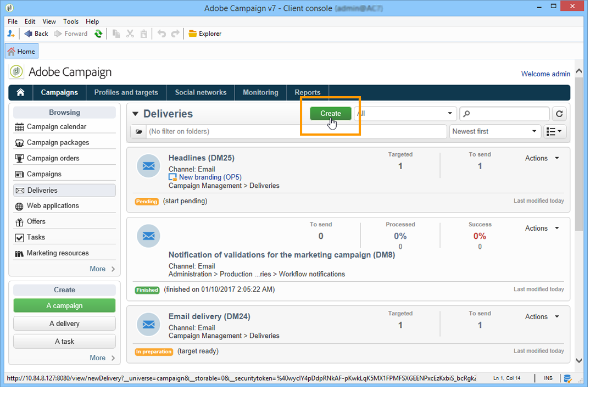

# Adobe Campaign 工作区{#adobe-campaign-workspace}

## 关于 Adobe Campaign 界面 {#about-adobe-campaign-interface}

连接到数据库后，即可访问 Adobe Campaign 主页，这是一个仪表板：其中包含允许您访问各种功能的链接和快捷方式，具体显示哪些取决于您的安装以及常规平台配置。

在主页的中央部分，可以使用链接访问 Campaign 在线文档门户网站、论坛及支持网站。

上面的屏幕快照是 Adobe Campaign 用户主页的一个示例。如需更多信息，请观看 [Adobe Campaign 界面概述视频](https://docs.adobe.com/content/help/en/campaign-learn/campaign-classic-tutorials/getting-started/interface-overview.html)。

>[!NOTE]
>
>在您的实例上有哪些 Adobe Campaign 功能可用取决于已安装的模块和附加组件。根据您的权限及具体配置，部分功能可能无法使用。
>
>在安装任何模块或加载项之前，您需要检查许可协议或与Adobe帐户管理人员联系。

### 控制台和 Web 访问 {#console-and-web-access}

可通过控制台或互联网浏览器访问 Adobe Campaign 平台。

Web 访问提供了与控制台类似的界面，但是功能有所减少。

例如，针对指定的操作员，控制台中会显示活动及以下选项：

而使用 Web 访问时，选项主要是查看功能：

### 语言 {#languages}

安装Adobe Campaign Classic实例时会选择该语言，之后将无法更改。 For more information on how to create an instance, refer to this [page](../../installation/using/creating-an-instance-and-logging-on.md).

您可以选择五种不同的语言：

* 英语（英国）
* 美式英语
* 法语
* 德语
* 日语

您为Adobe Campaign Classic实例选择的语言可能会影响日期和时间格式。 有关更多信息，请参阅此](../../platform/using/adobe-campaign-workspace.md#date-and-time)章节[。

## 导览基本功能 {#navigation-basics}

### 浏览页面 {#browsing-pages}

该平台的各种功能可分为几大核心功能：可使用界面上方的链接来访问这些功能。

可以访问的核心功能列表将取决于您所安装的软件包和附加组件以及访问权。

每项功能都包含一套基于工作任务相关需求及使用情境的功能。例如，**[!UICONTROL Profiles and targets]** 链接可用于访问收件人列表、订阅服务、现有的定位工作流，以及创建这些元素的快捷方式。

The lists are available via the **[!UICONTROL Lists]** link in the left-hand section of the **[!UICONTROL Profiles and Targets]** interface.

### 使用选项卡 {#using-tabs}

* 单击某个核心功能或链接时，相关页面会取代当前的页面。要回到上一页，可单击工具栏上的 **[!UICONTROL Back]** 按钮。要返回主页，可单击 **[!UICONTROL Home]** 按钮。

   

* 如果是某个显示屏幕（例如 Web 应用程序、计划、投放、报告等）的菜单和快捷方式，则会将匹配的页面显示在另一个选项卡中。这样您可以使用选项卡从一个页面浏览至另一页面。

   

### 创建元素 {#creating-an-element}

通过每个核心功能部分可以浏览各种可用的元素。要执行此操作，可使用 **[!UICONTROL Browsing]** 部分中的快捷方式。**[!UICONTROL Other choices]** 链接可用于访问其他所有页面，无论工作环境如何。

您可以创建新元素(投放、Web 应用程序、工作流等) 使用屏幕左 **[!UICONTROL Create]** 侧部分中的快捷键。 使用列表上方的 **[!UICONTROL Create]** 按钮向列表中添加新元素。

例如，在投放页面上，使用 **[!UICONTROL Create]** 按钮创建新的投放。

## 使用 Adobe Campaign Explorer {#using-adobe-campaign-explorer}

### 关于Adobe Campaign Explorer {#about-adobe-campaign-explorer}

可通过工具栏图标访问 Adobe Campaign Explorer。它可用于访问 Adobe Campaign、所有 Adobe Campaign 功能、配置屏幕以及部分平台元素的更详细视图。

**[!UICONTROL Explorer]** 工作区分成三个区域：

**1 - 树状结构**：您可以个性化树状结构的内容（添加、移动或删除节点）。此程序仅适用于专家级用户。有关详细信息，请参见[此页面](../../configuration/using/about-navigation-hierarchy.md)。

**2 - 列表**：您可以过滤列表、执行搜索、添加信息或排序数据。

**3 - 详细信息**：您可以显示所选元素的详细信息。您可以使用右上角的图标以全屏形式显示这些信息。

### 屏幕分辨率 {#screen-resolution}

为了获得最佳的导航和使用性，Adobe 建议您最低使用 1600x900 像素的屏幕分辨率。

>[!CAUTION]
>
>Adobe Campaign 可能不支持 1600x900 像素以下的分辨率。

在 **[!UICONTROL Explorer]** 工作区中，如果出现部分 **[!UICONTROL Details]** 区域被截断，可通过区域顶端的箭头或单击 **[!UICONTROL Enlarge]** 按钮展开该区域。

### 浏览列表 {#browsing-lists}

要浏览列表，可使用&#x200B;**滚动栏**（水平或垂直，同时不会改变记录选择情况）、**鼠标的滚轮**&#x200B;或&#x200B;**箭头键**&#x200B;来滚动页面。

>[!NOTE]
>
>Configuration and personalization of list content are presented in [Configuring lists](#configuring-lists).
>
>您也可以排序和过滤数据。请参 [阅筛选选项](../../platform/using/filtering-options.md)。

### 记录计数 {#counting-records}

默认情况下，Adobe Campaign 会加载列表的前 200 条记录。这意味着不一定会显示您所查看的数据库表的所有记录。您可以统计列表中的记录数量并加载更多记录。

In the lower right-hand part of the list screen, a **[!UICONTROL counter]** shows how many records have been loaded and the total number of records in the database (after applying any filters):

如果右侧出现 **?** 而非数字，可单击计数器启动计算过程。

### 加载更多纪录 {#loading-more-records}

要加载（以及显示）其他记录（默认为 200 行），可单击 **[!UICONTROL Continue loading]**。

要加载所有记录，可右键单击列表，然后选择 **[!UICONTROL Load all]**。

>[!CAUTION]
>
>根据记录数，加载完整列表的时间可能会很长。

### 更改默认的记录数 {#change-default-number-of-records}

要更改加载时的默认记录数，可单击列表右下角的 **[!UICONTROL Configure list]**。

在列表配置窗口中，单击 Advanced parameters（位于左下方），并更改要提取的行数。

### 配置列表 {#configuring-lists}

#### 添加列 {#add-columns}

在列表中添加列有两种方法。

您可以从记录的详细信息快速向列表添加列。 操作步骤：

1. 在详细信息屏幕中，右键单击要在列中显示的字段。
1. 选择 **[!UICONTROL Add in the list]**。

   该列会添加到现有列的右侧。

添加列的另一种方法是，例如，如果想显示详细信息屏幕上未显示的数据，可使用列表配置窗口。操作步骤：

1. 单击下方列表右侧的 **[!UICONTROL Configure list]**。

   

1. 在列表配置窗口中，双击 **[!UICONTROL Available fields]** 列表中要添加的字段，以便将其添加到 **[!UICONTROL Output columns]**。

   

   >[!NOTE]
   >
   >默认不会显示高级字段。要显示它们，请单击可用字段列表右下方的 **Display advanced fields**。
   >
   >会按照数据库表，然后按字母顺序显示各个标签。
   >
   >使用 **Search** 字段在可用字段中执行搜索。有关详细信息，请参 [阅对列表排序](#sorting-a-list)。
   >
   >通过具体图标标识各字段：SQL 字段、链接的表、已计算字段等。针对选中的每个字段，在可用字段的列表下会显示其说明。[配置列表](#configuring-lists).
   >
   >您也可以排序和过滤数据。请参 [阅筛选选项](../../platform/using/filtering-options.md)。

1. 对要显示的每个列重复此步骤。
1. 使用箭头修改&#x200B;**显示顺序**。值最高的列将显示在记录列表的左侧。

   

1. 如果需要，可单击 **[!UICONTROL Distribution of values]**，查看目前文件夹中所选字段的重新分区值。

   

1. 单击 **[!UICONTROL OK]** 确认配置并显示结果。

#### 新建列 {#create-a-new-column}

您可以创建新的列来显示列表中的其他字段。操作步骤：

1. Click **[!UICONTROL Configure the list]** at below and to the right of the list.
1. 单击 **[!UICONTROL Add]** 在列表中显示新字段。

#### 移除列 {#remove-a-column}

您可使用列表右下方的 **[!UICONTROL Configure list]** 屏蔽记录列表中的一个列或多个列。

在列表配置窗口中，从 **[!UICONTROL Output columns]** 区域中选择要屏蔽的列，然后单击删除按钮。

对要屏蔽的每个列重复此步骤。单击 **[!UICONTROL OK]** 确认配置并显示结果。

#### 调整列宽 {#adjust-column-width}

列表处于活动状态时，即至少选中了一行时，您可以使用 F9 调整列宽，以便在屏幕上显示所有的列。

#### 显示子文件夹记录 {#display-sub-folders-records}

列表可显示：

* 仅包含在所选文件夹中的记录，
* 或是所选文件夹及其子文件夹中的记录。

要从一个显示模式切换到另一个显示模式，可单击工具栏中的 **[!UICONTROL Display sub-levels]**。

### 存储一个列表配置 {#saving-a-list-configuration}

列表配置是在工作站级别本地定义的。清空本地缓存时，本地配置被禁用。

默认情况下，会将所定义的显示参数应用到具有相匹配文件夹类型的所有列表上。因此，当您从文件夹修改收件人列表显示方式时，这个配置将应用到所有其他收件人文件夹。

但是也可存储多个配置，从而将其应用到相同类型的不同文件夹。该配置会随包含数据的文件夹的属性一同保存，并可重新应用。

例如，对于投放文件夹，可以配置以下显示：

要保存此列表配置，使其可重复使用，可执行以下操作：

1. 右键单击其中包含已显示数据的文件夹。
1. 选择 **[!UICONTROL Properties]**。
1. Click **[!UICONTROL Advanced settings]** and then specify a name in the **[!UICONTROL Configuration]** field.

   

1. Click **[!UICONTROL OK]** and then click **[!UICONTROL Save]**.

然后可将此配置应用到另一个 **Delivery** 文件夹：

单击文件夹属性窗口中的 **[!UICONTROL Save]**。此时会修改列表显示，以符合所指定的配置：

### 导出列表 {#exporting-a-list}

要从列表中导出数据，必须使用导出向导。要启动此向导，可从列表中选择要导出的元素，右键单击它后选择 **[!UICONTROL Export...]**。

导入和导出功能的使用在通用导入 [和导出中说明](../../platform/using/generic-imports-and-exports.md)。

>[!CAUTION]
>
>不得使用“复制/粘贴”功能从列表中导出元素。

### 排序列表 {#sorting-a-list}

列表中可包含大量的数据。您可以排序这些数据，或者应用简单或高级过滤器。利用排序，您可以按升序或降序顺序显示数据。您可以利用过滤器来定义并组合各种标准，从而仅显示所选的数据。

单击列标题可应用升序或降序排序，或者取消数据排序。正在使用的排序状态和排序顺序会在列标签前方以蓝色箭头表示。列标签前方的红色破折号表示该排序已应用到数据库中已建立索引的数据。此排序方法用于优化排序作业。

此外也可以配置排序或组合排序标准。为此请执行以下操作步骤：

1. **[!UICONTROL Configure list]** 在列表右下。

   

1. 在列表配置窗口中，单击 **[!UICONTROL Sorting]** 选项卡。
1. 选择要排序的字段以及排序方向（升序或降序）。

   

1. 排序优先级通过排序列的顺序来定义。要改变优先级，可使用适当的图标改变各列的顺序。

   

   排序优先级不会影响列表中各类的显示情况。

1. 单击 **[!UICONTROL Ok]** 确认此配置，并在列表中显示结果。

### 执行搜索 {#running-a-search}

您可使用字段列表上方的 **[!UICONTROL Search]** 字段对编辑器中的可用字段进行搜索。按下键盘上的 **Enter** 键或浏览列表。符合搜索内容的字段将以粗体标签显示。

>[!NOTE]
>
>您可以创建过滤器，只显示列表中的部分数据。请参阅 [创建过滤器](../../platform/using/creating-filters.md)。

## 格式和单位 {#formats-and-units}

### 日期和时间 {#date-and-time}

Adobe Campaign Classic 实例的语言将会影响日期和时间格式。

无法在安装后更改您在安装 Campaign 时所选择的语言。您可以选择：美式英语、英式英语、法语、德语或日语。有关详细信息，请参见[此页面](../../installation/using/creating-an-instance-and-logging-on.md)。

美式英语和英式英语的主要差别如下：

<table> 
 <thead> 
  <tr> 
   <th> 格式  </th> 
   <th> 美式英语  </th> 
   <th> 英式英语  </th> 
  </tr> 
 </thead> 
 <tbody> 
  <tr> 
   <td> 日期  </td> 
   <td> 一周从星期日开始  </td> 
   <td> 一周从星期一开始  </td> 
  </tr> 
  <tr> 
   <td> 短日期  </td> 
   <td> 
%2M/%2D/%4Y

<strong>示例：09/25/2018</strong>
 </td> 
   <td> 
%2D/%2M/%4Y

<strong>示例：25/09/2018</strong>
 </td> 
  </tr> 
  <tr> 
   <td> 带时间的短日期  </td> 
   <td> 
%2M/%2D/%4Y %I:%2N:%2S %P

<strong>示例：09/25/2018 10:47:25 PM</strong>
 </td> 
   <td> 
%2D/%2M/%4Y %2H:%2N:%2S

<strong>示例：25/09/2018 22:47:25</strong>
 </td> 
  </tr> 
 </tbody> 
</table>

### 在枚举中添加值 {#add-values-in-an-enumeration}

使用带有下拉式列表的输入字段，您可以输入枚举值，该值将存储起来并且作为下拉式列表中的选项提供。例如，在收件人用户档案的 **[!UICONTROL City]** 选项卡的 **[!UICONTROL General]** 字段中，您可以输入 London。按下 Enter 键确认该值时，一条消息会询问您是否要为与该字段相关联的枚举保存此值。

如果单击 **[!UICONTROL Yes]**，就可以在相关字段的组合框中提供该值（在本例中为 **[!UICONTROL London]**）。

>[!NOTE]
>
>管理员通过 **[!UICONTROL Administration > Platform > Enumerations]** 部分管理枚举（也称为“分项列表”）。For more on this, refer to [Managing enumerations](../../platform/using/managing-enumerations.md).

### 默认单位 {#default-units}

在表示一段时间的字段中（例如，某次投放的资源的有效期、已批准的任务期限等），可采用以下&#x200B;**单位**&#x200B;表示该值：

* **[!UICONTROL s]** 几秒钟内，
* **[!UICONTROL mn]** 几分钟内，
* **[!UICONTROL h]** 几个小时，
* **[!UICONTROL d]** 几天。

