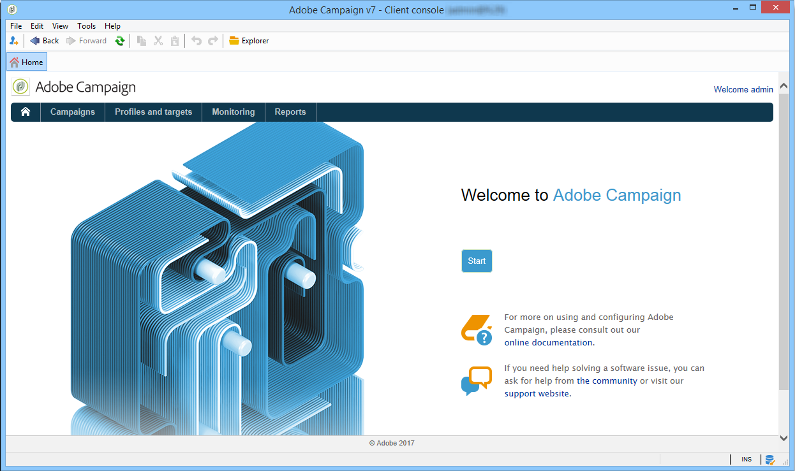

# Adobe Campaign 工作区{#adobe-campaign-workspace}

## 浏览Adobe Campaign接口{#about-adobe-campaign-interface}

连接到数据库后，即可访问 Adobe Campaign 主页，这是一个仪表板：其中包含允许您访问各种功能的链接和快捷方式，具体显示哪些取决于您的安装以及常规平台配置。

在主页的中央部分，可以使用链接访问 Campaign 在线文档门户网站、论坛及支持网站。

[ 在视频中发现 Campaign 工作区](#video)

>[!NOTE]
>
>在您的实例上有哪些 Adobe Campaign 功能可用取决于已安装的模块和附加组件。根据您的权限及具体配置，部分功能可能无法使用。
>
>在安装任何模块或加载项之前，您需要检查您的许可协议或与您的Adobe帐户主管联系。

### 控制台和 Web 访问 {#console-and-web-access}

可通过控制台或互联网浏览器访问 Adobe Campaign 平台。

Web 访问提供了与控制台类似的界面，但是功能有所减少。

例如，针对指定的操作员，控制台中会显示活动及以下选项：

而使用 Web 访问时，选项主要是查看功能：

### 语言{#languages}

安装Adobe Campaign Classic实例时，会选择该语言。

您可以在五种不同语言之间进行选择：

* 英语（英国）
* 美式英语
* 法语
* 德语
* 日语

您为Adobe Campaign Classic实例选择的语言可能会影响日期和时间格式。 有关更多信息，请参阅此](../../platform/using/adobe-campaign-workspace.md#date-and-time)章节[。

有关如何创建实例的详细信息，请参阅此[页面](../../installation/using/creating-an-instance-and-logging-on.md)。

>[!CAUTION]
>
>创建实例后无法更改语言。

## 导览基本功能 {#navigation-basics}

### 浏览页面{#browsing-pages}

该平台的各种功能可分为几大核心功能：可使用界面上方的链接来访问这些功能。

可以访问的核心功能列表将取决于您所安装的软件包和附加组件以及访问权。

每项功能都包含一套基于工作任务相关需求及使用情境的功能。例如，**[!UICONTROL Profiles and targets]** 链接可用于访问收件人列表、订阅服务、现有的定位工作流，以及创建这些元素的快捷方式。

这些列表可通过&#x200B;**[!UICONTROL Profiles and Targets]**&#x200B;接口左侧部分的&#x200B;**[!UICONTROL Lists]**&#x200B;链接访问。

### 使用选项卡{#using-tabs}

* 单击某个核心功能或链接时，相关页面会取代当前的页面。要回到上一页，可单击工具栏上的 **[!UICONTROL Back]** 按钮。要返回主页，可单击 **[!UICONTROL Home]** 按钮。

   

* 如果是某个显示屏幕（例如 Web 应用程序、计划、投放、报告等）的菜单和快捷方式，则会将匹配的页面显示在另一个选项卡中。这样您可以使用选项卡从一个页面浏览至另一页面。

   

### 创建元素{#creating-an-element}

通过每个核心功能部分可以浏览各种可用的元素。要执行此操作，可使用 **[!UICONTROL Browsing]** 部分中的快捷方式。**[!UICONTROL Other choices]** 链接可用于访问其他所有页面，无论工作环境如何。

您可以创建新元素(投放、Web 应用程序、工作流等) 使用屏幕左侧&#x200B;**[!UICONTROL Create]**&#x200B;部分中的快捷键。 使用列表上方的 **[!UICONTROL Create]** 按钮向列表中添加新元素。

例如，在投放页面上，使用 **[!UICONTROL Create]** 按钮创建新的投放。

## 使用Adobe Campaign资源管理器{#using-adobe-campaign-explorer}

可通过工具栏图标访问 Adobe Campaign Explorer。它可用于访问 Adobe Campaign、所有 Adobe Campaign 功能、配置屏幕以及部分平台元素的更详细视图。

**[!UICONTROL Explorer]** 工作区分成三个区域：

**1 - 树状结构**：您可以个性化树状结构的内容（添加、移动或删除节点）。此程序仅适用于专家级用户。有关详细信息，请参阅[此部分](#about-navigation-hierarchy)。)

**2 - 列表**：您可以过滤列表、执行搜索、添加信息或排序数据。[了解详情](adobe-campaign-ui-lists.md)。

**3 - 详细信息**：您可以显示所选元素的详细信息。您可以使用右上角的图标以全屏形式显示这些信息。

### 文件夹和导航树{#about-navigation-hierarchy}

导航树的工作方式类似于文件浏览器（例如Windows资源管理器）。 文件夹可能包含子文件夹。 选择节点后，将显示与该节点对应的视图。

显示的视图是与模式和用于编辑所选行的输入表单相关联的列表。

要向树中添加新文件夹，请右键单击要插入文件夹的分支中的文件夹，然后选择&#x200B;**[!UICONTROL Add new folder]**。 在快捷菜单中，选择要创建的文件类型。

了解如何在本节](../../configuration/using/configuration.md)中配置活动导航树[。

了解如何在此部分](access-management-folders.md)中设置文件夹[的权限。

### 文件夹配置最佳实践

* **使用内置文件夹**

   使用内置文件夹可让不参与项目的人员更轻松地使用、维护和排除应用程序故障。 您不应为收件人、列表、投放等创建自定义文件夹结构，而应使用标准文件夹，如管理、用户档案和目标、活动管理。

* **创建子文件夹**

   将技术工作流放在标准文件夹下：管理/生产/技术工作流，并根据工作流类型创建子目录。

* **设置命名约定**

   例如，您可以按字母顺序命名工作流，以便它们按执行顺序显示。

   例如：

   * A1 — 导入收件人,10:00开始;
   * A2 — 导入票证，11:00开始。

* **创建模板，供用户开始**

   创建投放模板、工作流模板、特定于用户的活动模板。 此结构可以节省时间，并确保为每个用户使用正确的投放映射和类型。

### 屏幕分辨率 {#screen-resolution}

为了获得最佳的导航和使用性，Adobe 建议您最低使用 1600x900 像素的屏幕分辨率。

>[!CAUTION]
>
>1600x900像素以下的分辨率受Adobe Campaign支持。

在 **[!UICONTROL Explorer]** 工作区中，如果出现部分 **[!UICONTROL Details]** 区域被截断，可通过区域顶端的箭头或单击 **[!UICONTROL Enlarge]** 按钮展开该区域。

### 浏览和自定义列表{#browsing-lists}

了解如何浏览、管理和自定义本节](adobe-campaign-ui-lists.md)中的列表[。

## 格式和单位 {#formats-and-units}

### 日期和时间 {#date-and-time}

Adobe Campaign Classic 实例的语言将会影响日期和时间格式。

无法在安装后更改您在安装 Campaign 时所选择的语言。您可以选择：美式英语、英式英语、法语、德语或日语。有关详细信息，请参见[此页面](../../installation/using/creating-an-instance-and-logging-on.md)。

美式英语和英式英语的主要差别如下：

<table> 
 <thead> 
  <tr> 
   <th> 格式  </th> 
   <th> 美式英语  </th> 
   <th> 英式英语  </th> 
  </tr> 
 </thead> 
 <tbody> 
  <tr> 
   <td> 日期  </td> 
   <td> 一周从星期日开始  </td> 
   <td> 一周从星期一开始  </td> 
  </tr> 
  <tr> 
   <td> 短日期  </td> 
   <td> 
%2M/%2D/%4Y

<strong>示例：09/25/2018</strong>
 </td> 
   <td> 
%2D/%2M/%4Y

<strong>示例：25/09/2018</strong>
 </td> 
  </tr> 
  <tr> 
   <td> 带时间的短日期  </td> 
   <td> 
%2M/%2D/%4Y %I:%2N:%2S %P

<strong>示例：09/25/2018 10:47:25 PM</strong>
 </td> 
   <td> 
%2D/%2M/%4Y %2H:%2N:%2S

<strong>示例：25/09/2018 22:47:25</strong>
 </td> 
  </tr> 
 </tbody> 
</table>

### 在枚举中添加值 {#add-values-in-an-enumeration}

使用带有下拉式列表的输入字段，您可以输入枚举值，该值将存储起来并且作为下拉式列表中的选项提供。例如，在收件人用户档案的 **[!UICONTROL City]** 选项卡的 **[!UICONTROL General]** 字段中，您可以输入 London。按下 Enter 键确认该值时，一条消息会询问您是否要为与该字段相关联的枚举保存此值。

如果单击 **[!UICONTROL Yes]**，就可以在相关字段的组合框中提供该值（在本例中为 **[!UICONTROL London]**）。

>[!NOTE]
>
>管理员通过 **[!UICONTROL Administration > Platform > Enumerations]** 部分管理枚举（也称为“分项列表”）。有关详细信息，请参阅[管理明细列表](../../platform/using/managing-enumerations.md)。

### 默认单位 {#default-units}

在表示一段时间的字段中（例如，某次投放的资源的有效期、已批准的任务期限等），可采用以下&#x200B;**单位**&#x200B;表示该值：

* **[!UICONTROL s]** 几秒钟，
* **[!UICONTROL mn]** 几分钟，
* **[!UICONTROL h]** 几个小时，
* **[!UICONTROL d]** 几天。

## 教程视频{#video}

此视频显示Campaign Classic工作区。

>[!VIDEO](https://video.tv.adobe.com/v/35130?quality=12)

其他Campaign Classic操作视频[此处](https://experienceleague.adobe.com/docs/campaign-classic-learn/tutorials/overview.html?lang=zh-Hans)可用。
