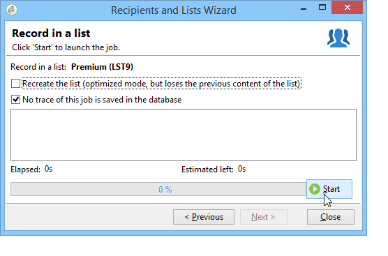

# 创建和管理列表{#creating-and-managing-lists}

## 什么是列表?{#about-lists-in-adobe-campaign}

列表是一组静态用户档案，用于在投放操作期间提供定位目标，或在导入操作或工作流执行期间进行更新。例如，通过查询从数据库中提取出的一组数据即可形成一个列表。

列表通过&#x200B;**[!UICONTROL Profiles and targets]**&#x200B;选项卡中的&#x200B;**[!UICONTROL Lists]**&#x200B;链接进行创建和管理。

Adobe Campaign 提供两类列表：

* **[!UICONTROL Group]** 类型：类 **[!UICONTROL Group]** 型列表属于根据特 **** 定条件选择的人员的列表。此列表就像一组用户档案的快照。请注意，将用户档案添加到数据库时，列表不会自动更新。

   有关如何创建&#x200B;**[!UICONTROL Group]**&#x200B;类型列表的详细信息，请参阅此[页面](#creating-a-profile-list-from-a-group)。

* **[!UICONTROL List]** 类型：类 **[!UICONTROL List]** 型列表允许您使用工作流创建和管理列表。这些列表将是由数据导入生成的特定活动，可通过专用的&#x200B;**[!UICONTROL List update]**&#x200B;工作流进行更新。

   与&#x200B;**[!UICONTROL Group]**&#x200B;类型列表不同，此类型列表可以使用&#x200B;**[!UICONTROL Scheduler]**&#x200B;活动自动更新。 请注意，有关如何创建&#x200B;**[!UICONTROL List]**&#x200B;类型列表的示例，请参阅[此页](../../workflow/using/list-update.md)。

 [在视频中发现此功能](#create-list-video)

## 从组{#creating-a-profile-list-from-a-group}创建用户档案列表

**[!UICONTROL Group]** 通过链接创建 **[!UICONTROL Profiles and targets]** 的类型列表必须基于默认Adobe Campaign用户档案表(nms:收件人)。

>[!NOTE]
>
>要创建包含其他类型数据的列表，您必须执行某个工作流。例如，通过在访客表上运行查询并更新列表，您可以创建一个访客列表。如需有关此工作流的详细信息，请参阅[本章节](../../workflow/using/about-workflows.md)。

要创建新的&#x200B;**[!UICONTROL Group]**&#x200B;类型列表，请应用以下步骤：

1. 单击&#x200B;**[!UICONTROL Create]**&#x200B;按钮并选择&#x200B;**[!UICONTROL New list]**。

   

1. 在列表创建窗口的 **[!UICONTROL Edit]** 选项卡中输入信息。

   * 在 **[!UICONTROL Label]** 字段中输入列表名，如有必要，更改內部名称。
   * 添加此列表的描述。
   * 可指定失效日期：达到此日期后，会清空并自动删除此列表。

      

1. 在 **[!UICONTROL Content]** 选项卡中，单击 **[!UICONTROL Add]** 选择哪些用户档案属于此列表。

   

1. 单击 **[!UICONTROL Save]** 保存列表。然后系统会将其添加到列表概要中。

您可单击 **[!UICONTROL Create]** 直接从“Add profiles”窗口创建新的用户档案。该用户档案也会被添加到数据库中。

与其他列表一样，也可以配置该用户档案列表。请参阅[此章节](../../platform/using/adobe-campaign-workspace.md#configuring-lists)。

## 将数据链接到列表{#linking-data-to-a-list}

>[!NOTE]
>
>只能使用&#x200B;**[!UICONTROL Group]**&#x200B;类型列表将数据链接到列表。

可对一组用户档案进行过滤并将得到的用户档案链接到列表。然后可将投放操作发送到此列表，从而定位用户档案。要分组用户档案：

1. 选择用户档案并单击鼠标右键。
1. 选择 **[!UICONTROL Actions > Associate selection with a list...]**。

   

1. 选择所需的列表或使用 **[!UICONTROL Create]** 按钮创建新列表，然后单击 **[!UICONTROL Next]**。

   

1. 单击 **[!UICONTROL Start]** 按钮。

   

**[!UICONTROL Recreate the list]**&#x200B;选项将从列表中删除早期内容。 此模式已进行了优化，因为无需通过查询来确认用户档案是否已链接到列表。

如果取消选中&#x200B;**[!UICONTROL No trace of this job is saved in the database]**&#x200B;选项，则可以选择（或创建）将存储与此进程链接的信息的执行文件夹。

可在窗口的上半部监控该执行过程。可以通过 **[!UICONTROL Stop]** 按钮停止该过程。已处理的联系人将会链接到列表。

可通过此操作所处理的用户档案上的 **[!UICONTROL Lists]** 选项卡监控该过程：

也可通过 Adobe Campaign 主页编辑列表：单击 **[!UICONTROL Profiles and Targets > Lists]** 菜单，然后选择相关的列表。**[!UICONTROL Content]** 选项卡会显示已链接到此列表的用户档案。

## 从列表{#removing-a-profile-from-a-list}中删除用户档案

要从列表中删除用户档案，您可以：

* 编辑列表，在 **[!UICONTROL Content]** 选项卡中选择用户档案，然后单击 **[!UICONTROL Delete]** 图标。

   

* 编辑用户档案，单击 **[!UICONTROL List]** 选项卡，然后单击 **[!UICONTROL Delete]** 图标。

   

## 删除列表用户档案{#deleting-a-list-of-profiles}

您可以从 Adobe Campaign 树状结构的组列表中删除一个或多个列表。为此可通过 Adobe Campaign 主页中的 **[!UICONTROL Advanced > Explorer]** 链接编辑树状结构。选择相关的组，然后单击鼠标右键。选择 **[!UICONTROL Delete]**。警告消息会要求您确认此删除操作。

>[!NOTE]
>
>删除列表时，该列表上的用户档案不受影响，但会更新其用户档案中的数据。

## 教程视频{#create-list-video}

### 如何创建列表收件人

列表是一组静态收件人档案，用于在投放操作期间提供定位目标，或在导入操作或工作流执行期间进行更新。收件人列表也称为受众。

了解如何通过从资源管理器中配置列表受众来创建收件人。

>[!VIDEO](https://video.tv.adobe.com/v/25602/quality=12)

### 如何使用工作流创建收件人{#create-list-in-a-wf-video}的列表

了解如何创建工作流以目标收件人，以及如何在电子邮件目标中使用列表之前使其重复。

>[!VIDEO](https://video.tv.adobe.com/v/25603?quality=12)

其他Campaign Classic操作视频[此处](https://experienceleague.adobe.com/docs/campaign-classic-learn/tutorials/overview.html?lang=zh-Hans)可用。