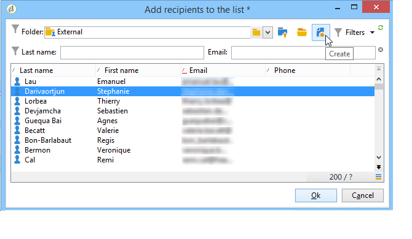

# 创建和管理列表{#creating-and-managing-lists}

## 什么是列表？ {#about-lists-in-adobe-campaign}

列表是一组静态用户档案，用于在投放操作期间提供定位目标，或在导入操作或工作流执行期间进行更新。 例如，通过查询从数据库中提取出的一组数据即可形成一个列表。

通过&#x200B;**[!UICONTROL Profiles and targets]**&#x200B;选项卡中的&#x200B;**[!UICONTROL Lists]**&#x200B;链接创建和管理列表。

Adobe Campaign 提供两类列表：

* **[!UICONTROL Group]**&#x200B;类型： **[!UICONTROL Group]**&#x200B;类型列表属于根据特定条件选择的&#x200B;**静态**&#x200B;人员列表。 该列表就像一组配置文件的快照。 请注意，将用户档案添加到数据库时，列表不会自动更新。

  有关如何创建&#x200B;**[!UICONTROL Group]**&#x200B;类型列表的详细信息，请参阅此[页面](#creating-a-profile-list-from-a-group)。

* **[!UICONTROL List]**&#x200B;类型： **[!UICONTROL List]**&#x200B;类型列表允许您使用工作流创建和管理列表。 这些将是数据导入生成的特定列表，可通过专用的&#x200B;**[!UICONTROL List update]**&#x200B;工作流活动更新这些列表。

  与&#x200B;**[!UICONTROL Group]**&#x200B;类型列表不同，此类型列表可以使用&#x200B;**[!UICONTROL Scheduler]**&#x200B;活动自动更新。 请注意，有关如何创建&#x200B;**[!UICONTROL List]**&#x200B;类型列表的示例，请参阅[此页面](../../workflow/using/list-update.md)。

 [通过观看视频了解此功能](#create-list-video)

## 从组创建配置文件列表 {#creating-a-profile-list-from-a-group}

通过&#x200B;**[!UICONTROL Profiles and targets]**&#x200B;链接创建的&#x200B;**[!UICONTROL Group]**&#x200B;类型列表必须基于默认的Adobe Campaign配置文件表(nms：recipient)。

>[!NOTE]
>
>要创建包含其他类型数据的列表，必须运行工作流。 例如，通过在访客表上使用查询，然后更新列表，您可以创建访客列表。 如需有关此工作流的详细信息，请参阅[本章节](../../workflow/using/about-workflows.md)。

要创建新的&#x200B;**[!UICONTROL Group]**&#x200B;类型列表，请应用以下步骤：

1. 单击&#x200B;**[!UICONTROL Create]**&#x200B;按钮并选择&#x200B;**[!UICONTROL New list]**。

   

1. 在列表创建窗口的&#x200B;**[!UICONTROL Edit]**&#x200B;选项卡中输入信息。

   * 在&#x200B;**[!UICONTROL Label]**&#x200B;字段中输入列表名称，并根据需要更改内部名称。
   * 添加此列表的描述。
   * 可指定失效日期：达到此日期后，会清空并自动删除此列表。

     

1. 在&#x200B;**[!UICONTROL Content]**&#x200B;选项卡中，单击&#x200B;**[!UICONTROL Add]**&#x200B;以选择属于该列表的用户档案。

   

1. 单击&#x200B;**[!UICONTROL Save]**&#x200B;保存列表。 然后系统会将其添加到列表概要中。

您可以单击&#x200B;**[!UICONTROL Create]**，直接从“添加配置文件”窗口创建新配置文件。 该用户档案也会被添加到数据库中。

配置文件列表可以像其他列表一样进行配置。 请参阅[此小节](../../platform/using/adobe-campaign-workspace.md#configuring-lists)。

## 将数据链接到列表 {#linking-data-to-a-list}

>[!NOTE]
>
>只能使用&#x200B;**[!UICONTROL Group]**&#x200B;类型列表将数据链接到列表。

可以过滤一组用户档案的用户档案并将其链接到列表。 然后，可以将投放操作发送到此列表，以定向用户档案。 要分组用户档案：

1. 选择用户档案并单击鼠标右键。
1. 选择 **[!UICONTROL Actions > Associate selection with a list...]**。

   

1. 选择所需的列表或使用&#x200B;**[!UICONTROL Create]**&#x200B;按钮创建新列表，然后单击&#x200B;**[!UICONTROL Next]**。

   

1. 单击 **[!UICONTROL Start]** 按钮。

   

**[!UICONTROL Recreate the list]**&#x200B;选项从列表中删除较早的内容。 此模式已进行了优化，因为无需通过查询来确认用户档案是否已链接到列表。

如果取消选中&#x200B;**[!UICONTROL No trace of this job is saved in the database]**&#x200B;选项，则可以选择（或创建）执行文件夹，其中将存储链接到此进程的信息。

通过窗口的上半部分，您可以监视执行情况。 使用&#x200B;**[!UICONTROL Stop]**&#x200B;按钮可停止该进程。 已处理的联系人将会链接到列表。

您可以通过此操作涉及的配置文件上的&#x200B;**[!UICONTROL Lists]**&#x200B;选项卡监视进程：

您还可以通过Adobe Campaign主页编辑列表：单击&#x200B;**[!UICONTROL Profiles and Targets > Lists]**&#x200B;菜单并选择相关列表。 **[!UICONTROL Content]**&#x200B;选项卡显示链接到此列表的用户档案。

## 从列表中删除配置文件 {#removing-a-profile-from-a-list}

要从列表中删除用户档案，您可以：

* 编辑列表，在&#x200B;**[!UICONTROL Content]**&#x200B;选项卡中选择配置文件，然后单击&#x200B;**[!UICONTROL Delete]**&#x200B;图标。

  

* 编辑配置文件，单击&#x200B;**[!UICONTROL List]**&#x200B;选项卡，然后单击&#x200B;**[!UICONTROL Delete]**&#x200B;图标。

  

## 删除配置文件列表 {#deleting-a-list-of-profiles}

您可以从Adobe Campaign树的组列表中删除一个或多个列表。 为此，请通过Adobe Campaign主页中的&#x200B;**[!UICONTROL Advanced > Explorer]**&#x200B;链接编辑树。 选择相关组并右键单击。 选择 **[!UICONTROL Delete]**。警告消息会要求您确认此删除操作。

>[!NOTE]
>
>删除列表时，该列表上的用户档案不受影响，但会更新其用户档案中的数据。

## 教程视频 {#create-list-video}

### 如何创建收件人列表

列表是一组静态收件人档案，用于在投放操作期间提供定位目标，或在导入操作或工作流执行期间进行更新。收件人列表也称为受众。

了解如何通过从Explorer配置收件人列表来创建受众。

>[!VIDEO](https://video.tv.adobe.com/v/25602/quality=12)

### 如何使用工作流创建收件人列表 {#create-list-in-a-wf-video}

了解如何在电子邮件目标中使用列表之前创建工作流以定位收件人，以及如何使其重复执行。

>[!VIDEO](https://video.tv.adobe.com/v/25603?quality=12)

[此处](https://experienceleague.adobe.com/docs/campaign-classic-learn/tutorials/overview.html?lang=zh-Hans)提供了其他 Campaign Classic 操作方法视频。
