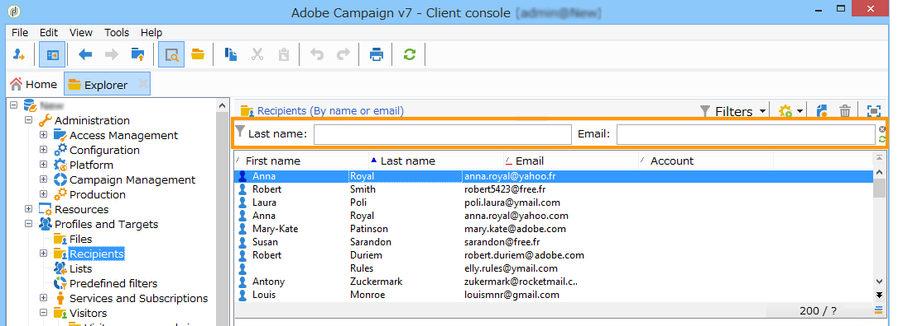
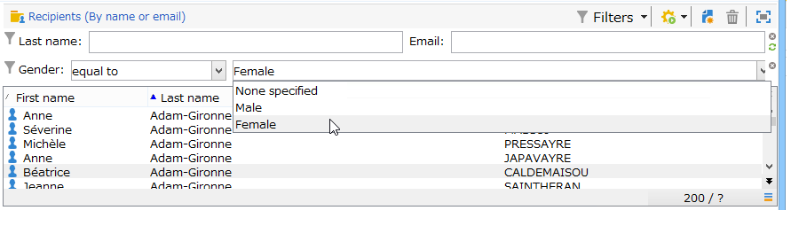
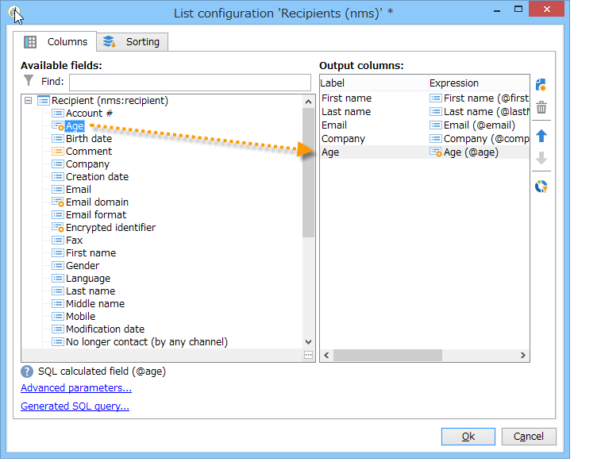
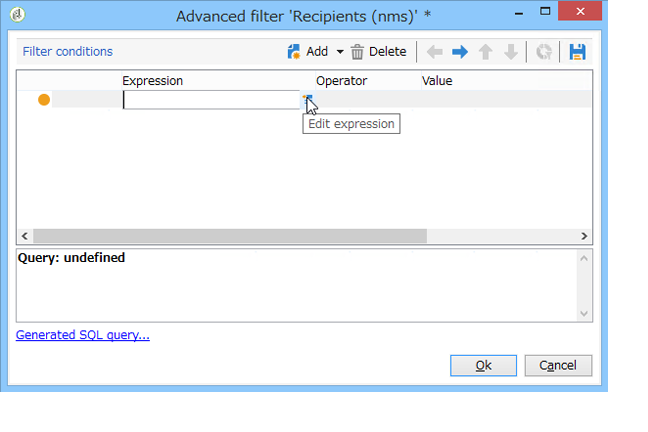
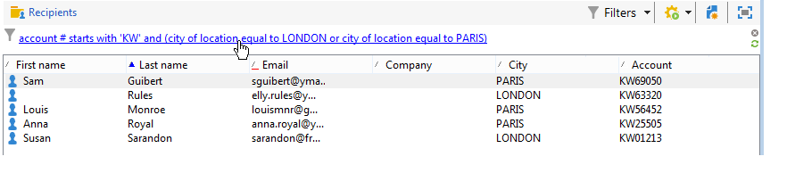
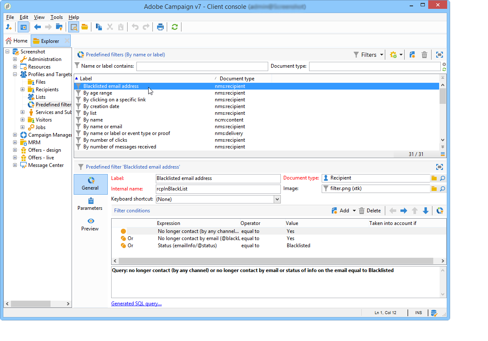
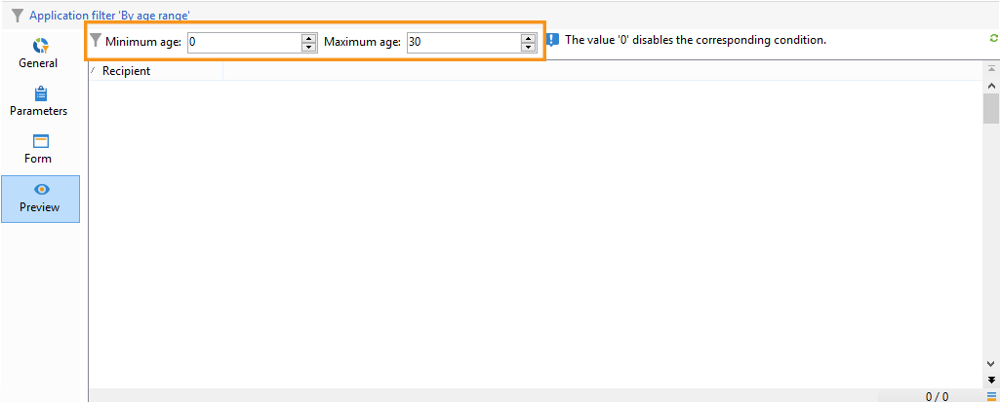

# 创建过滤器{#creating-filters}

在Adobe Campaign树中导航时(从 **[!UICONTROL Explorer]** 菜单)，则数据库中包含的数据会显示在列表中。 可以将这些列表配置为仅显示运算符所需的数据。 然后，可以对过滤的数据启动操作。 筛选器配置允许您从列表中选择数据 **[!UICONTROL dynamically]**. 如果修改了数据，则更新过滤的数据。

>[!NOTE]
>
>用户界面配置设置是在设备级别本地定义的。 有时可能有必要清除此数据，尤其是在刷新数据时出现问题的情况下。 要执行此操作，请使用 **[!UICONTROL File > Clear the local cache]** 菜单。

## 可用筛选器的类型 {#typology-of-available-filters}

Adobe Campaign允许您将过滤器应用于数据列表。

这些过滤器只能使用一次，您也可以保存它们以供将来使用。 您可以同时应用多个过滤器。

Adobe Campaign中有以下过滤器类型：

* **默认筛选条件**

   此 **默认筛选条件** 可通过位于列表上方的字段访问。 它允许您根据预定义字段进行筛选（对于收件人用户档案，默认情况下是名称和电子邮件地址）。 您可以使用字段输入要过滤的字符，或从下拉列表中选择过滤条件。

   
<!--
  >[!NOTE]
  >
  >The **%** character replaces any character string. For example, the string `%@yahoo.com` lets you display all the profiles with an email address in the domain "yahoo.com".
-->
您可以更改列表的默认筛选器。 有关更多信息，请参阅 [更改默认筛选器](#altering-the-default-filter).

* **简单过滤器**

   **简单过滤器** 是列的一次性过滤器。 在显示的列上使用一个或多个简单搜索条件来定义它们。

   您可以在同一数据列表上组合多个简单过滤器来优化搜索。 过滤器字段显示在一个字段的下方。 它们可以相互独立地删除。

   

   有关简单过滤器的详情，请参见 [创建简单过滤器](#creating-a-simple-filter).

* **高级过滤器**

   **高级过滤器** 使用查询或数据查询组合创建。

   有关创建高级过滤器的更多信息，请参阅 [创建高级过滤器](#creating-an-advanced-filter).

   您可以使用函数来定义过滤器的内容。 有关更多信息，请参阅 [使用函数创建高级过滤器](#creating-an-advanced-filter-with-functions).

   >[!NOTE]
   >
   >有关在Adobe Campaign中构建查询的更多信息，请参阅 [本节](../../platform/using/about-queries-in-campaign.md).

* **用户过滤器**

   An **应用程序过滤器** 是一个高级过滤器，已保存，可用于与其他操作员共享其配置。

   此 **[!UICONTROL Filters]** 位于列表上方的按钮提供了一组应用程序过滤器，可以组合这些过滤器来优化过滤。 中介绍了创建这些滤波器的方法 [保存过滤器](#saving-a-filter).

## 更改默认筛选器 {#altering-the-default-filter}

要更改收件人列表的默认筛选条件，请单击 **[!UICONTROL Profiles and Targets > Pre-defined filters]** 树节点。

对于所有其他类型的数据，请通过 **[!UICONTROL Administration > Configuration > Predefined filters]** 节点。

应用以下步骤：

1. 选择您希望默认使用的过滤器。
1. 单击 **[!UICONTROL Parameters]** 选项卡并选择 **[!UICONTROL Default filter for the associated document type]**.

   

   >[!CAUTION]
   >
   >如果已对列表应用了默认筛选器，则需要先禁用该筛选器，然后再应用新筛选器。 要实现此目的，请单击筛选字段右侧的红十字。

1. 单击 **[!UICONTROL Save]** 以应用过滤器。

   >[!NOTE]
   >
   >有关过滤器定义窗口的详情，请参阅 [创建高级过滤器](#creating-an-advanced-filter) 和 [保存过滤器](#saving-a-filter).

## 创建简单过滤器 {#creating-a-simple-filter}

创建 **简单过滤器**，应用以下步骤：

1. 右键单击要过滤的字段并选择 **[!UICONTROL Filter on this field]**.

   

   默认筛选条件字段显示在列表上方。

1. 从下拉列表中选择过滤器选项，或输入要应用的过滤器条件（选择或输入条件的方法取决于字段类型：文本、枚举等）。

   

1. 要激活过滤器，请按键盘上的Enter键，或单击过滤器字段右侧的绿色箭头。

如果要筛选数据的字段未显示在用户档案的表单中，则可以在显示的列中添加该字段，然后对该列进行筛选。 要执行此操作，

1. 单击 **[!UICONTROL Configure the list]** 图标。

   

1. 选择要显示的列，例如收件人的年龄。

   

1. 右键单击 **年龄** 列，然后选择 **[!UICONTROL Filter on this column]**.

   

   然后，您可以选择年龄筛选选项。

   

## 创建高级过滤器 {#creating-an-advanced-filter}

创建 **高级过滤器**，应用以下步骤：

1. 单击 **[!UICONTROL Filters]** 按钮并选择 **[!UICONTROL Advanced filter...]**.

   

   您还可以右键单击要筛选的数据列表并选择 **[!UICONTROL Advanced filter...]**.

   此时将显示筛选条件定义窗口。

1. 单击 **[!UICONTROL Expression]** 列来定义输入值。
1. 单击 **[!UICONTROL Edit expression]** 以选择将应用过滤器的字段。

   

1. 从列表中，选择要筛选数据的字段。 单击 **[!UICONTROL Finish]** 确认。
1. 单击 **[!UICONTROL Operator]** 列并从下拉列表中选择要应用的运算符。
1. 从中选择预期值 **[!UICONTROL Value]** 列。 您可以组合多个筛选器以优化查询。 要添加筛选条件，请单击 **[!UICONTROL Add]**.

   

1. 您可以为表达式分配层次结构，也可以使用工具栏箭头更改查询表达式的顺序。
1. 表达式之间的默认运算符为 **和**，但您可以通过单击字段更改此设置。 您可以选择 **或** 运算符。

   

1. 单击 **[!UICONTROL OK]** 以确认过滤器创建并将其应用于列表。

应用的过滤器显示在列表上方。

要编辑或修改此筛选器，请单击其标签。

要取消此筛选器，请单击 **[!UICONTROL Remove this filter]** 图标。

您可以保存高级筛选器以将其保留供将来使用。 有关此类型过滤器的更多信息，请参阅 [保存过滤器](#saving-a-filter).

### 使用函数创建高级过滤器 {#creating-an-advanced-filter-with-functions}

高级过滤器可以使用函数； **带有函数的过滤器** 通过表达式编辑器创建，该编辑器允许您使用数据库数据和高级函数创建公式。 要使用函数创建过滤器，请重复高级过滤器创建步骤1、2和3，然后按照以下步骤操作：

1. 在字段选择窗口中，单击 **[!UICONTROL Advanced selection]**.
1. 选择要使用的公式类型：聚合、现有用户筛选器或表达式。

   

   可以使用以下选项：

   * **[!UICONTROL Field only]** 以选择字段。 这是默认模式。
   * **[!UICONTROL Aggregate]** 以选择要使用的汇总公式（计数、总和、平均值、最大值、最小值）。
   * **[!UICONTROL User filter]** 以选择现有用户筛选器之一。 有关用户过滤器的详细信息，请参见 [保存过滤器](#saving-a-filter).
   * **[!UICONTROL Expression]** 以访问表达式编辑器。

      表达式编辑器允许您定义高级过滤器。 它看起来如下所示：

      

      它允许您选择数据库表中的字段并将高级函数附加到该表中：选择要在 **[!UICONTROL List of functions]**. 有关可用功能的详情，请参见 [函数列表](../../platform/using/defining-filter-conditions.md#list-of-functions). 接下来，选择与函数相关的一个或多个字段，然后单击 **[!UICONTROL OK]** 以批准表达式。

      >[!NOTE]
      >
      >有关基于表达式创建过滤器的示例，请参阅 [本节](../../workflow/using/sending-a-birthday-email.md#identifying-recipients-whose-birthday-it-is).

## 保存过滤器 {#saving-a-filter}

过滤器特定于每个运算符，每当运算符清除其客户端控制台的缓存时，都会重新初始化过滤器。

您可以创建 **应用程序过滤器** 保存高级过滤器：可通过右键单击任何列表或通过 **[!UICONTROL Filters]** 按钮时，单击鼠标左上角的“ ”按钮。

这些过滤器也可以直接通过投放向导在目标选择阶段访问(请参阅 [本节](../../delivery/using/creating-an-email-delivery.md) 以了解有关创建投放的更多信息)。 要创建应用程序过滤器，您可以：

* 将高级过滤器转换为应用程序过滤器。 要执行此操作，请单击 **[!UICONTROL Save]** ，然后再关闭高级过滤器编辑器。

   

* 通过以下方式创建此应用程序过滤器 **[!UICONTROL Administration > Configuration > Predefined filters]** (或 **[!UICONTROL Profiles and targets > Predefined filters]** （对于收件人）树节点。 要实现此目的，请右键单击筛选器列表，然后选择 **[!UICONTROL New...]**. 该过程与创建高级过滤器的过程相同。

   此 **[!UICONTROL Label]** 字段可让您命名此过滤器。 此名称将显示在 **[!UICONTROL Filters...]** 按钮。

   

您可以通过右键单击并选择 **[!UICONTROL No filter]** 或通过 **[!UICONTROL Filters]** 图标的位置。

您可以通过单击 **[!UICONTROL Filters]** 按钮并使用 **[!UICONTROL And...]** 菜单。

## 筛选收件人 {#filtering-recipients}

预定义过滤器(请参阅 [保存过滤器](#saving-a-filter))使您能够筛选数据库中包含的收件人的用户档案。 您可以从以下位置编辑过滤器： **[!UICONTROL Profiles and Targets > Predefined filters]** 树节点。 过滤器通过列在工作区上半部分的 **[!UICONTROL Filters]** 按钮。

选择一个筛选器以显示其定义并访问已筛选数据的预览。

>[!NOTE]
>
>有关预定义过滤器创建的详细示例，请参阅 [用例](../../platform/using/use-case.md).

预定义过滤器包括：

<table> 
 <tbody> 
  <tr> 
   <td> <strong>标签</strong>  </td> 
   <td> <strong>查询</strong>  </td> 
  </tr> 
  <tr> 
   <td> 已打开  </td> 
   <td> 选择已打开投放的收件人。  </td> 
  </tr> 
  <tr> 
   <td> 已打开但未单击  </td> 
   <td> 选择已打开投放但未单击链接的收件人。  </td> 
  </tr> 
  <tr> 
   <td> 不活动的收件人  </td> 
   <td> 选择在X个月内未打开投放的收件人。  </td> 
  </tr> 
  <tr> 
   <td> 按设备类型显示的上次活动  </td> 
   <td> 选择在过去Z天内使用设备X单击或打开了投放Y的收件人。  </td> 
  </tr> 
  <tr> 
   <td> 按设备类型显示的上次活动（跟踪）  </td> 
   <td> 选择在过去Z天内使用设备X单击或打开了投放Y的收件人。  </td> 
  </tr> 
  <tr> 
   <td> 未定位的收件人  </td> 
   <td> 选择在X个月内从未通过渠道Y定位的收件人。  </td> 
  </tr> 
  <tr> 
   <td> 非常活跃的收件人  </td> 
   <td> 选择在过去Y个月内至少点击过投放X次的收件人。  </td> 
  </tr> 
  <tr> 
 <td> 电子邮件地址列入阻止列表  </td> 
    <td> 选择电子邮件地址位于阻止列表上的收件人。  </td>
  </tr> 
  <tr> 
   <td> 隔离的电子邮件地址  </td> 
   <td> 选择其电子邮件地址被隔离的收件人。  </td> 
  </tr> 
  <tr> 
   <td> 文件夹中重复的电子邮件地址  </td> 
   <td> 选择文件夹中电子邮件地址重复的收件人。  </td> 
  </tr> 
  <tr> 
   <td> 未打开也未单击  </td> 
   <td> 选择尚未打开投放或单击投放的收件人。  </td> 
  </tr> 
  <tr> 
   <td> 新收件人（天）  </td> 
   <td> 选择最近X天创建的收件人。  </td> 
  </tr> 
  <tr> 
   <td> 新收件人（分钟）  </td> 
   <td> 选择最近X分钟创建的收件人。  </td> 
  </tr> 
  <tr> 
   <td> 新收件人（月）  </td> 
   <td> 选择过去X个月中创建的收件人。  </td> 
  </tr> 
  <tr> 
   <td> 按订阅  </td> 
   <td> 按订阅选择收件人。  </td> 
  </tr> 
  <tr> 
   <td> 通过单击特定链接  </td> 
   <td> 选择在投放中单击特定URL的收件人。  </td> 
  </tr> 
  <tr> 
   <td> 按帖子投放行为  </td> 
   <td> 根据收件人接收投放后的行为选择收件人。  </td> 
  </tr> 
  <tr> 
   <td> 按创建日期  </td> 
   <td> 按创建日期选择从X个月（当前日期减去n个月）到Y个月（当前日期减去n个月）的期间的收件人。  </td> 
  </tr> 
  <tr> 
   <td> 按列表  </td> 
   <td> 按列表选择收件人。  </td> 
  </tr> 
  <tr> 
   <td> 按点击次数  </td> 
   <td> 选择过去X个月内点击过投放的收件人。  </td> 
  </tr> 
  <tr> 
   <td> 按收到的消息数  </td> 
   <td> 根据收件人收到的邮件数选择收件人。  </td> 
  </tr> 
  <tr> 
   <td> 按打开次数  </td> 
   <td> 选择在X和Y投放之间在Z时间内打开的收件人。  </td> 
  </tr> 
  <tr> 
   <td> 按名称或电子邮件  </td> 
   <td> 根据收件人的姓名或电子邮件选择收件人。  </td> 
  </tr> 
  <tr> 
   <td> 按年龄范围  </td> 
   <td> 根据收件人的年龄选择收件人。  </td> 
  </tr> 
 </tbody> 
</table>

>[!NOTE]
>
>关于计数和期间的所有比较应从更广泛的意义上理解（与查询限制相对应的收件人包括在比较中）。

数据计算方式示例：

* 选择小于30岁的收件人：

   

* 选择18岁或以上的收件人：

   

* 选择年龄在18到30岁之间的收件人：

   

## 数据过滤器的高级设置 {#advanced-settings-for-data-filters}

单击 **[!UICONTROL Settings]** 选项卡访问以下选项：

* **[!UICONTROL Default filter for the associated document type]**：利用此选项，可在排序相关列表的编辑器中默认建议此过滤器。

   例如， **[!UICONTROL By name or login]** 过滤器应用于运算符。 该选项处于选中状态，因此筛选器始终在所有运算符列表中提供。

* **[!UICONTROL Filter shared with other operators]**：利用此选项可让过滤器可用于当前数据库上的所有其他运算符。
* **[!UICONTROL Use parameter entry form]**：利用此选项可定义在选择此过滤器时显示在列表上方的过滤器字段。 这些字段允许您定义过滤器设置。 必须通过XML格式输入此表单 **[!UICONTROL Form]** 按钮。 例如，预配置的过滤器 **[!UICONTROL Recipients who have opened]**&#x200B;在收件人列表中显示的过滤器字段可让您选择过滤器针对的投放。

   此 **[!UICONTROL Preview]** 按钮显示所选过滤器的结果。

* 此 **[!UICONTROL Advanced parameters]** 链接允许您定义其他设置。 特别是，您可以将SQL表与过滤器关联，使其对共享该表的所有编辑器通用。

   选择 **[!UICONTROL Do not restrict the filter]** 选项。

   为投放向导中提供的“投放的收件人”和“属于文件夹的投放的收件人”过滤器启用此选项，这些过滤器无法过载。

   
