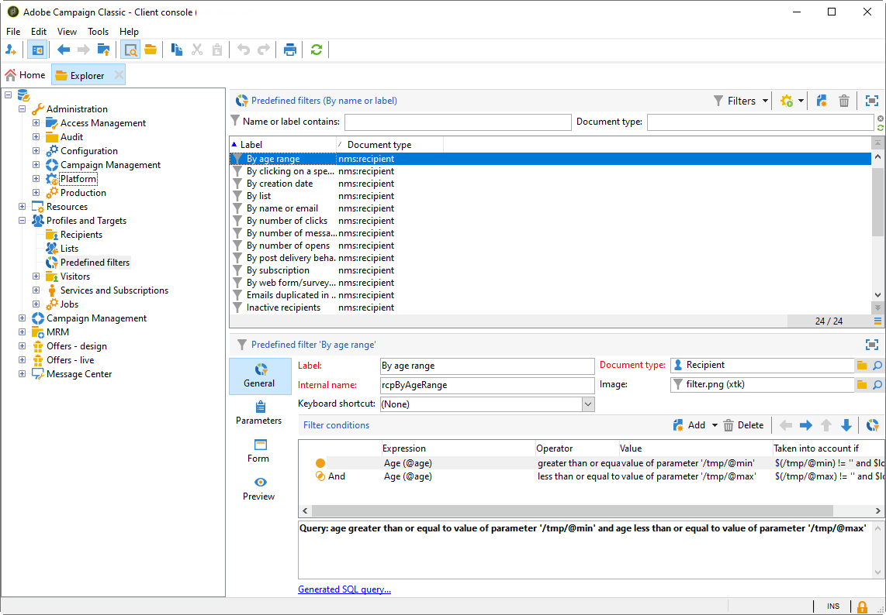

# 创建过滤器{#creating-filters}

## 简介 {#introduction}

在Adobe Campaign树中导航时(从的 **[!UICONTROL Explorer]** 菜单中),主页中包含的数据以列表显示。 这些列表可以配置为仅显示操作员需要的数据。 然后，可以对已过滤的数据启动操作。 过滤器配置允许您从列表中选择数 **[!UICONTROL dynamically]**&#x200B;据。 如果修改了数据，则更新筛选的数据。

>[!NOTE]
>
>显示配置在工作站级别本地定义。 它存储在隐藏文件中，有时可能需要清除此数据，尤其是在刷新数据时出现问题时。 为此，请使用菜 **[!UICONTROL File > Clear the local cache]** 单。

## 可用过滤器的类型 {#typology-of-available-filters}

Adobe Campaign允许您将过滤器应用于数据列表。

这些过滤器可以使用一次，也可以保存以备将来使用。 您可以同时应用多个过滤器。

以下筛选器类型在Adobe Campaign中可用：

* 默认过滤器

   默认 **过滤器** ，可通过位于列表上方的字段访问。 它允许您筛选预定义的字段(对于收件人用户档案，默认情况下这些是名称和电子邮件地址)。 您可以使用这些字段输入要筛选的字符或从下拉列表中选择筛选条件。

   
<!--
  >[!NOTE]
  >
  >The **%** character replaces any character string. For example, the string `%@yahoo.com` lets you display all the profiles with an e-mail address in the domain "yahoo.com".
-->
您可以更改列表的默认过滤器。 有关此功能的详细信息，请参 [阅更改默认过滤器](#altering-the-default-filter)。

* 简单过滤器

   **简单过滤器** 是列上的一次性过滤器。 这些属性在显示的列上使用一个或多个简单的搜索条件进行定义。

   您可以将多个简单的过滤器组合到同一数据列表中以细化搜索。 筛选器字段显示在另一个下方。 可以相互独立地删除它们。

   

   简单过滤器在创建简 [单过滤器中有详细介绍](#creating-a-simple-filter)。

* 高级过滤器

   **高级过滤器** 是使用查询或查询组合创建的。

   有关创建高级过滤器的详细信息，请参 [阅创建高级过滤器](#creating-an-advanced-filter)。

   您可以使用函数定义筛选器的内容。 有关此功能的详细信息，请 [参阅创建具有功能的高级过滤器](#creating-an-advanced-filter-with-functions)。

   >[!NOTE]
   >
   >有关在Adobe Campaign中构建查询的详细信息，请参 [阅本节](../../platform/using/about-queries-in-campaign.md)。

* 用户过滤器

   应 **用程序过滤** 器是已保存的高级过滤器，用于使用其配置并与其他运算符共享。

   位 **[!UICONTROL Filters]** 于列表上方的按钮优惠一组应用程序过滤器，这些可以合并来优化过滤。 创建这些过滤器的方法在保存 [过滤器中介绍](#saving-a-filter)。

## 更改默认过滤器 {#altering-the-default-filter}

要更改收件人列表的默认筛选器，请单 **[!UICONTROL Profiles and Targets > Pre-defined filters]** 击树的节点。

对于所有其他类型的数据，请通过节点配置默认筛 **[!UICONTROL Administration > Configuration > Predefined filters]** 选器。

应用以下步骤：

1. 选择默认要使用的筛选器。
1. 单击选 **[!UICONTROL Parameters]** 项卡并选择 **[!UICONTROL Default filter for the associated document type]**。

   

   >[!CAUTION]
   >
   >如果默认筛选器已应用于列表，则需要在应用新筛选器之前禁用它。 为此，请单击筛选字段右侧的红叉。

1. 单 **[!UICONTROL Save]** 击以应用筛选器。

   >[!NOTE]
   >
   >过滤器定义窗口在创建高级 [过滤器和保存过滤器](#creating-an-advanced-filter)[中有详细介绍](#saving-a-filter)。

## 创建简单的过滤器 {#creating-a-simple-filter}

要创建简单 **的筛选**，请应用以下步骤：

1. 右键单击要筛选的字段并进行选择 **[!UICONTROL Filter on this field]**。

   

   默认筛选器字段显示在列表上方。

1. 从下拉列表中选择筛选选项，或输入要应用的筛选条件(选择或输入条件的方法取决于字段的类型：文本、枚举等。)

   

1. 要激活滤镜，请按键盘上的Enter键，或单击滤镜字段右侧的绿色箭头。

如果要筛选数据的字段未以用户档案的形式显示，则可以在显示的列中添加它，然后对该列进行筛选。 为此，

1. 单击该 **[!UICONTROL Configure the list]** 图标。

   

1. 选择要显示的列，例如收件人的年龄。

   

1. 右键单击收件人 **列表** 中的 **[!UICONTROL Filter on this column]**“年龄”列，然后选择。

   

   然后，您可以选择年龄筛选选项。

   

## 创建高级过滤器 {#creating-an-advanced-filter}

要创建高级 **过滤器**，请应用以下步骤：

1. Click the **[!UICONTROL Filters]** button and select **[!UICONTROL Advanced filter...]**.

   

   您还可以右键单击列表进行筛选和选择 **[!UICONTROL Advanced filter...]**。

   将显示筛选条件定义窗口。

1. 单击列 **[!UICONTROL Expression]** 以定义输入值。
1. 单 **[!UICONTROL Edit expression]** 击以选择要应用筛选器的字段。

   

1. 从列表中，选择要筛选数据的字段。 Click **[!UICONTROL Finish]** to confirm.
1. 单击列 **[!UICONTROL Operator]** 并从下拉列表中选择要应用的运算符。
1. 从列中选择一个预期 **[!UICONTROL Value]** 值。 您可以合并多个过滤器来优化查询。 要添加筛选条件，请单击 **[!UICONTROL Add]**。

   

1. 您可以为表达式分配层次结构，或使用工具栏箭头更改查询表达式的顺序。
1. 表达式之间的默认运 **算符**&#x200B;为“And”，但您可以通过单击字段来更改此值。 您可以选择一个 **或运** 算符。

   

1. 单 **[!UICONTROL OK]** 击以确认创建筛选器并将其应用到列表。

应用的筛选器显示在列表上方。

要编辑或修改此过滤器，请单击其标签。

要取消此过滤器，请单 **[!UICONTROL Remove this filter]** 击该过滤器右侧的图标。

您可以保存高级过滤器以备将来使用。 有关此类型筛选器的详细信息，请参 [阅保存筛选器](#saving-a-filter)。

### 创建具有函数的高级过滤器 {#creating-an-advanced-filter-with-functions}

高级过滤器可以使用功能； **具有函数的过滤器** ，通过表达式编辑器创建，该编辑器允许您使用数据库数据和高级函数创建公式。 要创建具有函数的过滤器，请重复创建高级过滤器步骤1、2和3，然后按如下步骤继续：

1. 在字段选择窗口中，单击 **[!UICONTROL Advanced selection]**。
1. 选择要使用的公式类型：聚合、现有用户筛选器或表达式。

   

   可以使用以下选项：

   * **[!UICONTROL Field only]** 的双曲余切值。 这是默认模式。
   * **[!UICONTROL Aggregate]** 选择要使用的聚合公式（计数、和、平均、最大、最小）。
   * **[!UICONTROL User filter]** 选择现有用户过滤器。 用户过滤器详 [细介绍](#saving-a-filter)。
   * **[!UICONTROL Expression]** 访问表达式编辑器。

      表达式编辑器允许您定义高级过滤器。 它看起来如下所示：

      

      它允许您选择数据库表中的字段，并为它们附加高级函数：选择要在中使用的函数 **[!UICONTROL List of functions]**。 可用的功能在功能 [列表中详述](../../platform/using/defining-filter-conditions.md#list-of-functions)。 然后，选择与这些函数相关的字段，并单 **[!UICONTROL OK]** 击以批准表达式。

      >[!NOTE]
      >
      >有关基于表达式创建筛选器的示例，请参阅 [识别生日收件人](../../workflow/using/sending-a-birthday-email.md#identifying-recipients-whose-birthday-it-is)。

## 保存过滤器 {#saving-a-filter}

过滤器特定于每个操作符，并且每次操作符清除其客户端控制台的缓存时都重新初始化。

您可以通过保存高 **级过滤器** 来创建应用程序过滤器：它可以通过在任何列表中右键单击或通过位于列表上 **[!UICONTROL Filters]** 方的按钮重新使用。

这些过滤器还可以直接通过投放向导在目标选择阶段进行访问(有关创 [建投放的详](../../delivery/using/creating-an-email-delivery.md) 细信息，请参阅本节)。 要创建应用程序过滤器，您可以：

* 将高级过滤器转换为应用程序过滤器。 为此，请在关闭高级 **[!UICONTROL Save]** 过滤器编辑器之前单击。

   

* 通过树的(或收件人 **[!UICONTROL Administration > Configuration > Predefined filters]** )节 **[!UICONTROL Profiles and targets > Predefined filters]** 点创建此应用程序筛选器。 为此，请右键单击列表，然后选择 **[!UICONTROL New...]**。 该过程与创建高级过滤器相同。

   该字 **[!UICONTROL Label]** 段允许您命名此过滤器。 此名称将显示在按钮的组合框 **[!UICONTROL Filters...]** 中。

   

您可以通过右键单击并选择或通过过滤器上方的图 **[!UICONTROL No filter]** 标删除当 **[!UICONTROL Filters]** 前列表上的所有列表。

您可以通过单击按钮并使 **[!UICONTROL Filters]** 用菜单来组合 **[!UICONTROL And...]** 过滤器。

## 筛选收件人 {#filtering-recipients}

预定义过滤器(请参 [阅保存筛选](#saving-a-filter)器)允许您过滤数据库中包含的用户档案。 您可以从树的节 **[!UICONTROL Profiles and Targets > Predefined filters]** 点编辑过滤器。 这些过滤器通过按钮列在工作区的上 **[!UICONTROL Filters]** 部。

选择一个筛选器以显示其定义并访问已筛选数据的预览。

>[!NOTE]
>
>有关预定义筛选器创建的详细示例，请参阅 [用例](../../platform/using/use-case.md)。

预定义过滤器包括：

<table> 
 <tbody> 
  <tr> 
   <td> <strong>标签</strong>  </td> 
   <td> <strong>查询</strong>  </td> 
  </tr> 
  <tr> 
   <td> 已打开  </td> 
   <td> 选择已打开收件人的投放。  </td> 
  </tr> 
  <tr> 
   <td> 已打开但未单击  </td> 
   <td> 选择已打开投放但未单击链接的收件人。  </td> 
  </tr> 
  <tr> 
   <td> 非活动收件人  </td> 
   <td> 选择X个月内未打开投放的收件人。  </td> 
  </tr> 
  <tr> 
   <td> 上次活动（按设备类型）  </td> 
   <td> 选择在过去Z天中使用设备X单击或打开投放Y的收件人。  </td> 
  </tr> 
  <tr> 
   <td> 上次按设备类型活动（跟踪）  </td> 
   <td> 选择在过去Z天中使用设备X单击或打开投放Y的收件人。  </td> 
  </tr> 
  <tr> 
   <td> 非目标收件人  </td> 
   <td> 在X个月内选择从未通过渠道Y定位的收件人。  </td> 
  </tr> 
  <tr> 
   <td> 非常活跃的收件人  </td> 
   <td> 选择在过去Y个月中点击某个投放至少X次的收件人。  </td> 
  </tr> 
  <tr> 
 <td> 列入阻止列表电子邮件地址  </td> 
    <td> 选择其电子邮件地址在收件人阻止列表上的。  </td>
  </tr> 
  <tr> 
   <td> 隔离的电子邮件地址  </td> 
   <td> 选择其电子邮件地址被隔离的收件人。  </td> 
  </tr> 
  <tr> 
   <td> 文件夹中的电子邮件地址重复  </td> 
   <td> 选择其电子邮件地址在文件夹中重复的收件人。  </td> 
  </tr> 
  <tr> 
   <td> 未打开或未单击  </td> 
   <td> 选择尚未打开投放或已单击投放的收件人。  </td> 
  </tr> 
  <tr> 
   <td> 新收件人（天）  </td> 
   <td> 选择在过去X天内创建的收件人。  </td> 
  </tr> 
  <tr> 
   <td> 新收件人（分钟）  </td> 
   <td> 选择在最后X分钟内创建的收件人。  </td> 
  </tr> 
  <tr> 
   <td> 新收件人（月）  </td> 
   <td> 选择在过去X个月中创建的收件人。  </td> 
  </tr> 
  <tr> 
   <td> 按订阅  </td> 
   <td> 按收件人选择订阅。  </td> 
  </tr> 
  <tr> 
   <td> 单击特定链接  </td> 
   <td> 选择单击收件人中特定URL的投放。  </td> 
  </tr> 
  <tr> 
   <td> 按帖子投放行为  </td> 
   <td> 在收到收件人后，根据其行为选择投放。  </td> 
  </tr> 
  <tr> 
   <td> 按创建日期  </td> 
   <td> 按创建日期选择收件人，期间范围从X个月（当前日期减n个月）到Y个月（当前日期减n个月）。  </td> 
  </tr> 
  <tr> 
   <td> 按列表  </td> 
   <td> 按收件人选择列表。  </td> 
  </tr> 
  <tr> 
   <td> 按点击次数  </td> 
   <td> 选择在过去X个月中点击投放的收件人。  </td> 
  </tr> 
  <tr> 
   <td> 按收到的消息数  </td> 
   <td> 根据收到的消息数选择收件人。  </td> 
  </tr> 
  <tr> 
   <td> 按打开次数  </td> 
   <td> 选择在Z时间段内在X和Y投放之间打开的收件人。  </td> 
  </tr> 
  <tr> 
   <td> 按姓名或电子邮件  </td> 
   <td> 根据收件人的姓名或电子邮件选择客户。  </td> 
  </tr> 
  <tr> 
   <td> 按年龄范围  </td> 
   <td> 根据收件人的年龄选择数据。  </td> 
  </tr> 
 </tbody> 
</table>

>[!NOTE]
>
>所有与计数和时段有关的比较都应从更广泛的意义上理解(与收件人限制对应的查询将包括在比较中)。

数据的计算方式示例：

* 选择年龄不到30岁的收件人:

   

* 选择18岁或以上的收件人:

   

* 选择年龄在18至30岁之间的收件人:

   

## 数据过滤器的高级设置 {#advanced-settings-for-data-filters}

单击选 **[!UICONTROL Settings]** 项卡以访问以下选项：

* **[!UICONTROL Default filter for the associated document type]**:此选项允许您默认在排序相关列表的编辑器中建议使用此过滤器。

   例如，过滤器 **[!UICONTROL By name or login]** 将应用于运算符。 此选项处于选中状态，因此过滤器始终适用于所有操作符列表。

* **[!UICONTROL Filter shared with other operators]**:通过此选项，可使过滤器对当前数据库上的所有其他运算符可用。
* **[!UICONTROL Use parameter entry form]**:通过此选项，可定义在选择此筛选器时要在列表上方显示的筛选器字段。 这些字段允许您定义筛选器设置。 此表单必须通过按钮以XML格式 **[!UICONTROL Form]** 输入。 例如，预配置的筛 **[!UICONTROL Recipients who have opened]**&#x200B;选器(可从收件人列表中访问)会显示一个筛选器字段，通过该字段可以选择筛选器的目标投放。

   按 **[!UICONTROL Preview]** 钮显示所选筛选器的结果。

* 通过 **[!UICONTROL Advanced parameters]** 链接可定义其他设置。 特别是，您可以将SQL表与筛选器关联，以使共享该表的所有编辑器都通用。

   如果要 **[!UICONTROL Do not restrict the filter]** 阻止用户覆盖此过滤器，请选择此选项。

   此选项针对在投放向导中提供的“投放的收件人”和“属于某个文件夹的收件人”过滤器启用，该投放不能重载。

   

