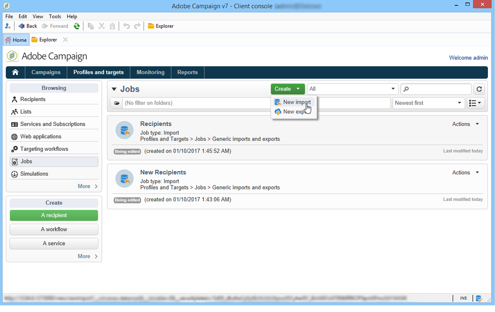

# 创建导入和导出作业 {#creating-import-export-jobs}

配置模板后，可以在Adobe Campaign的多个上下文中启动导入和导出操作。

* 在 **[!UICONTROL Profiles and targets]** 在Adobe Campaign工作区的部分中，单击 **[!UICONTROL Jobs]** 链接：这会将您转到现有进出口的列表。

   单击 **[!UICONTROL Create]** 按钮，然后选择要执行的作业类型。

   

* 您还可以从 **[!UICONTROL Monitoring]** 部分：通过两个专用链接，您可以直接开始导入或导出。

   

* 最后，可从Adobe Campaign资源管理器启动导入和导出。

   

所有这些打开的数据导入或导出向导。 以下各节详细介绍了这些功能：

* [配置导入作业](../../platform/using/executing-import-jobs.md)
* [配置导出作业](../../platform/using/executing-export-jobs.md)
