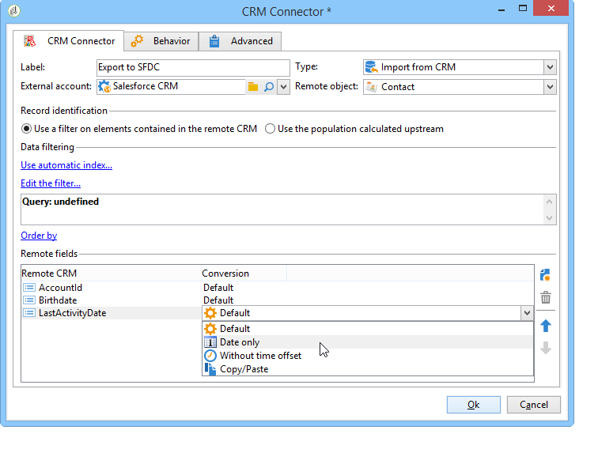

# CRM 连接器{#crm-connectors}

## 关于CRM连接器{#about-crm-connectors}

Adobe Campaign 提供各种 CRM 连接器，可将您的 Adobe Campaign 平台链接到第三方系统。通过这些 CRM 连接器，您可以同步处理联系人、帐户、购买等。您可以使用这些 CRM 连接器轻松地将您的应用程序与各第三方和商务应用程序相集成。

通过这些连接器，可快速轻松地集成数据：Adobe Campaign 提供专用的向导，让您从 CRM 中提供的表中收集和选择数据。并且可确保双向同步处理，让整个系统中的数据随时保持最新。

>[!NOTE]
>
>此功能可通过&#x200B;**CRM连接器**&#x200B;专用软件包进行Adobe Campaign。

连接到CRM是通过专用的工作流活动进行的。 这些活动详见[本节](../../workflow/using/crm-connector.md)中的一章。

### 兼容的CRM系统和限制{#compatible-crm-systems-and-limitations}

下面列出的CRM可以集成到Adobe Campaign中。

支持的版本详见活动[兼容性矩阵](../../rn/using/compatibility-matrix.md)。

* **Salesforce.com**

   请参阅[本节](#example-for-salesforce-com)，了解如何设置与Salesforce.com的连接。

   >[!IMPORTANT]
   >
   >将Adobe Campaign与Salesforce.com连接时，限制如下：
   >
   >    
   >    
   >    * 支持测试生产实例。
   >    * 支持分配规则。
   >    * 多选明细列表不受Adobe Campaign支持。

* **Oracle点播**

   请参阅[本节](#example-for-oracle-on-demand)，了解如何设置与Oracle点播的连接。

   >[!IMPORTANT]
   >
   >在将Adobe Campaign与Oracle点播连接时，限制如下：
   >
   >    
   >    
   >    * Adobe Campaign可以同步标准Oracle点播模板中可用的任何对象。 如果您在Oracle点播中添加了个性化的表，这些表将无法在Adobe Campaign中恢复。
   >    * API版本1.0允许您在查询中对数据进行排序或筛选，但不允许您同时执行这两项操作。
   >    * oracle点播发送的日期不包含时区信息。
   >    * 多选明细列表不受Adobe Campaign支持。

* **MS Dynamics** CRM **和MS Dynamics Online**

   请参阅[本节](#example-for-microsoft-dynamics)，了解如何设置与Microsoft Dynamics的连接。

    在此视频中了解Adobe Campaign和Microsoft Dynamics集成用 [例](https://helpx.adobe.com/campaign/kt/acc/using/acc-integrate-dynamics365-with-acc-feature-video-set-up.html)。

   >[!IMPORTANT]
   >
   >将Adobe Campaign与Microsoft Dynamics连接时，限制如下：
   >
   >    
   >    
   >    * 安装插件可以更改CRM的行为，这会导致与Adobe Campaign的兼容性问题。
   >    * 多选明细列表不受Adobe Campaign支持。

## 设置连接{#setting-up-the-connection}

要在Adobe Campaign中使用CRM连接器，请应用以下步骤：

1. 创建外部帐户
1. 收集CRM表
1. 同步明细列表
1. 创建同步工作流

>[!NOTE]
>
>CRM连接器只能使用安全URL(https)。

### Salesforce.com {#example-for-salesforce-com}的示例

要将&#x200B;**Salesforce.com**&#x200B;连接器配置为Adobe Campaign，请执行以下步骤：

1. 通过外部帐户树的&#x200B;**[!UICONTROL Administration > Platform > External accounts]**&#x200B;节点创建新Adobe Campaign。
1. 运行配置向导以生成可用的CRM表。

   

   通过配置向导，您可以收集表并创建匹配的模式。

   单击&#x200B;**[!UICONTROL Start]**&#x200B;以运行执行。

   

   >[!NOTE]
   >
   >要批准设置，您需要注销并重新登录到Adobe Campaign控制台。

1. 检查在&#x200B;**[!UICONTROL Administration > Configuration > Data schemas]**&#x200B;节点的Adobe Campaign中生成的模式。

   

1. 创建模式后，您可以通过CRM自动将明细列表同步到Adobe Campaign。

   为此，请单击&#x200B;**[!UICONTROL Synchronizing enumerations...]**&#x200B;链接，然后选择与CRMAdobe Campaign匹配的明细列表。

   您可以将Adobe Campaign明细列表的所有值替换为CRM的值：为此，请在&#x200B;**[!UICONTROL Replace]**&#x200B;列中选择&#x200B;**[!UICONTROL Yes]**。

   

   单击&#x200B;**[!UICONTROL Next]**，然后单击&#x200B;**[!UICONTROL Start]**&#x200B;以开始导入列表。

1. 检查&#x200B;**[!UICONTROL Administration > Platform > Enumerations]**&#x200B;菜单中导入的值。

   

1. 要导入Salesforce数据或将Adobe Campaign数据导出到Salesforce，您需要创建工作流并使用&#x200B;**[!UICONTROL CRM connector]**&#x200B;活动。

   

### oracle点播示例{#example-for-oracle-on-demand}

要配置&#x200B;**Oracle点播**&#x200B;连接器以与Adobe Campaign配合使用，请应用以下步骤：

1. 通过外部帐户树的&#x200B;**[!UICONTROL Administration > Platform > External accounts]**&#x200B;节点创建新Adobe Campaign。

   

1. 打开配置向导：Adobe Campaign自动显示Oracle数据模型的表。 选择要收集的表。

   

1. 单击&#x200B;**[!UICONTROL Next]**&#x200B;以开始创建匹配模式。

   匹配模式在Adobe Campaign中变为可用。

   

1. 开始同步Adobe Campaign与Oracle按需明细列表。

   

1. 要将Oracle点播数据导入Adobe Campaign，请创建以下类型的工作流：

   

   此工作流通过Oracle按需导入联系人，将其与现有Adobe Campaign数据同步，删除重复联系人，并更新Adobe Campaign数据库。

   **[!UICONTROL CRM Connector]**&#x200B;活动需要配置如下：

   

1. 要将Adobe Campaign数据导出到Oracle点播，请创建以下工作流：

   

   此工作流使用查询收集相关数据，然后将其导出到Oracle点播联系人表中。

### Microsoft Dynamics {#example-for-microsoft-dynamics}示例

要配置Microsoft Dynamics连接器以使用Adobe Campaign，请应用以下步骤：

1. 通过外部帐户树的&#x200B;**[!UICONTROL Administration > Platform > External accounts]**&#x200B;节点创建新Adobe Campaign。

   

1. 选择&#x200B;**部署类型**:**[!UICONTROL On-premise]**、**[!UICONTROL Office 365]**&#x200B;或&#x200B;**[!UICONTROL Web API]**，具体取决于要配置的连接器。

   Adobe Campaign Classic支持Dynamics 365 REST接口和OAuth协议进行身份验证。

   如果选择&#x200B;**[!UICONTROL WebAPI]**&#x200B;部署，则需要在Azure目录上注册一个应用程序，并从Azure目录获取&#x200B;**clientId**。 此注册记录在[此页](https://docs.microsoft.com/en-us/powerapps/developer/common-data-service/walkthrough-register-app-azure-active-directory)中。

   >[!NOTE]
   >
   >redirectURL参数不是Adobe Campaign Classic所必需的。

   **clientId**&#x200B;值与用户名／口令一起使用，以使用授权类型口令获取承载令牌。 这称为&#x200B;**资源所有者密码凭据授权**。 有关详细信息，请参见[此页面](https://docs.microsoft.com/en-us/azure/active-directory/develop/v2-oauth-ropc)。

   

   有关CRM版本兼容性的详细信息，请参阅[兼容性矩阵](https://helpx.adobe.com/cn/campaign/kb/compatibility-matrix.html)。

1. 打开配置向导。 Adobe Campaign自动从Microsoft Dynamics数据模板检测表。

   

1. 选择要恢复的表。

   

1. 单击&#x200B;**[!UICONTROL Next]**&#x200B;并开始创建相应的模式。

   

   >[!NOTE]
   >
   >要批准配置，您必须断开／重新连接到Adobe Campaign控制台。

   匹配模式在Adobe Campaign中变为可用。

   

1. 开始同步Adobe Campaign与Microsoft Dynamics之间的明细列表。

   

1. 要将Microsoft Dynamics数据导入Adobe Campaign，请创建以下类型的工作流：

   

   此工作流通过Microsoft Dynamics导入联系人，将其与现有Adobe Campaign数据同步，删除重复联系人，并更新Adobe Campaign数据库。

   **[!UICONTROL CRM Connector]**&#x200B;活动需要配置如下：

   

## 数据同步{#data-synchronization}

Adobe Campaign与CRM之间的同步通过专用工作流活动进行：[CRM连接器](../../workflow/using/crm-connector.md)。

此活动允许您：

* 从CRM导入（请参阅[从CRM](#importing-from-the-crm)导入）,
* 导出到CRM（请参阅[导出到CRM](#exporting-to-the-crm)）,
* 导入CRM中删除的对象（请参阅[导入CRM](#importing-objects-deleted-in-the-crm)中删除的对象）,
* 删除CRM中的对象（请参阅[删除CRM](#deleting-objects-in-the-crm)中的对象）。

选择与要配置同步的CRM匹配的外部帐户，然后选择要同步的对象（帐户、业务机会、潜在客户、联系人等）。

此活动的配置取决于要执行的过程。 下面详细介绍了各种配置。

### 从CRM {#importing-from-the-crm}导入

要在Adobe Campaign中通过CRM导入数据，您需要创建以下类型的工作流：

对于导入活动,**CRM连接器**&#x200B;活动配置步骤为：

1. 选择&#x200B;**[!UICONTROL Import from the CRM]**&#x200B;操作。
1. 转到&#x200B;**[!UICONTROL Remote object]**&#x200B;下拉列表并选择进程所关注的对象。 此对象与连接器配置期间在Adobe Campaign中创建的一个表重合。
1. 转到&#x200B;**[!UICONTROL Remote fields]**&#x200B;部分并输入要导入的字段。

   要添加字段，请单击工具栏中的&#x200B;**[!UICONTROL Add]**&#x200B;按钮，然后单击&#x200B;**[!UICONTROL Edit expression]**&#x200B;图标。

   

   如有必要，请通过&#x200B;**[!UICONTROL Conversion]**&#x200B;列的下拉列表更改数据格式。 可能的转换类型详见[数据格式](#data-format)。

   >[!IMPORTANT]
   >
   >对于在CRM中和在Adobe Campaign中链接对象，CRM中记录的标识符是必需的。 在批准包装盒时，会自动添加它。
   >
   >对于增量数据导入，CRM端的上次修改日期也是必需的。

1. 您还可以根据需要过滤要导入的数据。 为此，请单击&#x200B;**[!UICONTROL Edit the filter...]**&#x200B;链接。

   在以下示例中，Adobe Campaign将仅导入自2012年11月1日起已录制某些活动的联系人。

   

   >[!IMPORTANT]
   >
   >[筛选数据](#filtering-data)中详细介绍了与数据筛选模式相关的限制。

1. 使用&#x200B;**[!UICONTROL Use automatic index...]**&#x200B;选项，您可以自动管理CRM和Adobe Campaign之间的增量对象同步，具体取决于日期及其上次修改时间。

   有关详细信息，请参阅[变量管理](#variable-management)。

#### 变量管理{#variable-management}

启用&#x200B;**[!UICONTROL Automatic index]**&#x200B;选项可仅收集自上次导入以来修改的对象。

上次同步的日期默认存储在配置窗口中指定的选项中：**LASTIMPORT_&lt;%=instance.internalName%>_&lt;%=activityName%>**。

>[!NOTE]
>
>本说明仅适用于通用&#x200B;**[!UICONTROL CRM Connector]**&#x200B;活动。 对于其他CRM活动，该过程是自动的。
>
>必须在&#x200B;**[!UICONTROL Administration]** > **[!UICONTROL Platform]** > **[!UICONTROL Options]**&#x200B;下手动创建并填充此选项。 它必须是文本选项，其值需要与以下格式匹配：**yyyy/MM/dd hh:mm:ss**。
> 
>您需要手动更新此选项才能进行进一步导入。

您可以指定要考虑的远程CRM字段，以标识最新更改。

默认情况下，将使用以下字段（按指定顺序）:

* 对于Microsoft Dynamics:**已修改**,
* oracle点播：**LastUpdated**、**ModifiedDate**、**LastLoggedIn**、
* 对于Salesforce.com:**LastModifiedDate**、**SystemModstamp**。

激活&#x200B;**[!UICONTROL Automatic index]**&#x200B;选项会生成三个变量，这些变量可通过&#x200B;**[!UICONTROL JavaScript code]**&#x200B;类型活动在同步工作流中使用。 这些活动是：

* **vars.crmOptionName**:表示包含上次导入日期的选项的名称。
* **vars.crmStartImport**:表示上次开始恢复的日期（包括）。
* **vars.crmEndDate**:表示上次数据恢复的结束日期（已排除）。

   >[!NOTE]
   >
   >这些日期以下列格式显示：**yyyy/MM/dd hh:mm:ss**。

#### 筛选数据 {#filtering-data}

要确保使用各种CRM进行高效操作，需要使用以下规则创建过滤器:

* 每个过滤级别只能使用一种类型的运算符。
* 不支持AND NOT运算符。
* 比较只能涉及null值(&#39;is empty&#39;/&#39;is not empty&#39; type)或数字。 这意味着值（右列）将被评估，此评估的结果必须是数字。 因此不支持JOIN类型比较。
* 右列中包含的值将用JavaScript进行评估。
* 不支持JOIN比较。
* 左栏中的表达式必须是字段。 它不能是多个表达式、数字等的组合。

例如，以下过滤条件对于CRM导入无效，因为OR运算符与AND运算符位于同一级别：

* OR运算符与AND运算符放在同一级别
* 对文本字符串进行比较。

#### 排序依据{#order-by}

在Microsoft Dynamics和Salesforce.com中，可以按升序或降序对要导入的远程字段进行排序。

为此，请单击&#x200B;**[!UICONTROL Order by]**&#x200B;链接并将列添加到列表。

列表中的列顺序是排序顺序：

#### 记录标识{#record-identification}

您可以使用在工作流中预先计算的填充，而不是导入CRM中包含（可能已过滤）的元素。

为此，请选择&#x200B;**[!UICONTROL Use the population calculated upstream]**&#x200B;选项并指定包含远程标识符的字段。

然后选择要导入的入站人口的字段，如下所示：

### 导出到CRM {#exporting-to-the-crm}

将Adobe Campaign数据导出到CRM中，可将整个内容复制到CRM数据库。

要向CRM导出数据，您需要创建以下类型的工作流：

对于导出，请将以下配置应用于&#x200B;**CRM连接器**&#x200B;活动:

1. 选择&#x200B;**[!UICONTROL Export to CRM]**&#x200B;操作。
1. 转到&#x200B;**[!UICONTROL Remote object]**&#x200B;下拉列表并选择进程所关注的对象。 此对象与连接器配置期间在Adobe Campaign中创建的一个表重合。

   >[!IMPORTANT]
   >
   >**CRM Connectors**&#x200B;活动的导出功能可在CRM端插入或更新字段。 要在CRM中启用字段更新，您需要指定远程表的主键。 如果缺少密钥，则将插入数据（而不是更新）。

1. 在&#x200B;**[!UICONTROL Mapping]**&#x200B;部分，指定要导出的字段及其在CRM中的映射。

   

   要添加字段，请单击工具栏中的&#x200B;**[!UICONTROL Add]**&#x200B;按钮，然后单击&#x200B;**[!UICONTROL Edit expression]**&#x200B;图标。

   >[!NOTE]
   >
   >对于给定字段，如果CRM端未定义匹配项，则无法更新这些值：它们直接插入到CRM中。

   如有必要，请通过&#x200B;**[!UICONTROL Conversion]**&#x200B;列的下拉列表更改数据格式。 可能的转换类型详见[数据格式](#data-format)。

   >[!NOTE]
   >
   >要导出的记录的列表和导出结果将保存在临时文件中，该临时文件在完成或重新启动工作流之前一直可供访问。 这使您能够在出错时再次开始该过程，而不会冒多次导出相同记录或丢失数据的风险。

### 其他配置 {#additional-configurations}

#### 数据格式{#data-format}

在将数据格式导入CRM或从CRM导入数据格式时，可以立即转换它们。

为此，请选择要在匹配列中应用的转换。

**[!UICONTROL Default]**&#x200B;模式应用自动数据转换，在大多数情况下，这等于数据的复制／粘贴。 但是，时区管理被应用。

其他可能的转换包括：

* **[!UICONTROL Date only]**:此模式将删除“日期+时间”类型字段。
* **[!UICONTROL Without time offset]**:此模式取消在默认模式下应用的时区管理。
* **[!UICONTROL Copy/Paste]**:此模式使用字符串等原始数据（无转换）。

#### 处理{#error-processing}时出错

在数据导入或导出框架中，可以对错误和拒绝应用特定流程。 为此，请在&#x200B;**[!UICONTROL Behavior]**&#x200B;选项卡中选择&#x200B;**[!UICONTROL Process rejects]**&#x200B;和&#x200B;**[!UICONTROL Process errors]**&#x200B;选项。

这些选项会放置匹配的输出过渡。

然后，放置与要应用的流程相关的活动。

要处理实例的错误，可添加等待框和计划重试。

拒绝会收集到其错误代码和相关消息，这意味着您可以设置拒绝跟踪以优化同步过程。

>[!NOTE]
>
>即使&#x200B;**[!UICONTROL Process rejects]**&#x200B;选项未启用，也会为每个被拒绝列生成一个警告，并显示错误代码和消息。

**[!UICONTROL Reject]**&#x200B;输出过渡允许您访问包含与错误消息和代码相关的特定列的输出模式。 以下列为：

* oracle点播：**errorLogFilename**(Oracle侧日志文件的名称)、**errorCode**（错误代码）、**errorSymbol**（错误符号，不同于错误代码）、**errorMessage**（错误上下文的描述）。
* 对于Salesforce.com:**errorSymbol**（错误符号，不同于错误代码）,**errorMessage**（错误上下文的描述）。

### 正在导入CRM {#importing-objects-deleted-in-the-crm}中删除的对象

要启用广泛的数据同步过程的设置，您可以将CRM中删除的对象导入Adobe Campaign。

为此，请应用以下步骤：

1. 选择&#x200B;**[!UICONTROL Import objects deleted in the CRM]**&#x200B;操作。
1. 转到&#x200B;**[!UICONTROL Remote object]**&#x200B;下拉列表并选择进程所关注的对象。 此对象与连接器配置期间在Adobe Campaign中创建的一个表重合。
1. 在&#x200B;**[!UICONTROL Start date]**&#x200B;和&#x200B;**[!UICONTROL End date]**&#x200B;字段中指定要考虑的删除期。 这些日期将包括在该期间内。

   

   >[!IMPORTANT]
   >
   >元素删除期间必须与CRM特定的限制一致。 这意味着对于Salesforce.com，例如，30天前删除的元素无法恢复。

### 删除CRM {#deleting-objects-in-the-crm}中的对象

要删除CRM端的对象，您需要指定要删除的远程元素的主键。

使用&#x200B;**[!UICONTROL Behavior]**&#x200B;选项卡可以启用拒绝的处理。 此选项为&#x200B;**[!UICONTROL CRM connector]**&#x200B;过渡生成第二个输出活动。 有关详细信息，请参阅[错误处理](#error-processing)。

>[!NOTE]
>
>即使禁用&#x200B;**[!UICONTROL Process rejects]**&#x200B;选项，也会为每个被拒绝的列生成警告。

