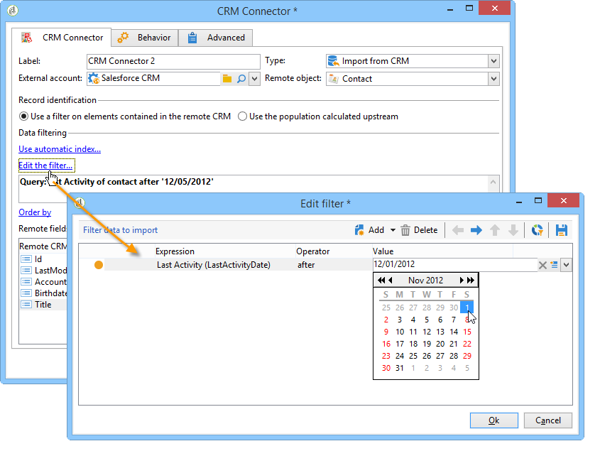

# CRM 连接器{#crm-connectors}

## 关于CRM连接器 {#about-crm-connectors}

Adobe Campaign 提供各种 CRM 连接器，可将您的 Adobe Campaign 平台链接到第三方系统。通过这些 CRM 连接器，您可以同步处理联系人、帐户、购买等。您可以使用这些 CRM 连接器轻松地将您的应用程序与各第三方和商务应用程序相集成。

通过这些连接器，可快速轻松地集成数据：Adobe Campaign 提供专用的向导，让您从 CRM 中提供的表中收集和选择数据。并且可确保双向同步处理，让整个系统中的数据随时保持最新。

>[!NOTE]
>
>此功能可通过CRM连接器专用 **包进行Adobe Campaign** 。

连接到CRM是通过专用的工作流活动进行的。 这些活动在本节介绍的一 [章中详述](../../workflow/using/crm-connector.md)。

### 兼容的CRM系统和限制 {#compatible-crm-systems-and-limitations}

下面列出的CRM可以集成到Adobe Campaign中。

支持的版本详见活动 [兼容性表](../../rn/using/compatibility-matrix.md)。

* **Salesforce.com**

   请参 [阅本节](#example-for-salesforce-com) ，了解如何设置与Salesforce.com的连接。

   >[!IMPORTANT]
   >
   >将Adobe Campaign与Salesforce.com连接时，限制如下：
   >
   >    
   >    
   >    * 支持测试生产实例。
   >    * 支持分配规则。
   >    * 多选明细列表不受Adobe Campaign支持。

* **Oracle点播**

   请参 [阅本节](#example-for-oracle-on-demand) ，了解如何设置与Oracle点播的连接。

   >[!IMPORTANT]
   >
   >在将Adobe Campaign与Oracle点播连接时，限制如下：
   >
   >    
   >    
   >    * Adobe Campaign可以同步标准Oracle点播模板中可用的任何对象。 如果您在Oracle点播中添加了个性化的表，这些表将无法在Adobe Campaign中恢复。
   >    * API版本1.0允许您在查询中对数据进行排序或筛选，但不允许您同时执行这两项操作。
   >    * oracle点播发送的日期不包含时区信息。
   >    * 多选明细列表不受Adobe Campaign支持。

* **MS Dynamics CRM和** MS **Dynamics Online**

   请参 [阅本节](#example-for-microsoft-dynamics) ，了解如何设置与Microsoft Dynamics的连接。

    在此视频中了解Adobe Campaign和Microsoft Dynamics集成用 [例](https://helpx.adobe.com/campaign/kt/acc/using/acc-integrate-dynamics365-with-acc-feature-video-set-up.html)。

   >[!IMPORTANT]
   >
   >将Adobe Campaign与Microsoft Dynamics连接时，限制如下：
   >
   >    
   >    
   >    * 安装插件可以更改CRM的行为，这会导致与Adobe Campaign的兼容性问题。
   >    * 多选明细列表不受Adobe Campaign支持。

## 设置连接 {#setting-up-the-connection}

要在Adobe Campaign中使用CRM连接器，请应用以下步骤：

1. 创建外部帐户
1. 收集CRM表
1. 同步明细列表
1. 创建同步工作流

>[!NOTE]
>
>CRM连接器只能使用安全URL(https)。

### Salesforce.com的示例 {#example-for-salesforce-com}

要将Salesforce.com **连接器配置为Adobe Campaign** ，请执行以下步骤：

1. 通过外部帐户树的节 **[!UICONTROL Administration > Platform > External accounts]** 点创建新Adobe Campaign。
1. 运行配置向导以生成可用的CRM表。

   

   通过配置向导，您可以收集表并创建匹配的模式。

   单击 **[!UICONTROL Start]** 以运行执行。

   

   >[!NOTE]
   >
   >要批准设置，您需要注销并重新登录到Adobe Campaign控制台。

1. 检查在节点的模式中生成 **[!UICONTROL Administration > Configuration > Data schemas]** 的Adobe Campaign。

   

1. 创建模式后，您可以通过CRM自动将明细列表同步到Adobe Campaign。

   为此，请单击链 **[!UICONTROL Synchronizing enumerations...]** 接并选择与CRMAdobe Campaign匹配的明细列表明细列表。

   您可以将Adobe Campaign明细列表的所有值替换为CRM的值：为此，请在列 **[!UICONTROL Yes]** 中选 **[!UICONTROL Replace]** 择。

   

   单 **[!UICONTROL Next]** 击，然 **[!UICONTROL Start]** 后开始导入列表。

1. 检查菜单中导入的 **[!UICONTROL Administration > Platform > Enumerations]** 值。

   

1. 要导入Salesforce数据或将Adobe Campaign数据导出到Salesforce，您需要创建工作流并使用 **[!UICONTROL CRM connector]** 活动。

   

### oracle点播示例 {#example-for-oracle-on-demand}

要将Oracle **点播连接器配置** ，以便与Adobe Campaign配合使用，请应用以下步骤：

1. 通过外部帐户树的节 **[!UICONTROL Administration > Platform > External accounts]** 点创建新Adobe Campaign。

   

1. 打开配置向导：Adobe Campaign自动显示Oracle数据模型的表。 选择要收集的表。

   

1. 单击 **[!UICONTROL Next]** 以开始创建匹配模式。

   匹配模式在Adobe Campaign中变为可用。

   

1. 开始同步Adobe Campaign与Oracle按需明细列表。

   

1. 要将Oracle点播数据导入Adobe Campaign，请创建以下类型的工作流：

   

   此工作流通过Oracle按需导入联系人，将其与现有Adobe Campaign数据同步，删除重复联系人，并更新Adobe Campaign数据库。

   需 **[!UICONTROL CRM Connector]** 要配置活动，如下所示：

   

1. 要将Adobe Campaign数据导出到Oracle点播，请创建以下工作流：

   

   此工作流使用查询收集相关数据，然后将其导出到Oracle点播联系人表中。

### Microsoft Dynamics的示例 {#example-for-microsoft-dynamics}

要配置Microsoft Dynamics连接器以使用Adobe Campaign，请应用以下步骤：

1. 通过外部帐户树的节 **[!UICONTROL Administration > Platform > External accounts]** 点创建新Adobe Campaign。

   

1. 选择部 **署类型**: **[!UICONTROL On-premise]**&#x200B;或 **[!UICONTROL Office 365]** , **[!UICONTROL Web API]**&#x200B;取决于要配置的连接器。

   Adobe Campaign Classic支持Dynamics 365 REST接口和OAuth协议进行身份验证。

   如果选择部 **[!UICONTROL WebAPI]** 署，则需要在Azure目录上注册应用程序并从Azure目 **录获取** clientId。 本页记录了 [此注册](https://docs.microsoft.com/en-us/previous-versions/dynamicscrm-2016/developers-guide/mt622431(v=crm.8)?redirectedfrom=MSDN)。

   >[!NOTE]
   >
   >redirectURL参数不是Adobe Campaign Classic所必需的。

   ClientId **值与用户** 名／口令一起使用，以使用授权类型口令获取承载令牌。 这称为“资 **源所有者密码凭据授予**”。 有关详细信息，请参见[此页面](https://blogs.msdn.microsoft.com/wushuai/2016/09/25/resource-owner-password-credentials-grant-in-azure-ad-oauth/)。

   

   有关CRM版本兼容性的详细信息，请参 [阅兼容性表](https://helpx.adobe.com/cn/campaign/kb/compatibility-matrix.html)。

1. 打开配置向导。 Adobe Campaign自动从Microsoft Dynamics数据模板检测表。

   

1. 选择要恢复的表。

   

1. 单击 **[!UICONTROL Next]** 并开始创建相应的模式。

   

   >[!NOTE]
   >
   >要批准配置，您必须断开／重新连接到Adobe Campaign控制台。

   匹配模式在Adobe Campaign中变为可用。

   

1. 开始同步Adobe Campaign与Microsoft Dynamics之间的明细列表。

   

1. 要将Microsoft Dynamics数据导入Adobe Campaign，请创建以下类型的工作流：

   

   此工作流通过Microsoft Dynamics导入联系人，将其与现有Adobe Campaign数据同步，删除重复联系人，并更新Adobe Campaign数据库。

   活动 **[!UICONTROL CRM Connector]** 需要配置如下：

   

## 数据同步 {#data-synchronization}

Adobe Campaign与CRM之间的同步通过专用工作流活动进行： [CRM连接器](../../workflow/using/crm-connector.md)。

此活动允许您：

* 从CRM导入(请参 [阅从CRM导入](#importing-from-the-crm)),
* 导出到CRM(请参 [阅导出到CRM](#exporting-to-the-crm)),
* 导入在CRM中删除的对象(请参 [阅在CRM中删除的导入对象](#importing-objects-deleted-in-the-crm)),
* 删除CRM中的对象(请参 [阅删除CRM中的对象](#deleting-objects-in-the-crm))。

选择与要配置同步的CRM匹配的外部帐户，然后选择要同步的对象（帐户、业务机会、潜在客户、联系人等）。

此活动的配置取决于要执行的过程。 下面详细介绍了各种配置。

### 从CRM导入 {#importing-from-the-crm}

要在Adobe Campaign中通过CRM导入数据，您需要创建以下类型的工作流：

对于导入活动,CRM **连接器活动配** 置步骤：

1. 选择一个 **[!UICONTROL Import from the CRM]** 操作。
1. 转到下 **[!UICONTROL Remote object]** 拉列表，选择进程所关注的对象。 此对象与连接器配置期间在Adobe Campaign中创建的一个表重合。
1. 转到部 **[!UICONTROL Remote fields]** 分并输入要导入的字段。

   要添加字段，请单击工 **[!UICONTROL Add]** 具栏中的按钮，然后单击 **[!UICONTROL Edit expression]** 图标。

   

   如有必要，可通过列的下拉列表更改数据格 **[!UICONTROL Conversion]** 式。 可能的转换类型以数据格 [式详细介绍](#data-format)。

   >[!IMPORTANT]
   >
   >对于在CRM中和在Adobe Campaign中链接对象，CRM中记录的标识符是必需的。 在批准包装盒时，会自动添加它。
   >
   >对于增量数据导入，CRM端的上次修改日期也是必需的。

1. 您还可以根据需要过滤要导入的数据。 为此，请单击链 **[!UICONTROL Edit the filter...]** 接。

   在以下示例中，Adobe Campaign将仅导入自2012年11月1日起已录制某些活动的联系人。

   

   >[!IMPORTANT]
   >
   >与数据过滤模式链接的限制在过滤数据中 [有详细说明](#filtering-data)。

1. 通过 **[!UICONTROL Use automatic index...]** 此选项，您可以根据日期和Adobe Campaign的上次修改情况，自动管理CRM和客户之间的增量对象同步。

   For more on this, refer to [Variable management](#variable-management).

#### 变量管理 {#variable-management}

启用该 **[!UICONTROL Automatic index]** 选项后，您只能收集自上次导入以来修改的对象。

上次同步的日期默认存储在配置窗口中指定的选项中： **LASTIMPORT_&lt;%=instance.internalName%>_&lt;%=activityName%>**。

>[!NOTE]
>
>此注释仅适用于通用 **[!UICONTROL CRM Connector]** 活动。 对于其他CRM活动，该过程是自动的。
>
>此选项必须手动创建并填充在> **[!UICONTROL Administration]** > **[!UICONTROL Platform]** 下 **[!UICONTROL Options]**。 它必须是文本选项，其值需要与以下格式匹配： **yyyy/MM/dd hh:mm:ss**。
> 
>您需要手动更新此选项才能进行进一步导入。

您可以指定要考虑的远程CRM字段，以标识最新更改。

默认情况下，将使用以下字段（按指定顺序）:

* 对于Microsoft Dynamics: **修改**,
* oracle点播： **LastUpdated**、 **ModifiedDate**、 **LastLoggedIn**、
* 对于Salesforce.com: **LastModifiedDate**、 **SystemModstamp**。

激活选 **[!UICONTROL Automatic index]** 项可生成三个变量，这些变量可通过类型活动在同步工作流 **[!UICONTROL JavaScript code]** 中使用。 这些活动是：

* **vars.crmOptionName**:表示包含上次导入日期的选项的名称。
* **vars.crmStartImport**:表示上次开始恢复的日期（包括）。
* **vars.crmEndDate**:表示上次数据恢复的结束日期（已排除）。

   >[!NOTE]
   >
   >这些日期以下列格式显示： **yyyy/MM/dd hh:mm:ss**。

#### 筛选数据 {#filtering-data}

要确保使用各种CRM进行高效操作，需要使用以下规则创建过滤器:

* 每个过滤级别只能使用一种类型的运算符。
* 不支持AND NOT运算符。
* 比较只能涉及null值(&#39;is empty&#39;/&#39;is not empty&#39; type)或数字。 这意味着值（右列）将被评估，此评估的结果必须是数字。 因此不支持JOIN类型比较。
* 右列中包含的值将用JavaScript进行评估。
* 不支持JOIN比较。
* 左栏中的表达式必须是字段。 它不能是多个表达式、数字等的组合。

例如，以下过滤条件对于CRM导入无效，因为OR运算符与AND运算符位于同一级别：

* OR运算符与AND运算符放在同一级别
* 对文本字符串进行比较。

#### 订购依据 {#order-by}

在Microsoft Dynamics和Salesforce.com中，可以按升序或降序对要导入的远程字段进行排序。

为此，请单击链 **[!UICONTROL Order by]** 接并向列表添加列。

列表中的列顺序是排序顺序：

#### 记录标识 {#record-identification}

您可以使用在工作流中预先计算的填充，而不是导入CRM中包含（可能已过滤）的元素。

为此，请选择选 **[!UICONTROL Use the population calculated upstream]** 项并指定包含远程标识符的字段。

然后选择要导入的入站人口的字段，如下所示：

### 导出到CRM {#exporting-to-the-crm}

将Adobe Campaign数据导出到CRM中，可将整个内容复制到CRM数据库。

要向CRM导出数据，您需要创建以下类型的工作流：

要进行导出，请将以下配置应用于 **CRM连接器** 活动:

1. 选择一个 **[!UICONTROL Export to CRM]** 操作。
1. 转到下 **[!UICONTROL Remote object]** 拉列表，选择进程所关注的对象。 此对象与连接器配置期间在Adobe Campaign中创建的一个表重合。

   >[!IMPORTANT]
   >
   >CRM连接器活动的 **导出功能** ，可以在CRM端插入或更新字段。 要在CRM中启用字段更新，您需要指定远程表的主键。 如果缺少密钥，则将插入数据（而不是更新）。

1. 在部 **[!UICONTROL Mapping]** 分中，指定要导出的字段及其在CRM中的映射。

   

   要添加字段，请单击工 **[!UICONTROL Add]** 具栏中的按钮，然后单击 **[!UICONTROL Edit expression]** 图标。

   >[!NOTE]
   >
   >对于给定字段，如果CRM端未定义匹配项，则无法更新这些值：它们直接插入到CRM中。

   如有必要，可通过列的下拉列表更改数据格 **[!UICONTROL Conversion]** 式。 可能的转换类型以数据格 [式详细介绍](#data-format)。

   >[!NOTE]
   >
   >要导出的记录的列表和导出结果将保存在临时文件中，该临时文件在完成或重新启动工作流之前一直可供访问。 这使您能够在出错时再次开始该过程，而不会冒多次导出相同记录或丢失数据的风险。

### 其他配置 {#additional-configurations}

#### 数据格式 {#data-format}

在将数据格式导入CRM或从CRM导入数据格式时，可以立即转换它们。

为此，请选择要在匹配列中应用的转换。

该模 **[!UICONTROL Default]** 式应用自动数据转换，在大多数情况下，这等于数据的复制／粘贴。 但是，时区管理被应用。

其他可能的转换包括：

* **[!UICONTROL Date only]**:此模式将删除“日期+时间”类型字段。
* **[!UICONTROL Without time offset]**:此模式取消在默认模式下应用的时区管理。
* **[!UICONTROL Copy/Paste]**:此模式使用字符串等原始数据（无转换）。

#### 错误处理 {#error-processing}

在数据导入或导出框架中，可以对错误和拒绝应用特定流程。 为此，请选择选 **[!UICONTROL Process rejects]** 项 **[!UICONTROL Process errors]** 卡中的和 **[!UICONTROL Behavior]** 选项。

这些选项会放置匹配的输出过渡。

然后，放置与要应用的流程相关的活动。

要处理实例的错误，可添加等待框和计划重试。

拒绝会收集到其错误代码和相关消息，这意味着您可以设置拒绝跟踪以优化同步过程。

>[!NOTE]
>
>即使未启 **[!UICONTROL Process rejects]** 用该选项，也会为每个被拒绝的列生成警告，并显示错误代码和消息。

输出 **[!UICONTROL Reject]** 过渡允许您访问包含与错误消息和代码相关的特定列的输出模式。 以下列为：

* oracle点播： **errorLogFilename** (Oracle侧日志文件的名 **称)、** errorCode **（错误代码）、** errorSymbol **（错误符号，不同于错误代码）、** errorMessage（错误上下文的描述）。
* 对于Salesforce.com: **errorSymbol** （错误符号，与错误代码不同）, **errorMessage** （错误上下文的描述）。

### 导入在CRM中删除的对象 {#importing-objects-deleted-in-the-crm}

要启用广泛的数据同步过程的设置，您可以将CRM中删除的对象导入Adobe Campaign。

为此，请应用以下步骤：

1. 选择一个 **[!UICONTROL Import objects deleted in the CRM]** 操作。
1. 转到下 **[!UICONTROL Remote object]** 拉列表，选择进程所关注的对象。 此对象与连接器配置期间在Adobe Campaign中创建的一个表重合。
1. 在和字段中指定要考虑的删 **[!UICONTROL Start date]** 除期 **[!UICONTROL End date]** 间。 这些日期将包括在该期间内。

   

   >[!IMPORTANT]
   >
   >元素删除期间必须与CRM特定的限制一致。 这意味着对于Salesforce.com，例如，30天前删除的元素无法恢复。

### 在CRM中删除对象 {#deleting-objects-in-the-crm}

要删除CRM端的对象，您需要指定要删除的远程元素的主键。

通过 **[!UICONTROL Behavior]** 该选项卡可以启用拒绝的处理。 此选项为该过渡生成第二个输出 **[!UICONTROL CRM connector]** 活动。 For more on this, refer to [Error processing](#error-processing).

>[!NOTE]
>
>即使禁用 **[!UICONTROL Process rejects]** 了该选项，也会为每个被拒绝的列生成警告。

