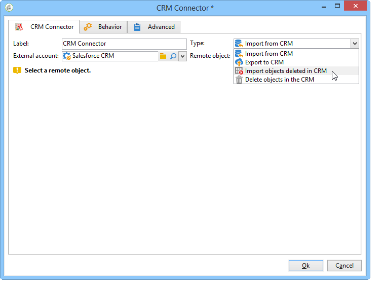
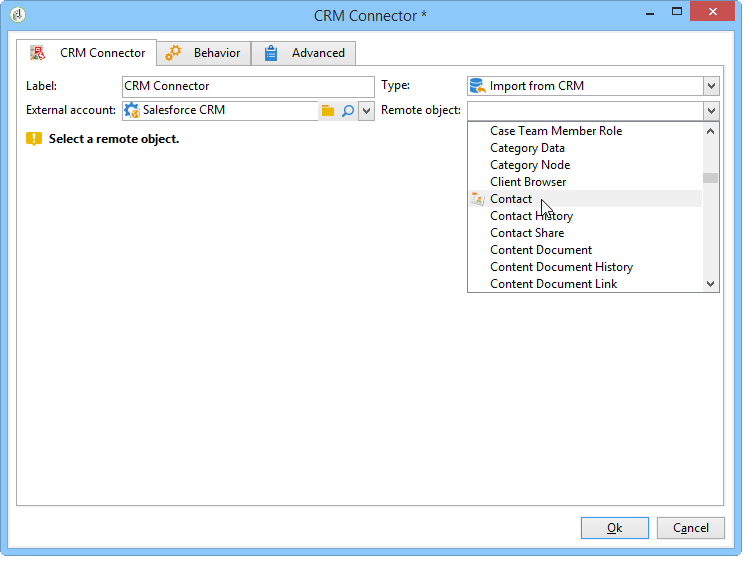
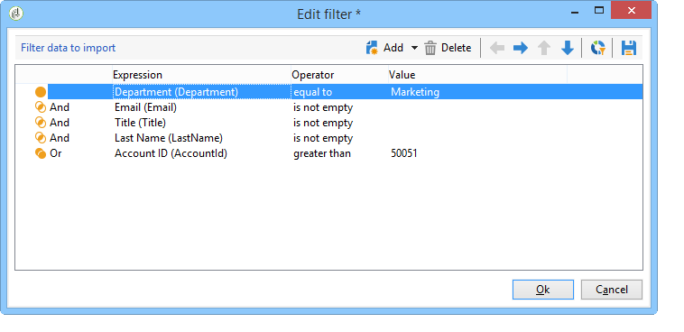
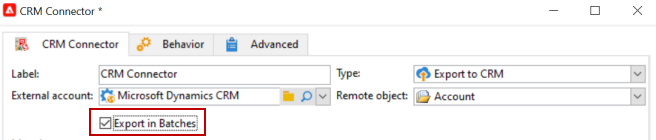

# 在Campaign和CRM之间同步数据 {#data-synchronization}

Adobe Campaign和CRM之间的数据同步是通过专用工作流活动执行的： [CRM连接器](../../workflow/using/crm-connector.md).

例如，要将Microsoft Dynamics数据导入Adobe Campaign，请创建以下类型的工作流：

此工作流通过Microsoft Dynamics导入联系人，将其与现有Adobe Campaign数据同步，删除重复联系人，并更新Adobe Campaign数据库。

此 **[!UICONTROL CRM Connector]** 需要配置活动才能同步数据。

通过此活动，您可以：

* 从CRM导入 —  [了解详情](#importing-from-the-crm)
* 导出到CRM - [了解详情](#exporting-to-the-crm)
* 导入CRM中删除的对象 —  [了解详情](#importing-objects-deleted-in-the-crm)
* 删除CRM中的对象 —  [了解详情](#deleting-objects-in-the-crm)

选择与要配置同步的CRM匹配的外部帐户，然后选择要同步的对象：帐户、商机、潜在客户、联系人等。

此活动的配置取决于执行的流程。 各种配置详见下文。

## 从CRM导入 {#importing-from-the-crm}

要通过Adobe Campaign中的CRM导入数据，您需要创建以下类型的工作流：

对于导入活动， **[!UICONTROL CRM Connector]** 活动配置步骤包括：

1. 选择 **[!UICONTROL Import from the CRM]** 操作。
1. 转到 **[!UICONTROL Remote object]** 下拉列表并选择进程涉及的对象。 此对象与连接器配置期间在Adobe Campaign中创建的某个表一致。
1. 转到 **[!UICONTROL Remote fields]** 并输入要导入的字段。

   要添加字段，请单击 **[!UICONTROL Add]** 按钮，然后单击 **[!UICONTROL Edit expression]** 图标。

   

   如有必要，请通过 **[!UICONTROL Conversion]** 列。 中详细介绍了可能的转换类型 [数据格式](#data-format).

   >[!IMPORTANT]
   >
   >CRM中记录的标识符对于链接CRM和Adobe Campaign中的对象是必需的。 该复选框在获得批准时自动添加。
   >
   >对于增量数据导入，CRM端的上次修改日期也是强制性的。

1. 您也可以根据需要筛选要导入的数据。 要执行此操作，请单击 **[!UICONTROL Edit the filter...]** 链接。

   在以下示例中，Adobe Campaign将仅导入自2012年11月1日以来记录了一些活动的联系人。

   

   >[!IMPORTANT]
   >
   >中详细介绍了与数据过滤模式相关的限制 [筛选数据](#filtering-data).

1. 此 **[!UICONTROL Use automatic index...]** 选项允许您根据日期和上次修改时间，自动管理CRM和Adobe Campaign之间的增量对象同步。

   有关详细信息，请参见 [变量管理](#variable-management).

### 管理变量 {#variable-management}

启用 **[!UICONTROL Automatic index]** 选项，用于仅收集自上次导入以来修改的对象。

缺省情况下，上次同步的日期存储在配置窗口中指定的选项中： **LASTIMPORT_&lt;%=instance.internalName%>_&lt;%=activityName%>**.

>[!NOTE]
>
>此注释仅适用于通用部件 **[!UICONTROL CRM Connector]** 活动。 对于其他CRM活动，该流程是自动的。
>
>此选项必须手动创建并填充到 **[!UICONTROL Administration]** > **[!UICONTROL Platform]** > **[!UICONTROL Options]**. 它必须是文本选项，其值需要匹配以下格式： **`yyyy/MM/dd hh:mm:ss`**.
> 
>您需要手动更新此选项以进行任何进一步的导入。

您可以指定要考虑的远程CRM字段以标识最新更改。

默认情况下，使用以下字段（按指定顺序）：

* 对于Microsoft Dynamics： **修改**，
* 对于Salesforce.com ： **LastModifiedDate**， **SystemModstamp**.

激活 **[!UICONTROL Automatic index]** 选项生成三个变量，这些变量可通过在同步工作流中使用 **[!UICONTROL JavaScript code]** 键入activity。 这些活动包括：

* **vars.crmOptionName**：表示包含上次导入日期的选项的名称。
* **vars.crmStartImport**：表示上次数据恢复的开始日期（包括）。
* **vars.crmEndDate**：表示上次数据恢复的结束日期（已排除）。

  >[!NOTE]
  >
  >这些日期以下列格式显示： **`yyyy/MM/dd hh:mm:ss`**.

### 筛选数据 {#filtering-data}

要确保各种CRM的高效运行，需要使用以下规则创建过滤器：

* 每个过滤级别只能使用一种类型的运算符。
* 不支持AND NOT运算符。
* 比较可能只涉及null值（“为空”/“不为空”类型）或数字。 这意味着将对值（右侧列）进行评估，且此评估的结果必须是数字。 因此，不支持JOIN类型比较。
* 右侧列中包含的值是在JavaScript中进行评估的。
* 不支持联接比较。
* 左侧列中的表达式必须为字段。 它不能是多个表达式、数字等的组合。

例如，以下筛选条件对于CRM导入将无效，因为OR运算符与AND运算符位于同一级别：

* OR运算符与AND运算符位于同一级别
* 对文本字符串进行比较

### 排序方式 {#order-by}

在Microsoft Dynamics和Salesforce.com中，您可以按升序或降序对要导入的远程字段进行排序。

要执行此操作，请单击 **[!UICONTROL Order by]** 链接并将列添加到列表中。

列表中的列顺序是排序顺序：

### 记录标识 {#record-identification}

您可以使用工作流中预先计算的群体，而不是导入CRM中包含（并可能经过筛选）的元素。

要执行此操作，请选择 **[!UICONTROL Use the population calculated upstream]** 选项并指定包含远程标识符的字段。

然后，选择要导入的集客群体的字段，如下所示：

## 导出到CRM {#exporting-to-the-crm}

通过将Adobe Campaign数据导出到CRM，您可以将整个内容复制到CRM数据库。

要将数据导出到CRM，您需要创建以下类型的工作流：

对于导出，请将以下配置应用于 **[!UICONTROL CRM Connector]** 活动：

1. 选择 **[!UICONTROL Export to CRM]** 操作。
1. 转到 **[!UICONTROL Remote object]** 下拉列表并选择进程涉及的对象。 此对象与连接器配置期间在Adobe Campaign中创建的某个表一致。

   >[!IMPORTANT]
   >
   >的导出函数 **[!UICONTROL CRM Connector]** 活动可以在CRM端插入或更新字段。 要在CRM中启用字段更新，您需要指定远程表的主键。 如果缺少键，将插入数据（而不是更新数据）。

1. Check **[!UICONTROL Export in Batches]** 如果您需要更快的导出。

   

1. 在 **[!UICONTROL Mapping]** 部分，单击 **[!UICONTROL New]** 指定要导出的字段及其在CRM中的映射。

   

   要添加字段，请单击 **[!UICONTROL Add]** 按钮，然后单击 **[!UICONTROL Edit expression]** 图标。

   >[!NOTE]
   >
   >对于给定字段，如果在CRM端未定义匹配项，则无法更新值：这些值直接插入到CRM中。

   如有必要，请通过 **[!UICONTROL Conversion]** 列。 中详细介绍了可能的转换类型 [数据格式](#data-format).

   >[!NOTE]
   >
   >要导出的记录列表和导出结果将保存在临时文件中，在工作流完成或重新启动之前，该文件将保持可访问状态。 这样，您就可以在出现错误时再次启动该过程，而不会出现多次导出同一记录或丢失数据的风险。

## 其他配置 {#additional-configurations}

### 数据格式 {#data-format}

将数据格式导入或从CRM导入时，您可以即时转换数据格式。

要实现此目的，请选择要应用于匹配列的转换。

此 **[!UICONTROL Default]** 模式应用自动数据转换，在大多数情况下，转换等同于数据的复制/粘贴。 但是，会应用时区管理。

其他可能的转换包括：

* **[!UICONTROL Date only]**：此模式会删除日期+时间类型字段。
* **[!UICONTROL Without time offset]**：此模式会取消在默认模式下应用的时区管理。
* **[!UICONTROL Copy/Paste]**：此模式使用原始数据，例如字符串（无转化）。

### 错误处理 {#error-processing}

在数据导入或导出的框架中，您可以将特定进程应用于错误和拒绝。 要执行此操作，请选择 **[!UICONTROL Process rejects]** 和 **[!UICONTROL Process errors]** 中的选项 **[!UICONTROL Behavior]** 选项卡。

这些选项可放置匹配的输出过渡。

然后放置与要应用的进程相关的活动。

要处理实例错误，可以添加等待框并安排重试。

系统会收集拒绝及其错误代码和相关消息，这意味着您可以设置拒绝跟踪以优化同步过程。

>[!NOTE]
>
>即使 **[!UICONTROL Process rejects]** 选项，则会为每个被拒绝的列生成警告，其中包含错误代码和消息。

此 **[!UICONTROL Reject]** 利用输出过渡，可访问包含与错误消息和代码相关的特定列的输出架构。 对于Salesforce.com ，此列为 **errorSymbol** （错误符号，不同于错误代码）， **错误消息** （错误上下文的描述）。

## 导入CRM中删除的对象 {#importing-objects-deleted-in-the-crm}

要启用广泛的数据同步过程的设置，您可以将CRM中删除的对象导入Adobe Campaign。

要执行此操作，请应用以下步骤：

1. 选择 **[!UICONTROL Import objects deleted in the CRM]** 操作。
1. 转到 **[!UICONTROL Remote object]** 下拉列表并选择进程涉及的对象。 此对象与连接器配置期间在Adobe Campaign中创建的某个表一致。
1. 指定要在中考虑的删除时段 **[!UICONTROL Start date]** 和 **[!UICONTROL End date]** 字段。 这些日期将包含在此期间中。

   

   >[!IMPORTANT]
   >
   >元素删除期必须符合CRM的特定限制。 这意味着对于Salesforce.com ，例如，30天前删除的元素将无法恢复。

## 删除 CRM 中的对象 {#deleting-objects-in-the-crm}

要删除CRM端的对象，您需要指定要删除的远程元素的主键。

此 **[!UICONTROL Behavior]** 选项卡允许您启用拒绝处理。 此选项为生成第二个输出转换 **[!UICONTROL CRM connector]** 活动。 有关详细信息，请参见 [处理时出错](#error-processing).

>[!NOTE]
>
>即使 **[!UICONTROL Process rejects]** 选项被禁用，将为每个被拒绝的列生成警告。
>
