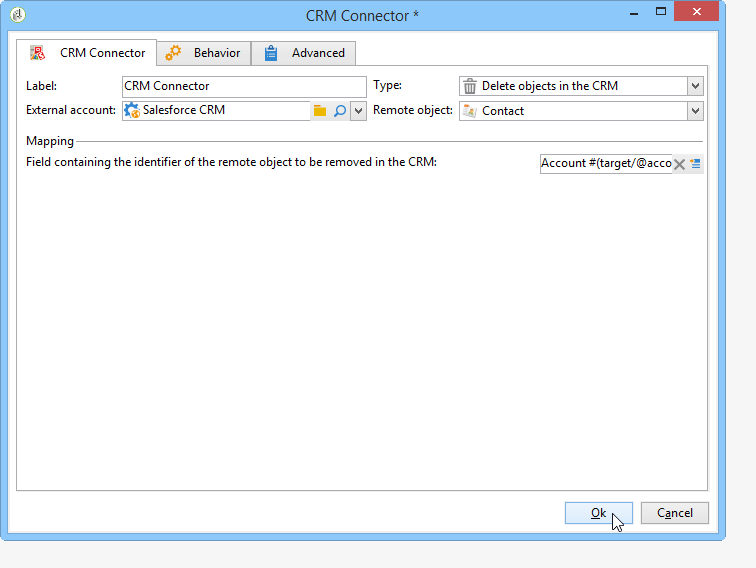

# 在活动和CRM {#data-synchronization}之间同步数据

Adobe Campaign与CRM之间的数据同步是通过专用工作流活动实现的：[CRM连接器](../../workflow/using/crm-connector.md)。

例如，要将Microsoft Dynamics数据导入Adobe Campaign，请创建以下类型的工作流：

此工作流通过Microsoft Dynamics导入联系人，将其与现有Adobe Campaign数据同步，删除重复联系人，并更新Adobe Campaign数据库。

**[!UICONTROL CRM Connector]**&#x200B;活动需要配置以同步数据。

通过此活动，您可以：

* 从CRM导入 — [了解更多](#importing-from-the-crm)
* 导出到CRM - [了解更多](#exporting-to-the-crm)
* 导入CRM中删除的对象 — [了解更多](#importing-objects-deleted-in-the-crm)
* 删除CRM中的对象 — [了解更多](#deleting-objects-in-the-crm)

选择与要配置同步的CRM匹配的外部帐户，然后选择要同步的对象：帐户、机会、潜在客户、联系人等。

此活动的配置取决于要执行的过程。 下面详细介绍了各种配置。

## 从CRM {#importing-from-the-crm}导入

要在Adobe Campaign中通过CRM导入数据，您需要创建以下类型的工作流：

对于导入活动,**[!UICONTROL CRM Connector]**&#x200B;活动配置步骤为：

1. 选择&#x200B;**[!UICONTROL Import from the CRM]**&#x200B;操作。
1. 转到&#x200B;**[!UICONTROL Remote object]**&#x200B;下拉列表并选择进程所关注的对象。 此对象与连接器配置期间在Adobe Campaign中创建的一个表重合。
1. 转到&#x200B;**[!UICONTROL Remote fields]**&#x200B;部分并输入要导入的字段。

   要添加字段，请单击工具栏中的&#x200B;**[!UICONTROL Add]**&#x200B;按钮，然后单击&#x200B;**[!UICONTROL Edit expression]**&#x200B;图标。

   

   如有必要，请通过&#x200B;**[!UICONTROL Conversion]**&#x200B;列的下拉列表更改数据格式。 [数据格式](#data-format)中详细介绍了可能的转换类型。

   >[!IMPORTANT]
   >
   >对于在CRM中和在Adobe Campaign中链接对象，CRM中记录的标识符是必需的。 在批准该框时，会自动添加该框。
   >
   >对于增量数据导入，CRM端的上次修改日期也是强制的。

1. 您还可以根据需要筛选要导入的数据。 为此，请单击&#x200B;**[!UICONTROL Edit the filter...]**&#x200B;链接。

   在以下示例中，Adobe Campaign将仅导入自2012年11月1日以来已记录某些活动的联系人。

   

   >[!IMPORTANT]
   >
   >[筛选数据](#filtering-data)中详细介绍了链接到数据筛选模式的限制。

1. 使用&#x200B;**[!UICONTROL Use automatic index...]**&#x200B;选项，您可以自动管理CRM和Adobe Campaign之间的增量对象同步，具体取决于日期及其上次修改时间。

   有关详细信息，请参阅[变量管理](#variable-management)。

### 管理变量{#variable-management}

启用&#x200B;**[!UICONTROL Automatic index]**&#x200B;选项可仅收集自上次导入以来修改的对象。

默认情况下，上次同步的日期存储在配置窗口中指定的选项中：**LASTIMPORT_&lt;%=instance.internalName%>_&lt;%=activityName%>**。

>[!NOTE]
>
>此注释仅适用于通用&#x200B;**[!UICONTROL CRM Connector]**&#x200B;活动。 对于其他CRM活动，该过程是自动的。
>
>必须在&#x200B;**[!UICONTROL Administration]** > **[!UICONTROL Platform]** > **[!UICONTROL Options]**&#x200B;下手动创建并填充此选项。 它必须是文本选项，其值需要与以下格式匹配：**yyyy/MM/dd hh:mm:ss**。
> 
>您需要手动更新此选项才能进一步导入。

您可以指定要考虑的远程CRM字段，以标识最新更改。

默认情况下，将使用以下字段（按指定顺序）：

* 对于Microsoft Dynamics:**已修改**,
* 对于Salesforce.com:**LastModifiedDate**、**SystemModstamp**。

激活&#x200B;**[!UICONTROL Automatic index]**&#x200B;选项会生成三个变量，这些变量可通过&#x200B;**[!UICONTROL JavaScript code]**&#x200B;类型活动在同步工作流中使用。 这些活动是：

* **vars.crmOptionName**:表示包含上次导入日期的选项的名称。
* **vars.crmStartImport**:表示上次开始恢复的日期（包括）。
* **vars.crmEndDate**:表示上次数据恢复的结束日期（已排除）。

   >[!NOTE]
   >
   >这些日期采用以下格式显示：**yyyy/MM/dd hh:mm:ss**。

### 筛选数据{#filtering-data}

要确保对各种CRM进行高效操作，需要使用以下规则创建过滤器:

* 每个过滤级别只能使用一种类型的运算符。
* 不支持AND NOT运算符。
* 比较可能只涉及null值(&#39;is empty&#39;/&#39;is not empty&#39; type)或数字。 这意味着将评估值（右栏），此评估的结果必须为数字。 因此不支持JOIN类型比较。
* 右侧列中包含的值将用JavaScript进行评估。
* 不支持JOIN比较。
* 左栏中的表达式必须是字段。 它不能是多个表达式、数字等的组合。

例如，以下筛选条件对CRM导入无效，因为OR运算符与AND运算符位于相同的级别：

* OR运算符与AND运算符位于相同的级别
* 对文本字符串进行比较

### 按{#order-by}排序

在Microsoft Dynamics和Salesforce.com中，可以按升序或降序对要导入的远程字段进行排序。

要执行此操作，请单击&#x200B;**[!UICONTROL Order by]**&#x200B;链接并将列添加到列表。

列表中的列顺序是排序顺序：

### 记录标识{#record-identification}

您可以使用在工作流中预先计算的填充，而不是导入CRM中包含的（可能已过滤的）元素。

要执行此操作，请选择&#x200B;**[!UICONTROL Use the population calculated upstream]**&#x200B;选项并指定包含远程标识符的字段。

然后选择要导入的入站人口字段，如下所示：

## 导出到CRM {#exporting-to-the-crm}

将Adobe Campaign数据导出到CRM中可让您将整个内容复制到CRM数据库。

要将数据导出到CRM，您需要创建以下类型的工作流：

对于导出，请将以下配置应用于&#x200B;**[!UICONTROL CRM Connector]**&#x200B;活动:

1. 选择&#x200B;**[!UICONTROL Export to CRM]**&#x200B;操作。
1. 转到&#x200B;**[!UICONTROL Remote object]**&#x200B;下拉列表并选择进程所关注的对象。 此对象与连接器配置期间在Adobe Campaign中创建的一个表重合。

   >[!IMPORTANT]
   >
   >**[!UICONTROL CRM Connector]**&#x200B;活动的导出函数可在CRM端插入或更新字段。 要在CRM中启用字段更新，您需要指定远程表的主键。 如果缺少密钥，则将插入数据（而不是更新）。

1. 在&#x200B;**[!UICONTROL Mapping]**&#x200B;部分中，指定要导出的字段及其在CRM中的映射。

   

   要添加字段，请单击工具栏中的&#x200B;**[!UICONTROL Add]**&#x200B;按钮，然后单击&#x200B;**[!UICONTROL Edit expression]**&#x200B;图标。

   >[!NOTE]
   >
   >对于给定字段，如果CRM端没有定义匹配项，则无法更新这些值：它们会直接插入到CRM中。

   如有必要，请通过&#x200B;**[!UICONTROL Conversion]**&#x200B;列的下拉列表更改数据格式。 [数据格式](#data-format)中详细介绍了可能的转换类型。

   >[!NOTE]
   >
   >要导出的记录的列表和导出结果将保存在一个临时文件中，该临时文件在工作流完成或重新启动之前一直可供访问。 这使您能够在出错时再次开始该过程，而不会冒多次导出相同记录或丢失数据的风险。

## 其他配置 {#additional-configurations}

### 数据格式{#data-format}

在将数据格式导入CRM或从CRM导入数据格式时，可以立即转换它们。

为此，请选择要在匹配列中应用的转换。

**[!UICONTROL Default]**&#x200B;模式应用自动数据转换，在大多数情况下，这等于数据的复制/粘贴。 但是，时区管理是应用的。

其他可能的转换包括：

* **[!UICONTROL Date only]**:此模式将删除“日期+时间”类型字段。
* **[!UICONTROL Without time offset]**:此模式取消在默认模式中应用的时区管理。
* **[!UICONTROL Copy/Paste]**:此模式使用字符串等原始数据（无转换）。

### 处理{#error-processing}时出错

在数据导入或导出的框架内，可以对错误和拒绝应用特定进程。 要执行此操作，请在&#x200B;**[!UICONTROL Behavior]**&#x200B;选项卡中选择&#x200B;**[!UICONTROL Process rejects]**&#x200B;和&#x200B;**[!UICONTROL Process errors]**&#x200B;选项。

这些选项会放置匹配的输出过渡。

然后放置与要应用的流程相关的活动。

要处理实例的错误，可以添加等待框和计划重试。

系统会收集拒绝及其错误代码和相关消息，这意味着您可以设置拒绝跟踪以优化同步过程。

>[!NOTE]
>
>即使未启用&#x200B;**[!UICONTROL Process rejects]**&#x200B;选项，也会为每个被拒绝的列生成警告，并显示错误代码和消息。

**[!UICONTROL Reject]**&#x200B;输出过渡允许您访问包含与错误消息和代码相关的特定列的输出模式。 对于Salesforce.com，此列为&#x200B;**errorSymbol**（错误符号，与错误代码不同），**errorMessage**（错误上下文的说明）。

## 导入CRM {#importing-objects-deleted-in-the-crm}中删除的对象

要启用扩展数据同步过程的设置，您可以将CRM中删除的对象导入Adobe Campaign。

为此，请应用以下步骤：

1. 选择&#x200B;**[!UICONTROL Import objects deleted in the CRM]**&#x200B;操作。
1. 转到&#x200B;**[!UICONTROL Remote object]**&#x200B;下拉列表并选择进程所关注的对象。 此对象与连接器配置期间在Adobe Campaign中创建的一个表重合。
1. 在&#x200B;**[!UICONTROL Start date]**&#x200B;和&#x200B;**[!UICONTROL End date]**&#x200B;字段中指定要考虑的删除期。 这些日期将包括在该期间内。

   

   >[!IMPORTANT]
   >
   >元素删除期间必须与特定于CRM的限制一致。 这意味着，例如，对于Salesforce.com，无法恢复在30天前删除的元素。

## 删除CRM {#deleting-objects-in-the-crm}中的对象

要删除CRM端上的对象，您需要指定要删除的远程元素的主键。

使用&#x200B;**[!UICONTROL Behavior]**&#x200B;选项卡可以启用拒绝处理。 此选项为&#x200B;**[!UICONTROL CRM connector]**&#x200B;活动生成第二个输出过渡。 有关详细信息，请参阅[错误处理](#error-processing)。

>[!NOTE]
>
>即使禁用&#x200B;**[!UICONTROL Process rejects]**&#x200B;选项，也会为每个被拒绝的列生成警告。

