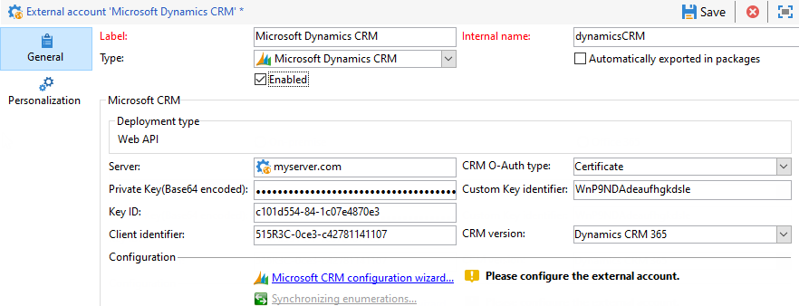
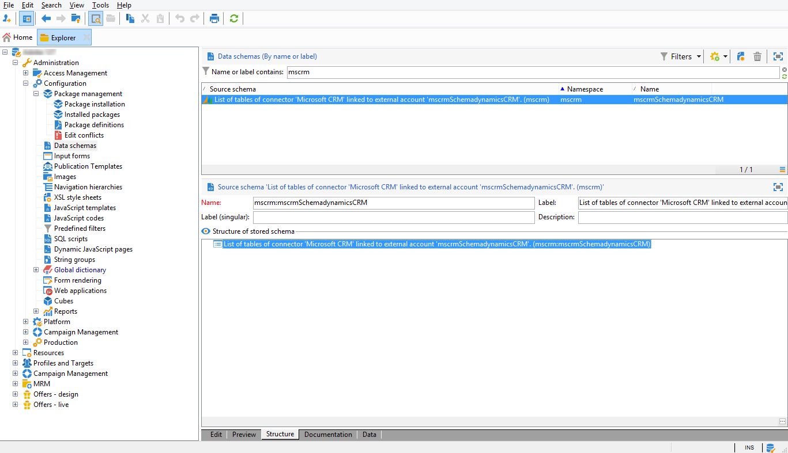

# 连接Campaign和Microsoft Dynamics 365{#connect-to-msdyn}


在本页中，您将学习如何将Campaign Classic连接到 **Microsoft Dynamics CRM 365**.

可能的部署是通过 **Web API** （推荐）。 请参阅 [以下部分](#microsoft-dynamics-implementation-step) 了解设置与Microsoft Dynamics连接的步骤。

数据同步是通过专用的工作流活动执行的。 [了解详情](../../platform/using/crm-data-sync.md)。

## 实施步骤{#microsoft-dynamics-implementation-steps}

要连接Microsoft Dynamics 365以通过与Adobe Campaign配合使用，请执行以下操作 **Web API**，则需要应用以下步骤：

在Microsoft Dynamics CRM中：
1. 获取Microsoft Dynamics客户端ID
1. 生成Microsoft Dynamics证书密钥标识符和密钥ID
1. 配置权限
1. 创建应用程序用户
1. 对私钥进行编码

[在本节中了解详情](#config-crm-microsoft)

在Campaign Classic中：
1. 创建新的外部帐户
1. 使用Microsoft Dynamics设置配置外部帐户
1. 使用配置向导映射表并同步枚举
1. 创建同步工作流

[在本节中了解详情](#configure-acc-for-microsoft)


>[!CAUTION]
> 将Adobe Campaign与Microsoft Dynamics连接时，无法：
> * 安装插件，这些插件可能会更改CRM的行为，并导致与Adobe Campaign的兼容性问题
> * 选择多个枚举


## 配置Microsoft Dynamics CRM {#config-crm-microsoft}

要生成访问令牌和密钥以设置帐户，您需要登录到 [Microsoft Azure目录](https://portal.azure.com) 使用 **全局管理员** 凭据。 然后，按照下面概述的步骤操作。

### 获取Microsoft Dynamics客户端ID {#get-client-id-microsoft}

要获取客户端ID，您需要在Azure Active Directory中注册应用程序。 客户端ID与应用程序ID相同。

1. 导航到 **Azure Active Directory >应用程序注册**，然后单击  **新申请注册**.
1. 提供一个可帮助识别实例的唯一名称，例如 **adobecampaign`<instance identifier>`**.
1. 选择 **应用程序类型** as **Web应用程序/ API**.
1. 使用 `http://localhost` 表示 **登录URL**.

保存后，您会 **应用程序ID** 是Campaign的客户端标识符。

请参阅[此页面](https://docs.microsoft.com/powerapps/developer/common-data-service/walkthrough-register-app-azure-active-directory)以了解详情。

### 生成Microsoft Dynamics证书密钥标识符和密钥ID {#config-certificate-key-id}

要获取 **证书密钥标识符(customKeyIdentifier)** 和 **键ID(keyId)**，请执行以下步骤：

1. 导航到 **Azure Active Directory >应用程序注册** 并选择之前创建的应用程序。
1. 单击 **证书和密钥**.
1. 单击 **上传证书** 然后浏览并上传生成的公共证书。
1. 要生成证书，您可以使用openssl。

   例如：

   ```
   - openssl req -x509 -sha256 -nodes -days 365 -newkey rsa:2048 -keyout '<'private key name'>' -out '<'public certificate name'>
   ```

   >[!NOTE]
   >
   >您可以在此处更改天数 `-days 365`，在证书有效期较长的代码示例中。

1. 然后，您需要将其编码为base64。 要实现此目的，您可以使用Base64编码器的帮助或使用命令行 `base64 -w0 private.key` 的URL。

1. 单击 **清单** 链接以获取 **证书密钥标识符(customKeyIdentifier)** 和 **键ID(keyId)**.

的 **证书密钥标识符(customKeyIdentifier)** 和 **键ID(keyId)** 以后需要使用证书配置Microsoft Dynamics CRM外部帐户 **[!UICONTROL CRM O-Auth type]**.

### 配置权限 {#config-permissions-microsoft}

**步骤1**:配置 **所需权限** ，用于创建的应用程序。

1. 导航到 **Azure Active Directory >应用程序注册** 并选择之前创建的应用程序。
1. 单击 **设置** 左上角。
1. 开 **所需权限**，单击 **添加** 和 **选择API > Dynamics CRM Online**.
1. 单击 **选择**，启用 **以组织用户身份访问Dynamics 365** 复选框，单击 **选择**.
1. 然后，从您的应用程序中，选择 **清单** 下 **管理** 菜单。

1. 从 **清单** 编辑器中，设置 `allowPublicClient` 属性自 `null` to `true` 单击 **保存**.

**步骤2**:授予管理员同意

1. 导航到 **Azure Active Directory >企业应用程序**.

1. 选择要向其授予租户范围管理员同意的应用程序。

1. 从左窗格菜单中，选择 **权限** 在 **安全性**.

1. 单击 **授予管理员同意**.

有关此内容的详细信息，请参阅 [Azure文档](https://docs.microsoft.com/azure/active-directory/manage-apps/grant-admin-consent#grant-admin-consent-from-the-azure-portal).

### 创建应用程序用户 {#create-app-user-microsoft}

>[!NOTE]
>
> 此步骤是可选的 **[!UICONTROL Password credentials]** 身份验证。

应用程序用户是上述注册的应用程序将使用的用户。 使用上述注册的应用程序对Microsoft Dynamics所做的任何更改都将通过此用户完成。

**步骤1**:在azure active directory上创建非交互式用户

1. 单击 **Azure Active Directory >用户** 单击 **新用户**.
1. 为要使用的名称指定正确的名称，用户名应为电子邮件格式。
1. 选择 **Dynamics 365管理员** 在 **目录角色**.

**步骤2**:为创建的用户分配适当的许可证

1. 从 [Microsoft Azure](https://portal.azure.com)，单击 **管理员应用程序**.
1. 转到 **“用户”>“活动用户”** 并单击新创建的用户。
1. 单击 **编辑产品许可证** ，然后选择 **Dynamics 365客户参与计划**.
1. 单击&#x200B;**关闭**。

**步骤3**:在Dynamics CRM上创建应用程序用户

1. 从 [Microsoft Azure](https://portal.azure.com)，导航到 **设置>安全>用户**.
1. 单击下拉菜单，选择 **应用程序用户** 单击 **新建**.
1. 使用与上面在active directory上创建的用户相同的用户名

   >[!NOTE]
   >
   >使用相同的名称会引发重复的密钥错误，因此在获得是否需要此步骤的确认之前，请使用其他用户名并继续。

1. 分配 **应用程序ID** 表示 [您之前创建的应用程序](#get-client-id-microsoft).
1. 单击 **管理角色** 然后选择 **系统管理员** 角色。

## 配置 Campaign {#configure-acc-for-microsoft}

>[!NOTE]
>
> 在 [RDS自Microsoft](https://docs.microsoft.com/previous-versions/dynamicscrm-2016/developers-guide/dn281891%28v=crm.8%29#microsoft-dynamics-crm-2011-endpoint)，内部部署和Office 365类型的CRM部署不再与Campaign兼容。 Adobe Campaign现在仅支持对CRM版本进行Web API部署 **动态CRM 365**. [了解详情](../../rn/using/deprecated-features.md#crm-connectors)。

要连接Microsoft Dynamics 365和Campaign，您需要创建并配置一个专用 **[!UICONTROL External Account]** 在Campaign中。

1. 导航到 **[!UICONTROL Administration > Platform > External accounts]**.

1. 选择 **[!UICONTROL Microsoft Dynamics CRM]** 外部帐户。 勾选 **[!UICONTROL Enabled]** 选项。

1. 填写连接Microsoft Dynamics 365和Campaign所需的信息。

   >[!NOTE]
   >
   >Microsoft Dynamics CRM外部帐户配置 **[!UICONTROL CRM O-Auth type]** 详细 [在此部分中](../../installation/using/external-accounts.md#microsoft-dynamics-crm-external-account).

   

1. 单击 **[!UICONTROL Microsoft CRM configuration wizard...]** 链接。Adobe Campaign会自动检测Microsoft Dynamics数据模板中的表。

   

1. 选择要恢复的表。

   

1. 单击 **[!UICONTROL Next]** 以开始创建相应的架构。

   

   >[!NOTE]
   >
   >要批准配置，必须断开/重新连接到Adobe Campaign控制台。

   您可以检查匹配的数据架构是否在Adobe Campaign中可用。

   

1. 单击 **[!UICONTROL Synchronizing enumerations...]** 链接以开始在Adobe Campaign和Microsoft Dynamics之间同步枚举。

   

Campaign和Microsoft Dynamics现已连接。 您可以在两个系统之间设置数据同步。 在 [数据同步](../../platform/using/crm-data-sync.md) 中。

>[!NOTE]
>
> 您需要确保将添加到允许列表两个URL:服务器URL和 `login.microsoftonline.com` 中。 有关如何配置URL权限的更多信息，请参阅此 [页面](../../installation/using/url-permissions.md).

## 支持的字段数据类型 {#ms-dyn-supported-types}

对于Microsoft Dynamics 365，以下列出了受支持/不受支持的属性类型：


| 属性类型 | 支持 |
| --------------------------------------------------------------------------------- | --------- |
| 基本类型：布尔，日期时间，小数，浮点，双精度，整数， bigint，字符串 | 是 |
| 货币（双倍） | 是 |
| memo， entityname， primarykey， uniqueidentifier（作为字符串） | 是 |
| 状态、选取列表（我们在枚举中存储可能的值）、状态（字符串） | 是 |
| 所有者（字符串） | 是 |
| 查找（仅单个实体引用查找） | 是 |
| 客户 | 否 |
| 关于 | 否 |
| PartyList | 否 |
| ManagedProperty | 否 |
