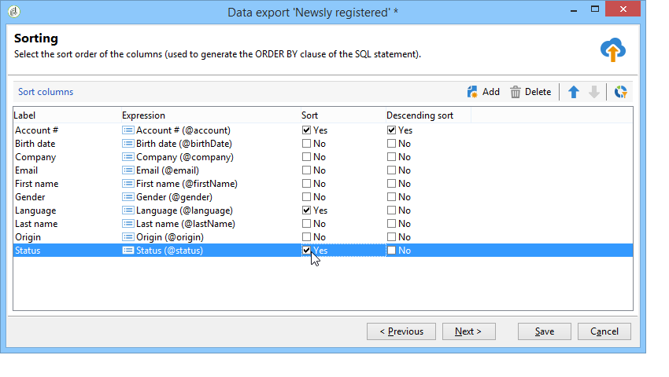

# 配置导出作业 {#executing-export-jobs}

导出作业允许您访问数据库并从数据库中提取数据：联系人、客户端、列表、区段等。

例如，使用营销活动跟踪数据（跟踪历史记录等）可能很有用 在电子表格中。 输出数据可以是 txt、CSV、TAB 或 XML 格式。

导出向导允许您配置导出、定义其选项并启动执行。 它是一系列屏幕，其内容取决于导出类型（简单或多个）和操作员的权限。

创建新导出作业后，将显示导出向导(请参阅 [创建导入和导出作业](../../platform/using/creating-import-export-jobs.md).

## 步骤1 — 选择导出模板 {#step-1---choosing-the-export-template}

启动导出向导时，首先必须选择模板。例如，要配置最近注册的收件人的导出，请按照以下步骤操作：

1. 选择 **[!UICONTROL Profiles and Targets > Job > Generic imports and exports]** 文件夹。
1. 点击 **New**，然后点击 **Export** 以创建导出模板。

   

1. 单击右侧的箭头 **[!UICONTROL Export template]** 字段以选择您的模板，或单击 **[!UICONTROL Select link]** 以浏览树。

   本地模板为 **[!UICONTROL New text export]**. 不得修改此模板，但您可以复制它以配置新模板。默认情况下，导出模板保存在 **[!UICONTROL Resources > Templates > Job templates]** 节点。

1. 在中输入要导出的名称 **[!UICONTROL Label]** 字段。 您可以添加描述。
1. 选择导出类型。有两种可能的导出类型： **[!UICONTROL Simple export]** 以仅导出一个文件，并且 **[!UICONTROL Multiple export]** 从一种或多种类型的源文档中，在单个执行中导出多个文件。

## 第 2 步 - 要导出的文件类型 {#step-2---type-of-file-to-export}

选择要导出的文档类型，即要导出的数据模式。

默认情况下，从启动导出时， **[!UICONTROL Jobs]** 节点数据来自收件人表。 从数据列表启动导出时(从 **[!UICONTROL right click > Export]** 菜单)，数据所属的表会自动填充到 **[!UICONTROL Document type]** 字段。

* 默认情况下， **[!UICONTROL Download the file generated on the server after the export]** 选项。 在 **[!UICONTROL Local file]** 字段，填写要创建的文件的名称和路径，或单击字段右侧的文件夹浏览本地磁盘。 您可以取消选择此选项以输入服务器输出文件的访问路径和名称。

   >[!NOTE]
   >
   >始终在服务器上执行自动导入和导出作业。
   >
   >要仅导出部分数据，请单击 **[!UICONTROL Advanced parameters]** 并在相应的字段中输入要导出的行数。

* 您可以创建差异导出以仅导出自上次执行后修改的记录。要执行此操作，请单击 **[!UICONTROL Advanced parameters]** 链接，然后单击 **[!UICONTROL Differential export]** 选项卡，然后选择 **[!UICONTROL Activate differential export]**.

   

   您必须输入上次修改的日期。它可以从字段中检索或计算。

## 步骤3 — 定义输出格式 {#step-3---defining-the-output-format}

选择导出文件的输出格式。可以使用以下格式：文本、固定列文本、CSV 和 XML。

* 对象 **[!UICONTROL Text]** 格式，选择分隔符以分隔列（制表符、逗号、分号或自定义）和字符串（单引号、双引号或无）。
* 对象 **[!UICONTROL text]** 和 **[!UICONTROL CSV]**，您可以选择选项 **[!UICONTROL Use first lines as column titles]**.
* 指示日期格式和数字格式。要执行此操作，请单击 **[!UICONTROL Edit]** 有关字段的按钮，并使用编辑器。
* 对于包含枚举值的字段，您可以选择 **[!UICONTROL Export labels instead of internal values of enumerations]**. 例如，标题可以存储在表单中 **1=先生**， **2=未命中**， **3=太太**. 如果选择此选项，将导出 **Mr.****、Miss** 和 **Mrs.**。

## 第 4 步 - 数据选择 {#step-4---data-selection}

选择要导出的字段。操作步骤：

1. 双击 **[!UICONTROL Available fields]** 列表以将其添加到 **[!UICONTROL Output columns]** 部分。
1. 使用清单右侧的箭头定义输出文件中字段的顺序。

   

1. 单击 **[!UICONTROL Add]** 按钮以调用函数。 有关更多信息，请参阅 [函数列表](../../platform/using/defining-filter-conditions.md#list-of-functions).

## 步骤5 — 对列进行排序 {#step-5---sorting-columns}

选择列的排序顺序。

## 第 6 步 - 筛选条件 {#step-6---filter-conditions-}

您可以添加筛选条件以避免导出所有数据。此筛选的配置与投放向导中的收件人定位相同。请参见[此页面](../../delivery/using/steps-defining-the-target-population.md)。

## 第 7 步 – 设定数据格式 {#step-7---data-formatting}

您可以修改输出文件的字段顺序和标签，并将转换应用于源数据。

* 要更改要导出的列的顺序，请选择相关列，然后使用表右侧的蓝色箭头。
* 要更改字段的标签，请单击 **[!UICONTROL Label]** 与要修改的字段匹配的列，并输入新标签。 按键盘上的 Enter 确认。
* 要将案例转换应用于字段的内容，请从中选择它 **[!UICONTROL Transformation]** 列。 您可以选择：

   * 切换到小写
   * 切换到大写
   * 首字母大写

   

* 单击 **[!UICONTROL Add a calculated field]** 如果要创建新的计算字段（例如，包含姓氏+名字的列）。 有关更多信息，请参阅 [计算字段](../../platform/using/executing-import-jobs.md#calculated-fields).

如果要导出元素集合（例如，收件人的订阅，它们所属的清单等），则必须指定要导出的集合中的元素数量。

## 第 8 步 - 数据预览 {#step-8---data-preview}

单击 **[!UICONTROL Start the preview of the data]** 用于预览导出结果。 按照默认，显示前 200 行。要更改此值，请单击 **[!UICONTROL Lines to display]** 字段。

点击向导底部的选项卡，从列中结果的预览切换到 XML 中的结果。您还可以查看生成的 SQL 查询。

## 步骤9 — 启动导出 {#step-9---launching-the-export}

单击 **[!UICONTROL Start]** 以启动数据导出。

然后，您可以监视导入作业的执行(请参阅 [监测作业执行](../../platform/using/monitoring-jobs-execution.md).
